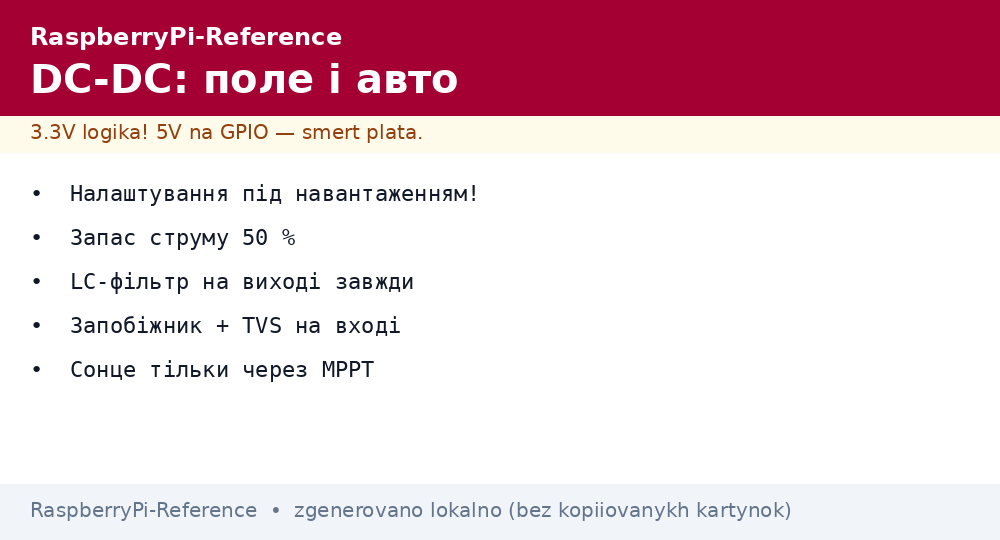
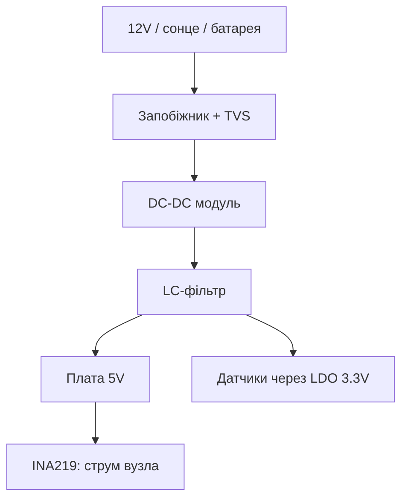

# DC-DC модулі для Raspberry Pi - buck, boost і живлення вузлів


*Рис. Вхід будь-який (12V/сонце/батарея) → DC-DC → чисті 5V: фільтр на вході і виході обов'язковий.*

> [!tip] Що це за нота
> Поле і авто: 12V бортмережі, сонячні панелі, батареї - усе перетворюємо в стабільні 5V. Вибір топології, струми, шуми. Штатне живлення: [живлення USB-C](../../../RaspberryPi-Reference/02-Zhivlennya/01-USB-C-PD.md), резерв: [UPS-резерв](../../../RaspberryPi-Reference/02-Zhivlennya/03-UPS-18650.md).

## 1. Мета

Живити Pi не від розетки:

- buck (понижуючий): 12/24V → 5V, основний кінь;
- boost (підвищуючий): 3.7V батарея → 5V;
- buck-boost/SEPIC: сонце з плаваючою напругою;
- шуми перетворювачів: фільтрація для АЦП і радіо.

| Топологія | Вхід → вихід | ККД | Коли |
| --- | --- | --- | --- |
| Buck (LM2596) | 7-30V → 5V | 85-92 % | авто, 12V системи |
| Boost (MT3608) | 2-5V → 5V | 80-90 % | одна банка, USB-повербанк свого складання |
| SEPIC | 3-12V → 5V | 80-85 % | сонячна панель |
| LDO (кінець) | 5V → 3.3V чисті | 66 % | живлення датчиків |

## 2. Архітектура живлення вузла



Запобіжник і TVS-діод на вході - від переполюсовки і стрибків. Економити на них - спалити вузол.

## 3. Buck на LM2596 детально

- готовий модуль з підстроювальником: крутимо до 5.1V БЕЗ навантаження? - ні, під навантаженням 1A;
- струм до 3A з радіатором, без - до 1.5A;
- пульсації ~50 мВ - для цифри ок, для АЦП ставимо LC;
- ККД росте з різницею входу/виходу? - навпаки: чим ближче, тим краще;
- фіксована версія 5V надійніша за регульовану в полі.

## 4. Boost і сонце

- MT3608: з 3.7V в 5V 2A, ККД ~85 %;
- одна банка 18650 + boost - кишеньковий UPS;
- сонячна панель 6/12V + MPPT-контролер (не безпосередньо!);
- ніч переживаємо батареєю, день - заряджаємо;
- діод Шотткі проти зворотного струму в панель вночі.

## 5. Робочий код: вартовий живлення вузла

```python
import time
import board
import busio
from adafruit_ina219 import Adafruit_INA219

i2c = busio.I2C(board.SCL, board.SDA)
ina = Adafruit_INA219(i2c)

V_MIN = 4.75
I_MAX = 2.5

while True:
    v = ina.bus_voltage + ina.shunt_voltage
    i = ina.current / 1000.0
    status = 'OK'
    if v < V_MIN:
        status = 'LOW VOLTAGE'
    if i > I_MAX:
        status = 'OVERLOAD'
    print(f"{v:.2f}V {i:.2f}A {status}")
    time.sleep(10)
```

INA219 на вході вузла (після DC-DC) - бачимо просадки і перевантаження до того, як плата зависне.

## 6. Фільтрація шумів

- LC-фільтр на виході: 10 мкГн + 470 мкФ;
- феритові намистини на дротах живлення датчиків;
- аналогова земля окремим провідником;
- частота перетворювача подалі від чутливих смуг (150 кГц vs АЦП);
- осцилографом дивимось пульсації, не віримо напису «low ripple».

## 7. Тепло і ККД на практиці

| Струм | Втрати buck (12→5V) | Нагрів модуля |
| --- | --- | --- |
| 0.5A | ~0.4W | теплий |
| 1.5A | ~1.2W | гарячий, треба потік |
| 3A | ~2.5W | радіатор обов'язково |

## 8. Типові помилки

| Симптом | Причина | Лікування |
| --- | --- | --- |
| 4.6V на платі | тонкі дроти після модуля | товсті короткі дроти |
| Свист у динаміках | шум перетворювача | LC-фільтр, інша частота |
| Модуль гріється | струм на межі без радіатора | запас 50 %, радіатор |
| Не стартує з батареї | просадка при пуску | конденсатор 1000+ мкФ на виході |
| Згорів від сонця | панель безпосередньо без контролера | MPPT-контролер між панеллю і АКБ |
| Переполюсовка = дим | немає захисту | запобіжник + діод/TVS на вході |

## 9. Швидка шпаргалка DC-DC

- налаштовуємо під навантаженням, не вхолосту;
- запас струму 50 % мінімум;
- фільтр на виході завжди;
- захист входу: запобіжник + TVS;
- ККД міряємо, не читаємо з опису.

## 10. Суміжні ноти

- [живлення USB-C](../../../RaspberryPi-Reference/02-Zhivlennya/01-USB-C-PD.md) - штатне живлення.
- [UPS-резерв](../../../RaspberryPi-Reference/02-Zhivlennya/03-UPS-18650.md) - батареї вузла.
- [струм INA219](../../../RaspberryPi-Reference/10-Sensori/04-INA219-Strum.md) - моніторинг споживання.
- [узгодження рівнів](../../../RaspberryPi-Reference/13-Moduli-zhivlennya-rivniv/02-Level-Shift-3V3.md) - чисті 3.3V.
- [головна карта](../../../RaspberryPi-Reference/Home.md) - повна навігація.

## 9.1 Вибір топології одним поглядом

- батарея/авто: buck з 12V;
- одна банка: boost до 5V;
- сонце: SEPIC або MPPT-контролер;
- датчики: LDO 3.3V після 5V;
- сумніваєшся - buck + запас струму.
- вхідний фільтр економить нервові клітини.
- вихідний конденсатор біля навантаження.
- дросель не в насиченні на піках.
- маркування полярності на вході.

## Офіційні джерела

- [LM2596 (Texas Instruments)](https://www.ti.com/product/LM2596) - buck-контролер, розрахунок дроселя.
- [UPS HAT C (Waveshare Wiki)](https://www.waveshare.com/wiki/UPS_HAT_(C)) - батарейний приклад вузла.
- [Getting Started (Raspberry Pi docs)](https://www.raspberrypi.com/documentation/computers/getting-started.html) - вимоги живлення.
