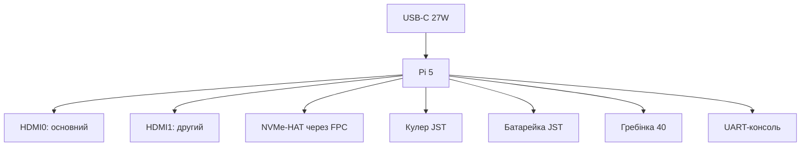

# Raspberry Pi 5 як виріб - ревізії, роз'єми, NVMe і корпуси


*Рис. Анатомія Pi 5: USB-C PD, 2×HDMI, PCIe-FPC, RTC-JST, FAN-JST, гребінка 40 - усе на своїх місцях.*

> [!tip] Що це за нота
> Плата очима власника: що куди встромляти, які HAT-плати брати, як не перегріти. Кристал: [BCM2712 і Pi 5](../../../RaspberryPi-Reference/01-Hardware/02-BCM2712-Pi5.md), покупка: [плати і аксесуари](../../../RaspberryPi-Reference/00-Start/04-Devkit-plati.md).

## 1. Мета

Освоїти плату як виріб за вечір:

- карта роз'ємів: що куди і навіщо;
- NVMe-HAT-плати: які брати під систему і дані;
- корпуси і кулери: тиша проти продуктивності;
- кнопка живлення і UART-консоль: приховані можливості.

| Роз'єм | Призначення | Примітка |
| --- | --- | --- |
| USB-C | живлення PD 5V 5A + дані | тільки якісний кабель |
| 2×micro-HDMI | монітори 4Kp60 | HDMI0 - основний |
| PCIe FPC | NVMe-HAT, 1 лінія | увімкнути в config.txt |
| RTC JST-SH | батарейка часу | 2 піни, полярність! |
| FAN JST-SH | кулер 5V з ШІМ | 4 піни |
| UART debug | 3-пінова консоль | 115200 8N1 |
| Гребінка | 40 пінів, 3.3V | HATи сідають зверху |

## 2. Архітектура плати



Порядок складання: NVMe-HAT-плата → кулер → корпус → SD (якщо треба) → кабелі. Гвинти M2.5, не перетягувати.

## 3. NVMe-HAT-плати детально

- офіційна M.2 HAT+: 2230/2242, PCIe 2.0 x1;
- сторонні під 2280 - перевіряти сумісність живлення;
- SSD без DRAM: менше гріється, дешевше, для системи ок;
- система прямо на NVMe: Imager → вибрати диск;
- `dtparam=pciex1`, свіжий EEPROM - інакше диска немає.

## 4. Корпуси і кулери

- офіційний корпус + кулер: баланс шуму і температури;
- Flirc-пасив: тиша, але під стресом тротлить;
- відкритий стенд + великий радіатор: максимум повітря;
- термопрокладка на SoC/RAM/PMIC - усі три гріються;
- крива кулера: `dtparam=fan_temp0=50000` і гістерезис.

## 5. Робочий код: кнопка і вентилятор

```python
from gpiozero import Button, PWMLED, CPUTemperature
import os
import time

# Штатний 4-піновий кулер Pi 5 керується прошивкою (dtoverlay=pwm-fan,
# див. розділ 4), а НЕ кодом: GPIO14 - це UART TXD!
# Зовнішній вентилятор - тільки через N-MOSFET:
fan = PWMLED(pin=14)  # GPIO14 -> затвор MOSFET, живлення 5V окремо
btn = Button(pin=3, hold_time=2)

def fan_curve(temp):
    if temp < 50:
        return 0.0
    if temp < 65:
        return 0.4
    return 1.0

def on_temp():
    fan.value = fan_curve(CPUTemperature().temperature)

btn.when_held = lambda: os.system('sudo poweroff')

while True:
    on_temp()
    time.sleep(5)
```

Кнопка на GPIO3 - апаратний wakeup зі сну. Довге утримання - коректне вимкнення, не висмикування живлення.

## 6. Ревізії і клони

- ревізія друкується біля гребінки: свіжіша - менше еррат;
- клонів Pi 5 немає (складна плата), зате є клони БЖ і кулерів;
- micro-HDMI перехідники - брати з екраном, інакше іскри 4K;
- перевірка при покупці: boot з тестової SD до кінця гарантії.

## 7. Живлення периферії

- USB-порти: 1.6A сумарно з БЖ 5A, 600 мА з БЖ 3A;
- SSD 2.5" по USB - через хаб з живленням;
- PoE+ HAT - живлення і мережа одним кабелем;
- вимірюємо струм USB-тестером, не «на око».

## 7.1 USB-периферія: що тягне порт

- клавіатура/миша - будь-які, струм мізерний;
- SSD 2.5" - через хаб з живленням, інакше відвали;
- веб-камера + мікрофон - сумарно до ліміту порту;
- SDR-донгл - окреме живлення при довгому кабелі;
- ліміти: 1.2A з БЖ 5A, 600 мА з БЖ 3A;
- вимірюємо USB-тестером у розриві, не гадаємо.

## 8. Типові помилки

| Симптом | Причина | Лікування |
| --- | --- | --- |
| NVMe не видно | немає dtparam | `dtparam=pciex1` + ребут |
| Кулер не крутиться | не той JST або немає overlay | 4-піновий JST, `dtoverlay=pwm-fan` |
| RTC не тримає | батарейка не вставлена/розряджена | JST-акумулятор, `hwclock -w` |
| USB-диск відвалюється | слабкий БЖ | PD 27W, хаб з живленням |
| Тротлінг у корпусі-глухарі | немає вентиляції | корпус з кулером або відкритий |
| Не стартує зі старою SD | образ до Bookworm | свіжий образ під Pi 5 |

## 9. Суміжні ноти

- [BCM2712 і Pi 5](../../../RaspberryPi-Reference/01-Hardware/02-BCM2712-Pi5.md) - кристал детально.
- [живлення USB-C](../../../RaspberryPi-Reference/02-Zhivlennya/01-USB-C-PD.md) - БЖ детально.
- [носії пам'яті](../../../RaspberryPi-Reference/08-Pamyat/01-SD-eMMC-NVMe.md) - NVMe детально.
- [робоча Pi 4](../../../RaspberryPi-Reference/14-Devboards/02-Pi4-Robocha.md) - молодша сестра.
- [завантаження EEPROM](../../../RaspberryPi-Reference/09-Proshivka/02-EEPROM-Boot.md) - порядок boot.

## 10. Швидка шпаргалка Pi 5 як виробу

- NVMe: HAT-плата + `dtparam=pciex1`;
- кулер: JST 4 піни + overlay;
- RTC: JST-батарейка + `hwclock -w`;
- USB-ліміти: 1.2A з PD, 600 мА з 3A;
- консоль: 3-піновий UART 115200.

## Офіційні джерела

- [Raspberry Pi 5 (Raspberry Pi)](https://www.raspberrypi.com/products/raspberry-pi-5/) - роз'єми, живлення, PCIe.
- [Getting Started (Raspberry Pi docs)](https://www.raspberrypi.com/documentation/computers/getting-started.html) - перший запуск.
- [gpiozero docs (Read the Docs)](https://gpiozero.readthedocs.io/en/stable/) - кнопка, кулер, температура.
