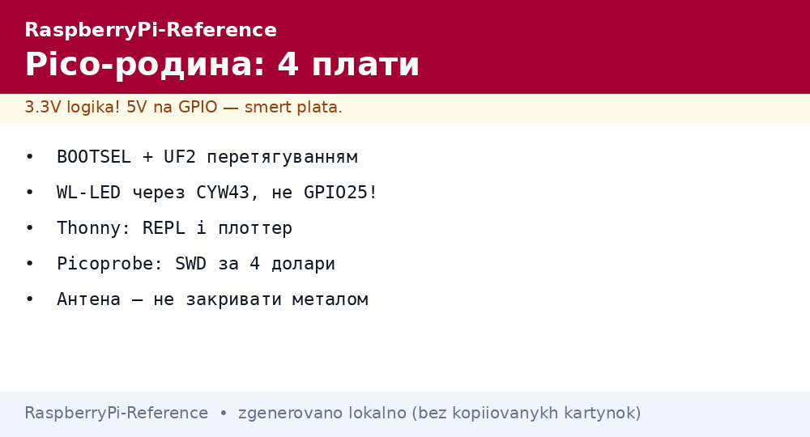

# Родина Pico - Pico, Pico W, Pico 2 і Pico 2 W на столі


*Рис. Pico-лінійка: гола плата під пайку, W-версії з антеною, прошивка перетягуванням UF2.*

> [!tip] Що це за нота
> Усі чотири плати поруч: чим відрізняються, що вміє радіо, як шити і налагоджувати. Кристали: [RP2040 і RP2350](../../../RaspberryPi-Reference/01-Hardware/03-RP2040-RP2350.md), середовище: [вибір середовища](../../../RaspberryPi-Reference/00-Start/05-Vibir-seredovischa.md).

## 1. Мета

Обрати і запустити Pico за вечір:

- таблиця чотирьох моделей без плутанини;
- W-версії: що вміє CYW43439, а чого ні;
- прошивка UF2, Thonny, Picoprobe-SWD;
- castellated-край: паяння і плати-носії.

| Плата | Чип | Flash | Радіо | USB |
| --- | --- | --- | --- | --- |
| Pico | RP2040 | 2 МБ | немає | micro-USB пристрій |
| Pico W | RP2040 | 2 МБ | WiFi + BT (CYW43439) | micro-USB |
| Pico 2 | RP2350 | 4 МБ | немає | micro-USB пристрій + хост |
| Pico 2 W | RP2350 | 4 МБ | WiFi + BT | micro-USB |

## 2. Архітектура плати

```mermaid
flowchart TB
  USB[micro-USB] --> PICO[Pico: RP2040/50]
  PICO --> GPIO[26 GPIO + 3 АЦП]
  PICO --> DBG[SWD-роз'єм 3 піни]
  PICO --> ANT[Антена (тільки W)]
  PICO --> LED[LED + WL-LED (W)]
  BOOT[BOOTSEL] --> PICO
```

Кнопка BOOTSEL: тримати при вмиканні - плата стає флешкою, перетягуємо UF2. WL-LED на W-версіях висить на WiFi-чипі, керується окремо!

## 3. W-версії детально

- CYW43439: WiFi 4 + BT 5.2 (класика + BLE) - BT лише через C SDK/BTstack, у MicroPython немає;
- MicroPython: `network.WLAN`, прикладів повно;
- C SDK: `pico_cyw43_arch` (threadsafe або poll);
- вбудований LED - через `cyw43_arch_gpio_put`, не GPIO25!;
- BT-стек у C SDK (BTstack), у MicroPython - обмежено;
- струм WiFi TX до 300 мА - USB вистачає, батарея рахуємо.

## 4. Прошивка трьома шляхами

- UF2 перетягуванням: BOOTSEL + файл у вікно диска;
- Thonny: кнопка Run шле скрипт, Stop - зупиняє;
- `picotool load/verify/reboot` з консолі - для CI;
- Picoprobe (другий Pico): SWD-налагодження і консоль;
- масове: один UF2 на всі плати партії.

## 5. Робочий код (MicroPython)

```python
import network
import time
from machine import Pin, ADC
import umqtt.simple as mqtt

led = Pin("LED", Pin.OUT)
adc = ADC(26)
wlan = network.WLAN(network.STA_IF)
wlan.active(True)
wlan.connect("ssid", "pass")
while not wlan.isconnected():
    time.sleep(0.5)

cl = mqtt.MQTTClient("pico-node", "broker.local")
cl.connect()

while True:
    volt = adc.read_u16() * 3.3 / 65535
    cl.publish(b"pico/adc", str(volt).encode())
    led.toggle()
    time.sleep(10)
```

Рядок `"LED"` замість номера - працює на всіх Pico, включно з W (через CYW43-драйвер). ADC26 - перший зовнішній канал.

## 6. Живлення Pico-вузла

- VSYS 1.8-5.5V: батарея Li-ion безпосередньо без конвертера;
- ADC3 міряє VSYS/4 - контроль батареї з коробки;
- сон: `machine.deepsleep()` - мікроампери, будильник по GPIO/RTC;
- сонячна панель + TP4056 - класика польового вузла;
- USB 5V - розробка, батарея - поле.

## 7. Плати-носії і корпуси

- castellated-край паяється на несучу плату як модуль;
- готові носії: реле, дисплеї, мотори (Pimoroni, Waveshare);
- макетка: Pico стає в DIP-рядок 40 пінів;
- корпуси друкуємо або беремо акрилові сендвічі.

## 7.1 PIO-приклади з коробки

- WS2812-стрічка: приклад `pio/ws2812` світить без CPU;
- UART-TX програмний: будь-який пін стає портом;
- I2S-вивід: приклад з SDK жене звук у ЦАП;
- DVI-термінал: PicoDVI показує консоль на моніторі;
- логічний аналізатор: PIO пише захват у RAM;
- кожен приклад - пара файлів: `.pio` + `.c`, збирається разом.

## 8. Типові помилки

| Симптом | Причина | Лікування |
| --- | --- | --- |
| Не бачиться як диск | не тримали BOOTSEL | тримати кнопку при вмиканні USB |
| LED не блимає на W | пін 25 замість "LED" | `Pin("LED")` - йде через CYW43 |
| WiFi не конектиться | 5 ГГц мережа | тільки 2.4 ГГц |
| Thonny не бачить плату | старий MicroPython | свіжа UF2 під свою модель |
| АЦП пливе | опорна від USB | калібрування або LDO |
| C SDK не збирається | немає тулчейну | `arm-none-eabi-gcc` за гайдом |

## 9. Суміжні ноти

- [RP2040 і RP2350](../../../RaspberryPi-Reference/01-Hardware/03-RP2040-RP2350.md) - кристали детально.
- [вибір середовища](../../../RaspberryPi-Reference/00-Start/05-Vibir-seredovischa.md) - MicroPython проти C SDK.
- [зовнішні АЦП](../../../RaspberryPi-Reference/06-Analog/01-ADC-Zovnishnye.md) - коли вбудованого мало.
- [протокол MQTT](../../../RaspberryPi-Reference/15-Protokoli/01-MQTT.md) - телеметрія вузла.
- [UPS-плати](../../../RaspberryPi-Reference/02-Zhivlennya/03-UPS-18650.md) - батарейне живлення.

## 9.1 Швидка шпаргалка Pico

- BOOTSEL при вмиканні = диск UF2;
- W-версії: `Pin("LED")`, тільки 2.4 ГГц;
- VSYS 1.8-5.5V, ADC3 міряє батарею;
- Picoprobe = SWD за 4 долари;
- Thonny для старту, C SDK для швидкості.

## 9.2 Запасний Pico в сумці

- прошитий blink-UF2 - перевірка живлення і USB за хвилину;
- джампери і USB-кабель з даними (не charge-only!);
- розпиновка на картці - не гадати номери ADC;
- другий Pico як Picoprobe - SWD і консоль;
- чиста MicroPython-UF2 останньої версії.

## Офіційні джерела

- [RP2040 Datasheet (Raspberry Pi)](https://datasheets.raspberrypi.com/rp2040/rp2040-datasheet.pdf) - PIO, АЦП, USB.
- [RP2350 Datasheet (Raspberry Pi)](https://datasheets.raspberrypi.com/rp2350/rp2350-datasheet.pdf) - M33, хост, безпека.
- [Getting Started (Raspberry Pi docs)](https://www.raspberrypi.com/documentation/computers/getting-started.html) - UF2 і Thonny.
