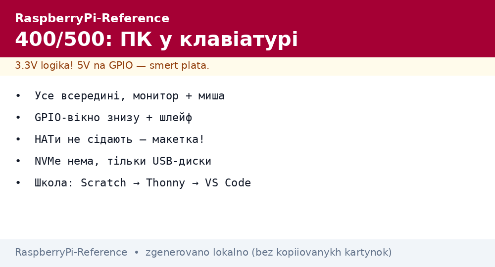
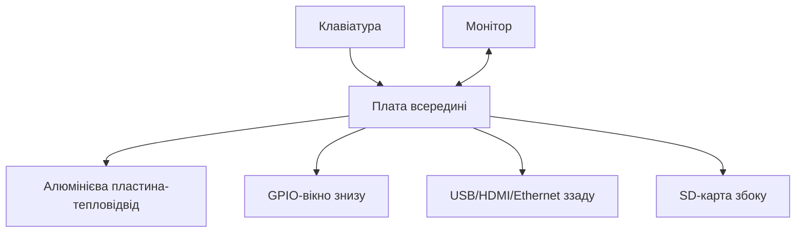

# Raspberry Pi 400 і 500 - комп'ютер у клавіатурі для школи і дому


*Рис. Усе в клавіатурі: плата, радіатор на всю площу, GPIO-вікно знизу - підключив монітор і працюєш.*

> [!tip] Що це за нота
> Готовий ПК без конструктора: розпакував - працюєш. Ідеальний для школи, гуртка і бабусі. Всередині - Pi 4 (400) або Pi 5-клас (500). Порівняння: [порівняння моделей](../../../RaspberryPi-Reference/00-Start/03-Porivnyannya-plate.md).

## 1. Мета

Показати нішу «комп'ютера без болю»:

- що всередині і чим відрізняються 400 від 500;
- GPIO для гуртка: як дістатись до пінів;
- софт з коробки: що вже встановлено;
- коли 400/500, а коли окрема плата.

| Параметр | Pi 400 | Pi 500 / 500+ |
| --- | --- | --- |
| База | Pi 4 (1.8 ГГц) | Pi 5-клас |
| RAM | 4 ГБ | 8/16 ГБ |
| Клавіатура | 78 клавіш, 3 розкладки | 78 клавіш, покращена |
| GPIO | 40 пінів під кришкою | 40 пінів під кришкою |
| Порти | 2×USB3, USB2, 2×HDMI, GbE | як Pi 5 + USB-C живлення |

## 2. Архітектура виробу



Велика алюмінієва пластина - пасивне охолодження на всю клавіатуру: тихо і без тротлінгу в офісних задачах.

## 3. Комплект і перший запуск

- Personal Kit: плата-клавіатура + миша + БЖ + SD з ОС + HDMI-кабель + книга;
- увімкнув - майстер налаштування: мова, WiFi, оновлення;
- дитячі акаунти і батьківський контроль - з коробки;
- Scratch, Thonny, LibreOffice - одразу встановлені.

## 4. GPIO для гуртка

- вікно знизу відкриває гребінку 40 пінів;
- шлейф-перехідник виводить піни на макетку поруч;
- 3.3V логіка - ті ж правила, що на звичайних Pi;
- HATи не сядуть (механіка), тільки дроти і макетки;
- перший урок: LED + кнопка за 10 хвилин.

## 5. Робочий код: урок за 10 хвилин

```python
from gpiozero import LED, Button
from signal import pause

led = LED(17)
btn = Button(27)

btn.when_pressed = led.on
btn.when_released = led.off

print("Натисни кнопку на макетці!")
pause()
```

Схема: LED через 330 Ом на GPIO17, кнопка між GPIO27 і землею (внутрішній pull-up gpiozero вмикає сам).

## 6. Дім і школа

- медіацентр: Kodi + HDMI + USB-диск;
- програмування: Scratch → Thonny → VS Code за віком;
- офіс: браузер + LibreOffice тягне спокійно;
- сервер: Pi-hole або файлопомийка, але без NVMe;
- ретро-ігри: RetroPie окремою карткою.

## 7. Межі

- NVMe немає - тільки USB-диски;
- GPIO без HATів - лише макетка;
- апгрейд RAM неможливий - обираємо одразу;
- розібрати цікаво, зібрати назад - теж треба вміти;
- для серйозного мейкерства - окрема Pi 4/5 поруч.

## 7.1 Навчальна програма на семестр

| Тиждень | Тема | Результат |
| --- | --- | --- |
| 1-2 | Scratch і миша | перша гра |
| 3-4 | Thonny + LED | блималка |
| 5-6 | Кнопки і зумер | реакція-гра |
| 7-8 | Датчик температури | графік кімнати |
| 9-10 | Камера + фото | стоп-моушн |
| 11-12 | Мережа і Scratch-обмін | мультиплеєр |
| 13-14 | Свій проєкт | захист робіт |
| 15-16 | Резерв і повторення | виставка |

Кожен урок: 10 хв теорії, 30 хв практики, фото результату в портфоліо. Домашка - доробити, не переробити.

Оцінювання без стресу:

- працює - вже добре;
- пояснив як - відмінно;
- допоміг сусіду - бонус;
- зламав і полагодив - досвід, не провал.

## 8. Типові помилки

| Симптом | Причина | Лікування |
| --- | --- | --- |
| Не бачить WiFi 5 ГГц | регіон не виставлений | `raspi-config` → WiFi-country |
| GPIO не відповідають | шлейф перевернутий | перший пін позначений трикутником |
| Гальмує браузер | забагато вкладок на 4 ГБ | менше вкладок або Pi 500 |
| SD швидко вмирає | своп + логи | zram, логи в RAM |
| Клавіатура іншої розкладки | не та локаль | майстер налаштування заново |
| Хочеться HAT | механіка не дозволяє | HAT - на окрему плату |

## 9. Суміжні ноти

- [порівняння моделей](../../../RaspberryPi-Reference/00-Start/03-Porivnyannya-plate.md) - місце 400/500.
- [робоча Pi 4](../../../RaspberryPi-Reference/14-Devboards/02-Pi4-Robocha.md) - начинка 400-ї.
- [флагман Pi 5](../../../RaspberryPi-Reference/14-Devboards/01-Pi5-Flagman.md) - начинка 500-ї.
- [гребінка і gpiozero](../../../RaspberryPi-Reference/03-GPIO/01-Header-Gpiozero.md) - перші піни.
- [прошивка Imager](../../../RaspberryPi-Reference/09-Proshivka/01-Imager-Headless.md) - перевстановлення ОС.

## 9.1 Швидка шпаргалка 400/500

- Personal Kit = усе для старту;
- GPIO через вікно + шлейф;
- HATи не сідають - тільки макетка;
- NVMe немає, диски по USB;
- гурток: Scratch → Thonny → проєкт.

## Офіційні джерела

- [Raspberry Pi 400 (Raspberry Pi)](https://www.raspberrypi.com/products/raspberry-pi-400/) - комплектація і характеристики.
- [Raspberry Pi 500 (Raspberry Pi)](https://www.raspberrypi.com/products/raspberry-pi-500/) - нове покоління.
- [gpiozero docs (Read the Docs)](https://gpiozero.readthedocs.io/en/stable/) - перший код гуртка.
