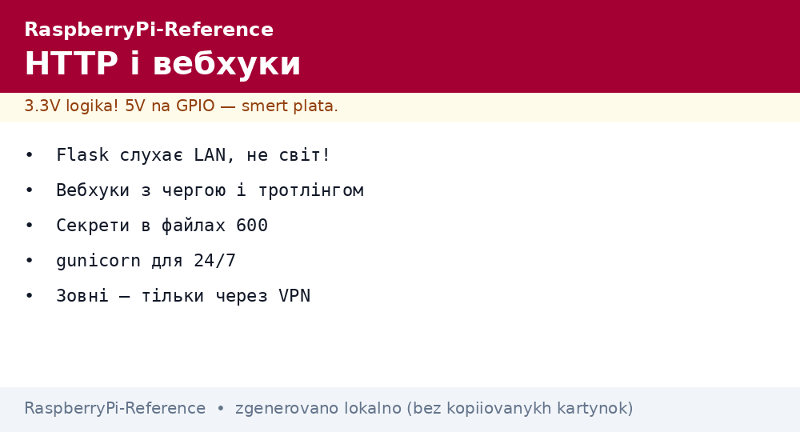
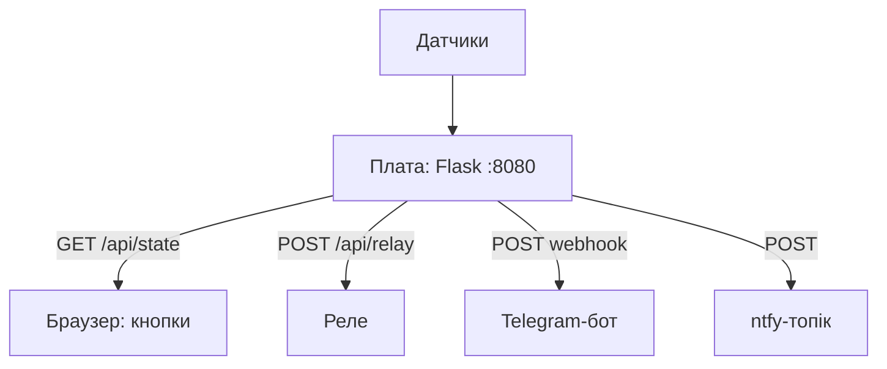

# HTTP і вебхуки на Raspberry Pi - Flask, Telegram і сповіщення


*Рис. HTTP-шар вузла: Flask віддає API і сторінку, вебхуки стукають у Telegram, дашборд малює графіки.*

> [!tip] Що це за нота
> Коли MQTT забагато: звичайний HTTP для рідкісних даних, керування з браузера і пушів у телефон. Flask-сервер на платі + вебхуки назовні. Брат-близнюк: [протокол MQTT](../../../RaspberryPi-Reference/15-Protokoli/01-MQTT.md), мережа: [налаштування ОС](../../../RaspberryPi-Reference/09-Proshivka/03-OS-Nalashtuvannya.md).

## 1. Мета

Покрити HTTP-сценарії вузла:

- REST API: віддати стан і прийняти команди;
- веб-сторінка керування без фреймворків-важковаговиків;
- вебхуки: Telegram, ntfy, IFTTT;
- безпека: не світити вузол у світ голим.

| Сценарій | Інструмент | Період |
| --- | --- | --- |
| Стан датчиків | Flask JSON | за запитом |
| Керування реле | POST-форми | за подією |
| Сповіщення | Telegram Bot API | за тривогою |
| Пуші без сервера | ntfy | за тривогою |
| Графіки | вбудована сторінка + JS | за запитом |

## 2. Архітектура шару



Flask слухає тільки LAN (не `0.0.0.0` у світ!). Зовнішній доступ - через VPN/Tailscale, не проброс портів.

## 3. Flask-мінімум

- маршрути: `/` сторінка, `/api/state` JSON, `/api/relay/<on|off>`;
- шаблони Jinja в `templates/` - HTML без білда;
- статика (CSS/JS) з `static/` - один файл стилів вистачає;
- Basic Auth на API: логін/пароль з secrets;
- gunicorn замість dev-сервера для 24/7 (3 воркери вистачає).

## 4. Вебхуки назовні

- Telegram: `sendMessage` з токеном бота, chat_id свій;
- ntfy: POST на свій топік - пуш без сервера;
- формат тривоги: що, де, коли, значення;
- тротлінг: не частіше разу на 5 хвилин на подію;
- черга: спочатку в файл, відправка фоном.

## 5. Робочий код

```python
from flask import Flask, jsonify, request, render_template_string
import subprocess

app = Flask(__name__)
PAGE = """
<h1>Вузол-01</h1>
<p>Температура: {{t}} C</p>
<form method=post action=/api/relay>
<button name=state value=on>УВІМКНУТИ</button>
<button name=state value=off>ВИМКНУТИ</button>
</form>
"""

def read_temp():
    out = subprocess.check_output(['cat', '/sys/class/thermal/thermal_zone0/temp'])
    return int(out) / 1000.0

@app.route('/')
def index():
    return render_template_string(PAGE, t=f"{read_temp():.1f}")

@app.route('/api/state')
def state():
    return jsonify(temp=read_temp())

@app.route('/api/relay', methods=['POST'])
def relay():
    # RPi.GPIO застарів на Bookworm/Pi 5 - використовуємо gpiozero:
    from gpiozero import DigitalOutputDevice
    relay_pin = DigitalOutputDevice(23)
    relay_pin.value = request.form['state'] == 'on'
    return 'OK', 200

if __name__ == '__main__':
    app.run(host='127.0.0.1', port=8080)
```

Слухаємо localhost + реверс-проксі (nginx/Caddy) з TLS - прямо в світ Flask не виставляємо ніколи.

## 6. Telegram-сповіщення

```python
import requests

TOKEN = open('/home/pi/.tg-token').read().strip()
CHAT = open('/home/pi/.tg-chat').read().strip()

def tg_send(text):
    try:
        requests.post(
            f'https://api.telegram.org/bot{TOKEN}/sendMessage',
            json={'chat_id': CHAT, 'text': text},
            timeout=10)
    except Exception as e:
        with open('/home/pi/tg-fail.log', 'a') as f:
            f.write(text + '\n')
```

Токен і chat_id - в окремих файлах з правами 600. Невідправлене - у файл-чергу, cron добиває.

## 7. Безпека веб-шару

- ніяких портів назовні без VPN;
- паролі не в коді і не в git;
- оновлення Flask/requests з changelog безпеки;
- ліміт запитів: fail2ban на 404-сканери;
- резервний доступ - SSH, не веб.

## 8. Типові помилки

| Симптом | Причина | Лікування |
| --- | --- | --- |
| Сторінка не відкривається | слухає localhost без проксі | nginx/Caddy реверс або LAN-адреса |
| Реле не клацає з вебу | прав доступу до GPIO | група gpio, сервіс від юзера в групі |
| Telegram мовчить | не той chat_id/токен | перевірити getMe, потім sendMessage вручну |
| Спам кожну хвилину | немає тротлінгу | не частіше разу на 5 хв на подію |
| Dev-сервер падає | один потік, виняток | gunicorn + Restart=always |
| Порт світиться в світ | проброс без потреби | прибрати, тільки VPN |

## 9. Швидка шпаргалка HTTP

- Flask слухає LAN, світ - через VPN;
- JSON для машин, сторінка для людей;
- вебхуки з чергою і тротлінгом;
- секрети в окремих файлах 600;
- gunicorn для 24/7.

## 10. Суміжні ноти

- [протокол MQTT](../../../RaspberryPi-Reference/15-Protokoli/01-MQTT.md) - транспорт для частих даних.
- [налаштування ОС](../../../RaspberryPi-Reference/09-Proshivka/03-OS-Nalashtuvannya.md) - systemd для сервера.
- [дисплеї DSI/HDMI](../../../RaspberryPi-Reference/11-Vivid/01-DSI-HDMI-Displeyi.md) - локальна морда.
- [клімат BME280](../../../RaspberryPi-Reference/10-Sensori/01-BME280-Klimat.md) - що віддавати.
- [головна карта](../../../RaspberryPi-Reference/Home.md) - повна навігація.

## Офіційні джерела

- [MQTT Specification (OASIS)](https://mqtt.org/mqtt-specification/) - коли HTTP замало.
- [Getting Started (Raspberry Pi docs)](https://www.raspberrypi.com/documentation/computers/getting-started.html) - мережа і сервіси.
- [Raspberry Pi OS (Raspberry Pi)](https://www.raspberrypi.com/software/) - Python і пакети.
