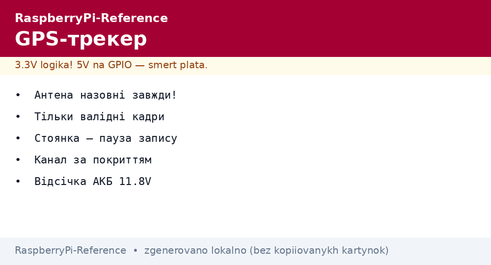
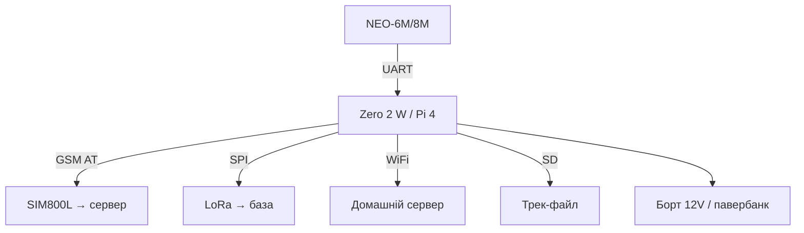

# GPS-трекер на Raspberry Pi - координати, трек і геозони


*Рис. Трекер: GPS дає точку, модем/LoRa віддає, плата пише трек і стежить за зонами.*

> [!tip] Що це за нота
> Авто, велосипед, I2C-адаптер, вулик: де воно і куди їде. Три канали передачі під бюджет і покриття. Сенсор: [GPS-модулі](../../../RaspberryPi-Reference/10-Sensori/05-GPS-NEO.md), радіо: [бортове радіо](../../../RaspberryPi-Reference/05-Radio/01-WiFi-BT-Bort.md), [LoRa і GPS HAT](../../../RaspberryPi-Reference/12-Moduli-zvyazku/02-GPS-LoRa-HAT.md).

## 1. Мета

Зібрати трекер під задачу:

- GPS-фікс кожні 10-60 секунд;
- канал: GSM (місто), LoRa (поле), WiFi (база);
- трек у GPX + геозони з алертами;
- живлення від борту/батареї з виміром.

| Канал | Де працює | Тариф/ціна |
| --- | --- | --- |
| GSM (SIM800L) | де є стільники | SIM з копійками |
| LoRa P2P | поле, 5 км | безкоштовно |
| WiFi | база/дім | безкоштовно |

## 2. Архітектура трекера



Zero 2 W вистачає з головою: GPS + один канал. Pi 4 - якщо треба камера до треку.

## 3. GPS-частина

- антена з видом на небо (лобове скло - мінімум);
- холодний старт 30 с, гарячий - секунди (батарейка RTC на модулі);
- фільтр: ігнор стрибків понад 200 км/год;
- стоянка: не писати точку, якщо стоїмо (економія трафіку);
- точність 2-5 м на відкритій місцевості.

## 4. Канали передачі

- GSM: HTTP POST кожну хвилину, буфер при втраті мережі;
- LoRa: пакет 20 байт (lat/lon/швидкість), раз на хвилину;
- WiFi: злив накопиченого при поверненні додому;
- пріоритет: WiFi → LoRa → GSM за наявністю;
- шифрування корисного - хоча б XOR з ключем (краще AES).

## 5. Робочий код

```python
import serial
import time
import math

gps = serial.Serial('/dev/serial0', 9600, timeout=1)

def parse_rmc(line):
    p = line.strip().split(',')
    if len(p) < 10 or p[2] != 'A':
        return None
    def deg(raw, hemi):
        d = int(float(raw) / 100)
        m = float(raw) - d * 100
        v = d + m / 60.0
        return -v if hemi in 'SW' else v
    lat = deg(p[3], p[4])
    lon = deg(p[5], p[6])
    return lat, lon, float(p[7] or 0) * 1.852

HOME = (50.4501, 30.5234)
RADIUS_KM = 0.5

def dist(a, b):
    dlat = math.radians(b[0] - a[0])
    dlon = math.radians(b[1] - a[1])
    h = math.sin(dlat/2)**2 + math.cos(math.radians(a[0])) * math.cos(math.radians(b[0])) * math.sin(dlon/2)**2
    return 6371 * 2 * math.asin(math.sqrt(h))

inside = True
with open('/home/pi/track.gpx', 'a') as log:
    while True:
        line = gps.readline().decode('ascii', errors='ignore')
        if not line.startswith('$GPRMC'):
            continue
        r = parse_rmc(line)
        if not r:
            continue
        lat, lon, kmh = r
        now_in = dist((lat, lon), HOME) < RADIUS_KM
        if now_in != inside:
            inside = now_in
            print('ZONE:', 'HOME' if inside else 'AWAY')
        log.write(f"{time.strftime('%F %T')},{lat:.6f},{lon:.6f},{kmh:.0f}\n")
        log.flush()
        print(f"{lat:.6f},{lon:.6f} {kmh:.0f}kmh")
```

GPX-обгортку додаємо при вивантаженні (заголовок + трекпойнти). Живий перегляд - Traccar-сервер або свій дашборд.

## 6. Живлення в авто

- 12V → buck 5V 3A (прикурювач/постійний плюс);
- затримка вимкнення: працюємо 10 хв після глушіння, потім сон;
- захист АКБ авто: відсічка при 11.8V;
- суперконденсатор на коректне завершення запису;
- приховане встановлення - антена все одно назовні.

## 7. Геозони і алерти

- дім/робота/дача - кола в конфігу;
- в'їзд/виїзд - подія в MQTT/Telegram;
- перевищення швидкості - поріг за типом дороги;
- стоянка в чужій зоні вночі - окремий алерт;
- історія зон - у базі, не лише в логах.

## 8. Типові помилки

| Симптом | Причина | Лікування |
| --- | --- | --- |
| Трек «павутина» на стоянці | дрейф координат | не писати при швидкості < 3 км/год |
| Діри в треку в місті | каньйони/тунелі | інтерполяція + позначка якості |
| Батарея сідає за ніч | модем не спить | сон між відправками, PSM-режим |
| SIM з'їла гроші | роумінг/трафік карт | IoT-тариф, ліміт трафіку |
| Антена під металом | екран кузова | зовнішня антена на дах |
| Час 1970-й у логах | немає фікса при старті | чекати валідний RMC |

## 9. Швидка шпаргалка трекера

- антена назовні завжди;
- писати тільки валідні кадри;
- стоянка - пауза запису;
- канал за покриттям і бюджетом;
- живлення з відсічкою АКБ.

## 10. Суміжні ноти

- [GPS-модулі](../../../RaspberryPi-Reference/10-Sensori/05-GPS-NEO.md) - NMEA детально.
- [LoRa і GPS HAT](../../../RaspberryPi-Reference/12-Moduli-zvyazku/02-GPS-LoRa-HAT.md) - дальній канал.
- [бортове радіо](../../../RaspberryPi-Reference/05-Radio/01-WiFi-BT-Bort.md) - WiFi-злив.
- [UPS-резерв](../../../RaspberryPi-Reference/02-Zhivlennya/03-UPS-18650.md) - живлення вузла.
- [головна карта](../../../RaspberryPi-Reference/Home.md) - повна навігація.

## Офіційні джерела

- [NEO-6 series (u-blox)](https://www.u-blox.com/en/product/neo-6-series) - NMEA і режими.
- [SX1268 433M LoRa HAT (Waveshare)](https://www.waveshare.com/wiki/SX1268_433M_LoRa_HAT) - дальній канал.
- [Getting Started (Raspberry Pi docs)](https://www.raspberrypi.com/documentation/computers/getting-started.html) - UART і живлення.
