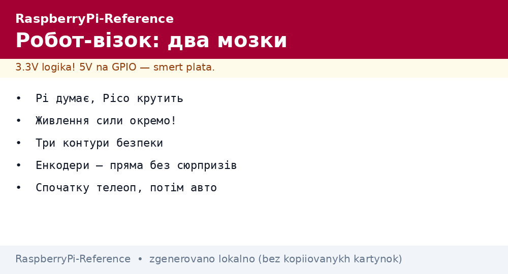
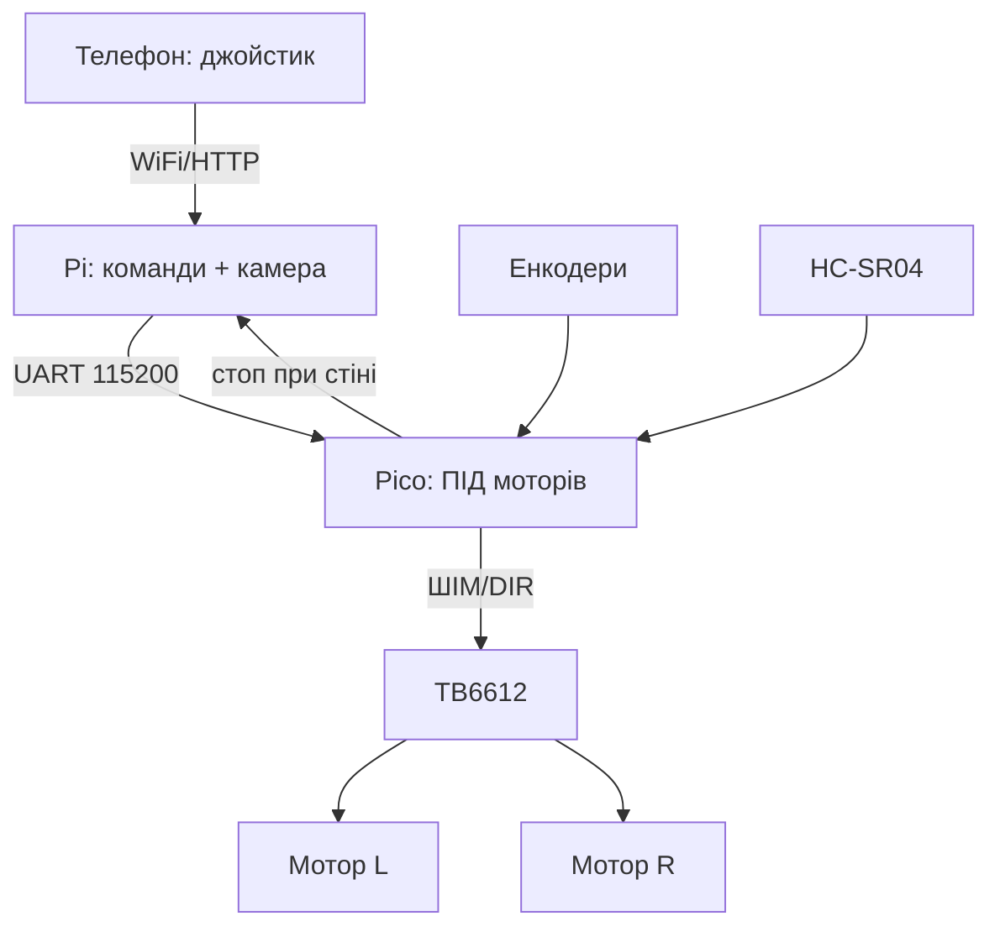

# Робот-візок на Raspberry Pi - шасі, драйвери і керування


*Рис. Два мозки візка: Pi - камера і рішення, Pico - мотори і енкодери; міст - UART.*

> [!tip] Що це за нота
> Перший робот без болю: готове шасі, два мотори з енкодерами, керування з телефона, потім - автономність. Архітектура «мозок + спинний мозок» масштабується до серйозних машин. Мотори: [сила і реле](../../../RaspberryPi-Reference/11-Vivid/02-NeoPixel-Servo-Rele.md), камера: [камера CSI](../../../RaspberryPi-Reference/10-Sensori/06-Kamera-CSI.md).

## 1. Мета

Поїхати за вихідні:

- шасі 2WD + мотори з енкодерами - база;
- драйвер TB6612 (краще) або L298N (дешевше);
- телеоперування з телефона по WiFi;
- другий крок: лінія, ультразвук, камера;
- живлення: 2S Li-ion + buck.

| Вузол | Варіант | Струм |
| --- | --- | --- |
| Шасі 2WD + TT-мотори | енкодери опційно | 0.5A холості |
| TB6612 | 1.2A на канал, ККД високий | пік 3A |
| L298N | 2A, гріється, дешевий | пік 4A |
| Pi Zero 2 W / Pi 4 | мозок, камера | 1-3A |
| Pico | реальний час моторів | міліампери |

## 2. Архітектура керування



Розділення: Pi думає (камера, мережа, план), Pico крутить (ШІМ 20 кГц, енкодери, аварійний стоп). Завис Pi - Pico зупиняє візок сам.

## 3. Шасі і механіка

- 2WD + поворотне колесо: просто, прощає помилки;
- 4WD: прохідність, але розвороти рвуть шини;
- енкодери на валах - одометрія і пряма;
- кліренс і кріплення плати на стійках;
- бампер-вимикач спереду - остання лінія оборони.

## 4. Драйвери детально

- TB6612: MOSFET-міст, 1.2A постійно, майже не гріється;
- L298N: біполярний, втрати 2V, радіатор обов'язково;
- STBY-пін TB6612 - сон драйверів однією піном;
- ШІМ 20+ кГц - не чути писку моторів;
- роздільне живлення логіки і моторів - святе.

## 5. Робочий код: міст Pi-Pico (MicroPython)

```python
from machine import UART, Pin, PWM
import time

uart = UART(0, baudrate=115200, tx=Pin(0), rx=Pin(1))
AIN1 = Pin(2, Pin.OUT); AIN2 = Pin(3, Pin.OUT)
PWMA = PWM(Pin(4), freq=20000)
BIN1 = Pin(5, Pin.OUT); BIN2 = Pin(6, Pin.OUT)
PWMB = PWM(Pin(7), freq=20000)
trig = Pin(14, Pin.OUT); echo = Pin(15, Pin.IN)
last_cmd = time.ticks_ms()

def drive(l, r):
    for pin_a, pin_b, pwm, v in ((AIN1, AIN2, PWMA, l), (BIN1, BIN2, PWMB, r)):
        if v >= 0:
            pin_a.on(); pin_b.off()
        else:
            pin_a.off(); pin_b.on()
        pwm.duty_u16(int(min(abs(v), 100) * 655))
    global last_cmd
    last_cmd = time.ticks_ms()

def dist_cm():
    trig.low(); time.sleep_us(2)
    trig.high(); time.sleep_us(10); trig.low()
    while echo.value() == 0:
        pass
    t0 = time.ticks_us()
    while echo.value() == 1:
        pass
    return (time.ticks_us() - t0) / 58.0

while True:
    if uart.any():
        line = uart.readline().decode().strip()
        try:
            l, r = map(int, line.split(','))
            drive(l, r)
        except ValueError:
            pass
    if dist_cm() < 20:
        drive(0, 0)
    if time.ticks_diff(time.ticks_ms(), last_cmd) > 1000:
        drive(0, 0)
```

Три контури безпеки: стіна ближче 20 см, тиша команд понад секунду, все - стоп. Pi шле `l,r` десятками разів на секунду.

## 6. Телеоперування з телефона

- Flask на Pi: сторінка-джойстик (тач-зони);
- WebSocket замість HTTP-опитування - менше лагів;
- відео MJPEG поруч із джойстиком;
- мертва зона джойстика 10 % - не смикається;
- кнопка СТОП розміром з пів екрана.

## 7. Автономність крок за кроком

- рівень 1: їзда по лінії (ІЧ-датчики на Pico);
- рівень 2: об'їзд перешкод (ультразвук + повороти);
- рівень 3: SLAM-камера і карта кімнати;
- кожен рівень - окремий режим, перемикач на сторінці;
- логи поїздок - розбір польотів увечері.

## 8. Типові помилки

| Симптом | Причина | Лікування |
| --- | --- | --- |
| Їде тільки прямо | один мотор не крутиться | перевірити канал драйвера, дроти |
| Ребутиться при старті | пусковий струм моторів | окреме живлення, конденсатор 1000 мкФ |
| Криво їде прямо | мотори різні | ПІД по енкодерах на Pico |
| WiFi-лаг керування | HTTP-опитування | WebSocket + локальна мережа |
| Не зупиняється | немає вотчдога команд | таймаут 1 с + стоп |
| Камера лагає | бітрейт + WiFi | нижча роздільність, 5 ГГц |

## 9. Швидка шпаргалка візка

- мозок і мотори - різні плати;
- живлення логіки і сили - окремо;
- три контури безпеки мінімум;
- енкодери - пряма без сюрпризів;
- починати з телеопа, потім автономність.

## 10. Суміжні ноти

- [сила і реле](../../../RaspberryPi-Reference/11-Vivid/02-NeoPixel-Servo-Rele.md) - драйвери і живлення.
- [камера CSI](../../../RaspberryPi-Reference/10-Sensori/06-Kamera-CSI.md) - очі робота.
- [родина Pico](../../../RaspberryPi-Reference/14-Devboards/03-Pico-W-Family.md) - спинний мозок.
- [UPS-резерв](../../../RaspberryPi-Reference/02-Zhivlennya/03-UPS-18650.md) - бортове живлення.
- [головна карта](../../../RaspberryPi-Reference/Home.md) - повна навігація.

## Офіційні джерела

- [TB6612FNG (Adafruit)](https://www.adafruit.com/product/2448) - драйвер, струми, STBY.
- [gpiozero docs (Read the Docs)](https://gpiozero.readthedocs.io/en/stable/) - мотори і дистанційка.
- [Getting Started (Raspberry Pi docs)](https://www.raspberrypi.com/documentation/computers/getting-started.html) - піни і живлення.
