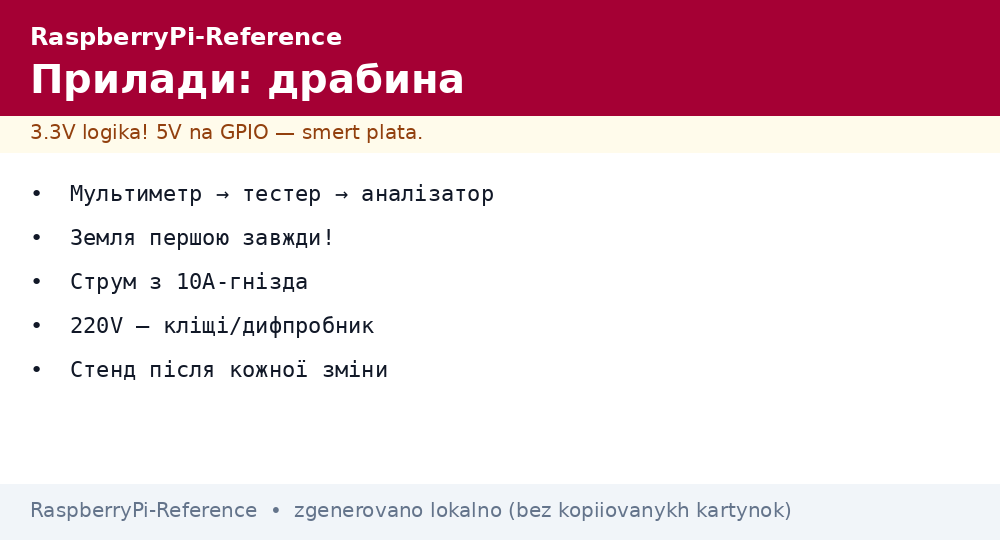
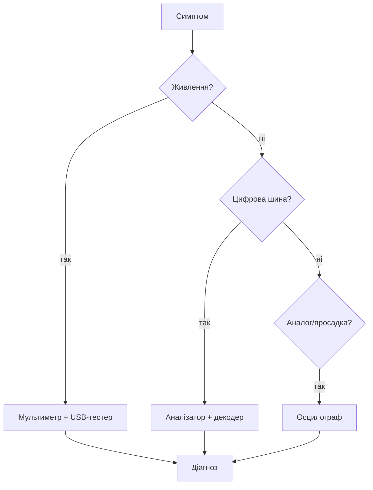

# Прилади мейкера Raspberry Pi - мультиметр, аналізатор і осцилограф


*Рис. Драбина приладів: мультиметр → USB-тестер → аналізатор → осцилограф - кожен закриває свій клас проблем.*

> [!tip] Що це за нота
> Чим міряти, коли щось не працює: від продзвонки до захвата шин. Порядок купівлі за віддачею на вкладене. Відладка шин: [логічний аналізатор](../../../RaspberryPi-Reference/04-Shini/02-Logic-Analyzer.md), живлення: [живлення USB-C](../../../RaspberryPi-Reference/02-Zhivlennya/01-USB-C-PD.md).

## 1. Мета

Купити прилади в правильному порядку:

- мінімум для старту і його межі;
- що закриває кожен наступний прилад;
- бюджетні моделі без переплат;
- безпека вимірювань (не спалити вхід!).

| Прилад | Ціна-порядок | Закриває |
| --- | --- | --- |
| Мультиметр цифровий | копійки | напруги, продзвонка, струм |
| USB-тестер | мало | вольти/ампери живлення |
| Логічний аналізатор 8ch | десятки | I2C/SPI/UART вживу |
| Осцилограф 100 МГц | сотні | просадки, дзвін, аналог |
| Термометр ІЧ | мало | перегрів SoC і ключів |

## 2. Архітектура діагностики



Правило трьох кроків: земля → живлення → сигнали. 90 % проблем вмирають на перших двох.

## 3. Мультиметр: перший друг

- напруга DC: 5V/3V3 на гребінці під навантаженням;
- продзвонка: короткі, обриви, правильність монтажу;
- струм: в розрив плюса (починати з 10A-гнізда!);
- опір: резистори і шлейфи без живлення;
- не міряти струм мережі побутовим - тільки кліщами.

## 4. USB-тестер: правда про живлення

- вольти/ампери/вати в реальному часі;
- просадка під навантаженням - головна цифра;
- лічильник мАг - ємність павербанків чесно;
- тригерні кабелі PD - перевірити профіль;
- тестер у сумці адміністратора завжди.

## 5. Робочий код: стенд самоперевірки

```python
import subprocess

def psu_test():
    out = subprocess.check_output(['vcgencmd', 'get_throttled']).decode()
    code = int(out.strip().split('=')[1], 16)
    print(f"throttled flags: {code:#x}")
    return code == 0

def temp_test():
    out = subprocess.check_output(['vcgencmd', 'measure_temp']).decode()
    t = float(out.split('=')[1].replace("'C", ''))
    print(f"temp: {t}C")
    return t < 70

def disk_test():
    out = subprocess.check_output(['df', '/']).decode().splitlines()[1].split()
    pct = int(out[4].rstrip('%'))
    print(f"disk used: {pct}%")
    return pct < 85

if __name__ == '__main__':
    ok = psu_test() and temp_test() and disk_test()
    print('STAND: PASS' if ok else 'STAND: FAIL')
```

Ганяємо після кожної зміни заліза: новий HAT, новий БЖ, новий корпус - стенд одразу покаже регрес.

## 6. Аналізатор і осцилограф

- аналізатор: 8 каналів, 24 МГц, декодери з коробки;
- осцилограф: 2 канали, 100 МГц - мінімум для цифри;
- пробники ×10 для високих/швидких сигналів;
- земля пробника - коротка, інакше дзвін від землі;
- калібрувальний вихід осцилографа - компенсація пробника.

## 7. Термоконтроль

- ІЧ-пірометр: SoC, стабілізатори, мости - точково;
- термопара мультиметра - контактно і точно;
- тепловізор телефону - картина плати цілком;
- критичні точки: SoC, PMIC, USB-хаб, DC-DC;
- журнал температур - тренд деградації термопасти.

## 8. Типові помилки

| Симптом | Причина | Лікування |
| --- | --- | --- |
| Мультиметр мовчить | згорілий запобіжник 200 мА | міряти струм з 10A-гнізда |
| Аналізатор бачить шум | немає спільної землі | GND крокодил на землю плати |
| Осцилограф бреше | некомпенсований пробник | калібрування по виходу |
| USB-тестер гріється | струм понад номінал | тестер на 5A+ для Pi 5 |
| Пірометр показує погоду | емісивність/відстань | матова стрічка на блискучому |
| Спалили вхід осцилографа | 220V безпосередньо | тільки через диференційний пробник! |

## 9. Швидка шпаргалка приладів

- порядок: мультиметр → тестер → аналізатор → осцилограф;
- земля першою, потім усе інше;
- струм - з 10A-гнізда починати;
- 220V - тільки кліщі/дифпробник;
- стенд самоперевірки після кожної зміни.

## 10. Суміжні ноти

- [логічний аналізатор](../../../RaspberryPi-Reference/04-Shini/02-Logic-Analyzer.md) - шини детально.
- [живлення USB-C](../../../RaspberryPi-Reference/02-Zhivlennya/01-USB-C-PD.md) - що міряти.
- [плата і PCB](../../../RaspberryPi-Reference/17-Lab/02-Plata-PCB-HAT.md) - виміри на своїй платі.
- [бекапи і клони](../../../RaspberryPi-Reference/08-Pamyat/02-Backup-Clone.md) - бекап перед експериментами.
- [головна карта](../../../RaspberryPi-Reference/Home.md) - повна навігація.

## 9.1 Калібрування домашньої лабораторії

- мультиметр: звірка з еталонним джерелом раз на рік;
- аналізатор: тест відомим UART-патерном;
- осцилограф: калібрувальний вихід + компенсація;
- термометр: лід (0 °C) і кип'яток (100 °C);
- записи калібрувань - у журнал лабораторії.

## Офіційні джерела

- [Getting Started (Raspberry Pi docs)](https://www.raspberrypi.com/documentation/computers/getting-started.html) - живлення і діагностика.
- [Raspberry Pi OS (Raspberry Pi)](https://www.raspberrypi.com/software/) - утиліти vcgencmd.
- [gpiozero docs (Read the Docs)](https://gpiozero.readthedocs.io/en/stable/) - тестові скрипти.
