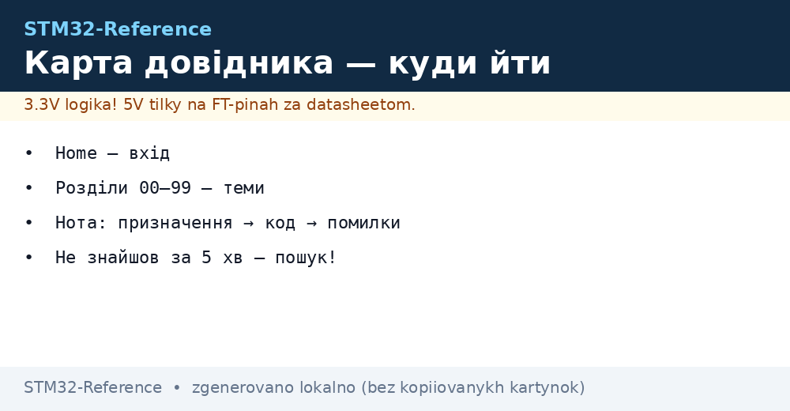
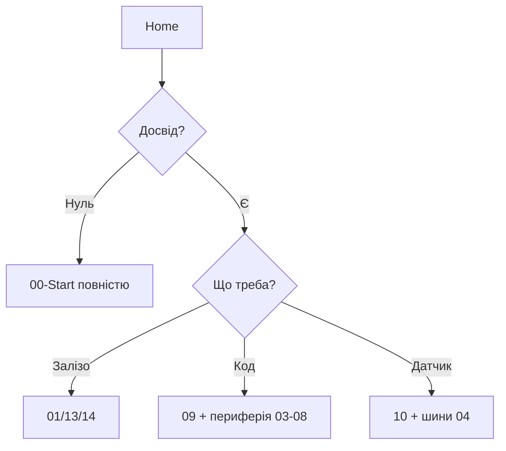

# Як користуватись довідником


*Рис. Карта руху: Home → розділ → нота → код → залізо.*

> [!tip] Призначення ноти
> Пояснити структуру бази за 3 хвилини: куди йти з конкретною задачею.

## 1. Призначення

База побудована як MOC (Map of Content): [Home](../../../STM32-Reference/Home.md) - вхід, 18 розділів - теми, ноти - відповіді з кодом. Кожна нота однакова всередині: призначення → характеристики → піни → схема → код → помилки → джерела. Стандарт перевіряють скрипти `scripts/` - усі в нуль.

## Маршрути за задачами

| Задача | Маршрут |
| --- | --- |
| Перший Blink | [DevKit плати](../../../STM32-Reference/00-Start/04-Devkit-plati.md) → [Вибір середовища](../../../STM32-Reference/00-Start/05-Vibir-seredovischa.md) |
| Вибрати чип | [Порівняння чипів](../../../STM32-Reference/00-Start/03-Porivnyannya-chipiv.md) |
| Датчик по I2C | Розділ 10 (черга 4) → конкретний сенсор |
| Не працює плата | FAQ + логіка + ST-Link-дебаг (черги 1, 5) |

```text
Правило 5 хвилин: не знайшов відповідь за 5 хвилин навігацією —
користуйся пошуком Obsidian за тегом або назвою чипа/модуля.
```

## Mermaid: куди йти



## Типові помилки

| # | Помилка | Чому погано | Як правильно |
| --- | --- | --- | --- |
| 1 | Читання підряд як книгу | База - довідник, не підручник | Заходити з задачі через таблицю маршрутів |
| 2 | Стара ревізія ноти | Інформація могла застаріти | Дивитись дату і CHANGELOG |
| 3 | Ігнор «Див. також» | Дублі питань у різних нотах | Ходити за перехресними лінками |

## Офіційні джерела

- [STM32 Documentation (ST)](https://www.st.com/en/microcontrollers-microprocessors/stm32-32-bit-arm-cortex-mcus.html) - точка входу в доки.
- [STM32CubeMX (ST)](https://www.st.com/en/development-tools/stm32cubemx.html) - конфігуратор і селектор.

## Структура ноти детально

| Блок | Що всередині | Навіщо |
| --- | --- | --- |
| Призначення + tip | Одне речення мети | Зрозуміти за 10 секунд, чи це твоя нота |
| Характеристики | Таблиця параметрів | Порівняти варіанти не читаючи все |
| Піни / схема ASCII | Текстова схема підключення | Зібрати без картинки |
| Рисунок PNG | Згенерована схема | Перевірити очима |
| Код | Фрагменти HAL/LL/Arduino | Скопіювати і запустити |
| Типові помилки | Таблиця граблів | Не наступити двічі |
| Офіційні джерела | Документація ST | Першоджерело замість форумів |
| Див. також | Перехресні лінки | Піти далі по темі |

## Теги і пошук

Кожна нота має теги: `stm32` + тема (`gpio`, `adc`, `power`...). Шукай за тегом чипа (`f4`, `g0`), периферії (`i2c`, `dma`) або плати (`bluepill`, `nucleo`). Frontmatter містить `description` - стислий зміст для списків.

## Версії і дати

У HAT-платі - `date-created` і `date` (останнє оновлення). ST випускає нові ревізії кремнію і HAL-версії щокварталу: звіряй дату ноти з версією свого CubeIDE/HAL. Застаріле маркується в CHANGELOG.

## Розбір ноти на прикладі

Візьмемо умовну ноту про датчик. Читання згори вниз:

1. **HAT-плата frontmatter** - `title` (що це), `description` (стисло), `tags` (для пошуку), `date` (свіжість). Застаріла дата + нова HAL-версія = перевірити актуальність.
2. **H1 + рисунок** - тема одним поглядом. Рисунок згенерований скриптом, стиль єдиний: HAT-плата, булети, футер.
3. **Призначення + tip** - чи твоя це задача. Не твоя - іди за лінками далі, не читай все.
4. **Характеристики** - таблиця «параметр → значення». Порівнюй стовпці, а не абзаци.
5. **Піни і ASCII-схема** - збирай прямо з тексту, без відкриття картинки.
6. **Код** - копіюй блоками, але читай коментарі: там пастки (таймінги, порядок ініціалізації).
7. **Типові помилки** - читай ДО збирання, не після диму. Кожен рядок - чиясь спалена плата.
8. **Офіційні джерела** - коли ноти мало: Reference Manual за номером розділу, datasheet за таблицею.

## Словник скорочень бази

| Скорочення | Розшифровка | Де зустрінеш |
| --- | --- | --- |
| HAL / LL | Hardware Abstraction / Low-Layer | Весь код прикладів |
| MOC | Map of Content (ця сторінка!) | Навігація |
| SWD | Serial Wire Debug | Прошивка і дебаг |
| DFU | Device Firmware Upgrade | Прошивка по USB |
| OB / RDP | Option Bytes / Readout Protection | Захист прошивки |
| HSE/HSI/LSE/LSI | Генератори тактування | Налаштування частот |
| AF | Alternate Function | Піни і периферія |
| DNP / NC | Do Not Populate / Not Connected | Схеми і BOM |

## Часті питання

| Питання | Відповідь |
| --- | --- |
| З чого почати з нуля? | Маршрут «Новачок» на [Home](../../../STM32-Reference/Home.md): гід → чипи → плати → середовище |
| Де код під мою плату? | У ноті теми, розділ «Код»; адаптуй піни під свою плату |
| Нота застаріла? | Дивись `date` у HAT-платі і CHANGELOG; доки ST - першоджерело |
| Немає моєї плати? | Шукай за чипом, не за назвою плати (той же F103 на сотнях плат) |
| Помилка не з ноти? | FAQ + логіка OpenOCD + питання з логом дебагу |

## Як пропонувати правки

Знайшов помилку - зафіксуй: файл, рядок, що не так, що перевірив (плата, чип, версія HAL). Правка без перевірки на залізі не приймається.

## Карта розділів одним поглядом

| Розділ | Про що | Коли йти |
| --- | --- | --- |
| 00-Start | Вибір чипа, плати, середовища | Ти тут |
| 01-Hardware | Родини, корпуси, errata | Вибираєш залізо |
| 02-Zhivlennya | Живлення і сон | Рахуєш батарею |
| 03-GPIO | Піни і альтернативні функції | Не працює пін |
| 04-Shini | I2C/SPI/UART/CAN/USB | Підключаєш модуль |
| 05-Radio | Бездротові модулі | Треба зв'язок |
| 06-Analog | АЦП/ЦАП/компаратори | Міряєш аналог |
| 07-Timeri-Son | Таймери, RTC, сон | Точний час або ШІМ |
| 08-Pamyat | Flash, OB, bootloader | Зберігаєш налаштування |
| 09-Proshivka | IDE, HAL/LL, дебаг | Пишеш код |
| 10-Sensori | Датчики | Міряєш світ |
| 11-Vivid | Вивід і приводи | Показуєш/рухаєш |
| 12-Moduli | Модулі зв'язку | Розширюєш можливості |
| 13-Модулі | Живлення і рівні | Живиш вузол |
| 14-Devboards | Плати | Вибираєш носія |
| 15-Protokoli | USB, CANopen, Modbus | Говориш протоколами |
| 16-Proekti | Готові вироби | Повторюєш цілком |
| 17-Lab | Інструменти | Налагоджуєш |
| 99-Dodatki | Таблиці, FAQ, errata | Швидка довідка |

## Див. також

- [Home](../../../STM32-Reference/Home.md)
- [Порівняння чипів](../../../STM32-Reference/00-Start/03-Porivnyannya-chipiv.md)
