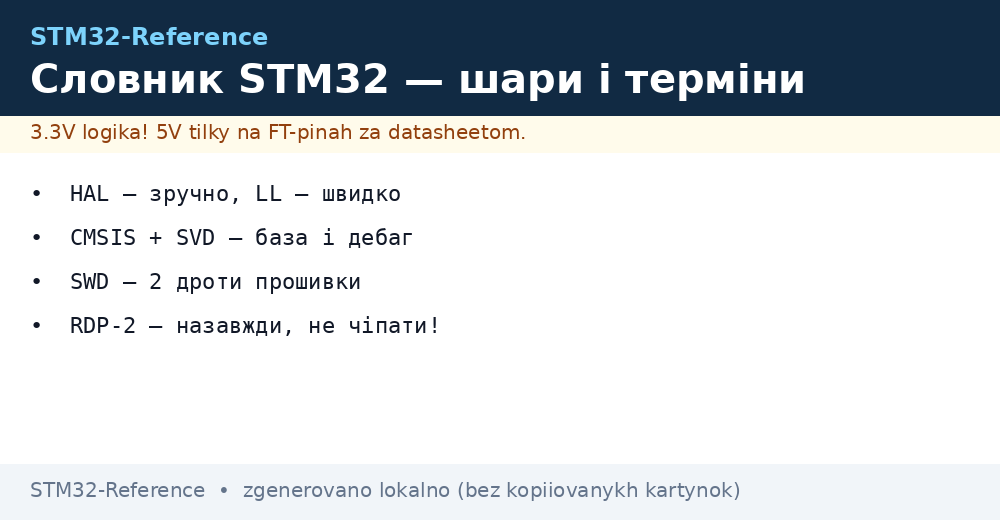
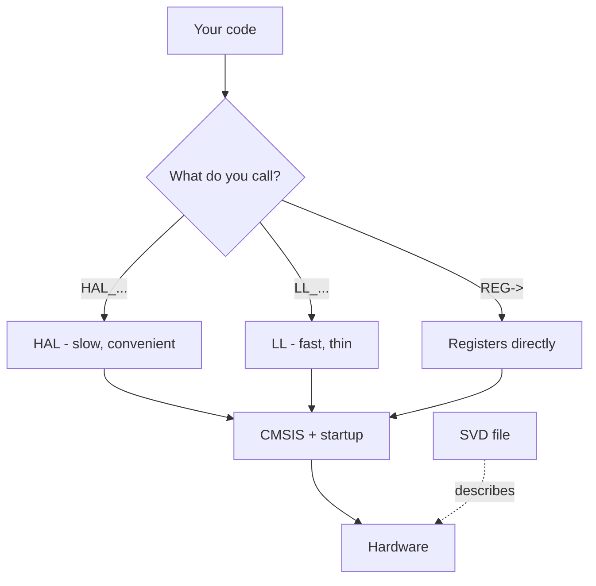

# STM32 glossary - terms


*Fig. STM32 layers: hardware → CMSIS → HAL/LL → your code; tools on the side.*

> [!tip] Purpose of this note
> Decode the abbreviations ST sprinkles into every document: how HAL differs from LL, what SVD is and why there is no debug without it.

## 1. Purpose

A newcomer to STM32 drowns not in registers but in vocabulary: HAL, LL, CMSIS, SVD, OCD, SWD, DFU, OB - all different layers and tools to tell apart before the first project. This note is a dictionary with a "where it lives" mapping.

## Code layers and environment

| Term | Meaning | Explanation |
| --- | --- | --- |
| HAL | Hardware Abstraction Layer | ST wrappers: readable, portable across chips, slower |
| LL | Low-Layer | Thin inlines close to registers: fast, less portable |
| CMSIS | Cortex Microcontroller Software Interface Standard | ARM standard: register map, startup, system functions |
| SVD | System View Description | XML description of chip registers - the debugger shows peripherals through it |
| BSP | Board Support Package | Drivers of a specific board (Discovery buttons, display) |
| Middleware | Middleware | USB stack, FATFS, LwIP, mbedTLS on top of HAL |

## Flashing and debug

| Term | Meaning | Explanation |
| --- | --- | --- |
| SWD | Serial Wire Debug | 2 wires (SWDIO/SWCLK) instead of 5 JTAG; the STM32 standard |
| SWO | Serial Wire Output | Third wire: printf-debug without UART (ITM) |
| OCD | On-Chip Debugger | Built-in debug module of the die |
| DFU | Device Firmware Upgrade | Flashing over USB without a programmer (ROM mode) |
| OB | Option Bytes | One-time configurable bits: readout protection, boot source, watchdog |
| RDP | Readout Protection | Firmware readout protection levels (0/1/2, 2 is forever!) |
| RTC backup | Battery domain | Registers and RTC that live off VBAT with main power off |

## Clocks and power supply

| Term | Meaning | Explanation |
| --- | --- | --- |
| HSE / HSI | High-Speed External / Internal | Outer crystal / inner RC oscillator |
| LSE / LSI | Low-Speed External / Internal | 32.768 kHz crystal / ~32 kHz RC for RTC |
| PLL | Phase-Locked Loop | Frequency multiplier: makes 72/170/480 out of 8 MHz |
| HSE bypass | Oscillator bypass | Clocking from an external generator instead of a crystal |
| PVD / BOR | Programmable Voltage Detector / Brown-Out Reset | Supply monitoring thresholds and reset on droop |
| SMPS | Switched-Mode Power Supply | Built-in switching regulator (H7/H5 - less heating) |
| VCAP / VDD11 | Inner core pins | Stabilization capacitors of the 1.xV domain - mandatory! |

## Peripherals

| Term | Meaning | Explanation |
| --- | --- | --- |
| AF | Alternate Function | Pin assignment to a peripheral (AF0-AF15 via GPIOx_AFRL/AFRH) |
| EXTI | External Interrupt | External interrupts from pins |
| DMA / BDMA / MDMA | Direct Memory Access | Transfers without CPU; streams/channels, arbiter, priorities |
| DMAMUX | DMA Multiplexer | Request router to channels (newer chips) |
| FDCAN | Flexible Data CAN | CAN-FD: flexible data rate, successor of bxCAN |
| SAI | Serial Audio Interface | Audio bus tougher than I2S: several slots, TDM |
| QUADSPI / OCTOSPI | Quad/Octal SPI | External Flash/PSRAM with XIP (code executes straight from it) |
| FMC / FSMC | Flexible Memory Controller | External SRAM/NOR/LCD over a parallel bus |
| LTDC | LCD-TFT Display Controller | RGB displays up to XGA with no CPU load |
| CRC / HASH / RNG | Hardware compute | CRC, SHA/HMAC, random number generator |
| CORDIC | Coordinate Rotation Computer | Hardware sin/cos/arctan (G4!) |
| FMAC | Filter Math Accelerator | FIR/IIR filters in hardware (G4!) |

```text
Мінімум для старту: HAL, SWD, HSE/PLL, AF, OB, RDP.
Решта — у міру появи периферії в проєкті, повертайся сюди.
```

## Mermaid: code layers



## Common issues

| # | Issue | Cause | Fix |
| --- | --- | --- | --- |
| 1 | Mixing up HAL and LL | Expecting LL speed from HAL in an ISR | Hot paths - LL/registers |
| 2 | No SVD for your chip | Debugger shows only CPU registers | Attach an SVD of a similar chip |
| 3 | RDP level 2 "to try" | Protection is forever, chip is execute-only | Level 2 - never during development |
| 4 | Mixing up DFU and bootloader | DFU is a ROM USB mode, your own bootloader is separate | Read AN2606 for your chip |

## Official sources

- [STM32 MCUs overview (ST)](https://www.st.com/en/microcontrollers-microprocessors.html) - decodings from ST engineers.
- [CMSIS Documentation (ARM)](https://www.keil.arm.com/components/cmsis/) - the layer standard.

## Board terms

| Term | Meaning | Explanation |
| --- | --- | --- |
| BOOT0 | Boot mode pin | 0 = Flash (run), 1 = System bootloader (DFU/UART) |
| NRST | Reset | Active-low reset, button + RC chain |
| SWDIO / SWCLK | Debug lines | Flashing and debug over two wires |
| VCAP | Core capacitor | 2.2 uF on VCAP, without it - instability |
| VBAT | Battery input | CR2032 for RTC/backup with main power off |
| PVD | Supply detector | Interrupt on droop (save context!) |
| BOR | Brown-out reset | Hardware reset on droop |
| TAMPER | Tamper input | Wiping secrets when the case is opened |
| JTAG-DP / SW-DP | Debug ports | Two debug port modes, SW is typical |

## Protocols and buses

| Term | Meaning | Explanation |
| --- | --- | --- |
| UART | Universal Async Receiver-Transmitter | TX/RX, baud rates up to Mbits, debug log base |
| SPI | Serial Peripheral Interface | MOSI/MISO/SCK/CS, tens of MHz, displays/Flash |
| I2C | Inter-Integrated Circuit | SDA/SCL + pull-up, sensors |
| CAN / FDCAN | Controller Area Network | Differential pair, automotive, needs a transceiver |
| USB CDC/HID/MSC | USB device classes | Virtual COM / keyboard / flash drive |
| DFU / DUFU | USB flashing | ROM mode for loading without a programmer |
| MODBUS RTU/TCP | Industrial protocol | RS485 or Ethernet, registers |
| CANopen | Profile over CAN | Object dictionary, SDO/PDO, industry |

## Power supply and packages

| Term | Meaning | Explanation |
| --- | --- | --- |
| LDO | Linear regulator | Quiet, heats on the voltage drop |
| Buck / Boost | Switching converters | High efficiency, noisy (ferrite!) |
| VBAT | Battery input | RTC + backup registers live without main power |
| LQFP / QFN / BGA | Package types | Soldering: iron / hot air / factory only |
| PTH / SMD | Through-hole / surface mount | PTH is tougher, SMD is denser |

## See also

- [Home](../../../STM32-Reference/Home.md)
- [Chip comparison](../../../STM32-Reference/00-Start/03-Porivnyannya-chipiv.md)
- [Environment choice](../../../STM32-Reference/00-Start/05-Vibir-seredovischa.md)
