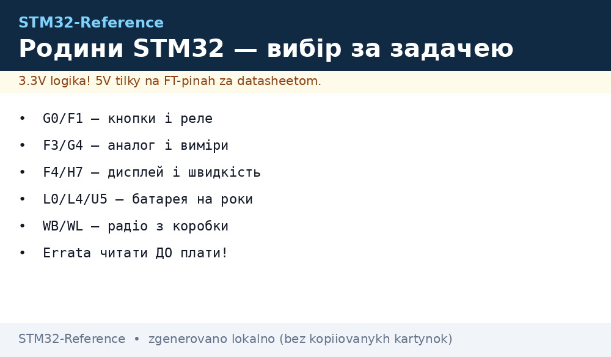
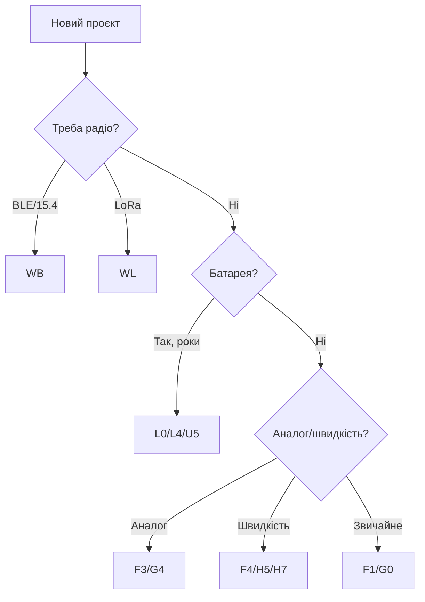

# Порівняння родин STM32

EN version: `00-Start/03-Porivnyannya-chipiv.en.md`


*Рис. Родини STM32: від бюджетного G0 до флагманського H5, бездротові WB/WL окремо.*

> [!tip] Призначення ноти
> Відповісти на питання «який STM32 брати» за 5 хвилин: таблиця родин, правило вибору за задачею, пастки клонів.

## 1. Призначення

Лінійка ST - це 10+ родин і тисячі партномерів. Правило вибору просте: починай з задачі (піни → периферія → продуктивність → живлення), а не з ціни. Дешевший чип без потрібного таймера дорожчий за дорогий з ним.

## Характеристики родин (орієнтир 2026)

| Родина | Ядро | Макс. частота | Флеш | Фішка | Бери коли |
| --- | --- | --- | --- | --- | --- |
| F0 | Cortex-M0 | 48 МГц | 16-256 КБ | Дешевий, 5V-толерантні піни | Проста логіка, кнопки, реле |
| F1 | Cortex-M3 | 72 МГц | 16-1024 КБ | Класика (Blue Pill), тони прикладів | Навчання, legacy-проєкти |
| F3 | Cortex-M4F | 72 МГц | 16-512 КБ | Аналогова периферія (АЦП+ЦАП+компаратори) | Вимірювання, керування живленням |
| F4 | Cortex-M4F | 84-180 МГц | 256-2048 КБ | Продуктивність + FPU, камери/DSP | Дисплеї, звук, обробка сигналів |
| G0 | Cortex-M0+ | 64 МГц | 16-512 КБ | Сучасна заміна F0, USB-C PD, низька ціна | Нові прості вузли |
| G4 | Cortex-M4F | 170 МГц | 32-512 КБ | Аналоговий монстр: 5× АЦП 4 Msps, ЦАП, оп-підсилювачі, HRTIM | Силова електроніка, FOC |
| H5 | Cortex-M33 | 250 МГц | 128-2048 КБ | Флагман: TrustZone, OCTOSPI, FDCAN | Складні HMI, безпека |
| H7 | Cortex-M7/M4 | 240-600 МГц | до 2 МБ | Максимум: LTDC, 2× USB, Ethernet | Відео, шлюзи, важкий ML |
| L0/L4 | Cortex-M0+/M4 | 32-120 МГц | 16-1024 КБ | Низьке споживання (нА-мкА сон) | Батарейні роки роботи |
| U5 | Cortex-M33 | 160 МГц | до 4 МБ | Низькоспоживчий флагман + безпека | Батарейні + захист |
| WB/WL | Cortex-M4+M0+ | 64 МГц | 256-1024 КБ | BLE/802.15.4 (WB) / Sub-GHz LoRa (WL) на борту! | Бездротові вузли без другого чипа |

```text
Швидкий вибір:
  Кнопки+реле+дешево ......... G0 (новий) або F1 (приклади)
  Аналог/вимірювання ......... F3 або G4
  Дисплей/камера/звук ........ F4 / H7
  Батарея на роки ............ L0 / L4 / U5
  BLE/LoRa з коробки ......... WB / WL
  Безпека/TrustZone .......... H5 / U5
```

## Mermaid: вибір за 4 питання



## Типові помилки

| # | Помилка | Чому погано | Як правильно |
| --- | --- | --- | --- |
| 1 | F1 бо «всі так роблять» | Старі ціни/дефіцит, немає FDCAN/USB-C | Нові проєкти - G0/G4 |
| 2 | H7 під блималку | Ціна, BGA, живлення-ядро складне | Бери мінімум під задачу |
| 3 | Ігнор errata | Баги кремнію конкретної ревізії | Читати errata ДО розводки плати! |
| 4 | Клон CS32F103 замість STM32 | Інша периферія/баги, немає підтримки | Маркування + CubeMX-тест |

## Офіційні джерела

- [STM32 MCU Selector (ST)](https://www.st.com/en/microcontrollers-microprocessors/stm32-32-bit-arm-cortex-mcus.html) - parametric search.
- [STM32F103C8T6 datasheet (ST)](https://www.st.com/en/microcontrollers-microprocessors/stm32f103c8.html) - еталон Blue Pill.

## Живлення і корпуси за родинами

| Питання | Що знати |
| --- | --- |
| Напруги | Більшість - 3.3V (деякі піни 5V-толерантні, див. даташит конкретного чипа, не родини!) |
| Ядро 1.xV | VCAP/VDD11 - конденсатори обов'язкові, інакше нестабільність |
| H7/H5 SMPS | Внутрішній buck: менше нагріву, але своя обв'язка індуктивності |
| Корпуси | LQFP (паяється вручну) → QFN → BGA (тільки завод/фен) |
| L0/L4/U5 сон | RAM retention + wakeup-таймери: мікроампери реальні, а не маркетингові |

## Клони і перевірка справжності

| Ознака | Оригінал ST | Клон (CS32/GD32/перемаркування) |
| --- | --- | --- |
| Маркування | Лазерне, рівне | Друк, криве, помилки в тексті |
| Flash | Як у даташиті | Часто більше/менше заявленого |
| USB/UART | За даташитом | Глюки на нестандартних бодах |
| Ціна | Ринкова | «Вдвічі дешевше» = перший дзвіночок |

Перевірка: `st-info --probe` (chip ID + flash size), потім CubeMX-blink, потім тест саме твоєї периферії (таймер/USB/АЦП). Клон для навчання згодиться, у серію - ні.

## Errata-практика

1. Знайди свій точний партномер + ревізію (маркування на корпусі, `DBGMCU_IDCODE`).
2. Відкрий errata sheet саме цієї ревізії на st.com.
3. Перевір пункти про твою периферію (I2C-зависання, ADC-калібрування, USB-resume - класика!).
4. Обхідні шляхи (workaround) - у код з першого дня, не «потім».

## Корпуси і розводка: що впливає на вибір

| Питання | Відповідь |
| --- | --- |
| Паяю сам паяльником | Тільки LQFP (крок 0.5 мм реально, 0.4 - вже спорт) |
| Треба багато пінів дешево | LQFP-100 у F4/G4 замість BGA у H7 |
| Високочастотний USB/RMII | Короткі диференційні пари, кварц близько до OSC_IN/OUT |
| АЦП точний | Окремий VDDA + VREF+, ферит від цифри, земля зіркою |
| Кварц чи внутрішній RC | HSI ±1% - для UART згодиться; USB/CAN - тільки кварц/HSE |
| Де взяти футпринт | Бібліотека CubeMX + перевірка кроку штангенциркулем на платі |

## Матриця «задача → 2 кандидати»

| Задача | Варіант А (дешево) | Варіант Б (із запасом) |
| --- | --- | --- |
| Реле/світлодіоди | G0 | F1 (якщо лежить у шухляді) |
| Датчики I2C + екран | G0/C3? ні - G031 | F401 |
| Аудіо I2S | F411 | F446 |
| FOC / мотори | G431 | F405 |
| Камера | F427 + DCMI | H743 |
| BLE-маяк | WB55 (готовий) | NRF + будь-який STM32 |

## Ціни і доступність (орієнтир)

| Сегмент | Ціна чипа | Коментар |
| --- | --- | --- |
| G0/F0 | ~$1 | Дешевше тільки клони |
| F1/F3 | $1.5-3 | F1 тримається за рахунок обсягів |
| F4 | $4-10 | Залежить від пам'яті |
| G4 | $3-7 | Вигідно за аналог на борту |
| H5/H7 | $8-20+ | Плюс BGA-монтаж у ціну виробу |
| WB/WL | $4-8 | Дешевше двох чипів (MCU+радіо) |

> Ціни - роздріб дрібних партій, коливаються з курсом і дефіцитом. Перед серією - запит у 3 дистриб'юторів + перевірка життєвого циклу (ST вказує longevity для промчипів).

## Швидка діагностика вибору

| Симптом неправильного вибору | Діагноз | Лікування |
| --- | --- | --- |
| Не вистачило пінів | Рахували «впритул» | Наступного разу +20% пінів запасу |
| Не вистачило Flash | Бібліотеки з'їли все | Перейти на сусіда з ×2 пам'яті того ж корпусу |
| АЦП шумить | Немає окремого VDDA | Ревізія плати або зовнішній АЦП |
| Проєкт виріс до F4, починали з F0 | Архітектура не масштабується | HAL-код переноситься легко - не прив'язуйся до регістрів рано |

## Див. також

- [Home](../../../STM32-Reference/Home.md)
- [DevKit плати](../../../STM32-Reference/00-Start/04-Devkit-plati.md)
- [Вибір середовища](../../../STM32-Reference/00-Start/05-Vibir-seredovischa.md)
