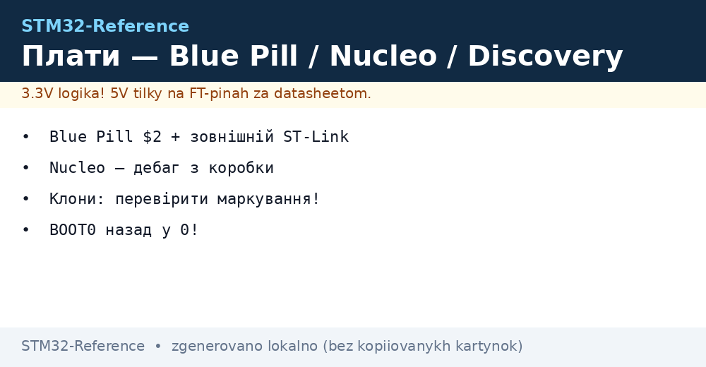

# DevKit плати - Blue Pill, Black Pill, Nucleo, Discovery

EN version: `00-Start/04-Devkit-plati.en.md`


*Рис. Від $2 Blue Pill (без нічого) до Nucleo (ST-Link + Morpho на борту).*

> [!tip] Призначення ноти
> Вибрати плату під етап: навчання, прототип, серійний виріб. Плюс пастки клонів.

## 1. Призначення

Плата - це чип + живлення + програматор + зручні піни. Blue Pill дешевий, але без ST-Link і з лотереєю стабілізатора. Nucleo дорожчий, зате з вбудованим ST-Link і Morpho-роз'ємом під шилди. Плутати їх місцями - втрачати дні.

## Характеристики плат

| Плата | Чип типово | Програматор | Живлення | Коли брати |
| --- | --- | --- | --- | --- |
| Blue Pill | F103C8 (часто перемарк!) | Немає (зовнішній ST-Link!) | USB 5V → слабкий LDO | Навчання за $2; перевірити справжність чипа! |
| Black Pill | F401/F411 | Немає / USB-CDC (залежить) | USB-C, кращий LDO | Компактні вузли, USB-серійник |
| Nucleo-64/144 | Залежить від плати | ST-Link вбудований! | ST-Link USB / VIN / 5V | Розробка: дебаг з коробки |
| Discovery | F4/H7 + дисплей/сенсори | ST-Link вбудований | USB | Демо периферії (аудіо, LCD, MEMS) |
| WeAct MiniF4 | F401 | USB-CDC | USB-C | Сучасний мінімалізм |

```text
Швидкий вибір:
  Перша плата в житті .......... Nucleo (дебаг з коробки рятує тижні)
  Дешевий вузол у корпус ........ Black Pill / WeAct
  Вчитися на помилках за $2 ..... Blue Pill (+ зовнішній ST-Link!)
```

## Mermaid: оригінал vs клон

```mermaid
flowchart TB
    BUY[Купую Blue Pill] --> MARK{Маркування чипа?}
    MARK -->|Лазерне, чітке| T1[Ймовірно оригінал: тест CubeMX + flash size]
    MARK -->|Друковане/криве| CLONE[Клон (CS32/GD32): перевірити периферію поштучно!]
    CLONE --> USBS{USB працює?}
    USB -->|Ні| EXT[Зовнішній ST-Link обов'язково]
```

## Типові помилки

| # | Помилка | Чому погано | Як правильно |
| --- | --- | --- | --- |
| 1 | Клон з перемарком | Інший обсяг flash, глюки USB | `st-info --probe` + тест периферії |
| 2 | Живлення 5V на пін 3.3V | Смерть чипа | Тільки 3.3V на GPIO (5V-толерантні - виняток, не правило!) |
| 3 | Прошивка Blue Pill по USB | Там немає USB-UART! | ST-Link (SWDIO/SWCLK) або UART-bootloader |
| 4 | BOOT0 не повернули в 0 | Плата завжди в bootloader | Перемичка назад після прошивки через UART |

## Офіційні джерела

- [Nucleo Boards (ST)](https://www.st.com/en/evaluation-tools/stm32-nucleo-boards.html) - лінійка і доки.
- [STM32CubeProgrammer (ST)](https://www.st.com/en/development-tools/stm32cubeprog.html) - прошивка/стирання/OB.

## Перший запуск покроково (будь-яка плата)

1. **Оглянь плату**: перемички живлення (JP5 на Nucleo!), BOOT0 в положенні 0, USB-кабель з даними.
2. **Підключи і послухай**: новий COM-порт / ST-Link у диспетчері пристроїв = жива.
3. **Прочитай чип**: STM32CubeProgrammer → Connect → chip ID + розмір flash. Не конектиться - перевір BOOT0, NRST, живлення.
4. **Залий Blink**: приклад GPIO_Toggle, кнопка Start Debugging (зелений жук!). LED блимає = тулчейн цілий.
5. **Потім**: поміняй пін LED на свій, додай кнопку з перериванням, увімкни UART-лог.

## Живлення детально

| Джерело | Куди йде | Обмеження |
| --- | --- | --- |
| USB ST-Link (Nucleo) | 5V шина плати → LDO → 3.3V | Струм від USB-порту ПК (~500 мА) |
| USB device (Blue Pill) | 5V → LDO RT9193 | Слабкий LDO: WiFi-модулі/мотори - окремо! |
| VIN / 5V пін | Безпосередньо на 5V шину | Не перевищувати 5.5V, діод Шотткі від переполюсовки |
| 3.3V пін | Безпосередньо в домен (в обхід LDO!) | Тільки стабільні 3.3V, інакше - смерть |
| Батарея + LDO | Через VIN | Рахувати dropout: Li-Ion 3.0V не потягне 3.3V LDO! |

## Плати детально: що де знаходиться

### Blue Pill (F103C8)

| Елемент | Де | Нотатка |
| --- | --- | --- |
| USB | Micro-USB, тільки живлення (даних немає!) | Прошивка - ST-Link або UART1 |
| Кнопки | RESET + BOOT0-перемичка | BOOT0: 0 = робота, 1 = завантаження |
| LED | PC13 (активний низький!) | Перший Blink - саме сюди |
| LDO | Слабий, гріється | Зовнішні модулі - окреме живлення |

### Nucleo-64 (приклад F401RE)

| Елемент | Де | Нотатка |
| --- | --- | --- |
| ST-Link | Верхня частина, USB Mini-B | Прошивка + дебаг + VCP-лог |
| Перемички живлення | JP5 (U5V/E5V/VIN) | Неправильна - плата мовчить |
| Кнопки | RESET (чорна) + USER (синя, PC13) | USER - перше переривання |
| Arduino-роз'єм | Morpho + Arduino Uno V3 | Шилди стають одразу |
| JP6 (IDD) | Вимір струму | Амперметр замість перемички - міряй сон! |

### Discovery (приклад F407)

| Елемент | Де | Нотатка |
| --- | --- | --- |
| Дисплей/аудіо/сенсори | На борту | Демо-прошивки ST як старт |
| ST-Link | Вбудований | Як у Nucleo |
| Живлення | USB + зовнішній 5V | Дисплей їсть - USB-хаба може не вистачити |

## Клони детально: що перевіряти

| Перевірка | Як | Очікувано |
| --- | --- | --- |
| Chip ID | `st-info --probe` | Відповідає маркуванню |
| Розмір Flash | CubeProgrammer → read | Як у даташиті |
| USB/UART | Echo-тест на 115200 і 921600 | Без сміття на високій швидкості |
| АЦП | Замкнути вхід на GND/3V3 | 0 і 4095 без шуму в сотні кодів |
| Кнопка Reset | Натискання під час роботи | Чистий рестарт, не зависання |

> Клон з чесними параметрами за $1 - робочий варіант для навчання. Клон з перемаркованим меншим Flash - повернення продавцю.

## Апгрейд плати з ростом проєкту

| Було | Стало | Що змінюється |
| --- | --- | --- |
| Blue Pill | Black Pill / WeAct | USB-CDC, більше Flash, той же код |
| Black Pill | Nucleo-64 | З'являється ST-Link і запас пінів |
| Nucleo-64 | Nucleo-144 / Discovery | Ethernet, дисплеї, більше пам'яті |
| Будь-яка DevKit | Своя плата | Тільки потрібне: чип + кварц + LDO + SWD-роз'єм |

> Піни і HAL-код переносяться майже 1-в-1 у межах однієї родини. Міняй плату, не переписуй проєкт.

## Де купувати і на що дивитись

| Канал | Плюс | Мінус |
| --- | --- | --- |
| Офіційні дистриб'ютори | Гарантія оригіналу, повні доки | Ціна і терміни |
| Маркетплейси | Дешево, швидко | Лотерея клонів - перевіряти за таблицею вище |
| Барахолки/б/в | Іноді раритети | Без гарантій взагалі |

> Для навчання вистачить однієї Nucleo + однієї Blue Pill. Набір «все підряд» збирає пил.

## Як відрізнити клон

- Ціна нижча за $2 - майже напевно клон з меншим Flash; перевіряти програматором.
- Шовкографія розмита, USB-роз'єм хитається - ознаки дешевої збірки.
- Клон працює, але errata і документація - як пощастить.

## Див. також

- [Home](../../../STM32-Reference/Home.md)
- [Порівняння чипів](../../../STM32-Reference/00-Start/03-Porivnyannya-chipiv.md)
- [Вибір середовища](../../../STM32-Reference/00-Start/05-Vibir-seredovischa.md)
