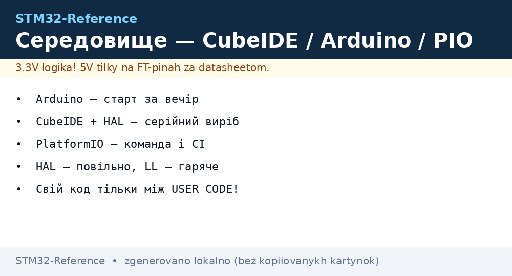

# Вибір середовища - STM32CubeIDE vs Arduino vs PlatformIO


*Рис. Три шляхи: CubeIDE (повний контроль), Arduino (швидкий старт), PlatformIO (залежності + CI).*

> [!tip] Призначення ноти
> Вибрати інструмент під задачу, а не за звичкою: порівняння, правило вибору, пастки кожного.

## 1. Призначення

Середовище визначає швидкість старту і стелю можливостей. Arduino - Blink за 10 хвилин, але без CubeMX-конфігуратора і з чужими ядрами. CubeIDE - повний контроль (HAL/LL, дебаг, CubeMX), але поріг входу вищий. PlatformIO - залежності і CI поверх обох світів.

## Характеристики варіантів

| Критерій | STM32CubeIDE | Arduino (ядро STM32Duino) | PlatformIO |
| --- | --- | --- | --- |
| Ціна/ліцензія | Безкоштовно (ST) | Безкоштовно | Безкоштовно (ядро - PIO) |
| CubeMX-генерація | Вбудована | Немає (руками/DIV) | Через CubeMX + імпорт |
| HAL vs LL | Обидва + прямий регістровий | Arduino-обгортки (сховані HAL) | Як налаштовано |
| Дебаг | ST-Link + GDB з коробки | Обмежений (Serial + інколи ST-Link) | ST-Link через налаштування |
| Бібліотеки | HAL-приклади ST | Тисячі Arduino-бібліотек | PIO Registry + Arduino + HAL |
| CI/автоматизація | headless-білди складно | CLI є, але криво | `pio run/test/ci` - найкраще |

```text
Швидкий вибір:
  Навчання / прототип за вечір .. Arduino (Blue Pill + USB-Serial)
  Серійний виріб / складна периферія  CubeIDE + HAL (далі LL у гарячих місцях)
  Команда / CI / кілька плат ........ PlatformIO
```

## Mermaid: HAL vs LL

```mermaid
flowchart TB
    Q[Пишу драйвер] --> HOT{Гарячий шлях?}
    HOT -->|Ні: init, повільне| HAL[HAL: читабельно, переносимо]
    HOT -->|Так: ISR, МГц| LL[LL: тонко, швидко, ближче до регістрів]
    HOT -->|Екстрим| REG[Прямі регістри (див. Reference Manual!)]
```

## Типові помилки

| # | Помилка | Чому погано | Як правильно |
| --- | --- | --- | --- |
| 1 | Arduino-ядро не під свій чип | Не компілюється / не ті піни | Перевірити підтримку плати в ядрі STM32Duino |
| 2 | HAL у МГц-перериванні | Не встигає, джиттер | LL або регістри в ISR |
| 3 | CubeMX перегенерував поверх ручного коду | Код зник | Свій код ТІЛЬКИ між `USER CODE BEGIN/END`! |
| 4 | Дебаг через Serial замість ST-Link | Сліпота при зависаннях | ST-Link + breakpoints з дня 1 |

## Офіційні джерела

- [STM32CubeIDE (ST)](https://www.st.com/en/development-tools/stm32cubeide.html) - IDE + CubeMX.
- [Arduino core STM32 (GitHub)](https://github.com/stm32duino/Arduino_Core_STM32) - підтримувані плати.

## Перший проєкт покроково

**CubeIDE:** File → New → STM32 Project → вибери свій чип → назви → Yes ініціалізувати периферію → у `.ioc` увімкни GPIO LED як Output → Ctrl+S (генерація!) → пиши між USER CODE → Debug (зелений жук).

**Arduino:** Tools → Board → знайди свою плату → приклад Blink → Upload. Перший раз довго (компіляція ядра), далі швидко.

**PlatformIO:** New Project → плата + Arduino/STM32Cube framework → `src/main.cpp` → Upload + Monitor. Бібліотеки - через Library Manager в `platformio.ini` (`lib_deps`).

## HAL vs LL на прикладі (моргнути LED)

```c
// HAL: читабельно
HAL_GPIO_TogglePin(LD2_GPIO_Port, LD2_Pin);
HAL_Delay(500);
// LL: те саме, швидше і тонше
LL_GPIO_TogglePin(LD2_GPIO_Port, LD2_Pin);
LL_mDelay(500);
```

## HAL vs LL глибше: коли що болить

| Ситуація | HAL | LL |
| --- | --- | --- |
| Ініціалізація периферії | Один виклик `HAL_UART_Init` | Десятки рядків налаштувань |
| Переривання 1 кГц | Встигає з запасом | Тим більше встигає |
| Переривання 100 кГц+ | Джиттер, пропуски | Єдиний варіант |
| Читання даташиту | Можна рідко | Обов'язково (що саме пишеш у регістр) |
| Перенос на інший чип | Часто компілюється одразу | Переписати місця з різними регістрами |
| Розмір коду | Більше (але кого це хвилює у 512К) | Менше, важливо для F0 з 16К |

## Налаштування ST-Link в усіх трьох

| Середовище | Що натиснути | Якщо не бачить |
| --- | --- | --- |
| CubeIDE | Зелений жук → Debug Configurations → STM32 Cortex-M C/C++ Application | Оновити ST-Link firmware через STM32CubeProgrammer |
| Arduino | Tools → Programmer: ST-Link | Перевірити драйвер STLINK-VCP |
| PlatformIO | Кнопка Debug (жук) + `debug_tool = stlink` в ini | `platformio device list`, перевтикнути USB |

## Міграція між середовищами

Arduino → CubeIDE: забери логіку (`loop` → `while(1)` в main), перепиши HAL-виклики замість Arduino-функцій, піни звір з CubeMX. CubeIDE → PlatformIO: скопіюй `Core/` + створи `platformio.ini` з `framework = stm32cube`. PlatformIO → Arduino: витягни логіку назад у `.ino`, прибери HAL-залежності.

## CI-приклад для PlatformIO (GitHub Actions)

```yaml
# .github/workflows/build.yml — збірка при кожному push
jobs:
  build:
    runs-on: ubuntu-latest
    steps:
      - uses: actions/checkout@v4
      - uses: actions/cache@v4
        with: { path: ~/.platformio, key: pio }
      - uses: actions/setup-python@v5
        with: { python-version: '3.11' }
      - run: pip install platformio
      - run: pio run -e nucleo_f401re -e bluepill_f103c8
```

## Коли міняти середовище посеред проєкту

| Сигнал | Куди йти |
| --- | --- |
| Arduino стало тісно (немає дебагу, дивні падіння) | CubeIDE + ST-Link |
| CubeIDE-проєкт треба збирати на сервері | PlatformIO (той же код, `platformio.ini`) |
| Треба чужий Arduino-приклад у CubeIDE | Порт вручну: логіка - так, бібліотеки - шукати HAL-аналоги |

## Шпаргалка команд трьох середовищ

| Дія | CubeIDE | Arduino IDE | PlatformIO |
| --- | --- | --- | --- |
| Зібрати | Ctrl+B / Build | Verify (галочка) | `pio run` |
| Прошити | Debug (жук) | Upload (стрілка) | `pio run -t upload` |
| Монітор | OpenOCD Console / SWO | Serial Monitor | `pio device monitor` |
| Чиста збірка | Project → Clean | Немає (кеш ховається) | `pio run -t clean` |

## Зберігання проєкту (бекап!)

> Проєкт живе у трьох місцях: код у git, CubeMX `.ioc` поруч з кодом (без нього не відновити конфігурацію!), згенероване - можна видалити і перегенерувати. Бінарники і `.settings` IDE в git не класти.

## Версії тулчейну в команді

- Фіксувати версії CubeIDE/GCC у README проєкту, інакше збірка пливе.
- Docker-образ з тулчейном - один для всіх розробників.

## Див. також

- [Home](../../../STM32-Reference/Home.md)
- [Порівняння чипів](../../../STM32-Reference/00-Start/03-Porivnyannya-chipiv.md)
- [DevKit плати](../../../STM32-Reference/00-Start/04-Devkit-plati.md)
