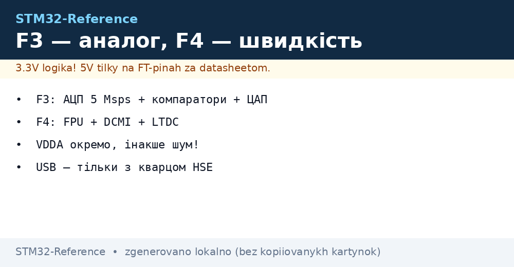
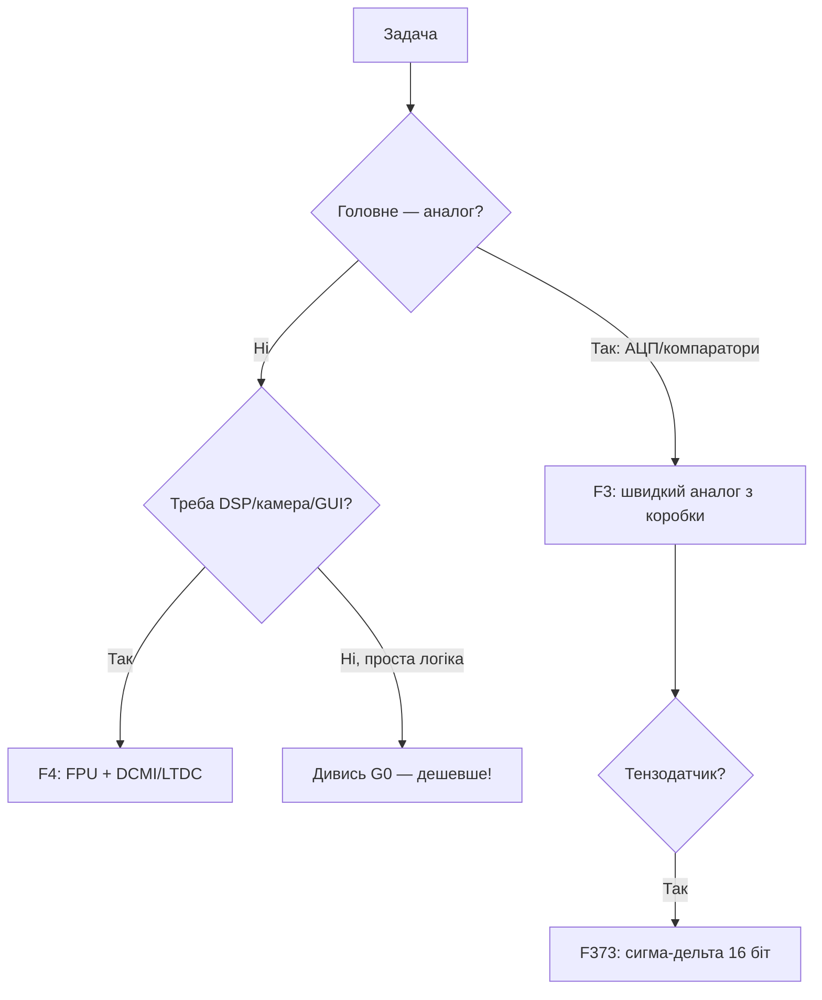

# STM32 F3 / F4 - аналог і продуктивність

EN version: `01-Hardware/02-F3-F4.en.md`


*Рис. F3 - вимірює, F4 - рахує.*


*Рис. F3 - аналоговий фронт (АЦП/ЦАП/компаратори), F4 - швидкість (FPU, камери, дисплеї).*

> [!tip] Призначення ноти
> Вибрати між «міряти точно» (F3) і «рахувати швидко» (F4): що вміє аналогова периферія і де потрібен FPU.

## 1. Призначення

F3 - це вимірювальний чип: швидкі 12-біт АЦП (до 5 Msps кожен, до 10 Msps у парі в interleaved-режимі), компаратори, ЦАП, а в F373 - навіть сигма-дельта АЦП. F4 - робоча конячка: Cortex-M4F до 180 МГц, апаратний FPU одинарної точності, DSP-інструкції, камери (DCMI), дисплеї (LTDC/FSMC). Обидві живляться 1.8-3.6 В, 5V-толерантні піни - за даташитом.

## Характеристики родин

| Параметр | STM32F3 (F303/F373) | STM32F4 (F401/F405/F427/F446) |
| --- | --- | --- |
| Ядро | Cortex-M4F, 72 МГц | Cortex-M4F, 84-180 МГц |
| Flash / RAM | 16-512 КБ / 4-80 КБ | 256-2048 КБ / 64-384 КБ |
| FPU / DSP | Так / Так | Так / Так + ART-акселератор (кеш Flash) |
| АЦП | До 4× 12-біт, 5 Msps interleaved | 3× 12-біт, 2.4 Msps |
| ЦАП | 2-3 канали 12-біт | 2 канали 12-біт |
| Компаратори / ОУ | До 7 / є (F3!) | 2 (деякі) / немає |
| Сигма-дельта АЦП | F373 (3 канали, 16 біт) | Немає |
| Камера/дисплей | Ні | DCMI (F4x7), LTDC (F429), FSMC |
| USB / CAN / Ethernet | USB device, CAN | USB OTG FS/HS, CAN, Ethernet (F407) |
| Коли брати | Точні виміри, керування живленням | DSP, звук, камери, GUI |

```text
Швидкий вибір усередині:
  Вимірювач з компараторами ...... F303K8 / F303CBT6
  Сигма-дельта (тензодатчики) .... F373VCT6
  Звук/DSP дешево ................ F401CCU6 (Black Pill!)
  Камера + дисплей ............... F427VIT6 / F429NIH6
  Ethernet-шлюз .................. F407VET6
```

## Mermaid: F3 чи F4



## Живлення і тактування

| Питання | Відповідь |
| --- | --- |
| VDDA | Окремий аналоговий домен + VREF+; без нього АЦП шумить |
| HSE | 4-26 МГц кварц; USB вимагає точності 0.25% - тільки кварц! |
| PLL | З 8 МГц - 72 (F3) / 84-180 (F4); USB 48 МГц - окремий дільник |
| VCAP | Конденсатори 2.2 мкФ на ядро - обов'язково |

## Типові помилки

| # | Помилка | Чому погано | Як правильно |
| --- | --- | --- | --- |
| 1 | VDDA не підключено | АЦП видає сміття або нулі | VDDA + VREF+ завжди, навіть якщо АЦП «не потрібен» |
| 2 | Старт з HSI для USB | Похибка RC не тримає USB-таймінги | HSE-кварц для всього з USB |
| 3 | Float-double замість float | Double рахується програмно навіть з FPU! | Тільки `float` у гарячих місцях |
| 4 | F429 без SDRAM під LTDC | Кадровий буфер не влазить у RAM | Зовнішня SDRAM через FMC |
| 5 | Очікування сигма-дельта на F4 | Її там немає - тільки F373 | Дивись F373 або зовнішній АЦП |

## Офіційні джерела

- [STM32F303VC datasheet (ST)](https://www.st.com/en/microcontrollers-microprocessors/stm32f303vc.html) - аналогова периферія.
- [STM32F407VG datasheet (ST)](https://www.st.com/en/microcontrollers-microprocessors/stm32f407vg.html) - продуктивність, Ethernet.

## АЦП-практика F3: interleaved-режим

Два АЦП семплять той же сигнал зі зсувом півтакту - подвоєна частота дискретизації (до 10 Msps сумарно на F303). Налаштування: ADC1 master + ADC2 slave, dual interleaved mode (саме interleaved подвоює частоту, не simultaneous), DMA збирає пари. Застосування: вимір струму ключа в кожному ШІМ-циклі (motor control!), імпульсні відгуки.

| Параметр | Значення |
| --- | --- |
| Роздільність | 12 біт + oversampling до 16 біт (апаратний!) |
| Тригер | Таймер (TIM1 CC) - синхронно з ШІМ |
| Калібрування | Заводські коефіцієнти + самокалібрування при старті |
| VREF | Зовнішній точний або VREFBUF-подібна схема |

## FPU/DSP-практика F4

| Тема | Практика |
| --- | --- |
| Увімкнення FPU | CPACR регістр при старті (startup це робить, перевірити!) |
| DSP-інструкції | `__SMUAD`, `__SMLAD` для FIR; CMSIS-DSP бібліотека готова |
| ART-акселератор | 0-wait-state Flash на 168 МГц - не вимикати! |
| CCM RAM | 64 КБ тісно зв'язаної пам'яті: критичний код/дані сюди |
| FPU-контекст | FreeRTOS зберігає регістри FPU тільки якщо задача їх торкалась |

## Компаратори F3: аналоговий захист без CPU

| Параметр | Значення |
| --- | --- |
| Кількість | До 7 (F303), швидкість ~50 нс |
| Вихід | На пін / на таймер BKIN (аварійна зупинка ШІМ!) / на переривання |
| Опора | Внутрішня (VREFINT/4/2/3/4) або зовнішня |
| Гістерезис | Програмований - без дребезгу компаратора |

```text
Застосування: струм мотора через шунт → компаратор → BKIN таймера →
ШІМ гасне залізякою за наносекунди, CPU дізнається потім з переривання.
```

## ЦАП-практика: два канали - це мало, але вистачає

| Тема | Практика |
| --- | --- |
| Роздільність/швидкість | 12 біт, ~1 Msps; буфер виходу вмикати при навантаженні |
| Хвилі без CPU | DMA з масиву семплів по тригеру таймера (синус/пилкоподібна) |
| Калібрування | Заводський trimming + програмний offset |
| Немає ЦАП у чипі | ШІМ + RC-фільтр (повільно) або зовнішній MCP4725 |

## FMC-практика: зовнішня пам'ять без болю

| Тема | Практика |
| --- | --- |
| SDRAM під LTDC | Таймінги з даташиту пам'яті (CAS latency!), частота FMC ≤ 90 МГц |
| NOR-Flash | XIP можливий, але повільніше за внутрішню |
| SRAM як mailbox | Швидкий обмін між ядрами/периферією |
| GPIO-конфлікт | Піни FMC фіксовані альтернативними функціями - планувати розводку з CubeMX |

```c
// Перевірка SDRAM після ініціалізації: пишемо патерн, читаємо назад
for (uint32_t i = 0; i < 1024; i++) ((uint32_t*)0xD0000000)[i] = i ^ 0xA5A5A5A5;
for (uint32_t i = 0; i < 1024; i++)
    if (((uint32_t*)0xD0000000)[i] != (i ^ 0xA5A5A5A5)) Error_Handler();
```

## Партномери: що замовляти

| Партномер | Ядро/Flash | Особливість | Для чого |
| --- | --- | --- | --- |
| STM32F303K8T6 | M4F/64 КБ | Компаратори, ЦАП | Вимірювач малий |
| STM32F303CCT6 | M4F/256 КБ | 4 АЦП, 7 компараторів | Керування живленням |
| STM32F373VCT6 | M4F/256 КБ | Сигма-дельта АЦП | Тензодатчики |
| STM32F401CCU6 | M4F/256 КБ | FPU, USB | Black Pill, звук |
| STM32F407VGT6 | M4F/1 МБ | Ethernet, DCMI | Шлюз з камерою |
| STM32F429NIH6 | M4F/2 МБ | LTDC, SDRAM | Дисплей 7 дюймів |

## Errata: що знати до плати

| Тема | Практика |
| --- | --- |
| АЦП interleaved ранніх ревізій | Перевірити зсув між каналами |
| USB на HSI | Тільки з кварцом HSE для стабільності |
| CCM-RAM | Не вся пам'ять DMA-доступна - буфери в SRAM! |

## Див. також

- [Home](../../../STM32-Reference/Home.md)
- [Порівняння чипів](../../../STM32-Reference/00-Start/03-Porivnyannya-chipiv.md)
- [F0/F1](../../../STM32-Reference/01-Hardware/01-F0-F1-Classic.md)
