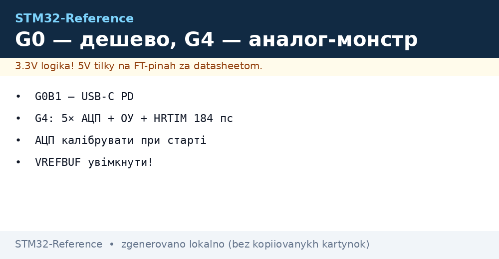
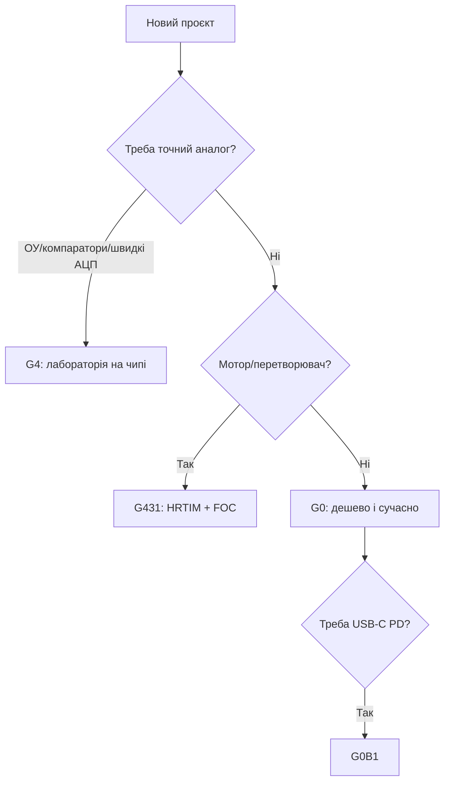

# STM32 G0 / G4 - сучасні бюджетник і аналоговий монстр

EN version: `01-Hardware/03-G0-G4.en.md`


*Рис. G0 - ціна, G4 - аналог і HRTIM.*


*Рис. G0 - дешево і сучасно; G4 - аналог, HRTIM і математика в залізі.*

> [!tip] Призначення ноти
> Пояснити, чому нові проєкти стартують з G0/G4, а не з F0/F1: ціни, USB-C, аналог і апаратна математика.

## 1. Призначення

G0 - це «F0, перероблений правильно»: Cortex-M0+ до 64 МГц, USB-C Power Delivery в окремих чипах, 5V-толерантні піни, ціна від ~$1. G4 - відповідь на питання «а що якщо в мікроконтролер покласти вимірювальну лабораторію»: 5× АЦП по 4 Msps, 7 компараторів, 6 операційних підсилювачів з програмованим підсиленням, HRTIM з роздільною здатністю 184 пс, апаратні CORDIC (sin/cos) і FMAC (фільтри).

## Характеристики родин

| Параметр | STM32G0 (G030/G070/G0B1) | STM32G4 (G431/G474) |
| --- | --- | --- |
| Ядро | Cortex-M0+, 64 МГц | Cortex-M4F, 170 МГц |
| Flash / RAM | 16-512 КБ / 8-144 КБ | 32-512 КБ / 22-128 КБ |
| АЦП | 1-2× 12-біт, 2.5 Msps | 5× 12-біт, 4 Msps кожен! |
| ЦАП / Компаратори | 2 / 2 | 7 ЦАП / 7 компараторів |
| ОУ | Немає | 6× OPAMP з PGA |
| HRTIM | Немає | Так: ШІМ 184 пс для перетворювачів! |
| CORDIC / FMAC | Немає | Так / Так |
| USB | Device (деякі) + USB-C PD (G0B1) | USB device |
| FD-CAN | G0B1 | Так |
| VREFBUF | Є (внутрішня опора!) | Є |
| Коли брати | Все просте, нове, дешеве | Силова електроніка, FOC, вимірювачі |

```text
Швидкий вибір усередині:
  Мінімум ніжок ................. G030F6 (TSSOP20/SO8!)
  USB-девайс .................... G070KB + кристал з USB
  USB-C з Power Delivery ......... G0B1 (зарядки, доки)
  Мотор/FOC ..................... G431KB (CTTC-плата — класика жанру)
  Багатофазний перетворювач ..... G474RE (HRTIM на повну)
```

## Mermaid: G0 чи G4



## HRTIM коротко (чому 184 пс - це багато)

HRTIM (High-Resolution Timer) - це ШІМ-таймер з кроком 184 пс проти ~6 нс у звичайних таймерів на 170 МГц. Навіщо: LLC-резонансні перетворювачі, цифрові БЖ, точне керування фазами. Практика: master-таймер задає період, slave-канали - фази з dead-time; Fault-входи гасять все залізо без CPU.

## Типові помилки

| # | Помилка | Чому погано | Як правильно |
| --- | --- | --- | --- |
| 1 | G0 як заміна F103 1-в-1 по пінах | Розпіновка інша! | Перемапити за CubeMX, не за пам'яттю |
| 2 | АЦП G4 без калібрування | Зсув нуля псує вимір струму | `HAL_ADCEx_Calibration_Start` при старті |
| 3 | OPAMP без налаштування PGA | Підсилення не те | PGA gain виставити явно, входи - за даташитом |
| 4 | Очікування HRTIM на G0/F1 | Його там немає | Тільки G4/H5 |
| 5 | VREFBUF не ввімкнено | АЦП пливе з живленням | Увімкнути VREFBUF на 2.048/2.5V |

## Офіційні джерела

- [STM32G431KB datasheet (ST)](https://www.st.com/en/microcontrollers-microprocessors/stm32g431kb.html) - аналог, HRTIM.
- [STM32G030F6 datasheet (ST)](https://www.st.com/en/microcontrollers-microprocessors/stm32g030f6.html) - бюджетник.

## OPAMP-практика G4: PGA без зовнішніх ОУ

Внутрішні операційники G4 вміють програмоване підсилення (PGA ×2/4/8/16/32/64) і режими follower/comparator. Типовий кейс: шунт струму мотора → OPAMP ×16 → АЦП, без жодної зовнішньої мікросхеми.

| Параметр | Значення |
| --- | --- |
| Кількість | До 6 (залежить від корпусу!) |
| GBW | ~1-3 МГц (не для радіо, для датчиків - із запасом) |
| Калібрування | Self-calibration при старті (зсув нуля!) |
| Обмеження | Діапазон входу не rail-to-rail на всіх режимах - дивись даташит |

## CORDIC і FMAC: коли згадати

| Блок | Що рахує | Приклад |
| --- | --- | --- |
| CORDIC | sin/cos/arctan/sqrt за ~10 тактів | FOC-перетворення Парка/Кларка без таблиць |
| FMAC | FIR/IIR фільтри | Фільтрація струму мотора на льоту |
| Обидва | Працюють через DMA | CPU вільний під керування |

## USB-C PD практика (G0B1)

| Тема | Практика |
| --- | --- |
| UCPD-периферія | Залізний контролер PD-протоколу, CPU лише обробляє події |
| Ролі | Sink (заряджаємось) / Source (живимо) / Dual |
| Типові контракти | 5V/3A, 9V, 12V, 20V - запит через PD-повідомлення |
| Захист | OVP по VBUS обов'язково - 20V на 5V-схему = дим |

## Код: старт ADC + OPAMP (G4, LL)

```c
LL_ADC_EnableInternalRegulator(ADC1);
while (!LL_ADC_IsInternalRegulatorStabilized(ADC1));
LL_ADC_StartCalibration(ADC1, LL_ADC_SINGLE_ENDED);
while (LL_ADC_IsCalibrationOnGoing(ADC1));
LL_ADC_Enable(ADC1);
// OPAMP1: follower на шунт
LL_OPAMP_SetFunctionalMode(OPAMP1, LL_OPAMP_MODE_FOLLOWER);
LL_OPAMP_Enable(OPAMP1);
```

## VREFBUF-практика

| Тема | Практика |
| --- | --- |
| Напруги | 2.048V / 2.5V на вибір, точність ~0.1% |
| Конденсатор | 0.47-4.7 мкФ на VREF+ (за даташитом!) |
| Коли вимикати | У глибокому сні - плюс час стабілізації при пробудженні |
| Перевірка | Заміряти VREF+ мультиметром: пливе - дивись навантаження/конденсатор |

## FD-CAN практика (G0B1/G4)

| Тема | Практика |
| --- | --- |
| Classic vs FD | FD-кадри швидші на полі даних (до 8 Мбіт), арбітраж - як у classic |
| Трансивер | Звичайний CAN-трансивер підійде до ~2 Мбіт; вище - з запасом по фронтах |
| Термінація | 120 Ом на кінцях шини, як завжди |
| Фільтри | Стандартні + розширені ID, маски - налаштувати, інакше потоп переривань |

## Дебаг-специфіка G0/G4

| Тема | Практика |
| --- | --- |
| SWD | Стандартно, але перевір живлення дебагера = живлення плати |
| Watchdog у дебагу | Зупиняти разом з ядром, інакше ресет під брейкпоінтом |
| OPAMP/HRTIM у дебагу | Зупинка ядра не зупиняє силову частину - обережно з мотором! |

## Партномери: що замовляти

| Партномер | Ядро/Flash | Особливість | Для чого |
| --- | --- | --- | --- |
| STM32G030F6P6 | M0+/32 КБ | TSSOP20, ціна | Кнопки і реле |
| STM32G070KBT6 | M0+/128 КБ | USB device | Дешевий USB-вузол |
| STM32G0B1CET6 | M0+/512 КБ | USB-C PD, FD-CAN | Зарядки і доки |
| STM32G431KBT6 | M4F/128 КБ | HRTIM, OPAMP | Мотор і FOC |
| STM32G474RET6 | M4F/512 КБ | 5 АЦП, HRTIM | Перетворювач |
| STM32G491KCT6 | M4F/256 КБ | Математика CORDIC | Фільтри на залізі |

## Errata: що знати до плати

| Тема | Практика |
| --- | --- |
| OPAMP зсув нуля | Самокалібрування при кожному старті |
| HRTIM fault-входи | Перевірити полярність в errata ревізії |
| VREFBUF час старту | Затримка стабілізації перед першим виміром |

## Див. також

- [Home](../../../STM32-Reference/Home.md)
- [Порівняння чипів](../../../STM32-Reference/00-Start/03-Porivnyannya-chipiv.md)
- [F0/F1](../../../STM32-Reference/01-Hardware/01-F0-F1-Classic.md)
