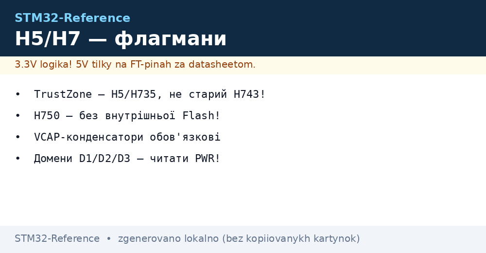
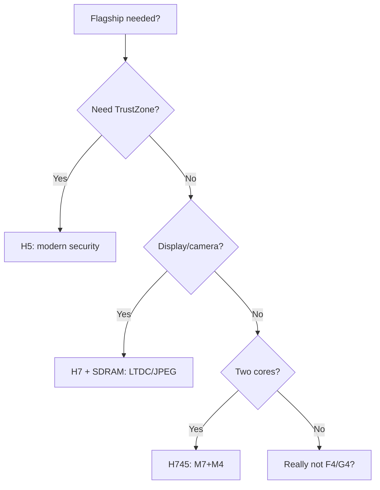

# STM32 H5 / H7 - Flagships with TrustZone and Speed


*Fig. Flagships: security, speed, complex power supply.*


*Fig. H5 - security and modernity; H7 - raw power: two cores, LTDC, Ethernet.*

> [!tip] Purpose of this note
> Understand what flagships cost: TrustZone, power domains, fast interfaces - and when it is overkill.

## 1. Purpose

H5 (Cortex-M33, 250 MHz) is everything modern at once: TrustZone, Secure Boot, OCTOSPI, FDCAN, USB HS, I3C. H7 (Cortex-M7 up to 480 MHz, in H745/H755 plus a second M4 core) is raw compute power: LTDC displays, JPEG codec, Ethernet, Chrom-ART. The price is complex power supply (D1/D2/D3 domains, LDO/SMPS/bypass) and BGA packages.

## Family characteristics

| Parameter | STM32H5 (H563/H573) | STM32H7 (H743/H745/H750) |
| --- | --- | --- |
| Cores | M33 250 MHz (single) | M7 240-480 MHz (+M4 240 in dual-core) |
| Flash / RAM | 128-2048 KB / 256-1408 KB | 128-2048 KB / up to 1.4 MB |
| TrustZone / Secure Boot | Yes / Yes | H735 and newer (old H743 - without!) |
| External memory | OCTOSPI + FMC | OCTOSPI/QSPI + FMC (SDRAM!) |
| Display | LTDC (H573), MIPI-DSI (H757) | LTDC, JPEG, Chrom-ART |
| USB / Ethernet | USB FS/HS | USB FS/HS + Ethernet (H743) |
| CAN | FDCAN | FDCAN |
| Power supply | LDO / SMPS / bypass | D1/D2/D3 domains + VCAP! |
| When to choose | Protected HMI, gateways, new | Heavy graphics, two cores, maximum |

```text
Швидкий вибір усередині:
  Захищений вузол ................ H563 (TrustZone з коробки)
  Дисплей 7" + камера ............ H743 + SDRAM через FMC
  Два ядра (M7 обчислення + M4 реалтайм) ... H745
  Дешевий H7 без зайвого ......... H750 (без flash — тільки з зовнішньої!)
```

## Mermaid: H5 or H7



## H7 power domains (main headache!)

| Domain | What it powers | Rule |
| --- | --- | --- |
| D1 (CPU) | M7 core, ART, ITCM/DTCM | VCAP capacitors mandatory |
| D2 (peripherals) | Most peripherals | Separate supply pins |
| D3 (backup) | RTC, backup-SRAM | VBAT for clock run |
| LDO / SMPS / Bypass | Internal regulator | SMPS - cooler; bypass - external core PSU |

> 90% of H7 does not start cases are power supply: forgotten VCAP, wrong PWR config or domain power-up order. Read the PWR chapter of the Reference Manual first, code second.

## Common issues

| # | Issue | Why it is bad | Fix |
| --- | --- | --- | --- |
| 1 | No VCAP capacitors | Instability/no start | 2.2 uF on each VCAP per datasheet |
| 2 | H750 as normal H743 | H750 has no internal Flash! | Only with external QSPI/OCTOSPI |
| 3 | TrustZone expected on old H743 | Missing in hardware | H735/H5 for TrustZone |
| 4 | LTDC without SDRAM | Frame does not fit | SDRAM via FMC minimum 8 MB |
| 5 | Two cores without IPCC | M7/M4 resource conflict | IPCC + HSEM for sync |

## Official sources

- [STM32H563ZI datasheet (ST)](https://www.st.com/en/microcontrollers-microprocessors/stm32h563zi.html) - TrustZone, OCTOSPI.
- [STM32H743ZI datasheet (ST)](https://www.st.com/en/microcontrollers-microprocessors/stm32h743zi.html) - domains, LTDC.

## OCTOSPI/XIP practice: execute from external Flash

XIP (eXecute In Place): code runs directly from external OCTOSPI Flash without copying to RAM. Setup: memory-mapped mode, dummy cycles per Flash datasheet, caches enabled.

| Parameter | Value |
| --- | --- |
| Speed | Up to 200+ MB/s (DDR, 8 lines) |
| Cache | Instruction/data - enable, else slowdown |
| H750 | No internal Flash at all - only works this way! |
| Encryption | OTFDEC - on-the-fly decryption (firmware protection) |

## TrustZone practice H5: where to start

| Step | Action |
| --- | --- |
| 1 | Split memory: Secure (keys, crypto) / Non-secure (application) |
| 2 | Always start from Secure world, call via veneer table |
| 3 | Split peripherals: UART for log - Non-secure, crypto - Secure |
| 4 | Verify attack: Non-secure code does NOT read Secure memory (HardFault otherwise) |

## M7 cache: enable and do not suffer

| Topic | Practice |
| --- | --- |
| I-Cache / D-Cache | Enable both at startup (`SCB_EnableICache`, `SCB_EnableDCache`) |
| DMA + D-Cache | Coherency! Clean/invalidate cache around DMA buffers |
| MPU | Configure regions: cached Flash/RAM, non-cached peripherals |
| Symptom of disabled cache | Everything works, but 3-5 times slower |

```c
// Мінімум при старті H7:
SCB_EnableICache();
SCB_EnableDCache();
// DMA-буфер: вирівняти на 32 байти + чистити перед передачею:
SCB_CleanDCache_by_Addr((uint32_t*)buf, size);
```

## Dual-core H745: division of labor

| Topic | Practice |
| --- | --- |
| Boot | M7 starts first, releases M4 |
| Shared memory | D3-SRAM + HSEM semaphores (without them - races!) |
| IPCC | Mail between cores + wakeup from sleep |
| Debug | Two OpenOCD connections or one with core switching |

## OCTOSPI vs FMC: what when

| Criterion | OCTOSPI | FMC |
| --- | --- | --- |
| Speed | Higher (DDR, 8 lines) | Lower, but simpler |
| SDRAM | No | Yes (for LTDC!) |
| XIP | Yes, with cache | NOR - yes |
| Layout complexity | High (pair lengths!) | Medium |

## H5/H7 debug specifics

| Topic | Practice |
| --- | --- |
| Two cores (H745) | Connect to both, set breakpoints with neighbor in mind |
| TrustZone in debug | Secure world visible only with rights; plan ahead |
| SWO trace | printf without UART, but configure TPIU/ITM |

## Part numbers: what to order

| Part number | Cores/Flash | Feature | Purpose |
| --- | --- | --- | --- |
| STM32H563ZIT6 | M33/2 MB | TrustZone, OCTOSPI | Protected gateway |
| STM32H573RIT6 | M33/2 MB | LTDC, TrustZone | Protected HMI |
| STM32H743ZIT6 | M7/2 MB | LTDC, Ethernet | Display and network |
| STM32H745BIT6 | M7+M4/2 MB | Two cores | Compute + realtime |
| STM32H750VBT6 | M7/128 KB | Cheap, without big Flash | Only with QSPI! |
| STM32H7A3VIT6 | M7/2 MB | Graphics, MIPI | Large screens |

## Errata: what to know before the board

| Topic | Practice |
| --- | --- |
| VCAP capacitors | No start without them - check every pin! |
| H750 without Flash | Only external QSPI with loader |
| Cache and DMA | Clean and invalidate around buffers |
| TrustZone revision | Old H743 without TrustZone in hardware! |

## See also

- [Home](../../../STM32-Reference/Home.md)
- [Chip comparison](../../../STM32-Reference/00-Start/03-Porivnyannya-chipiv.md)
- [F3/F4](../../../STM32-Reference/01-Hardware/02-F3-F4.md)
