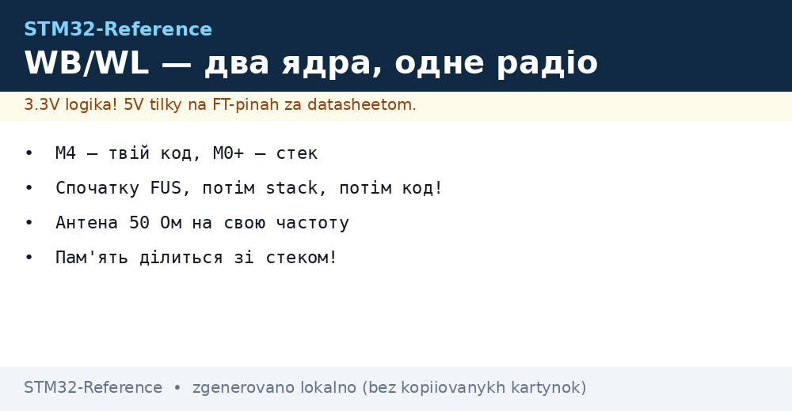
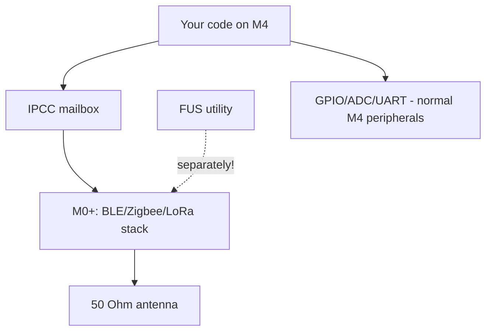

# STM32 WB / WL - Wireless Chips


*Fig. M4 - code, M0+ - radio, FUS separate.*


*Fig. Two cores: application M4 + radio M0+, IPCC mail between them, 50 Ohm antenna.*

> [!tip] Purpose of this note
> Understand the dual architecture of WB/WL: what each core does, how radio stacks update, and where the antenna lives.

## 1. Purpose

WB55 (BLE + 802.15.4: Zigbee/Thread/Matter) and WL55 (Sub-GHz: LoRa) are two processors in one package: application Cortex-M4 (your code) and radio Cortex-M0+ (closed ST stack). They talk via IPCC mailbox and shared memory. The radio stack updates separately with the FUS (Firmware Upgrade Services) utility - not together with your firmware!

## Characteristics

| Parameter | STM32WB55 | STM32WL55 |
| --- | --- | --- |
| Cores | M4 64 MHz + M0+ 32 MHz (radio) | M4 48 MHz + M0+ 48 MHz (radio) |
| Flash / RAM | 1 MB / 256 KB (shared!) | 256 KB / 64 KB |
| Radio | BLE 5.4 + 802.15.4 (Zigbee/Thread/Matter) | Sub-GHz LoRa/(G)FSK/MSK (SX126x block!) |
| Concurrent | BLE + Zigbee (concurrent!) | LoRaWAN + P2P |
| Antenna | 50 Ohm, PCB/chip antenna + pi-network | 50 Ohm, sub-GHz antenna |
| FUS / Stacks | FUS + BLE-stack + Thread (separate binaries!) | FUS + LoRaWAN stack |
| Power supply | SMPS config for saving | Up to 22 dBm TX (current!) |
| When to choose | BLE beacon/gateway/smart home | LoRaWAN node without external radio |

```text
Швидкий вибір усередині:
  BLE-периферія ................. WB55CG (базовий)
  Zigbee/Thread ................. WB55 + відповідний стек
  LoRaWAN вузол ................. WL55JC (вбудований DC-DC)
  P2P-радіо без стеку ........... WL + bare-metal драйвер SX126x
```

## Mermaid: who does what



## Flashing the radio stack (important!)

1. Connect ST-Link, open STM32CubeProgrammer.
2. Firmware Upgrade Services tab: first update FUS, then load the wireless stack for your task (BLE_full / Thread_FTD / Zigbee_FFD / LoRaWAN).
3. Only then flash your M4 firmware. Wrong stack means silent radio with live M4!
4. FUS and stack versions must match (compatibility table in release notes!).

## Common issues

| # | Issue | Why it is bad | Fix |
| --- | --- | --- | --- |
| 1 | Own code without FUS/stack | Radio silent | First FUS, then stack, then code |
| 2 | Antenna whichever was available | VSWR kills range and PA | 50 Ohm for your frequency + pi-tuning |
| 3 | All Flash for M4 | Nowhere to put stack | Memory layout per AppNote (part for stack!) |
| 4 | BLE and Zigbee somehow by themselves | Timing conflict | Concurrent mode from ST example |
| 5 | LoRa without power license | Fines/jamming | Duty-cycle and EIRP per region |

## Official sources

- [STM32WB55CG datasheet (ST)](https://www.st.com/en/microcontrollers-microprocessors/stm32wb55cg.html) - dual-core, stacks.
- [STM32WL55JC datasheet (ST)](https://www.st.com/en/microcontrollers-microprocessors/stm32wl55jc.html) - LoRa block.

## IPCC practice: mail between cores

| Topic | Practice |
| --- | --- |
| Channels | TX/RX queues in shared SRAM, busy flags |
| HSEM | Hardware semaphores against concurrent access |
| Event queue | M4 puts command, M0+ takes; answer - reverse |
| Debug | Log both sides with timestamps - else unclear who hung |

## 50 Ohm antenna practice (both chips)

| Topic | Practice |
| --- | --- |
| Pi-network | Two capacitors + inductor near ANT pin |
| Tuning | VNA or minimum - RSSI measurement at fixed distance before/after |
| Keepout | No copper/metal under chip antenna |
| Sub-GHz (WL) | Antenna physically longer; do not mix 433/868 MHz versions |
| Certification | Module versions (with shield) simplify RED/FCC |

## Concurrent BLE + Zigbee (WB): how they coexist

| Topic | Practice |
| --- | --- |
| Principle | Time-slicing radio between stacks (one transceiver!) |
| Limit | Peak throughput drops; realtime BLE audio + mesh - bad pair |
| Setup | Concurrent example from CubeWB package, default timeslots |
| Diagnostics | 802.15.4 + BLE sniffer at once, watch collisions |

## LoRa practice WL: SX126x block inside

| Topic | Practice |
| --- | --- |
| Modes | LoRa / (G)FSK / MSK / BPSK - by radio registers |
| LoRaWAN stack | End-node example from CubeWL package: OTAA, duty-cycle, ADR |
| P2P without stack | Direct registers + DIO interrupts, own protocol |
| TX power | Up to +22 dBm, but current and heat; EIRP per region! |
| TCXO vs XTAL | TCXO versions hold frequency in frost/heat |

## OTA for radio nodes (WB/WL specifics)

| Topic | Practice |
| --- | --- |
| Two images | M4 application and radio stack update separately! |
| BLE OTA | OTA service in node BLE profile |
| LoRaWAN FUOTA | Fragmented firmware over air (long, for fleet) |
| Rollback | Two M4 slots or external Flash with golden image |

## Radio certification: what to order

| Question | Answer |
| --- | --- |
| Module vs chip | Certified module (with shield) - tests simpler and cheaper |
| Own antenna | Radiation recertification almost certain |
| Firmware matters? | Power/frequency/protocol are coded - change it, retest |
| Documents | FCC/CE/RED + TELEC for Japan - plan budget and time |

## Typical node configurations

| Node | Chip | Stack | Power supply |
| --- | --- | --- | --- |
| BLE beacon | WB55 | BLE peripheral | CR2450 |
| Zigbee sensor | WB55 | Zigbee FFD/ED | 2xAA |
| LoRaWAN sensor | WL55 | LoRaWAN end-node | Li-SOCl2 |
| P2P remote | WL55 | Bare-metal | Li-Ion |

## Part numbers: what to order

| Part number | Radio | Feature | Purpose |
| --- | --- | --- | --- |
| STM32WB55CGU6 | BLE + 802.15.4 | 1 MB Flash | Beacon, gateway, smart home |
| STM32WB55CEU5 | BLE + 802.15.4 | 512 KB, small | Compact sensor |
| STM32WB5MMGH6 | BLE module | Shield + antenna | Certification simpler |
| STM32WL55JC56 | LoRa sub-GHz | 256 KB | LoRaWAN node |
| STM32WLE5CCU6 | LoRa sub-GHz | Without extra M4 | Radio modem |

## Errata and stacks: what to know before the board

| Topic | Practice |
| --- | --- |
| FUS and stack from one package | Else radio silent |
| Radio part revision | Receiver sensitivity errata |
| Certified module | Tests cheaper than chip from scratch |

## See also

- [Home](../../../STM32-Reference/Home.md)
- [Chip comparison](../../../STM32-Reference/00-Start/03-Porivnyannya-chipiv.md)
- [Low-power](../../../STM32-Reference/01-Hardware/05-L0-L4-U5.md)
