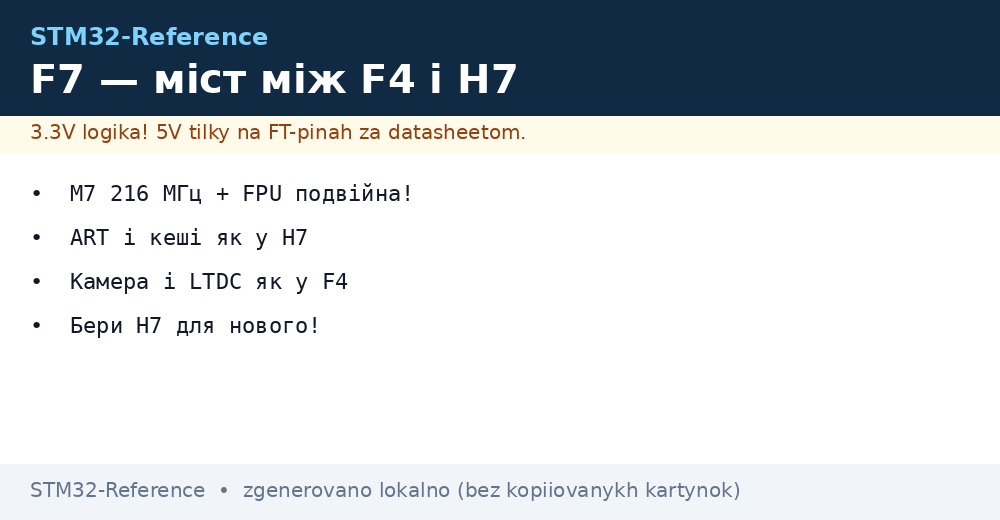
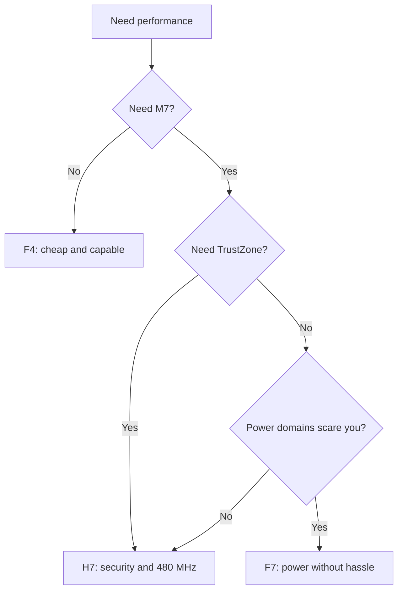

# STM32F7 - Bridge Between F4 and H7


*Fig. F7: M7 power without H7 complexity.*

> [!tip] Purpose of this note
> Explain the place of F7: when it is a sensible choice and when to take H7 right away.

## 1. Purpose

STM32F7 is the first Cortex-M7 from ST: 216 MHz, double-precision FPU, instruction and data caches, ART accelerator. In essence it is an F4 with an H7-class core but without power supply domains and TrustZone. For graphics, cameras and DSP where H7 is overkill in price and complexity.

## 2. F7 Against F4 Against H7

| Parameter | F4 | F7 | H7 |
| --- | --- | --- | --- |
| Core | M4F 180 MHz | M7 216 MHz | M7 up to 480 MHz |
| FPU | Single | Single + double! | Single + double |
| I/D cache | None | Present! | Present |
| Power supply | Simple | Simple | D1/D2/D3 domains! |
| TrustZone | None | None | H735 and newer |
| Camera/display | DCMI/LTDC | DCMI/LTDC | Same + more |
| Price | Lowest | Middle | Higher |

```text
Правило вибору:
  вистачає F4 ......... бери F4, дешевше;
  треба M7 без мороки .. бери F7;
  треба TrustZone/два ядра/480 МГц .. тільки H7.
```

## 3. M7 Cache: Mandatory to Enable

| Topic | Practice |
| --- | --- |
| I-Cache and D-Cache | Enable at startup, otherwise slow! |
| D-Cache + DMA | Clean and invalidate around buffers |
| MPU | Non-cached peripherals, cached memory |
| ART | Works together with cache, do not disable |

```c
// Мінімум старту F7:
SCB_EnableICache();
SCB_EnableDCache();
// DMA-буфер: вирівняти на 32 байти + clean/invalidate!
```

## 4. Part Numbers and Errata

| Part number | Flash | Purpose |
| --- | --- | --- |
| STM32F746NGH6 | 1 MB | Display + camera, classic |
| STM32F769NIH6 | 2 MB | Maximum graphics, DSI! |
| STM32F722ZET6 | 512 KB | Cheap entry into M7 |
| STM32F732VET6 | 512 KB | No LTDC, for computation |

| Topic | Practice |
| --- | --- |
| Silicon revision | Early-revision cache errata! |
| Double float | Slower than single - only where needed |
| Discovery F769 | Ready platform with display |

## Mermaid: F4, F7 or H7



## Common issues

| # | Issue | Why it is bad | Fix |
| --- | --- | --- | --- |
| 1 | Cache not enabled | Several times slower | I+D cache at startup! |
| 2 | DMA without cache clean | Stale data | Clean/invalidate always |
| 3 | Double everywhere | Slower than single | Double only where needed |
| 4 | New project without evaluating H7 | H7 turns out cheaper | Compare prices before start! |
| 5 | DMA buffers in CCM | CCM is not for DMA | Buffers in plain SRAM |
| 6 | Revision not checked | Early cache bug | Errata by revision! |
| 7 | F7 instead of H7 for TrustZone | It is not there | Only H735+/H5 |

## Sound on F7: I2S and SAI

| Topic | Practice |
| --- | --- |
| SAI blocks | Two independent audio interfaces |
| DMA circular | Stream without gaps and without the core |
| MCLK from PLL | Precise sampling rate |
| Discovery F7 | Audio DAC and microphones on board! |

## Official sources

- [STM32F746NG datasheet (ST)](https://www.st.com/en/microcontrollers-microprocessors/stm32f746ng.html) - core, caches, LTDC.
- [AN4839 Cache on M7 (ST)](https://www.st.com/resource/en/application_note/an4839.pdf) - cache and DMA practice.

## Power Supply and Clocking: Simpler Than H7

| Topic | Practice |
| --- | --- |
| Domains | Plain VDD/VDDA/VBAT, no D1/D2/D3! |
| VCAP | Capacitors per datasheet, as always |
| Over-drive | Boosted-frequency mode up to 216 MHz |
| HSE + PLL | USB 48 MHz on a separate branch |

## LTDC and DSI: Display Practice

| Topic | Practice |
| --- | --- |
| LTDC layers | Two layers with transparency without the core! |
| SDRAM for frame | Via FMC, timings from memory datasheet |
| DSI (F769) | Serial display over a thin cable |
| Chrom-ART | Copies and fills in hardware, core is free |

```text
Бюджет кадру 800x480x2 байти:
  ~768 КБ — у внутрішню RAM не влізе;
  SDRAM 8+ МБ через FMC обовязкова.
```

## F4 to F7 Migration: What Changes

| Topic | Action |
| --- | --- |
| Pins | Remap in CubeMX, no 1-to-1 compatibility |
| Cache | Add enable at startup! |
| DMA buffers | Add clean/invalidate |
| FPU double | Check where it wins and where it slows down |
| Tests | Run everything: timings differ! |

## See also

- [Home](../../../STM32-Reference/Home.md)
- [Productive F3 and F4](../../../STM32-Reference/01-Hardware/02-F3-F4.md)
- [Flagships](../../../STM32-Reference/01-Hardware/04-H5-H7.md)
- [Errata and migrations](../../../STM32-Reference/01-Hardware/07-Errata-Migratsiya.md)
- [Speed measurement](../../../STM32-Reference/09-Proshivka/07-Performance-Optimization.md)
