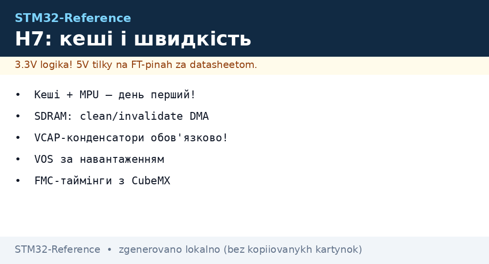
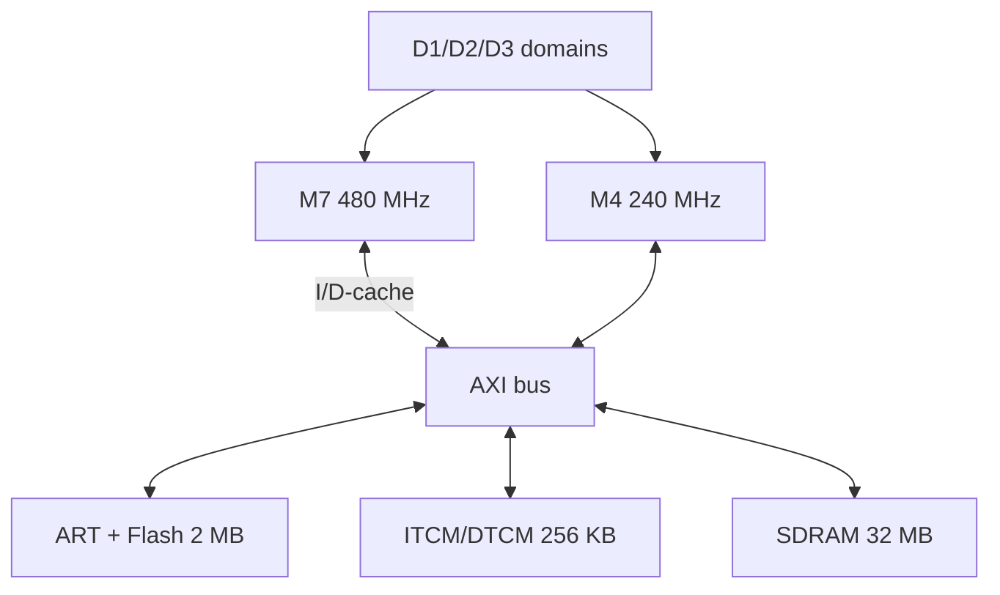

# STM32H7 in Depth - M7/M4, Caches, ART and Fast Memory


*Fig. H7: M7 with caches + ART, second M4, three power supply domains, FMC leads to SDRAM.*

> [!tip] What this note is
> Flagship series for those who outgrew F4: 400+ MHz, DSP/FPU with double precision, megabytes of memory. Bridge from F4: [F7 bridge](../../../STM32-Reference/01-Hardware/08-F7-Bridge.md), families: [H5/H7 overview](../../../STM32-Reference/01-Hardware/04-H5-H7.md).

## 1. Goal

Master H7 without speed mistakes:

- M7 vs M4: what runs where;
- I/D caches + MPU: without them flash slows down several times;
- ART and ITCM/DTCM: zero wait-state;
- D1/D2/D3 power supply domains and VOS levels;
- FMC + SDRAM: megabytes for displays and buffers.

| Parameter | STM32H743 | STM32F407 (for comparison) |
| --- | --- | --- |
| CPU | M7 480 MHz + M4 240 MHz | M4 168 MHz |
| Flash | 2 MB, ART | 1 MB |
| RAM | 1 MB + TCM | 192 KB |
| Caches | I16K+D16K + MPU | none |
| FMC | SDRAM 32-bit 100+ MHz | present, slower |

## 2. Architecture



Cache enabled - M7 flies; disabled - slower than F4. MPU configures cacheability of regions (cache SDRAM, never peripherals!).

## 3. Power Supply Pinout (LQFP144)

| Signal | Purpose | Note |
| --- | --- | --- |
| VDD xN | 1.62-3.6V digital | 100 nF near each! |
| VDDA/VREF | analog + ADC reference | LC filter from VDD |
| VCAP | 1.2V core (internal LDO) | 2.2 uF ceramic nearby |
| VBAT | RTC + backup | battery/supercap |
| NRST/BOOT0 | reset and boot mode | board buttons |
| PDR_ON | regulator selection | SMPS versions - inductor |

SMPS versions (H743BI) save watts but require the inductor and layout per the manual.

## 4. Caches and MPU: Mandatory Minimum

- `SCB_EnableICache()`, `SCB_EnableDCache()` - first in main;
- MPU region 0: whole space no-access (error trap);
- SDRAM: write-back cached + clean/invalidate on DMA;
- peripherals and DMA buffers: non-cacheable or write-through;
- forgotten invalidates - "magic" with stale data.

## 5. Working Code (C, HAL)

```c
#include "stm32h7xx_hal.h"
#include "core_cm7.h"

static MPU_Region_InitTypeDef mpu_sdram = {
  .Enable = MPU_REGION_ENABLE,
  .BaseAddress = 0xC0000000,
  .Size = MPU_REGION_SIZE_32MB,
  .AccessPermission = MPU_REGION_FULL_ACCESS,
  .IsBufferable = MPU_ACCESS_BUFFERABLE,
  .IsCacheable = MPU_ACCESS_CACHEABLE,
  .IsShareable = MPU_ACCESS_NOT_SHAREABLE,
  .TypeExtField = MPU_TEX_LEVEL0,
  .SubRegionDisable = 0,
  .DisableExec = MPU_INSTRUCTION_ACCESS_DISABLE,
};

void system_fast(void) {
  SCB_EnableICache();
  SCB_EnableDCache();
  HAL_MPU_Disable();
  HAL_MPU_ConfigRegion(&mpu_sdram);
  HAL_MPU_Enable(MPU_PRIVILEGED_DEFAULT);
  __HAL_RCC_FMC_CLK_ENABLE();
  sdram_init_seq();
}
```

Order: caches -> MPU -> FMC -> SDRAM init (precharge/refresh/mode). Without MPU, DMA into cached SDRAM is a lottery.

## 6. Working Code (MicroPython)

```python
# MicroPython: H7 як швидкий логер (периферія через mem32)
import time
import machine

SRAM_ADDR = 0x24000000
SAMPLES = 1000

def mem32(addr, val=None):
    import uctypes
    if val is None:
        return uctypes.bytes_at(addr, 4)
    uctypes.bytes_at(addr, 4)[:4] = val.to_bytes(4, 'little')

machine.freq(480000000)
t0 = time.ticks_us()
for i in range(SAMPLES):
    mem32(SRAM_ADDR + i * 4, i)
dt = time.ticks_diff(time.ticks_us(), t0)
print('write', SAMPLES, 'in', dt, 'us')

while True:
    print('tick', time.ticks_ms())
    time.sleep(1)
```

Honestly: MicroPython on H7 is for tests and scripts, not 480-MHz production. Direct mem32 access is for registers without a driver.

## 7. Domains and VOS

- D1 (CPU): VOS0 - 480 MHz, VOS3 - saving;
- D2 (peripherals): switched off separately in sleep;
- D3 (backup): RTC + SRAM4 always alive;
- Stop with SRAM - microamps, wakeup by EXTI/RTC;
- PWR config first, frequencies - after.

## Common issues

| Symptom | Cause | Fix |
| --- | --- | --- |
| Slower than F4 | caches disabled | SCB_Enable I/D in main |
| DMA returns stale data | cache not flushed | clean/invalidate before/after |
| HardFault at startup | MPU closed stack/vectors | region 0 last, check the map |
| SDRAM garbage | wrong init sequence | sequence from CubeMX code |
| Custom board does not start | VCAP without capacitor | 2.2 uF near each VCAP |
| Heats up when idle | VOS0 + 480 MHz always | DVFS: lower when idle |

## 9. H7 Quick Cheat Sheet

- caches + MPU - day one;
- SDRAM: clean/invalidate on DMA;
- VCAP capacitors mandatory;
- VOS per load, not always maximum;
- FMC timings from the CubeMX calculator.

## 10. Related Notes

- [F7 bridge](../../../STM32-Reference/01-Hardware/08-F7-Bridge.md) - stepping stone to H7.
- [H5/H7 overview](../../../STM32-Reference/01-Hardware/04-H5-H7.md) - place in the lineup.
- [STM32 timers](../../../STM32-Reference/07-Timeri-Son/01-GPTIM-ADTIM.md) - triggers and DMA.
- [External loaders](../../../STM32-Reference/08-Pamyat/02-Zovnishni-Loadery.md) - XIP from QSPI.
- [Main map](../../../STM32-Reference/Home.md) - full navigation.

## Official sources

- [STM32CubeF7 (STMicroelectronics, GitHub)](https://github.com/STMicroelectronics/STM32CubeF7) - HAL, FMC/cache examples.
- [STM32F4 (ST)](https://www.st.com/en/mcus-mpus/stm32f4.html) - baseline for comparison.
- [MQTT Specification (OASIS)](https://mqtt.org/mqtt-specification/) - node telemetry.
