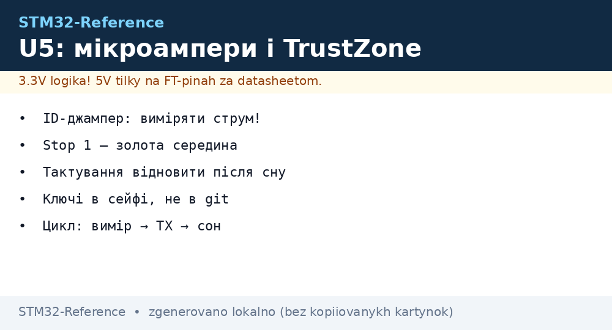
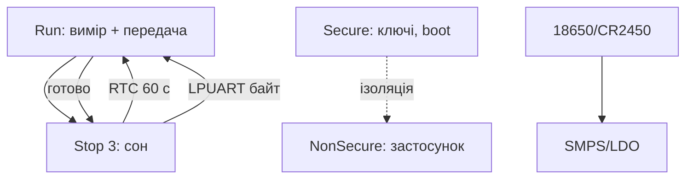

# STM32U5 глибоко - Cortex-M33, TrustZone і ультранизьке споживання


*Рис. U5: M33 спить у Stop 3 з SRAM, прокидається від LPUART/RTC, секрети - у TrustZone.*

> [!tip] Що це за нота
> Наступник L4 для батарейних років роботи: M33, субмікроамперні сни, апаратна безпека. Родина: [L0/L4/U5 оглядово](../../../STM32-Reference/01-Hardware/05-L0-L4-U5.md), живлення: [батарейне живлення](../../../STM32-Reference/02-Zhivlennya/02-Batareyne-zhivlennya.md).

## 1. Мета

Побудувати вузол на роки від батареї:

- режими Run/Sleep/Stop0-3/Standby/Shutdown - що живе в кожному;
- TrustZone: безпечний і небезпечний світи;
- LP-периферія: LPUART, LPTIM, ADC - робота у сні;
- SRAM-ретеншн: скільки пам'яті не втрачаємо;
- вимірювання мікроампер чесно.

| Режим | Струм типово | Живе |
| --- | --- | --- |
| Run 160 МГц | ~20 мА | усе |
| Sleep | ~5 мА | усе, CPU стоп |
| Stop 0/1 | ~30 мкА | SRAM, частина периферії |
| Stop 2/3 | ~3 мкА | SRAM вибірково |
| Standby | ~300 нА | RTC + backup |
| Shutdown | ~20 нА | тільки пробудження |

## 2. Архітектура



Цикл батарейного вузла: прокинувся → виміряв → відправив → заснув. Активність - мілісекунди на хвилини сну.

## 3. Розпіновка живлення (LQFP)

| Сигнал | Призначення | Примітка |
| --- | --- | --- |
| VDD/VDDA | цифра + аналог | 100 нФ біля кожного |
| VLCD | LCD-драйвер (де є) | конденсатори за мануалом |
| VBAT | RTC + backup SRAM | батарейка/суперкап |
| NRST | ресет | кнопка + RC |
| SMPS-індуктивність | тільки SMPS-версії | за референсом ST |

Вимірювання струму: джампер IDD на Nucleo (розрив + амперметр), або uCurrent-подібний підсилювач.

## 4. Stop-режими детально

- Stop 0: швидке прокидання (~5 мкс), більше струм;
- Stop 1: баланс для більшості вузлів;
- Stop 2/3: мінімум, частина SRAM вимикається вибірково;
- прокидання: RTC, LPUART-стартбіт, GPIO EXTI, I2C-адреса;
- після Stop - повторна ініціалізація тактування (MSI за замовчуванням!).

## 5. Робочий код (C, HAL)

```c
#include "stm32u5xx_hal.h"

void sleep_stop3_rtc(uint32_t seconds) {
  HAL_SuspendTick();
  __HAL_RCC_PWR_CLK_ENABLE();
  HAL_PWREx_EnableSRAMRetention(PWR_SRAM2_FULL);
  RTC_AlarmTypeDef al = {0};
  al.AlarmTime.Seconds = seconds % 60;
  al.AlarmTime.Minutes = (seconds / 60) % 60;
  HAL_RTC_SetAlarm_IT(&hrtc, &al, RTC_FORMAT_BIN);
  HAL_PWR_EnterSTOPMode(PWR_MAINREGULATOR_ON, PWR_STOPENTRY_WFI);
  SystemClock_Config();
  HAL_ResumeTick();
}

void app_main(void) {
  sensors_read();
  radio_send();
  sleep_stop3_rtc(60);
}
```

Помилка новачків: не відновлювати тактування після Stop - MCU працює, але на повільному MSI і все «пливе».

## 6. Робочий код (MicroPython)

```python
# MicroPython: U5-вузол сну і виміру (порт під U5)
import time
import machine

adc = machine.ADC(0)
uart = machine.UART(1, baudrate=9600)
rtc = machine.RTC()

def read_mv():
    s = 0
    for _ in range(16):
        s += adc.read_u16()
    return s * 3300 // (16 * 65535)

while True:
    mv = read_mv()
    uart.write(f"BAT {mv}\r\n")
    machine.lightsleep(60000)
```

`lightsleep` зберігає RAM і стан - прокинулись і продовжили. `deepsleep` - глибше, але рестарт програми.

## 7. TrustZone коротко

- Secure: boot, ключі, крипто - недоторканно;
- NonSecure: застосунок, викликає Secure через венір-таблицю;
- SAU/IDAU ділять пам'ять і периферію;
- для хобі-досить: увімкнений TZEN + приклад з Cube;
- продакшн: secure-boot + secure-update (див. ноту безпеки).

## 8. Типові помилки

| Симптом | Причина | Лікування |
| --- | --- | --- |
| Струм міліампери в Stop | не вимкнені GPIO/периферія | аналогові входи в analog, вимкити тактування |
| Не прокидається | будильник не налаштовано | RTC-alarm + NVIC, перевірити прапорці |
| Після Stop усе повільно | тактування не відновлено | SystemClock_Config() після виходу |
| TrustZone HardFault | виклик не через венір | тільки NSC-функції з атрибутом |
| Батарея сідає за місяць | часті прокидання | рідше цикл, більше сну, менше TX |
| LPUART губить перший байт | стартбіт-детект спить глибоко | Stop 1 замість Stop 3 для UART |

## 9. Швидка шпаргалка U5

- виміряти струм джампером IDD;
- Stop 1 - золота середина;
- тактування відновити після сну;
- TrustZone вмикати з прикладу Cube;
- цикл: вимір → TX → сон.

## 10. Суміжні ноти

- [L0/L4/U5 оглядово](../../../STM32-Reference/01-Hardware/05-L0-L4-U5.md) - місце в лінійці.
- [батарейне живлення](../../../STM32-Reference/02-Zhivlennya/02-Batareyne-zhivlennya.md) - джерела струму.
- [режими сну](../../../STM32-Reference/07-Timeri-Son/03-Sleep-Stop-Standby.md) - деталі сну.
- [безпечне завантаження](../../../STM32-Reference/15-Protokoli/06-Secure-Boot.md) - продакшн-безпека.
- [головна карта](../../../STM32-Reference/Home.md) - повна навігація.

## Офіційні джерела

- [STM32CubeU5 (STMicroelectronics, GitHub)](https://github.com/STMicroelectronics/STM32CubeU5) - HAL, приклади Stop/TrustZone.
- [STM32F4 (ST)](https://www.st.com/en/mcus-mpus/stm32f4.html) - база для порівняння споживання.
- [MQTT Specification (OASIS)](https://mqtt.org/mqtt-specification/) - телеметрія вузла.
