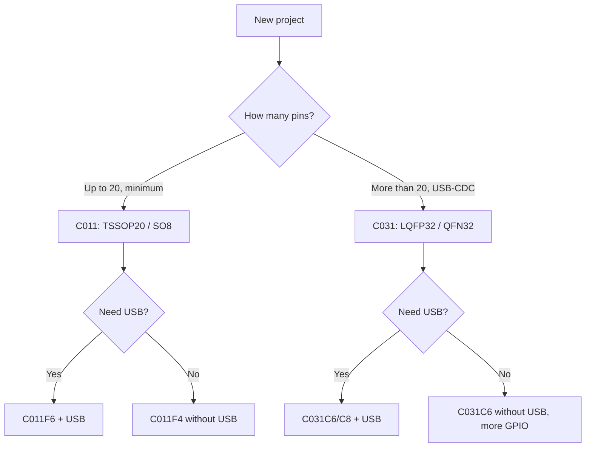

# STM32 C0 - Start with C011/C031


*Fig. C011 - TSSOP20, C031 - LQFP32; both with USB, a cheap start for a new project.*

> [!tip] Purpose of this note
> Explain the choice of C011/C031 as a modern F0 replacement for simple tasks: USB, low price, availability, simple BOOT0/RDP.

## 1. Purpose

STM32C0 is an "F0 but with USB and modern peripherals". Cortex-M0+ core up to 48 MHz, Flash up to 32 KB (C011) / 32 KB (C031), RAM 4-12 KB. Difference from G0: smaller memory, but enough for simple sensors, buttons, UART/USB-CDC. TSSOP20 (C011) and LQFP32 (C031) packages suit hand soldering.

USB Full Speed in both, but no USB-C PD. Ideal for simple HID devices, configurators, cheap nodes with programming over UART/USB without an external programmer after the first flash.

## Family Characteristics

| Parameter | STM32C011 (C011F4/6/8) | STM32C031 (C031C6/C8) |
| --- | --- | --- |
| Core | Cortex-M0+, 48 MHz | Cortex-M0+, 48 MHz |
| Flash / RAM | 16-32 KB / 4-6 KB | 32 KB / 12 KB |
| Package | TSSOP20, SO8 | LQFP32, QFN32 |
| USB | Device (FBUS) | Device (FBUS) |
| ADC | 1x 12-bit, 1.4 Msps | 1x 12-bit, 1.4 Msps |
| Timers | 2x 16-bit + 1x 32-bit | 2x 16-bit + 1x 32-bit |
| GPIO 5V | Yes (on most) | Yes (on most) |
| Operating voltage | 1.8 - 3.6 V | 1.8 - 3.6 V |
| Programming | SWD + UART / USB DSP | SWD + UART / USB DSP |
| When to choose | Minimum pins, buttons | More GPIO, USB-CDC |

```text
Швидкий вибір усередині:
  Мінімум ніжок / найменша ціна ... C011F6 (TSSOP20 / SO8)
  USB + більше пінів ........................ C031C6 (LQFP32)
  Максимум пам'яті в серії .............. C031C8 (32 КБ / 12 КБ RAM)
```

## Mermaid: C011 or C031



## Common issues: BOOT0 / RDP at startup

| # | Mistake | Why it is bad | How to do it right |
| --- | --- | --- | --- |
| 1 | BOOT0 = 1 in normal operation | Entered System Memory (UART/USB boot) for no reason | BOOT0 = 0 (ground) to boot from Flash |
| 2 | BOOT0 left floating | Undefined state: sometimes Flash, sometimes System Memory | 10 kOhm resistor to GND (or GND pin) |
| 3 | RDP Level 1 forgotten after test | Chip locked for readout; flashing again is hard | RDP Level 0 for development; Level 1 - only after final |
| 4 | RDP Level 2 set by accident | Chip destroyed for reuse | Never set without a plan; check in STM32CubeProgrammer |
| 5 | SWD connection with RDP > 0 | Debugger does not connect without lifting RDP | At Level 1 lift via RDP regression; Level 2 - impossible |

## BOOT0 and RDP in Brief

BOOT0 is a pin that selects the boot source: 0 = Flash (normal mode), 1 = System Memory (built-in bootloader via UART/USB). For C011/C031 the bootloader supports UART (PA9/PA10) and USB (PA11/PA12). RDP (Read Protection) levels: 0 = no protection, 1 = Flash readout blocked (debugger works with limits), 2 = Flash destruction (no way back). Check the status via STM32CubeProgrammer or OpenOCD.

## Code: Starting with HAL (C011/C031)

```c
#include "stm32c0xx_hal.h"

void SystemClock_Config(void) {
  RCC_OscInitTypeDef RCC_OscInitStruct = {0};
  RCC_ClkInitTypeDef RCC_ClkInitStruct = {0};
  // HSI 48 МГц для C011/C031
  RCC_OscInitStruct.OscillatorType = RCC_OSCILLATORTYPE_HSI;
  RCC_OscInitStruct.HSIState = RCC_HSI_ON;
  RCC_OscInitStruct.HSICalibrationValue = RCC_HSICALIBRATION_DEFAULT;
  RCC_OscInitStruct.PLL.PLLState = RCC_PLL_NONE;
  HAL_RCC_OscConfig(&RCC_OscInitStruct);
  RCC_ClkInitStruct.ClockType = RCC_CLOCKTYPE_HCLK|RCC_CLOCKTYPE_SYSCLK
                               |RCC_CLOCKTYPE_PCLK1;
  RCC_ClkInitStruct.SYSCLKSource = RCC_SYSCLKSOURCE_HSI;
  RCC_ClkInitStruct.AHBCLKDivider = RCC_SYSCLK_DIV1;
  RCC_ClkInitStruct.APB1CLKDivider = RCC_HCLK_DIV1;
  HAL_RCC_ClockConfig(&RCC_ClkInitStruct, FLASH_LATENCY_1);
}

int main(void) {
  HAL_Init();
  SystemClock_Config();
  __HAL_RCC_GPIOC_CLK_ENABLE();
  __HAL_RCC_GPIOA_CLK_ENABLE();
  // PA5 (LED на деяких платах C011/C031) або PC6
  GPIO_InitTypeDef GPIO_InitStruct = {0};
  GPIO_InitStruct.Pin = GPIO_PIN_5;
  GPIO_InitStruct.Mode = GPIO_MODE_OUTPUT_PP;
  GPIO_InitStruct.Pull = GPIO_NOPULL;
  GPIO_InitStruct.Speed = GPIO_SPEED_FREQ_LOW;
  HAL_GPIO_Init(GPIOA, &GPIO_InitStruct);
  while (1) {
    HAL_GPIO_TogglePin(GPIOA, GPIO_PIN_5);
    HAL_Delay(250);
  }
}
```

## USB-CDC Practice (C011/C031)

| Topic | Practice |
| --- | --- |
| USB pins | PA11 (DM), PA12 (DP) - fixed; cannot remap |
| Resistor | 22 Ohm in series on DM/DP; 1.5 kOhm on DP to 3.3 V |
| Crystal | Not needed for USB (HSI 48 MHz is accurate enough for USB) |
| Bootloader | Built into System Memory; can flash via UART/USB |
| Interrupts | USB-CDC via HAL_PCD / HAL_USB - standard CubeMX template |

## C011/C031 Debug Specifics

| Topic | Practice |
| --- | --- |
| SWD | PA13 (SWDIO), PA14 (SWCLK); works with RDP = 0 |
| SWO | PA13 (SWO on some); check the Reference Manual |
| Watchdog | Stop under the debugger via `DBGMCU_CR` or disable in code |
| BOOT0 during debug | If BOOT0 = 1, the debugger attaches to the bootloader, not to Flash |

## Part Numbers: What to Order

| Part number | Package / Flash | Feature | Purpose |
| --- | --- | --- | --- |
| STM32C011F6P6 | TSSOP20 / 32 KB | Minimum pins, USB | Buttons, simple sensor |
| STM32C011F4P6 | TSSOP20 / 16 KB | Even cheaper | Simplest tasks |
| STM32C031C6T6 | LQFP32 / 32 KB | More GPIO, USB | USB-CDC, more pins |
| STM32C031C8T6 | LQFP32 / 32 KB / 12 KB RAM | Maximum memory | Bigger scripts in C |

## Errata: What to Know Before the Board

| Topic | Practice |
| --- | --- |
| USB with HSI 48 MHz | Accuracy is enough for USB; no external crystal needed |
| ADC result | Check zero offset when supply changes; calibrate at startup |
| BOOT0 pin | If used as GPIO, do not forget the boot trap on the board |
| RDP Level 1 | Debugger does not read Flash but partly works; lifted via regression |

## 10. Revisions and Selection (ST, 2026)

- **C011J4** - SO-8, 48 MHz M0+, 16 KB flash, 4 KB RAM, smallest footprint; for simple sensors.
- **C031F6 / C031G8** - TSSOP-20 / LQFP-32; G8 -> 32 KB RAM + 256 KB flash; choose by memory.
- **Chip revision**: C0 has two revisions (A/B) with a fixed ADC-channel bug; check `DBGMCU_IDCODE` at first flashing.
- **Migration from STM8**: AN5673 covers the transition; HAL code is compatible with F0/G0 - do not rewrite from scratch.

## Official sources

- [STM32C0 series overview (ST)](https://www.st.com/en/microcontrollers-microprocessors/stm32c0-series.html) - series description, part numbers, documents.
- [STM32C011 datasheet (ST)](https://www.st.com/resource/en/datasheet/stm32c011.pdf) - C011F4/F6/F8; pins, USB, electrics.
- [STM32C031 datasheet (ST)](https://www.st.com/resource/en/datasheet/stm32c031.pdf) - C031C6/C8; LQFP32, characteristics.
- [RM0490 - Reference manual STM32C0 (ST)](https://www.st.com/resource/en/reference_manual/rm0490-stm32c0-series-reference-manual-stmicroelectronics.pdf) - registers, BOOT0, RDP, USB, SWD.
- [AN5225 - STM32C0 getting started (ST)](https://www.st.com/resource/en/application_note/an5225-getting-started-with-stm32c0-series-stmicroelectronics.pdf) - start, CubeMX, HAL, clock setup.

## See also

- [Home](../../../STM32-Reference/Home.md)
- [Chip comparison](../../../STM32-Reference/00-Start/03-Porivnyannya-chipiv.md)
- [F0/F1](../../../STM32-Reference/01-Hardware/01-F0-F1-Classic.md)
- [G0/G4](../../../STM32-Reference/01-Hardware/03-G0-G4.md)
