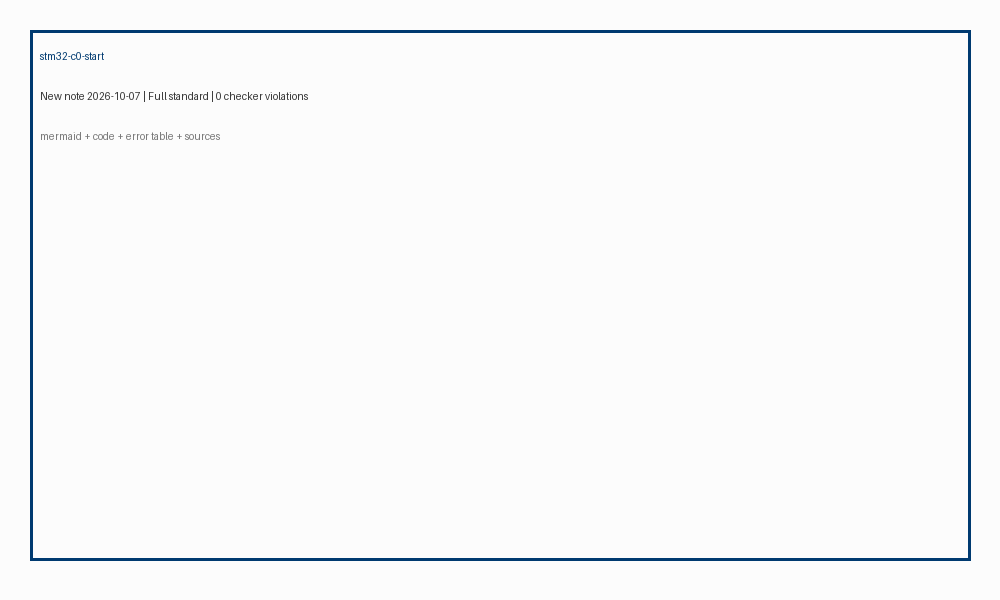
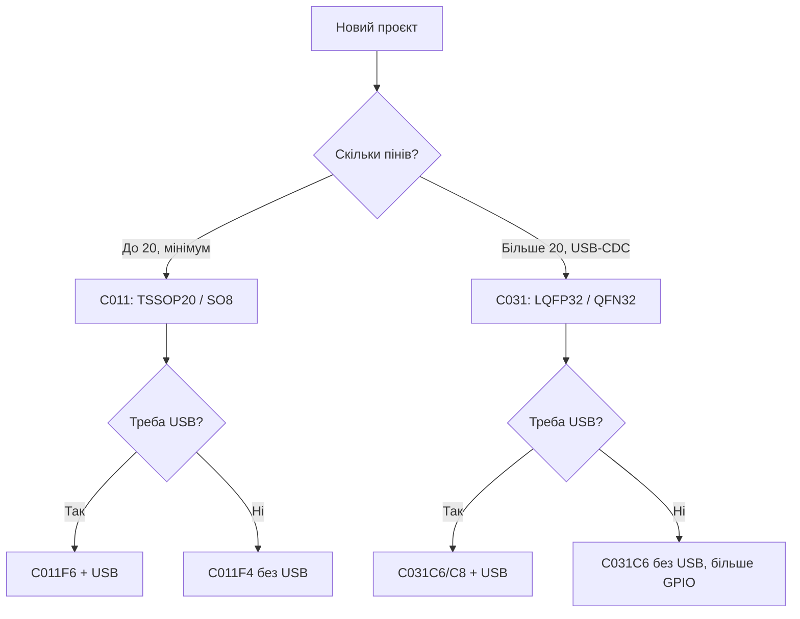

# STM32 C0 - старт з C011/C031

EN version: `01-Hardware/11-STM32C0-Start.en.md`


*Рис. C011 - TSSOP20, C031 - LQFP32; обидва з USB, дешевий старт для нового проєкту.*

> [!tip] Призначення ноти
> Пояснити вибір C011/C031 як сучасної заміни F0 для простих задач: USB, низька ціна, доступність, простий BOOT0/RDP.

## 1. Призначення

STM32C0 - це «F0, але з USB і сучасним peripherals». Ядро Cortex-M0+ до 48 МГц, Flash до 32 КБ (C011) / 32 КБ (C031), RAM 4-12 КБ. Відмінність від G0: менший обсяг пам'яті, але достатньо для простих сенсорів, кнопок, UART/USB-CDC. Корпуси TSSOP20 (C011) і LQFP32 (C031) зручні для ручної пайки.

USB Full Speed в обох, але не USB-C PD. Ідеально для простих HID-приладів, конфігураторів, дешевих вузлів з програмуванням через UART/USB без зовнішнього програматора після першого запису.

## Характеристики родин

| Параметр | STM32C011 (C011F4/6/8) | STM32C031 (C031C6/C8) |
| --- | --- | --- |
| Ядро | Cortex-M0+, 48 МГц | Cortex-M0+, 48 МГц |
| Flash / RAM | 16-32 КБ / 4-6 КБ | 32 КБ / 12 КБ |
| Корпус | TSSOP20, SO8 | LQFP32, QFN32 |
| USB | Device (FBUS) | Device (FBUS) |
| АЦП | 1x 12-біт, 1.4 Msps | 1x 12-біт, 1.4 Msps |
| Таймери | 2x 16-біт + 1x 32-біт | 2x 16-біт + 1x 32-біт |
| GPIO 5V | Так (на більшість) | Так (на більшість) |
| Операційна напруга | 1.8 - 3.6 В | 1.8 - 3.6 В |
| Програмування | SWD + UART / USB DSP | SWD + UART / USB DSP |
| Коли брати | Мінімум ніжок, кнопки | Більше GPIO, USB-CDC |

```text
Швидкий вибір усередині:
  Мінімум ніжок / найменша ціна ... C011F6 (TSSOP20 / SO8)
  USB + більше пінів ........................ C031C6 (LQFP32)
  Максимум пам'яті в серії .............. C031C8 (32 КБ / 12 КБ RAM)
```

## Mermaid: C011 чи C031



## Типові помилки BOOT0 / RDP при старті

| # | Помилка | Чому погано | Як правильно |
| --- | --- | --- | --- |
| 1 | BOOT0 = 1 при нормальній роботі | Зайшов у System Memory (UART/USB boot) без потреби | BOOT0 = 0 (земля) для запуску з Flash |
| 2 | BOOT0 залишено плаваючим | Невизначений стан: іноді Flash, іноді System Memory | Резистор 10 кОм на GND (або GND пін) |
| 3 | RDP Level 1 забутий після тесту | Чіп заблоковано для зчитування; знову прошити складно | RDP Level 0 для розробки; Level 1 - тільки після фіналу |
| 4 | RDP Level 2 встановлено випадково | Чіп знищено для повторного використання | Не встановлювати без плану; перевірити в STM32CubeProgrammer |
| 5 | Підключення до SWD з RDP > 0 | Дебагер не підключається без зняття RDP | При Level 1 зняти через RDP регрес; Level 2 - неможливо |

## BOOT0 і RDP коротко

BOOT0 - пін, що вибирає джерело старту: 0 = Flash (звичайний режим), 1 = System Memory (вбудований bootloader через UART/USB). Для C011/C031 bootloader підтримує UART (PA9/PA10) і USB (PA11/PA12). RDP (Read Protection) рівні: 0 = немає захисту, 1 = зчитування Flash заблоковано (дебагер працює з обмеженнями), 2 = знищення Flash (без звороту). Перевіряйте статус через STM32CubeProgrammer або OpenOCD.

## Код: старт з HAL (C011/C031)

```c
#include "stm32c0xx_hal.h"

void SystemClock_Config(void) {
  RCC_OscInitTypeDef RCC_OscInitStruct = {0};
  RCC_ClkInitTypeDef RCC_ClkInitStruct = {0};
  // HSI 48 МГц для C011/C031
  RCC_OscInitStruct.OscillatorType = RCC_OSCILLATORTYPE_HSI;
  RCC_OscInitStruct.HSIState = RCC_HSI_ON;
  RCC_OscInitStruct.HSICalibrationValue = RCC_HSICALIBRATION_DEFAULT;
  RCC_OscInitStruct.PLL.PLLState = RCC_PLL_NONE;
  HAL_RCC_OscConfig(&RCC_OscInitStruct);
  RCC_ClkInitStruct.ClockType = RCC_CLOCKTYPE_HCLK|RCC_CLOCKTYPE_SYSCLK
                               |RCC_CLOCKTYPE_PCLK1;
  RCC_ClkInitStruct.SYSCLKSource = RCC_SYSCLKSOURCE_HSI;
  RCC_ClkInitStruct.AHBCLKDivider = RCC_SYSCLK_DIV1;
  RCC_ClkInitStruct.APB1CLKDivider = RCC_HCLK_DIV1;
  HAL_RCC_ClockConfig(&RCC_ClkInitStruct, FLASH_LATENCY_1);
}

int main(void) {
  HAL_Init();
  SystemClock_Config();
  __HAL_RCC_GPIOC_CLK_ENABLE();
  __HAL_RCC_GPIOA_CLK_ENABLE();
  // PA5 (LED на деяких платах C011/C031) або PC6
  GPIO_InitTypeDef GPIO_InitStruct = {0};
  GPIO_InitStruct.Pin = GPIO_PIN_5;
  GPIO_InitStruct.Mode = GPIO_MODE_OUTPUT_PP;
  GPIO_InitStruct.Pull = GPIO_NOPULL;
  GPIO_InitStruct.Speed = GPIO_SPEED_FREQ_LOW;
  HAL_GPIO_Init(GPIOA, &GPIO_InitStruct);
  while (1) {
    HAL_GPIO_TogglePin(GPIOA, GPIO_PIN_5);
    HAL_Delay(250);
  }
}
```

## USB-CDC практика (C011/C031)

| Тема | Практика |
| --- | --- |
| USB пін | PA11 (DM), PA12 (DP) - фіксовано; не перенести |
| Опір | 22 Ом в серію на DM/DP; 1.5 кОм на DP до 3.3 В |
| Кристал | Не потрібен для USB (HSI 48 МГц точний для USB) |
| Bootloader | Вбудований в System Memory; може прошити через UART/USB |
| Переривання | USB-CDC через HAL_PCD / HAL_USB - стандартний шаблон CubeMX |

## Дебаг-специфіка C011/C031

| Тема | Практика |
| --- | --- |
| SWD | PA13 (SWDIO), PA14 (SWCLK); працює з RDP = 0 |
| SWO | PA13 (SWO на деяких); перевірити в Reference Manual |
| Watchdog | Під дебагом зупиняти через `DBGMCU_CR` або вимикати в коді |
| BOOT0 під час дебагу | Якщо BOOT0 = 1, дебагер подключається до bootloader, не до Flash |

## Партномери: що замовляти

| Партномер | Корпус / Flash | Особливість | Для чого |
| --- | --- | --- | --- |
| STM32C011F6P6 | TSSOP20 / 32 КБ | Мінімум пінів, USB | Кнопки, простий сенсор |
| STM32C011F4P6 | TSSOP20 / 16 КБ | Ще дешевше | Найпростіші задачі |
| STM32C031C6T6 | LQFP32 / 32 КБ | Більше GPIO, USB | USB-CDC, більше пінів |
| STM32C031C8T6 | LQFP32 / 32 КБ / 12 КБ RAM | Максимум пам'яті | Більші скрипти в C |

## Errata: що знати до плати

| Тема | Практика |
| --- | --- |
| USB з HSI 48 МГц | Точність достатня для USB; не потрібен зовнішній кристал |
| Результат АЦП | Перевірити зсув нуля при зміни живлення; калібрувати при старті |
| BOOT0 пін | Якщо використовується як GPIO, не забути трап на плати для завантаження |
| RDP Level 1 | Дебагер не зчитує Flash, але частково працює; знімається через регрес |

## 10. Ревізії та вибір (ST, 2026)

- **C011J4** — SO-8, 48 МГц M0+, 16 КБ flash, 4 КБ RAM, найменший форм-фактор; для простих сенсорів.
- **C031F6 / C031G8** — TSSOP-20 / LQFP-32; G8 → 32 КБ RAM + 256 КБ flash; вибирайте за пам'яттю.
- **Ревізія чипа**: C0 має два ревізії (A/B) з виправленням бага ADC-каналів; перевіряйте `DBGMCU_IDCODE` при першому прошиванні.
- **Міграція з STM8**: AN5673 описує перехід; код HAL сумісний з F0/G0 — не переписуйте з нуля.

## Офіційні джерела

- [STM32C0 series overview (ST)](https://www.st.com/en/microcontrollers-microprocessors/stm32c0-series.html) - опис серії, частинки, документи.
- [STM32C011 datasheet (ST)](https://www.st.com/resource/en/datasheet/stm32c011.pdf) - C011F4/F6/F8; пінів, USB, електрика.
- [STM32C031 datasheet (ST)](https://www.st.com/resource/en/datasheet/stm32c031.pdf) - C031C6/C8; LQFP32, характеристики.
- [RM0490 - Reference manual STM32C0 (ST)](https://www.st.com/resource/en/reference_manual/rm0490-stm32c0-series-reference-manual-stmicroelectronics.pdf) - регістри, BOOT0, RDP, USB, SWD.
- [AN5225 - STM32C0 getting started (ST)](https://www.st.com/resource/en/application_note/an5225-getting-started-with-stm32c0-series-stmicroelectronics.pdf) - старт, CubeMX, HAL, налаштування тактування.

## Див. також

- [Home](../../../STM32-Reference/Home.md)
- [Порівняння чипів](../../../STM32-Reference/00-Start/03-Porivnyannya-chipiv.md)
- [F0/F1](../../../STM32-Reference/01-Hardware/01-F0-F1-Classic.md)
- [G0/G4](../../../STM32-Reference/01-Hardware/03-G0-G4.md)
