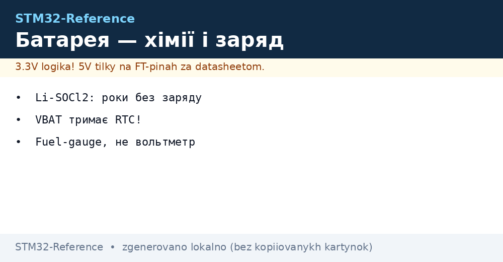
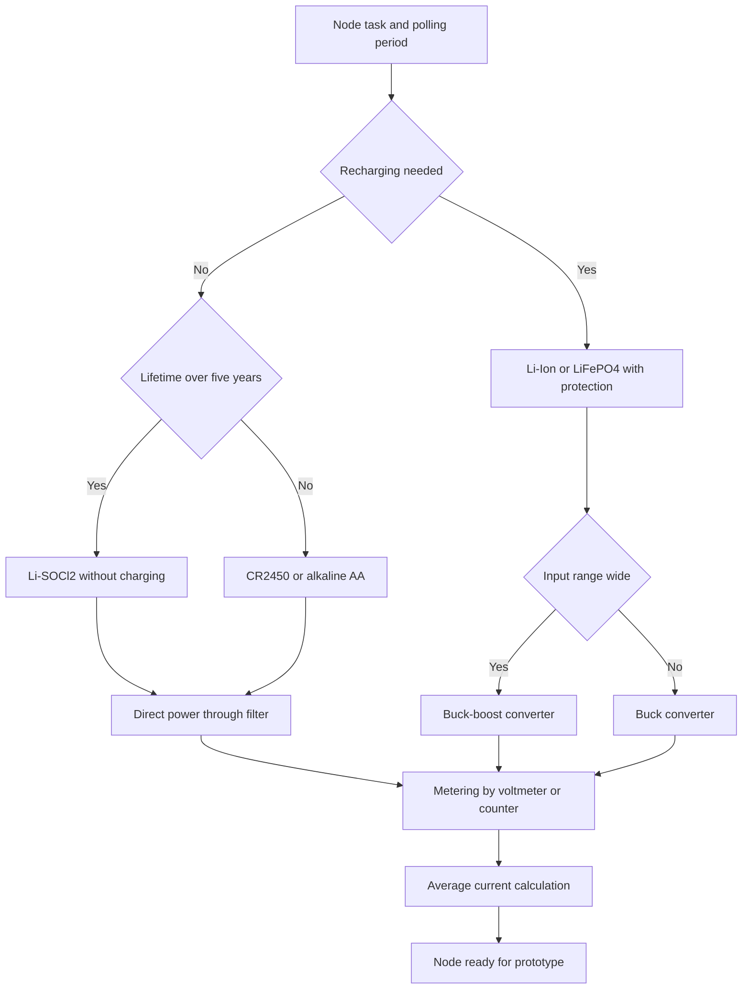

# Battery Power - Chemistries, Charging and Accounting


*Fig. Battery chemistries, lithium charging, backup domain and node charge accounting.*

> [!tip] Purpose of this note
> Help pick a battery for an autonomous node: which chemistry lives for years, how to charge lithium safely, how to power the chip with no loss, and how to honestly calculate lifetime.

## 1. Purpose

An autonomous STM32 node sleeps for years, rarely wakes up, measures a sensor and transmits a packet. The battery gives microamps in sleep and tens of milliamps in transmit bursts. A wrong chemistry or a linear regulator with large quiescent current eats the reserve long before the calculated term.

The note collects practice: comparing chemistries from coin lithium to lithium with built-in protection, charging rules for the current-voltage profile, the difference between a switching converter and a linear regulator, and balance tracking by voltage vs a dedicated chip.

A calculation of the average current budget and its conversion into years of work from a common coin cell is shown separately. The example adapts easily to your wakeup period and packet.

Board mains power and decoupling are described in [Board power supply chains](../../../STM32-Reference/02-Zhivlennya/01-Lancjugi-zhivlennya.md), and low-consumption modes in [Sleep modes](../../../STM32-Reference/07-Timeri-Son/03-Sleep-Stop-Standby.md).

## 2. Battery chemistries for STM32 nodes

| Chemistry | Nominal voltage | Working voltage range | Typical capacity | Notes |
| --- | --- | --- | --- | --- |
| CR2032 | 3.0 V | 3.2 V - 2.0 V | 220 mAh | Cheap, small pulsed current, sags on radio |
| CR2450 | 3.0 V | 3.2 V - 2.0 V | 620 mAh | Larger than CR2032, holds bursts better |
| Li-SOCl2 | 3.6 V | 3.6 V - 3.3 V | 2400 mAh | Very small self-discharge, years of life, not rechargeable |
| Li-Ion | 3.7 V | 4.2 V - 3.0 V | 1000 mAh - 3000 mAh | Rechargeable, needs overcharge protection |
| LiFePO4 | 3.2 V | 3.6 V - 2.8 V | 600 mAh - 1500 mAh | Safer, flat discharge curve, long cycles |
| AA alkaline | 1.5 V | 1.6 V - 0.9 V | 2500 mAh | Two cells give 3 V, cheap field replacement |

Coin lithium batteries suit compact nodes but have large internal resistance. Direct radio packet transmit from a CR2032 with no buffer capacitor often ends in reset from sagging.

Li-SOCl2 chemistry holds voltage almost flat for the whole term and self-discharges about one percent per year. Ideal for sensors that transmit rarely. Drawback: surface passivation after long storage gives a temporary voltage dip at the first current.

AA alkaline cells are available everywhere and forgive charging mistakes because they do not charge at all. Two cells in series give a start near 3.2 V and an end near 1.8 V, so a wide input range or a boost converter is needed.

```text
Вибір хімії за сценарієм роботи:

  Раз на годину маленький пакет .... CR2450 + конденсатор 470 мкФ
  Раз на добу роками без обслуговування .... Li-SOCl2 типорозміру AA
  Перезаряджуваний вузол з USB .... Li-Ion + захист + заряд
  Безпечний вуличний датчик .... LiFePO4 + сонячна панель
  Дешевий прототип на столі .... 2 x AA лужні
```

Battery voltage is always checked against the allowed input of the chip and converter. A fully charged Li-Ion reads 4.2 V, above the 3.6 V limit of most STM32, so direct connection with no regulator is forbidden.

## 3. VBAT domain: clock and backup when power is gone

| Question | Answer |
| --- | --- |
| What VBAT powers | Real-time clock, backup registers, part of the wakeup circuit |
| Range | 1.2 V - 3.6 V depending on family, exact value per datasheet |
| Consumption current | Fractions of a microamp to several microamps with clock on |
| What to connect | Coin battery, supercapacitor, or the VDD bus through a diode |
| Without battery | Tie to VDD per the recommendation for the specific chip |
| Backup registers | Hold counters, keys, node state between resets |

Diode isolation lets the domain run from the main bus when present and from the battery when the bus is gone. Drop on a Schottky diode near 0.3 V leaves enough margin for the clock.

A 0.47 F supercapacitor holds the clock for hours after power loss. Enough to survive a battery swap with no time loss. Supercapacitor leakage current exceeds lithium battery self-discharge, so a battery is picked for years of autonomy.

Backup registers do not replace flash. They hold tens of state bytes: packet number, next measurement time, calibration flags. Large arrays go to flash rarely to avoid wearing memory.

## 4. Li-Ion charging: CC and CV profile, modules and protection

Lithium charges in two stages. First with stable current until voltage reaches 4.2 V, then with stable voltage until current falls to a tenth of the start value. Skipping the second stage undercharges the battery, exceeding voltage destroys the chemistry.

| Stage | Mode | Transition condition |
| --- | --- | --- |
| Pre-charge | Small current at deep discharge below 3.0 V | Move to full current after voltage rise |
| CC | Stable current 0.5C - 1C | Move on reaching 4.2 V on terminals |
| CV | Stable voltage 4.2 V | Stop when current falls to 0.1C |
| Finish | Charge off | Do not keep lithium on float charge for weeks |

The TP4056 chip implements the profile on its own: current set by a resistor, end of charge signaled by a pin. Modules on this chip suit prototypes but need current and heat removal checks.

A DW01 plus dual transistor pair disconnects the battery on overcharge, overdischarge and current overload. Without protection, deep discharge below 2.5 V ruins the cell irreversibly. Protection does not replace correct charging, it only guards against accidents.

```text
Мінімальний ланцюг заряджання вузла:

  USB 5 В --> TP4056 --> [захист DW01] --> Li-Ion 3,7 В
                                                   |
                                            перетворювач --> 3,3 В --> STM32
                                                   |
                                            дільник --> АЦП контроль напруги
```

LiFePO4 charging has a different end voltage near 3.6 V. Charging LiFePO4 with a module for plain Li-Ion is forbidden. For LiFePO4 take a profile chip for this chemistry or a solar controller with a chemistry switch.

Temperature control is mandatory. Charging in frost below zero and in heat above 45 degrees speeds degradation. The battery thermistor goes to the charge inhibit input.

## 5. Battery converter: switching vs linear

| Option | Efficiency at small current | Quiescent current | Noise | When to take |
| --- | --- | --- | --- | --- |
| LDO | Low at a large input-output gap | Units to tens of microamps | Almost none | Cheap nodes from two AA cells, small currents |
| Buck | High even at gaps of volts | Hundreds of nanoamps to microamps in modern parts | Ripple of tens of millivolts | 4.2 V battery, long term, frequent transmits |
| Buck-boost | High across the whole range | A bit larger than pure buck | Harder spectrum | Two AA cells from 3.2 V to 1.8 V with no battery swap |
| Direct power | Maximum since no loss | Zero | None | LiFePO4 or CR2450 within chip tolerance |

A linear regulator burns the voltage gap as heat. Fed from 4.2 V to a 3.3 V output, a third of the energy is lost. At microamp sleep currents the regulator quiescent current matters more than efficiency under load.

A switching converter with small quiescent current pays off over years of life. Look for parts with pulse-skipping mode at light load. Ripple is filtered with ceramic near the chip power pin.

```text
Орієнтир вибору за входом:

  Вхід 4,2 В Li-Ion ......... buck на 3,3 В
  Вхід 3,0 В монетна ........ пряме живлення + буферна ємність
  Вхід 3,6 В Li-SOCl2 ....... пряме живлення через фільтр
  Вхід 3,0 В - 1,8 В 2xAA ... buck-boost на 3,3 В
  Вхід 3,6 В - 2,8 В LiFePO4  пряме живлення, контроль порогів
```

Radio peak current is budgeted separately from average. The converter must hold a 100 mA burst with no sag below the reset threshold. A 100 uF - 470 uF buffer capacitor near the radio module smooths the edge.

Bus voltage measurement details via the built-in channel are described in [ADC measurements](../../../STM32-Reference/06-Analog/01-ADC.md).

## 6. Charge accounting: voltmeter vs fuel-gauge chip

A simple voltmeter converts voltage to percent from a table. The method is cheap and enough for steep discharge curves where voltage drops visibly. For flat curves the method gives large errors.

| Method | Accuracy | Complexity | When enough |
| --- | --- | --- | --- |
| Voltmeter with divider | 10 percent on steep chemistries | One divider and one ADC channel | Alkaline AA, Li-Ion mid-scale |
| Averaged voltmeter | Better on slow changes | Filter in code | Coin batteries with no bursts at measure time |
| Coulomb counter | 2 percent when calibrated | Dedicated chip with shunt | Frequent charge-discharge cycles, paid devices |
| Impedance algorithm | 3 percent even on flat curves | Ready chip with chemistry model | LiFePO4 where voltage barely moves |

The flat LiFePO4 curve is tricky: from 80 percent to 20 percent voltage moves only tenths of a volt. ADC and divider errors eat the whole margin. Here an accounting chip with a model or at least coulomb counting is needed.

The voltmeter divider is picked high-impedance to avoid draining the battery. Resistance in hundreds of kiloohms plus a capacitor across the lower arm gives stable measurement on pulsed polling. A permanently connected low-impedance divider draws more than chip sleep.

Measurements run in the pause between radio bursts when voltage has recovered. A series of eight measurements with a median cuts outliers. The result is smoothed with an exponential filter.

## 7. Self-discharge and aging

| Chemistry | Self-discharge | Storage term | Aging |
| --- | --- | --- | --- |
| CR2032 and CR2450 | 1 percent per year | Up to 10 years | Capacity loss in heat above 40 degrees |
| Li-SOCl2 | About 1 percent per year | Up to 15 years | Passivation, needs a depassivation pulse |
| Li-Ion | 3 percent per month | 3 years to visible loss | 500 cycles, storage at 40 percent charge |
| LiFePO4 | 2 percent per month | 5 years | 2000 cycles, calmly survives full charge |
| AA alkaline | 2 percent per year | Up to 7 years | Leakage at deep discharge and in heat |

High temperature doubles aging speed for every 10 degrees. A street enclosure in the sun heats to 60 degrees, so the planned term is halved or a visor and ventilation are added.

Leakage current of capacitors and protection diodes adds to self-discharge. An electrolytic leaking microamps eats hundreds of milliamp-hours per year. For nodes living years, ceramic and film go in where possible instead of electrolytics.

## 8. Budget example: years from a CR2450

Task: a temperature sensor wakes every 10 minutes, measures the sensor and transmits a short packet. Calculate average current and lifetime from a 620 mAh battery.

| Phase | Current | Duration | Charge per cycle |
| --- | --- | --- | --- |
| Sleep with clock | 2 uA | 600 s | 1200 uC |
| Sensor measurement | 1 mA | 0.05 s | 50 uC |
| Packet transmit | 30 mA | 0.02 s | 600 uC |
| Processing and state write | 5 mA | 0.01 s | 50 uC |

Sum per cycle: 1900 uC per 600 seconds. Average current equals 1900 divided by 600, about 3.2 uA. Add regulator quiescent current 1 uA and capacitor leakage 0.5 uA, giving about 4.7 uA average.

Lifetime: 620 mAh divided by 0.0047 mA gives about 131900 hours, about 15 years by arithmetic. Reality is limited by 1 percent yearly self-discharge, passivation, contact degradation and cold nights with sagging. Honest estimate: 7 years with margin.

```text
Перерахунок під свій період опитування:

  Середній струм = (сон * час сну + суми імпульсів) / період
  Години служби = ємність мАг / середній струм мА
  Роки служби = години / 8760 з поправкою на саморозряд

  Приклад вище:
    (2 мкА * 600 с + 50 + 600 + 50 мкКл) / 600 с = 3,2 мкА
    + 1,5 мкА накладних = 4,7 мкА
    620 / 0,0047 = 131900 год = 15 років теорії = 7 років практики
```

Shortening the period to 1 minute raises average current about sixfold and cuts lifetime to a year. Tripling the packet cuts lifetime the same way. The budget is calculated before board routing, not after.

For clarity a current-vs-time plot is drawn: a long sleep shelf, a short measurement peak, a high transmit peak. The area under the plot is the cycle charge.

## 9. Mermaid: autonomous node path



The recharge branch leads to lithium with a charge controller. The long-term branch leads to primary chemistry with no cycles. Accounting is picked after the converter because accuracy depends on ripple.

## 10. Code: periodic battery voltage measurement

```c
#include "stm32l0xx_hal.h"

#define VDIV_TOP_KOHM   (820U)
#define VDIV_BOT_KOHM   (270U)
#define ADC_MAX_CODE    (4095U)
#define VREF_MV         (3000U)

static uint32_t Battery_Median(ADC_HandleTypeDef *hadc)
{
    uint32_t s[8];
    for (uint32_t i = 0U; i < 8U; i++)
    {
        HAL_ADC_Start(hadc);
        HAL_ADC_PollForConversion(hadc, 10U);
        s[i] = HAL_ADC_GetValue(hadc);
        HAL_ADC_Stop(hadc);
    }
    for (uint32_t i = 0U; i < 8U; i++)
    {
        for (uint32_t j = i + 1U; j < 8U; j++)
        {
            if (s[j] < s[i])
            {
                uint32_t t = s[i];
                s[i] = s[j];
                s[j] = t;
            }
        }
    }
    return (s[3] + s[4U]) / 2U;
}

uint32_t Battery_Millivolts(ADC_HandleTypeDef *hadc)
{
    uint32_t code = Battery_Median(hadc);
    uint32_t vadc = (code * VREF_MV) / ADC_MAX_CODE;
    uint32_t vbat = vadc * (VDIV_TOP_KOHM + VDIV_BOT_KOHM) / VDIV_BOT_KOHM;
    return vbat;
}

void Battery_Task(ADC_HandleTypeDef *hadc)
{
    uint32_t mv = Battery_Millivolts(hadc);
    if (mv < 2800U)
    {
        HAL_GPIO_WritePin(GPIOB, GPIO_PIN_0, GPIO_PIN_SET);
    }
    else
    {
        HAL_GPIO_WritePin(GPIOB, GPIO_PIN_0, GPIO_PIN_RESET);
    }
}
```

The 820 kOhm and 270 kOhm divider gives a ratio near four and draws only microamps from a 3.6 V battery. A 10 nF capacitor across the lower arm cuts sampling noise. Calibration runs once against a multimeter and the correction is stored.

Measurement starts after a 20 ms pause from the radio burst so voltage recovers. A median of eight rejects single noise outliers. The 2800 mV threshold signals coin battery discharge.

## 11. Solar top-up in brief

A small 5 V 0.5 W solar panel through a charge controller supports LiFePO4 in a street sensor. The controller limits voltage and current, at night the node lives on the accumulator. A Schottky diode keeps current from flowing back into the panel in the dark.

The panel faces south at the tilt of the site latitude. Tree shading cuts output many times stronger than the shadow area because series sections lose current. Glass is washed once a season from dust.

Panel power is calculated for winter sun, not summer. If the node draws 5 mAh per day, and winter gives only two hours of weak sun, the panel must deliver this charge in two hours given controller efficiency. Triple margin is planned in.

## Common issues

| # | Issue | Why it is bad | Fix |
| --- | --- | --- | --- |
| 1 | Direct chip power from 4.2 V Li-Ion | Exceeds the 3.6 V limit, ruins the die | Buck converter to 3.3 V between battery and chip |
| 2 | Transmit from CR2032 with no buffer capacitor | Burst sag causes reset | 470 uF capacitor near the module and short traces |
| 3 | LiFePO4 charged with a Li-Ion module | Overcharge above 3.6 V destroys the chemistry | Controller with a profile for LiFePO4 exactly |
| 4 | Percent from voltage on the flat LiFePO4 curve | Errors of tens of percent, sudden stop | Accounting chip with a chemistry model |
| 5 | Low-impedance divider permanently on battery | Divider eats more than chip sleep | High-impedance divider and pulsed polling |
| 6 | Charging in frost with no temperature control | Anode degradation and capacity loss | Thermistor and charge ban outside the temperature window |
| 7 | Self-discharge ignored in lifetime math | Theory 15 years, practice 3 years | Add self-discharge and double margin to the budget |

## Official sources

- [AN4452 Battery charger (ST)](https://www.st.com/resource/en/application_note/an4452-lithium-battery-charger-for-prestigio--stmicroelectronics.pdf) - lithium charging and process control.
- [STM32L0 ultra-low-power (ST)](https://www.st.com/en/microcontrollers-microprocessors/stm32l0-series.html) - sleep modes, VBAT and backup currents for autonomous nodes.
- [UM2305 STBC02 charger (ST)](https://www.st.com/resource/en/user_manual/um2305-stbc02-battery-charger-evaluation-board-stmicroelectronics.pdf) - CC and CV profile on a charge chip example.

## See also

- [Home](../../../STM32-Reference/Home.md)
- [Board power supply chains](../../../STM32-Reference/02-Zhivlennya/01-Lancjugi-zhivlennya.md)
- [Low-power chips](../../../STM32-Reference/01-Hardware/05-L0-L4-U5.md)
- [ADC measurements](../../../STM32-Reference/06-Analog/01-ADC.md)
- [Sleep modes](../../../STM32-Reference/07-Timeri-Son/03-Sleep-Stop-Standby.md)
- [H5 and H7 flagships](../../../STM32-Reference/01-Hardware/04-H5-H7.md)
- [ST-Link flashing](../../../STM32-Reference/09-Proshivka/03-ST-Link-Proshivka.md)
