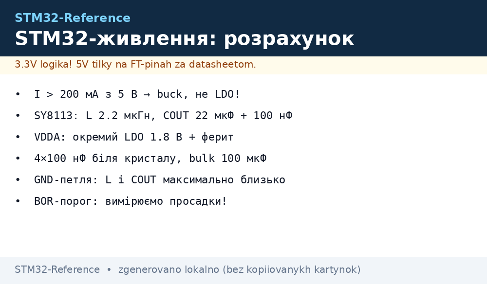
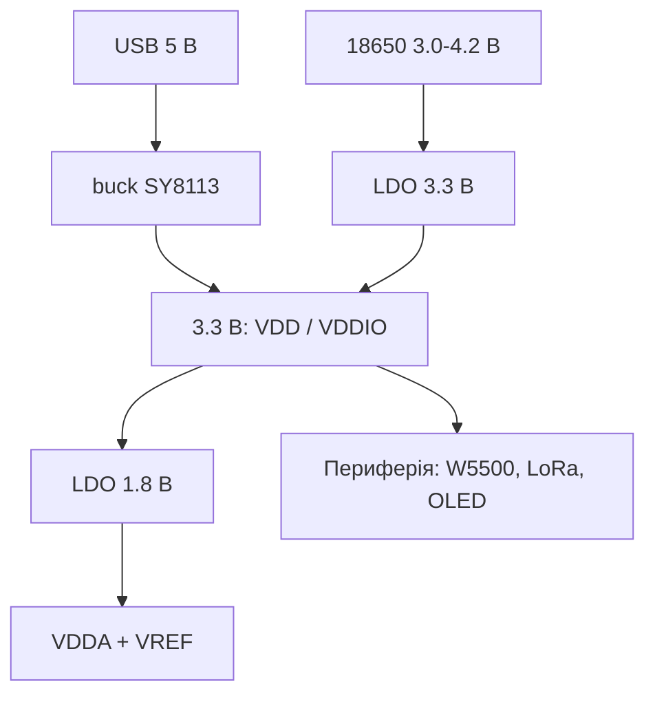

# Живлення плати зі STM32: розрахунок, layout, захист

EN version: `02-Zhivlennya/03-Power-Design.en.md`

*Рис. Дерево живлення: USB 5 В → buck SY8113 → 3.3 В → LDO VDDA 1.8 В + домени VDDIO.*

> [!tip] Що це за нота
> Глибок розбір поверх [Ланцюги](../../../STM32-Reference/02-Zhivlennya/01-Lancjugi-zhivlennya.md) і [Батареї](../../../STM32-Reference/02-Zhivlennya/02-Batareyne-zhivlennya.md): там - «як з'єднати», тут - «скільки дати і чому саме такий вибір». Усе з числами: струми, втрати, layout, захист.

Дерево живлення типової плати:

*Рис. Два дерева живлення: USB 5 В → buck, батарея → LDO.*

## 1. Струми STM32: з чого починаємо

Оцінки по даташитах (режим Run, 25 °C, ядро + активна периферія):

| Сімейство | Частота | I ядра, ~3.3 В | Пік (RAM/PS burst) |
| --- | --- | --- | --- |
| F030/F103 | 48-72 МГц | 40-80 мА | +50 мА |
| F407 | 168 МГц | ~170 мА | +100 мА |
| F767 | 216 МГц | ~230 мА | +150 мА |
| H743 | 600 МГц | ~400 мА | +300 мА |
| L431 | 80 МГц | ~30 мА | +20 мА |
| U553 | 400 МГц | ~250 мА | +200 мА |

Плюс периферія: LoRa-радіо пік 300 мА, W5500 ~100 мА, OLED 128×64 ~50 мА, Wi-Fi-модуль пік 350 мА.

## 2. Топології: LDO проти buck

Приклад: USB 5 В, STM32F4 + W5500 + OLED + LoRa-пік = ~550 мА.

| Варіант | Втрата при 550 мА, 5 В → 3.3 В | ККД | Тепловиділення |
| --- | --- | --- | --- |
| AMS1117 (LDO, drop ~1.1 В) | (5−3.3)×0.55 = 0.94 ВТ | ~66 % | 0.94 ВТ в SOT-223 - гарячий |
| ME6211 (LDO, низький drop) | ~0.85 ВТ | ~69 % | все одно гарячий |
| SY8113 (buck 3 А, 500 кГц) | ~0.07 ВТ | ~94 % | холодний, +4…+6 °C |

Висновок: при I > 200 мА з 5 В - тільки buck. LDO - для VDDA та для входу з 18650 (3 В → 3.3 В: на відміну від 5 В, втрата дуже мала).

## 3. Робочий приклад: 5 В → 3.3 В на SY8113

| Елемент | Значення | Навіщо |
| --- | --- | --- |
| IN | 4.7-5.5 В (USB) | input range 4.5-18 В |
| L | 2.2 мкГн, 3 А, низький DC | 500 кГц, f·L |
| C_OUT | 22 мкФ X5R + 100 нФ MLCC біля VOUT | петля ПЛГ, вихідний шум |
| FB | 45.4 кОм / 10 кОм | Vout = 0.6 × (1 + R1/R2) = 3.3 В |
| GND-зворот | одно-точковий під L і COUT | мінімальна петля струму |

VDDA: окремий LDO (ME6211A18 на 1.8 В або стабілізатор 3.3 В на VDDA), ферит + 100 нФ на виході, VREFINT - дільник від VDDA. На F4 VDDIO = VDD (окремих ізоляторів немає).

## 4. Layout: сім правил

1. 4× 100 нФ біля VDD/VSS кожного кристалу (сусідні пін QFN/BGA).
2. 2× 22 мкФ на виході VOUT + 100 мкF bulk біля MCU.
3. Ланцюг джерела L і COUT: короткий, широкий, GND-площина під ним.
4. VDDA - окремий вихід, LC-фільтр, VREF-дільник від VDDA.
5. USB D+/D− - паралельні, дифір ~90 Ом, перемичок, перехрестів немає.
6. «Довгі дроти» до DC-DC - найгірша петля струму: L, COUT, GND в одному кутку плати.
7. Захист на вході: TVS/ESD на USB (USBLC6-2), reverse-polarity (див. розділ 5).

## 5. Захист

- зворотна полярність: P-MOSFET (наприклад, IRFB7199) або діод з розрахунком втрат;
- перенапруга: TVS SMBJ5.0A на USB і на клеммах;
- перевантаження: fuse 500 мА на лінії 5 В;
- просадка: Brownout Detection (PWR, пороги BOR1-BOR4) - MCU детерміновано скидається замість «зависання»;
- температура: NTC на платі (канал [АЦП](../../../STM32-Reference/06-Analog/01-ADC.md)) - при >85 °C знижувати duty радіо.

## 6. Вимірювання

- INA219 на шунті лінії 5 В - розбір у [INA219](../../../STM32-Reference/10-Sensori/04-INA219-HX711.md);
- мультиметр в розриві +: піки при SPI/I2C burst і при старті радіо;
- термокамера: де гріється LDO проти buck - «тепло не бреше»;
- осцилограф: ripple на VOUT (buck < 20 мВ), просадки при SPI-burst і при ввімкненні ESC.

## 6.1 Тепловий розрахунок LDO: приклад

AMS1117 при 5 В → 3.3 В, I = 550 мА:

- втрата: P = (5 − 3.3) × 0.55 = 0.94 ВТ;
- θJA (SOT-223) ≈ 80 °C/ВТ → ΔT ≈ 75 °C;
- температура корпусу при 25 °C довкілля: ~100 °C - недопустимо.

Висновок: LDO з 5 В - тільки коли I < 150 мА (втрата < 0.25 ВТ). Інакше - buck.

## 6.2 Чек-лист живлення плати

| Пункт | Приймальний критерій |
| --- | --- |
| VDD на pin MCU | 3.13-3.47 В під навантаженням |
| Просадка при SPI-burst | < 5 % |
| Ripple на VOUT (buck) | < 20 мВ |
| Шум VDDA / VREF | < 1 мВ |
| Напруга батареї (18650) | > 3.0 В |
| Температура LDO | < 60 °C після години роботи |
| Струм USB до config | 100 мА (descriptor) |

> [!warning] Батарея + buck
> LiPo (4.2 В) → buck 3.3 В: дотримуватися input range, а навантаження тримати нижче за 50 % струму buck, інакше тепловий захист.

## 6.3 Розрахунок автономності: приклад

Плата: F407 + LoRa (duty 30 %), середнє навантаження 200 мА при 3.3 В.

| Параметр | Значення |
| --- | --- |
| Батарея | 18650 3000 мАг, корисна ~2400 мАг |
| Автономність без сну | 2400 / 200 = 12 год |
| Дуті 10 % (deep-sleep 90 % часу) | ~3 доби |
| Струм deep-sleep L4-класу | ~30 мкА |
| 2×18650 (7.4 В) + buck | ~14 год при 300 мА, η 94 % |

Правила:

- VBAT - дільник + АЦП, не «довіра» лічильнику окремо;
- відсічка BOR нижче порогу, де периферія починає помилятися;
- кінцева напруга 18650 - 3.0 В, не 2.5 В;
- сонячна панель - діод Шотткі + мінімальний MPPT.

## 7. Типові помилки

| Симптом | Причина | Лікування |
| --- | --- | --- |
| MCU Resets при I2C-burst | LDO входить у дроапт | buck, збільшити COUT, перевірити VDD |
| ADC «плаває» | VDDA шумить від цифри | окремий LDO VDDA, LC-фільтр, layout |
| Плата «падає» з батареї | просадка під радіо-радіо/піком | bulk-конденсатор, менший пік LoRa (duty) |
| Електроліт «співає» | мікрофонік | кераміка замість електроліта, менша петля струму |
| LED гасне під SPI-burst | LDO не встигає: burst 300 мА | збільшити COUT, перейти на buck |
| USB «відвалюється» під навантаженням | ліміт 100 мА до SET_CONFIGURATION | descriptor 500 мА, зовнішнє живлення |

## 8. Суміжні ноти

- [Buck/Boost](../../../STM32-Reference/13-Moduli-zhivlennya-rivniv/01-Buck-Boost.md) - модулі готових регуляторів.
- [Батареї](../../../STM32-Reference/02-Zhivlennya/02-Batareyne-zhivlennya.md) - LiPo, 18650, сонянка.
- [АЦП](../../../STM32-Reference/06-Analog/01-ADC.md) - шум VREF і калібрування.
- [Шунт](../../../STM32-Reference/06-Analog/05-Shunt-OPAMP.md) - вимірювання струму шунтом.

## Офіційні джерела

- [SY8113 application note (PDF, через Olimex)](https://www.olimex.com/Products/Breadboarding/BB-PWR-8113/resources/SY8113.pdf) - buck 3 А 500 кГц.
- [MP1584 (Monolithic Power)](https://www.monolithicpower.com/en/mp1584.html) - buck-розрахунок.
- [ME6211 datasheet (Microne, PDF)](https://github.com/Edragon/Datasheet/blob/master/Microne/ME6211.pdf) - LDO, низький drop.
- [AMS1117 datasheet (Advanced Monolithic, PDF)](http://www.advanced-monolithic.com/pdf/ds1117.pdf) - класика LDO 1 А.
- [STM32F4 product page (ST)](https://www.st.com/en/mcus-mpus/stm32f4.html) - струми, домени живлення.
