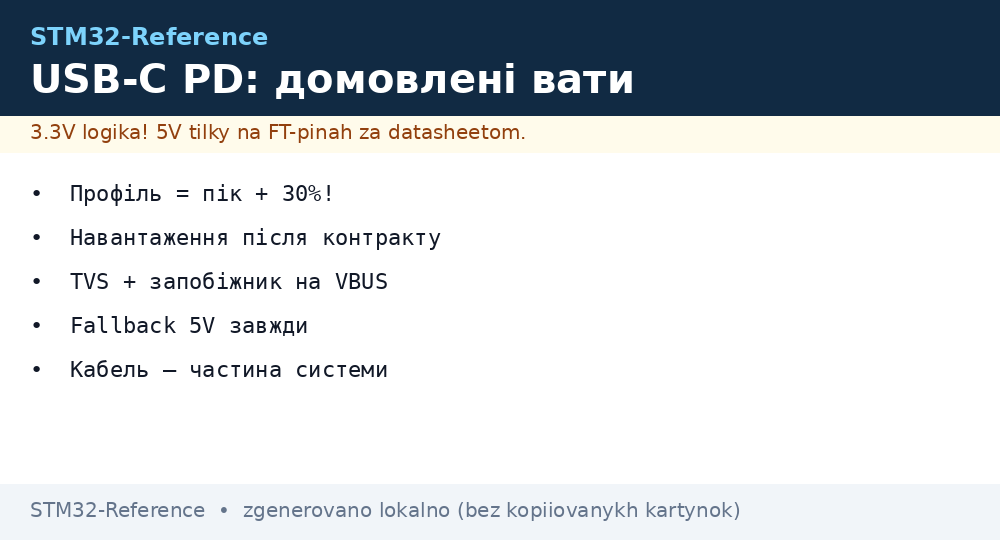
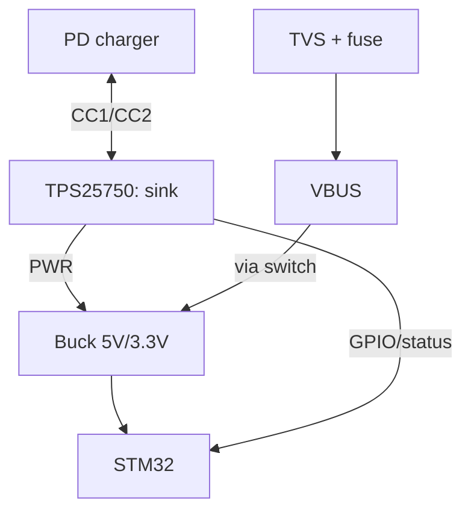

# STM32 USB-C Power Delivery - TPS25750 Sink and Watt Negotiation


*Fig. PD chain: charger to CC lines to TPS25750 to negotiated 15V to buck to 5V/3.3V of the board.*

> [!tip] What this note is
> Modern power instead of "dumb" 5V: the board asks the charger for the needed profile and gets watts with margin. Base: [Power supply chains](../../../STM32-Reference/02-Zhivlennya/01-Lancjugi-zhivlennya.md), [Power supply calculation](../../../STM32-Reference/02-Zhivlennya/03-Power-Design.md).

## 1. Goal

Get honest watts over USB-C:

- PD contract: request to contract to power;
- TPS25750 as a firmware-free PD sink;
- 5V/9V/15V/20V profiles: what to ask for each task;
- CC lines, Rp/Rd and cable orientation;
- protection: overvoltage and wrong profile.

| PD profile | Voltage/current | For what |
| --- | --- | --- |
| 5V 3A | base | board + sensors |
| 9V 3A | 27W | board + motors/display |
| 15V 3A | 45W | server node |
| 20V 5A | 100W | not for STM32, the limit |

## 2. Architecture



TPS25750 negotiates on its own (resistor/EEPROM config), STM32 only reads status. VBUS is enabled with a switch after the contract.

## 3. Sink pinout

| TPS25750 signal | To where | Note |
| --- | --- | --- |
| CC1/CC2 | USB-C connector | Rp/Rd inside, cable either way |
| VBUS sense | divider | control of actual voltage |
| PWR (5V out en) | VBUS switch | enable after contract |
| GPIO status | PB5 (input) | contract closed |
| I2C (optional) | PB6/PB7 | telemetry and logs |
| GND | common | thick current trace |

## 4. Firmware-free configuration

- profile picked with pins/resistors (datasheet table);
- EEPROM option - for series with identical demands;
- ask the minimum that covers peak + 30 %;
- 5V fallback - if the charger is not PD (plain port);
- contract LED - visible proof of agreement.

## 5. Working code (C, HAL)

```c
#define PD_OK_PIN GPIO_PIN_5

int pd_wait_contract(uint32_t timeout_ms) {
  uint32_t t0 = HAL_GetTick();
  while (HAL_GetTick() - t0 < timeout_ms) {
    if (HAL_GPIO_ReadPin(GPIOB, PD_OK_PIN) == GPIO_PIN_SET) {
      return 1;
    }
    HAL_Delay(50);
  }
  return 0;
}

void power_init(void) {
  VBUS_KEY_OFF();
  if (pd_wait_contract(3000)) {
    VBUS_KEY_ON();
    power_rail_enable();
  } else {
    power_rail_enable();
    log_warn("PD no contract, fallback 5V");
  }
}
```

Principle: load turns on AFTER the contract. Otherwise a sag at negotiation time resets the board.

## 6. Working code (MicroPython)

```python
# MicroPython: монітор PD-контракту і живлення
import time
from machine import Pin, ADC

pd_ok = Pin('PB5', Pin.IN)
vbus = ADC(Pin('PA4'))
relay = Pin('PB6', Pin.OUT, value=0)

def vbus_volts(n=16):
    s = 0
    for _ in range(n):
        s += vbus.read_u16()
    return s * 3.3 * 4.0 / (n * 65535)

t0 = time.ticks_ms()
while not pd_ok.value():
    if time.ticks_diff(time.ticks_ms(), t0) > 3000:
        print('PD no contract, fallback')
        break
    time.sleep_ms(50)
else:
    print('PD contract OK')

relay.value(1)
while True:
    print('VBUS', round(vbus_volts(), 2))
    time.sleep(1)
```

VBUS divider 4:1 - 20V fits into the 3.3V ADC. Contract check before relay turn-on is mandatory.

## 7. Line safety

- TVS on VBUS - hot-plug spikes;
- self-recovering fuse on input;
- wrong profile (20V into a 5V circuit) - excluded by config;
- CC lines - no capacitors that break negotiation;
- certified cable - part of safety, not an accessory.

## Common issues

| Symptom | Cause | Fix |
| --- | --- | --- |
| Always 5V though 15V asked | charger not PD / cable without CC | PD charger + full cable |
| Reset at contract moment | load enabled too early | VBUS switch after contract |
| Works every other time | CC contact dirty | connector cleaning, another cable |
| Buck heats | efficiency at current limit | 30 % margin, heatsink |
| Status lies | GPIO pull | explicit pull-down, filter |
| 20V on the board | config mistake | verify profile before turn-on! |

## 9. PD cheat sheet

- profile = peak + 30 %;
- load after contract;
- TVS + fuse on VBUS;
- 5V fallback always planned;
- cable - part of the system.

## 10. Related notes

- [Power supply chains](../../../STM32-Reference/02-Zhivlennya/01-Lancjugi-zhivlennya.md) - power base.
- [Power supply calculation](../../../STM32-Reference/02-Zhivlennya/03-Power-Design.md) - currents and heat.
- [Buck/Boost modules](../../../STM32-Reference/13-Moduli-zhivlennya-rivniv/01-Buck-Boost.md) - converters.
- [Analog ADC](../../../STM32-Reference/06-Analog/01-ADC.md) - VBUS measurement.
- [Main map](../../../STM32-Reference/Home.md) - full navigation.

## Official sources

- [TPS25750 (Texas Instruments)](https://www.ti.com/product/TPS25750) - PD sink, configuration, profiles.
- [STM32F4 (ST)](https://www.st.com/en/mcus-mpus/stm32f4.html) - power supply and GPIO domains.
- [MQTT Specification (OASIS)](https://mqtt.org/mqtt-specification/) - power telemetry.
