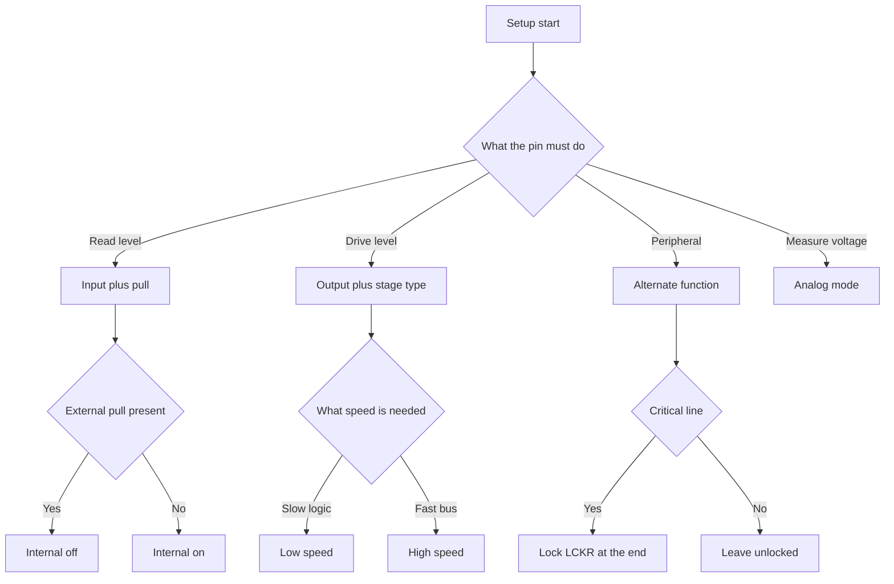

# STM32 GPIO - Modes, Registers and Currents


*Fig. GPIO pin structure: MODER modes, output stage, pull resistors and input protection.*

> [!tip] Purpose of this note
> Give a full map of a GPIO pin: which registers answer for what, how to switch with no races, how much current can be drawn, and why a floating input catches noise.

## 1. Purpose

A GPIO port is a software-driven group of microcontroller pins. Each pin can work as input, output, alternate function line, or analog input. Settings live in port registers: mode, output type, edge speed, pulls, input and output data. Understanding these registers removes most questions about why an LED stays dark, a button bounces, and a neighbor pin affects measurement.

Practice starts with three steps: enable port clocking, configure mode via MODER and PUPDR, then write via BSRR instead of direct ODR writes. Details on currents, speed and protection come next.

## 2. MODER register - four pin modes

Each pin owns two bits in the MODER register. The value picks the base working mode.

| MODER | Mode | What the pin does | When to take |
| --- | --- | --- | --- |
| 00 | Input | Level read via IDR, output stage off | Buttons, sensors, logic signals |
| 01 | Output | Level driven via ODR or BSRR | LEDs, relays via switch, control signals |
| 10 | Alternate function | Pin driven by peripherals via AF multiplexer | UART, SPI, I2C, timers, USB |
| 11 | Analog | Digital buffer off, pin tied to ADC or comparator | Voltage measurement, ADC channels |

After reset most pins sit in input mode with pulls off. Exceptions are debug service lines and crystal lines, which have a fixed purpose after startup.

```text
Логіка вибору режиму:
  Треба читати рівень ............ MODER 00 вхід + PUPDR підтяжка
  Треба видавати рівень ........... MODER 01 вихід + OTYPER тип
  Треба периферія ................. MODER 10 AF + регістри AFRL і AFHR
  Треба виміряти напругу .......... MODER 11 аналог + відключити підтяжки
  Пін висить у повітрі ............ неприпустимо, задати вхід з підтяжкою або вихід
```

## 3. OTYPER register - push-pull and open-drain

OTYPER holds one bit per pin and works only in output and alternate function modes.

| OTYPER | Type | Circuit | Application |
| --- | --- | --- | --- |
| 0 | Push-pull | Two switches take turns joining the pin to power or ground | Plain output, logic drive, LEDs |
| 1 | Open-drain | Only the lower switch pulls to ground, no upper switch | I2C bus, shared interrupt lines, level via external pull-up |

A push-pull output drives high and low levels on its own. Open-drain can only pull to ground, while an external pull-up resistor makes the high level. So I2C always picks open-drain with pull-ups to power.

## 4. OSPEEDR edge speed and PUPDR pulls

OSPEEDR sets output edge steepness. PUPDR sets built-in pull resistors for input, output and alternate function.

| OSPEEDR | Speed | Effect | Recommendation |
| --- | --- | --- | --- |
| 00 | Low | Slow edges, minimum noise and ringing | LEDs, buttons, slow signals |
| 01 | Medium | Speed and noise compromise | UART to hundreds of kbits, slow SPI |
| 10 | High | Steep edges, more emission | Fast SPI, clock signals |
| 11 | Very high | Maximum speed, demands short traces | Fast buses only, signal integrity care |

| PUPDR | Pull | Resistor value | When to take |
| --- | --- | --- | --- |
| 00 | None | Input floats | Only with an external pull or driver |
| 01 | Up to power | About 30-50 kOhm | Button to ground, idle input high |
| 10 | Down to ground | About 30-50 kOhm | Button to power, idle input low |
| 11 | Reserved | Do not use | Avoid this value |

The speed principle is simple: never set maximum by default. Steep edges ring on long traces, leak into neighbor ADC channels and add consumption. Start low or medium, raise only when edge speed falls short.

## 5. IDR input and ODR output

IDR is the read register: each bit shows the live pin level regardless of mode. ODR is the stored output state register: writing one asks high, writing zero asks low in output mode.

Danger hides in ODR writes. The classic read-modify-write sequence takes three steps and can be interrupted by an interrupt handler between read and write. Then the interrupt change is lost. That is why the BSRR register serves single-bit changes.

```text
Проблема читання-модифікації-запису:
  Головний цикл читає ODR ......... 0b00001111
  Переривання ставить біт 7 ....... ODR стає 0b10001111
  Головний цикл пише старе + біт 0 . ODR стає 0b00011111, біт 7 втрачено
  Висновок: для бітів використовувати BSRR, а не ODR
```

## 6. Atomic access via BSRR and BRR

BSRR holds two halves: the lower sixteen bits set outputs to one, the upper sixteen bits clear outputs to zero. The write completes in one bus operation, so interrupts cannot break it. Older families have a separate BRR register for clearing only.

| Operation | Via ODR | Via BSRR | Conclusion |
| --- | --- | --- | --- |
| Set bit | Read, set bit, write | Write mask to lower half | BSRR is safe |
| Clear bit | Read, clear bit, write | Write mask to upper half | BSRR is safe |
| Toggle bit | Read, invert, write | Read ODR and pick a BSRR half | In interrupts BSRR only |
| Work with ISR | Bit loss possible | No races | Always BSRR on shared ports |

A direct BSRR write looks like one line and compiles into one store instruction. Display drivers, software buses and fast pulses are written exactly this way.

## 7. LCKR configuration lock

LCKR locks pin settings until the next reset. The write sequence takes three steps with a key, after which the lock bit sticks. This guards critical lines against accidental overwrite, for example power control or motor inhibit.

The lock cannot be lifted in software. After activation, mode, output type and pulls cannot change until hardware reset. So LCKR turns on at the very end of debugging, when configuration is already verified.

## 8. 5 V tolerance and allowed currents

Pins split into plain and 5 V tolerant. The FT mark in the pinout table means up to 5 V may go to the input even when the controller runs at 3.3 V. Plain pins marked TTa must not exceed power. Analog pins and crystal lines are never tolerant.

| Parameter | Typical value | Comment |
| --- | --- | --- |
| Single pin output current | ±8 mA within VOL/VOH, 25 mA abs. max | See Absolute maximum ratings of the specific DS |
| Total current of all pins | About 80-120 mA depending on package | Excess drags power down |
| Current through a power line | Up to 150 mA per VDD and VSS pair | Thick packages survive more |
| FT input voltage | Up to 5.5 V | Digital mode only |
| Plain input voltage | No higher than VDD plus 0.3 V | Excess opens protection diodes |
| Input leakage current | About 1 uA | Count it for precise dividers |

An LED with no resistor, a relay driven directly, and motor power from a pin are typical ways to damage the die. A pin is a logic signal, not a power source. Loads switch through a transistor or driver.

```text
Схема піна спрощено:
        VDD
         |
      [P-ключ] --- OTYPER 0 замкнуто у двотактному режимі
         |
  PAD ---+--- вхідний буфер --- IDR
         |         |
      [N-ключ]  захист і підтяжки PUPDR
         |
        VSS
  Відкритий стік: верхнього ключа нема, тільки N-ключ і зовнішня підтяжка
```

## 9. Input with no pull is an antenna

An input left in the air with PUPDR 00 has large resistance and catches pickup from hands, mains and neighbor traces. Level wanders, edge interrupts fire on their own, consumption grows through shoot-through currents of the input buffer. So every unused pin must explicitly become an output or an input with pull.

For a button with no external parts a built-in pull is picked: button to ground plus pull-up to power, or button to power plus pull-down to ground. External 10 kOhm resistors give smaller resistance and better noise immunity than built-in 40 kOhm, so long cables prefer external parts.

## 10. Analog mode for ADC

Mode 11 turns the digital input buffer and Schmitt trigger off, so they stay quiet and draw no extra current. Pulls turn off in analog mode. Edge speed means nothing in this mode.

Before measuring, verify that a pin is tolerant in the digital sense only: in analog mode voltage must not exceed power. Protection diodes open and distort neighbor channel measurements. The divider is calculated so peak signal stays below reference voltage.

## 11. C code examples

```c
// HAL: базові операції з піном PC13
HAL_GPIO_WritePin(GPIOC, GPIO_PIN_13, GPIO_PIN_SET);
HAL_GPIO_WritePin(GPIOC, GPIO_PIN_13, GPIO_PIN_RESET);
HAL_GPIO_TogglePin(GPIOC, GPIO_PIN_13);
GPIO_PinState s = HAL_GPIO_ReadPin(GPIOA, GPIO_PIN_0);

// LL: ті самі дії швидше і компактніше
LL_GPIO_SetOutputPin(GPIOC, LL_GPIO_PIN_13);
LL_GPIO_ResetOutputPin(GPIOC, LL_GPIO_PIN_13);
LL_GPIO_TogglePin(GPIOC, LL_GPIO_PIN_13);
uint32_t v = LL_GPIO_IsInputPinSet(GPIOA, LL_GPIO_PIN_0);

// Прямий доступ через BSRR: атомарно і за один такт шини
GPIOC->BSRR = GPIO_BSRR_BS13;
GPIOC->BSRR = GPIO_BSRR_BR13;
GPIOA->BSRR = GPIO_BSRR_BS5;

// Налаштування: тактування, режим, підтяжка, швидкість
__HAL_RCC_GPIOA_CLK_ENABLE();
GPIO_InitTypeDef g = {0};
g.Pin = GPIO_PIN_5;
g.Mode = GPIO_MODE_OUTPUT_PP;
g.Pull = GPIO_NOPULL;
g.Speed = GPIO_SPEED_FREQ_LOW;
HAL_GPIO_Init(GPIOA, &g);
```

In the main loop and in interrupts touching one port, writes go only through BSRR. Button state reads go through IDR or the HAL read function. Delays as empty loops give way to hardware timers.

## 12. Mermaid: pin setup choice



## 13. Speed vs noise

Raising OSPEEDR shortens edge time but grows trace capacitance recharge current and emission. Long cables ring, double-clocking the receiver. In sensitive measurements neighbor output switching leaks into the ADC.

Practical order: low speed for LEDs and relays, medium for UART and slow SPI, high only for fast buses with short matched traces. Ground runs as a solid polygon, fast signals never lie next to analog inputs.

## Common issues

| # | Issue | Why it is bad | Fix |
| --- | --- | --- | --- |
| 1 | ODR writes from main loop and interrupt | Read-modify-write loses bits, races with ISR | Write only via BSRR with separate masks |
| 2 | Button input with no pull | Floating input catches noise, false firing | PUPDR up or down, better external 10 kOhm |
| 3 | 5 V on a plain pin with no FT mark | Protection diodes open, die overheats | Check the FT column, divider or translator for plain pins |
| 4 | OSPEEDR maximum on all outputs | Ringing, emission, ADC faults | Low by default, raise point by point |
| 5 | LED or relay straight from a pin with no switch | Current excess, power sag, degradation | Resistor for LED, transistor for relay |
| 6 | Analog input with pull on | Measurement offset, extra divider current | In mode 11 pulls off |
| 7 | LCKR on before debug ends | Configuration frozen until reset | Lock only verified configuration |

## Official sources

- [GPIO/BSRR in RM0316 for STM32F3 (ST)](https://www.st.com/resource/en/reference_manual/rm0316-stm32f303xbcde-stm32f303x68-stm32f328x8-stm32f358xc-stm32f398xe-advanced-armbased-mcus-stmicroelectronics.pdf) - modes, BSRR and speed.
- [STM32F103 Reference Manual RM0008 (ST)](https://www.st.com/resource/en/reference_manual/rm0008-stm32f101xx-stm32f102xx-stm32f103xx-stm32f105xx-and-stm32f107xx-advanced-armbased-32bit-mcus-stmicroelectronics.pdf) - GPIO, AFIO and LCKR chapters.
- [STM32F401 Reference Manual RM0368 (ST)](https://www.st.com/resource/en/reference_manual/rm0368-stm32f401xbc-and-stm32f401xde-advanced-armbased-32bit-mcus-stmicroelectronics.pdf) - MODER, OTYPER, OSPEEDR, PUPDR, BSRR registers.
- [Cortex-M3 Technical Reference Manual (ARM)](https://developer.arm.com/documentation/100165/latest/) - interrupt model and access atomicity.

## See also

- [Home](../../../STM32-Reference/Home.md)
- [Alternate function mapping](../../../STM32-Reference/03-GPIO/02-AF-maping.md)
- [EXTI interrupts](../../../STM32-Reference/03-GPIO/03-EXTI-NVIC.md)
- [F0/F1 classics](../../../STM32-Reference/01-Hardware/01-F0-F1-Classic.md)
- [HAL and LL layers](../../../STM32-Reference/09-Proshivka/02-HAL-LL.md)
- [CubeMX setup](../../../STM32-Reference/09-Proshivka/01-CubeIDE-CubeMX.md)
- [Environment choice](../../../STM32-Reference/00-Start/05-Vibir-seredovischa.md)
