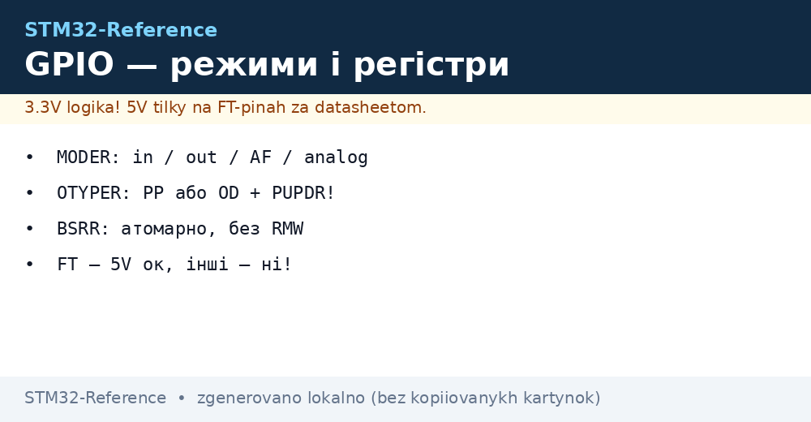
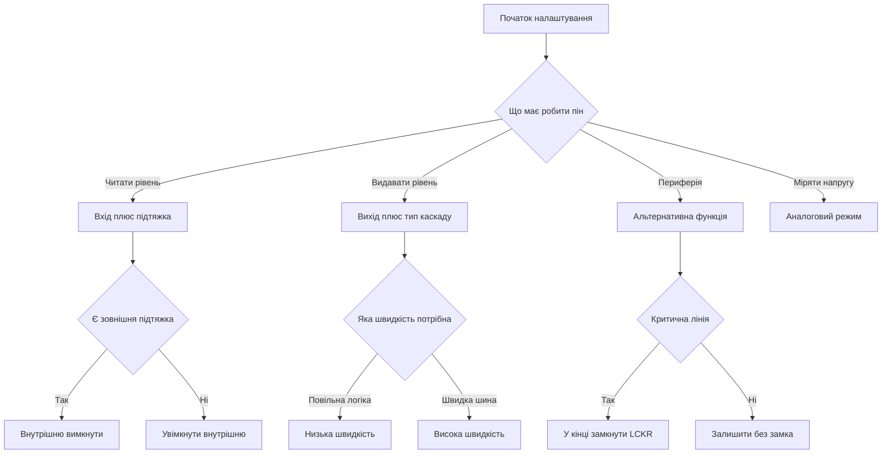

# GPIO STM32 - режими, регістри і струми

EN version: `03-GPIO/01-GPIO-Modes.en.md`


*Рис. Структура піна GPIO: режими MODER, вихідний каскад, підтяжки і захист входу.*

> [!tip] Призначення ноти
> Дати повну карту піна GPIO: які регістри за що відповідають, як перемикати без гонок, скільки струму можна брати і чому висячий вхід ловить завади.

## 1. Призначення

Порт GPIO це програмно керовані виводи мікроконтролера. Кожен пін вміє працювати входом, виходом, лінією альтернативної функції або аналоговим входом. Налаштування зберігається у регістрах порту: режим, тип виходу, швидкість фронтів, підтяжки, вхідні і вихідні дані. Розуміння цих регістрів знімає більшість питань про те, чому світлодіод не світиться, кнопка брязкає, а сусідній пін впливає на вимірювання.

Практика починається з трьох кроків: увімкнути тактування порту, налаштувати режим через MODER і PUPDR, а потім писати через BSRR замість прямого запису в ODR. Далі вже йдуть деталі про струми, швидкість і захист.

## 2. Регістр MODER - чотири режими піна

Кожен пін має два біти в регістрі MODER. Значення обирає базовий режим роботи.

| MODER | Режим | Що робить пін | Коли брати |
| --- | --- | --- | --- |
| 00 | Вхід | Читання рівня через IDR, вихідний каскад вимкено | Кнопки, датчики, логічні сигнали |
| 01 | Вихід | Керування рівнем через ODR або BSRR | Світлодіоди, реле через ключ, сигнали керування |
| 10 | Альтернативна функція | Пін керується периферією через мультиплексор AF | UART, SPI, I2C, таймери, USB |
| 11 | Аналог | Цифровий буфер вимкено, пін з'єднано з АЦП або компаратором | Вимірювання напруги, канали АЦП |

Після скидання більшість пінів знаходяться у режимі входу з вимкеними підтяжками. Виняток становлять службові лінії налагодження і кварцу, які мають фіксоване призначення після старту.

```text
Логіка вибору режиму:
  Треба читати рівень ............ MODER 00 вхід + PUPDR підтяжка
  Треба видавати рівень ........... MODER 01 вихід + OTYPER тип
  Треба периферія ................. MODER 10 AF + регістри AFRL і AFHR
  Треба виміряти напругу .......... MODER 11 аналог + відключити підтяжки
  Пін висить у повітрі ............ неприпустимо, задати вхід з підтяжкою або вихід
```

## 3. Регістр OTYPER - двотактний і відкритий стік

OTYPER має по одному біту на пін і працює тільки у режимах виходу і альтернативної функції.

| OTYPER | Тип | Схема | Застосування |
| --- | --- | --- | --- |
| 0 | Двотактний | Два ключі по черзі зєднують пін з живленням або землею | Звичайний вихід, керування логікою, світлодіоди |
| 1 | Відкритий стік | Тільки нижній ключ тягне до землі, верхнього немає | Шина I2C, спільні лінії переривань, рівень через зовнішню підтяжку |

Двотактний вихід сам видає високий і низький рівень. Відкритий стік вміє тільки притягувати до землі, а високий рівень створює зовнішній резистор підтяжки. Тому для I2C завжди обирають відкритий стік з підтяжками до живлення.

## 4. Швидкість фронтів OSPEEDR і підтяжки PUPDR

OSPEEDR задає крутизну фронтів виходу. PUPDR задає вбудовані резистори підтяжки для входу, виходу і альтернативної функції.

| OSPEEDR | Швидкість | Наслідок | Рекомендація |
| --- | --- | --- | --- |
| 00 | Низька | Повільні фронти, мінімум завад і дзвону | Світлодіоди, кнопки, повільні сигнали |
| 01 | Середня | Компроміс швидкості і завад | UART до сотень кбіт, SPI на малій швидкості |
| 10 | Висока | Круті фронти, більше випромінювання | Швидкий SPI, сигнали тактування |
| 11 | Дуже висока | Максимум швидкості, вимагає коротких доріжок | Тільки швидкі шини, увага до цілісності сигналу |

| PUPDR | Підтяжка | Значення резистора | Коли брати |
| --- | --- | --- | --- |
| 00 | Немає | Вхід висить | Тільки якщо є зовнішня підтяжка або драйвер |
| 01 | До живлення | Близько 30-50 кОм | Кнопка до землі, вхід у простої у високому рівні |
| 10 | До землі | Близько 30-50 кОм | Кнопка до живлення, вхід у простої у низькому рівні |
| 11 | Зарезервовано | Не використовувати | Уникати цього значення |

Правило швидкості просте: не ставити максимум за замовчуванням. Круті фронти дають дзвін на довгих доріжках, просочування у сусідні канали АЦП і зайве споживання. Починати з низької або середньої, а підвищувати тільки коли не вистачає швидкості фронту.

## 5. Вхід IDR і вихід ODR

IDR це регістр читання: кожен біт показує поточний рівень на піні незалежно від режиму. ODR це регістр збереженого стану виходу: запис одиниці просить високий рівень, запис нуля просить низький рівень у режимі виходу.

Небезпека ховається у способі запису в ODR. Класична послідовність читання, модифікації і запису складається з трьох кроків і може бути перервана обробником переривання між читанням і записом. Тоді зміна з переривання губиться. Саме тому для зміни окремих бітів використовують регістр BSRR.

```text
Проблема читання-модифікації-запису:
  Головний цикл читає ODR ......... 0b00001111
  Переривання ставить біт 7 ....... ODR стає 0b10001111
  Головний цикл пише старе + біт 0 . ODR стає 0b00011111, біт 7 втрачено
  Висновок: для бітів використовувати BSRR, а не ODR
```

## 6. Атомарний доступ через BSRR і BRR

BSRR має дві половини: молодші шістнадцять біт встановлюють виходи в одиницю, старші шістнадцять біт скидають виходи в нуль. Запис виконується за одну шинну операцію, тому не боїться переривань. Старі родини мають окремий регістр BRR тільки для скидання.

| Операція | Через ODR | Через BSRR | Висновок |
| --- | --- | --- | --- |
| Встановити біт | Прочитати, встановити біт, записати | Записати маску у молодшу половину | BSRR безпечний |
| Скинути біт | Прочитати, скинути біт, записати | Записати маску у старшу половину | BSRR безпечний |
| Перемкнути біт | Прочитати, інвертувати, записати | Прочитати ODR і вибрати половину BSRR | У перериванні тільки BSRR |
| Робота з ISR | Можлива втрата бітів | Гонок немає | Завжди BSRR у спільних портах |

Прямий запис у BSRR виглядає як один рядок і компілюється у одну інструкцію збереження. Саме так пишуть драйвери дисплеїв, програмні шини і швидкі імпульси.

## 7. Замок конфігурації LCKR

LCKR дозволяє заблокувати налаштування пінів до наступного скидання. Послідовність запису складається з трьох кроків з ключем, після чого біт блокування фіксується. Це захист від випадкового перезапису критичних ліній, наприклад керування живленням або блокування двигуна.

Блокування не знімається програмно. Після активації змінити режим, тип виходу і підтяжки неможливо до апаратного скидання. Тому LCKR вмикають в самому кінці налагодження, коли конфігурація вже перевірена.

## 8. Толерантність до 5 В і допустимі струми

Піни діляться на звичайні і толерантні до 5 В. Позначка FT у таблиці виводів означає, що на вхід можна подавати до 5 В навіть коли живлення контролера 3.3 В. Звичайні піни з позначкою TTa перевищувати живлення не можуть. Аналогові піни і лінії кварцу толерантними не бувають.

| Параметр | Типове значення | Коментар |
| --- | --- | --- |
| Струм одного піна у виході | ±8 мА в межах VOL/VOH, абс. максимум 25 мА | Дивитись таблицю Absolute maximum ratings конкретного DS |
| Сумарний струм усіх виводів | Близько 80-120 мА залежно від корпусу | Перевищення садить живлення |
| Струм через лінію живлення | До 150 мА на пару VDD і VSS | Товсті корпуси витримують більше |
| Напруга FT входу | До 5.5 В | Тільки у цифровому режимі |
| Напруга звичайного входу | Не вище VDD плюс 0.3 В | Перевищення відкриває захисні діоди |
| Вхідний струм витоку | Близько 1 мкА | Для точних дільників враховувати |

Світлодіод без резистора, реле безпосередньо і живлення мотора від піна це типові способи пошкодити кристал. Пін це логічний сигнал, а не джерело живлення. Навантаження комутують через транзистор або драйвер.

```text
Схема піна спрощено:
        VDD
         |
      [P-ключ] --- OTYPER 0 замкнуто у двотактному режимі
         |
  PAD ---+--- вхідний буфер --- IDR
         |         |
      [N-ключ]  захист і підтяжки PUPDR
         |
        VSS
  Відкритий стік: верхнього ключа нема, тільки N-ключ і зовнішня підтяжка
```

## 9. Вхід без підтяжки це антена

Залишений у повітрі вхід з PUPDR 00 має великий опір і ловить наведення від рук, мережі і сусідніх доріжок. Рівень бовтається, переривання по фронту спрацьовують самі, споживання росте через наскрізні струми вхідного буфера. Тому кожен невикористаний пін треба явно перевести у вихід або у вхід з підтяжкою.

Для кнопки без зовнішніх деталей обирають вбудовану підтяжку: кнопка до землі плюс підтяжка до живлення, або кнопка до живлення плюс підтяжка до землі. Зовнішні резистори 10 кОм дають менший опір і кращу завадостійкість, ніж вбудовані 40 кОм, тому для довгих шлейфів краще зовнішні.

## 10. Аналоговий режим для АЦП

Режим 11 вимкає цифровий вхідний буфер і тригер Шмітта, щоб вони не шуміли і не споживали зайвого. Підтяжки в аналоговому режимі вимикають. Швидкість фронтів у цьому режимі значення не має.

Перед вимірюванням перевіряють, що пін не толерантний тільки у цифровому сенсі: в аналоговому режимі напруга не може перевищувати живлення. Захисні діоди відкриваються і спотворюють вимірювання сусідніх каналів. Дільник розраховують так, щоб максимум сигналу був нижче опорної напруги.

## 11. Приклади коду C

```c
// HAL: базові операції з піном PC13
HAL_GPIO_WritePin(GPIOC, GPIO_PIN_13, GPIO_PIN_SET);
HAL_GPIO_WritePin(GPIOC, GPIO_PIN_13, GPIO_PIN_RESET);
HAL_GPIO_TogglePin(GPIOC, GPIO_PIN_13);
GPIO_PinState s = HAL_GPIO_ReadPin(GPIOA, GPIO_PIN_0);

// LL: ті самі дії швидше і компактніше
LL_GPIO_SetOutputPin(GPIOC, LL_GPIO_PIN_13);
LL_GPIO_ResetOutputPin(GPIOC, LL_GPIO_PIN_13);
LL_GPIO_TogglePin(GPIOC, LL_GPIO_PIN_13);
uint32_t v = LL_GPIO_IsInputPinSet(GPIOA, LL_GPIO_PIN_0);

// Прямий доступ через BSRR: атомарно і за один такт шини
GPIOC->BSRR = GPIO_BSRR_BS13;
GPIOC->BSRR = GPIO_BSRR_BR13;
GPIOA->BSRR = GPIO_BSRR_BS5;

// Налаштування: тактування, режим, підтяжка, швидкість
__HAL_RCC_GPIOA_CLK_ENABLE();
GPIO_InitTypeDef g = {0};
g.Pin = GPIO_PIN_5;
g.Mode = GPIO_MODE_OUTPUT_PP;
g.Pull = GPIO_NOPULL;
g.Speed = GPIO_SPEED_FREQ_LOW;
HAL_GPIO_Init(GPIOA, &g);
```

У головному циклі і в перериваннях, які чіпають один порт, запис роблять тільки через BSRR. Читання стану кнопки роблять через IDR або через HAL функцію читання. Затримки у вигляді порожніх циклів заміняють апаратними таймерами.

## 12. Mermaid: вибір налаштування піна



## 13. Швидкість проти завад

Підвищення OSPEEDR зменшує час фронту, але збільшує струм перезаряду ємності доріжки і випромінювання. На довгих шлейфах зявляється дзвін, який подвійно тактує приймач. У чутливих вимірюваннях перемикання сусідніх виходів просочується в АЦП.

Практичний порядок дій: ставити низьку швидкість для світлодіодів і реле, середню для UART і повільного SPI, високу тільки для швидких шин з короткими узгодженими доріжками. Землю вести суцільним полігоном, а швидкі сигнали не класти поруч з аналоговими входами.

## Типові помилки

| # | Помилка | Чому погано | Як правильно |
| --- | --- | --- | --- |
| 1 | Запис у ODR з головного циклу і з переривання | Читання-модифікація-запис губить біти, гонка з ISR | Писати тільки через BSRR окремими масками |
| 2 | Вхід кнопки без підтяжки | Висячий вхід ловить завади, хибні спрацьовування | PUPDR вгору або вниз, краще зовнішні 10 кОм |
| 3 | Подача 5 В на звичайний пін без позначки FT | Відкриваються захисні діоди, перегрів кристала | Перевірити колонку FT, для звичайних дільник або транслятор |
| 4 | OSPEEDR максимум для всіх виходів | Дзвін, випромінювання, збої АЦП | Низька за замовчуванням, підвищувати точково |
| 5 | Світлодіод або реле безпосередньо від піна без ключа | Перевищення струму, просадка живлення, деградація | Резистор для світлодіода, транзистор для реле |
| 6 | Аналоговий вхід з увімкненою підтяжкою | Зсув вимірювання, зайвий струм дільника | У режимі 11 підтяжки вимкнути |
| 7 | LCKR увімкнено до кінця налагодження | Конфігурацію не змінити до скидання | Замикати тільки перевірену конфігурацію |

## Офіційні джерела

- [GPIO/BSRR у RM0316 для STM32F3 (ST)](https://www.st.com/resource/en/reference_manual/rm0316-stm32f303xbcde-stm32f303x68-stm32f328x8-stm32f358xc-stm32f398xe-advanced-armbased-mcus-stmicroelectronics.pdf) - режими, BSRR і швидкість.
- [STM32F103 Reference Manual RM0008 (ST)](https://www.st.com/resource/en/reference_manual/rm0008-stm32f101xx-stm32f102xx-stm32f103xx-stm32f105xx-and-stm32f107xx-advanced-armbased-32bit-mcus-stmicroelectronics.pdf) - розділи GPIO, AFIO і LCKR.
- [STM32F401 Reference Manual RM0368 (ST)](https://www.st.com/resource/en/reference_manual/rm0368-stm32f401xbc-and-stm32f401xde-advanced-armbased-32bit-mcus-stmicroelectronics.pdf) - регістри MODER, OTYPER, OSPEEDR, PUPDR, BSRR.
- [Cortex-M3 Technical Reference Manual (ARM)](https://developer.arm.com/documentation/100165/latest/) - модель переривань і атомарність доступу.

## Див. також

- [Home](../../../STM32-Reference/Home.md)
- [мапінг альтернативних функцій](../../../STM32-Reference/03-GPIO/02-AF-maping.md)
- [переривання EXTI](../../../STM32-Reference/03-GPIO/03-EXTI-NVIC.md)
- [класика F0/F1](../../../STM32-Reference/01-Hardware/01-F0-F1-Classic.md)
- [шари HAL і LL](../../../STM32-Reference/09-Proshivka/02-HAL-LL.md)
- [налаштування CubeMX](../../../STM32-Reference/09-Proshivka/01-CubeIDE-CubeMX.md)
- [Вибір середовища](../../../STM32-Reference/00-Start/05-Vibir-seredovischa.md)
