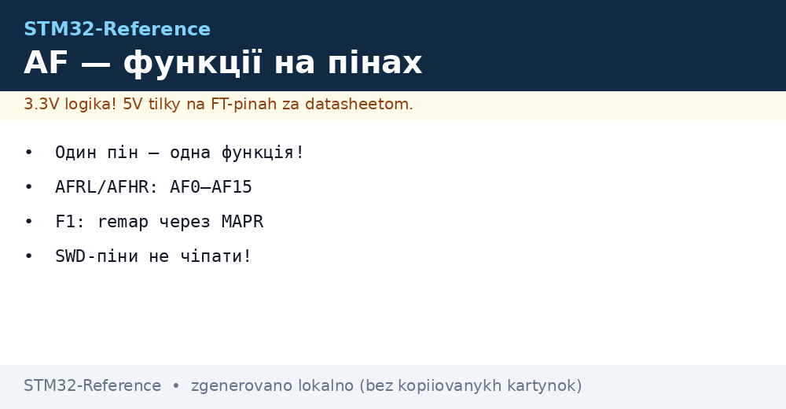
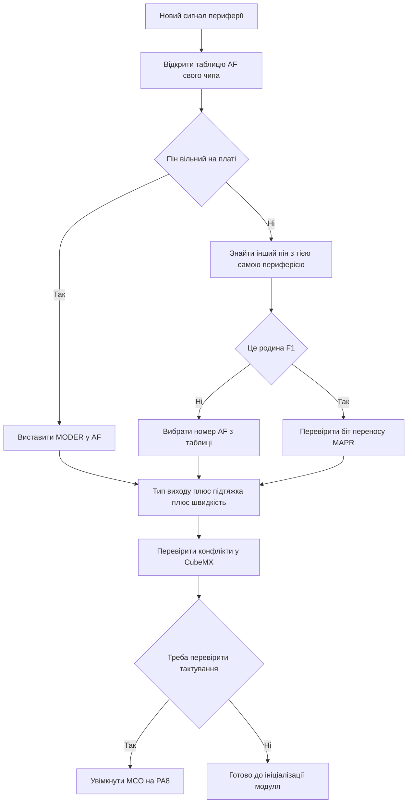

# Альтернативні функції GPIO - AF-мапінг

EN version: `03-GPIO/02-AF-Mapping.en.md`


*Рис. Мультиплексор альтернативних функцій: один пін, шістнадцять варіантів AF0-AF15.*

> [!tip] Призначення ноти
> Навчити читати таблиці AF з даташита, правильно вибирати AFRL і AFHR, розуміти різницю F1 і сучасних родин і не займати службові піни.

## 1. Призначення

Альтернативна функція підключає пін до внутрішньої периферії замість програмного виходу. Мультиплексор вибирає один з шістнадцяти варіантів AF0-AF15, а конкретна відповідність залежить від чипа і корпусу. Без правильного AF периферія мовчить навіть при ідеальному коді ініціалізації, тому перевірка мапінгу це перший крок налагодження UART, SPI, I2C і таймерів.

Нота показує, де шукати таблиці AF, чим F1 відрізняється від F0, F4, G0 і H7, як уникати конфліктів у CubeMX і як звільняти піни JTAG коли не вистачає виводів.

## 2. Де живе вибір AF: AFRL і AFHR

У сучасних родинах кожен пін має чотири біти вибору функції. Молодша половина пінів 0-7 керується регістром AFRL, старша половина пінів 8-15 керується регістром AFHR. Режим піна при цьому має бути 10, тобто альтернативна функція.

| Регістр | Піни | Бітів на пін | Значення |
| --- | --- | --- | --- |
| AFRL | 0-7 | 4 | AF0-AF15 для молодшої половини |
| AFHR | 8-15 | 4 | AF0-AF15 для старшої половини |
| MODER | Той же пін | 2 | Має бути 10 для роботи AF |
| OTYPER | Той же пін | 1 | Двотактний для SPI і UART TX, відкритий стік для I2C |
| PUPDR | Той же пін | 2 | Підтяжка за вимогою шини |
| OSPEEDR | Той же пін | 2 | Середня для UART, висока для швидкого SPI |

```text
Приклад розкладу для порту A:
  PA0 .. PA7  <-- AFRL: по 4 біти на кожен пін
  PA8 .. PA15 <-- AFHR: по 4 біти на кожен пін
  MODER PA2 = 10, AFRL PA2 = 0111 означає USART2 TX на F4
  Без MODER 10 мультиплексор не підключить периферію до піна
```

## 3. Таблиці AF у даташиті

Головна таблиця знаходиться у даташиті конкретного чипа у розділі pin definitions. Стовпці AF0-AF15 показують, яка периферія виходить на пін. Один пін може мати UART в AF7, таймер в AF1 і SPI в AF5, але одночасно працює тільки один варіант.

| Крок | Де дивитись | Що шукати |
| --- | --- | --- |
| 1 | Даташит, таблиця Alternate function mapping | Рядок свого піна, наприклад PA2 |
| 2 | Стовпець AF1-AF15 | Назву потрібної периферії |
| 3 | Reference Manual, розділ GPIO | Номер AF для запису в AFRL або AFHR |
| 4 | CubeMX, вкладка Pinout | Підсвічування конфліктів жовтим і червоним |
| 5 | Плата, схема розведення | Чи не зайнято пін кнопкою або світлодіодом |

Правило одне: даташит важливіший за чужі приклади з інтернету. Той же PA2 на F030, F401 і G070 має різні номери AF для USART2. Копіювання коду між родинами без перевірки таблиці дає тишу в ефірі.

## 4. Приклад: USART2 на PA2 у родині F4

На STM32F4 передавач USART2 виведено на PA2 з функцією AF7. Приймач USART2 знаходиться на PA3 також з AF7. Налаштування складається з тактування GPIOA і USART2, переводу PA2 і PA3 у режим AF, запису 7 у відповідні поля AFRL і вибору двотактного виходу для TX.

| Сигнал | Пін | AF на F4 | Тип виходу | Підтяжка |
| --- | --- | --- | --- | --- |
| USART2 TX | PA2 | AF7 | Двотактний | Без підтяжки |
| USART2 RX | PA3 | AF7 | Вхід через AF | Підтяжка вгору |
| USART1 TX | PA9 | AF7 | Двотактний | Без підтяжки |
| USART1 RX | PA10 | AF7 | Вхід через AF | Підтяжка вгору |
| I2C1 SCL | PB6 | AF4 | Відкритий стік | Зовнішня вгору |
| I2C1 SDA | PB7 | AF4 | Відкритий стік | Зовнішня вгору |
| SPI1 SCK | PA5 | AF5 | Двотактний | Без підтяжки |

Той же USART2 на інших родинах може мати інший номер AF. На F0 це AF1, на G0 це також інший варіант залежно від корпусу. Тому номер AF завжди беруть з таблиці свого чипа, а не з памяті.

## 5. Особливість F1: регістр MAPR замість AFR

Родина F1 не має AFRL і AFHR. Замість гнучкого мультиплексора там жорсткі варіанти переносу через регістр MAPR у блоці AFIO. Кожна периферія має один або два фіксовані набори пінів, наприклад USART1 без переносу або з переносом, SPI1 без переносу або з переносом, JTAG повний або скорочений.

| Периферія на F1 | Без переносу | З переносом | Регістр |
| --- | --- | --- | --- |
| USART1 | TX PA9 RX PA10 | TX PB6 RX PB7 | MAPR біт USART1_REMAP |
| SPI1 | PA5 PA6 PA7 | PB3 PB4 PB5 | MAPR біт SPI1_REMAP |
| I2C1 | PB6 PB7 | Те саме, переносу немає | Фіксовано |
| TIM2 | PA0-PA3 | PA15 PB3 PB10 PB11 частково | MAPR біти TIM2_REMAP |
| JTAG і SWD | PA13 PA14 PA15 PB3 PB4 | Тільки SWD або все вимкнено | MAPR біти SWJ_CFG |

Наслідок простий: на F1 не можна довільно рухати периферію по пінах. Якщо потрібний пін зайнято, дивляться чи є біт переносу в MAPR. Якщо переносу немає, міняють розведення плати або вибирають іншу периферію.

```text
Різниця поколінь:
  F1 ......... AFIO MAPR, жорсткі пари без переносу або з переносом
  F0 F4 G0 ... GPIO AFRL і AFHR, гнучкі AF0–AF15 на кожному піні
  H7 ......... та сама гнучка схема, але більше AF-варіантів і швидкісні обмеження
  Правило .... код F1 з MAPR не переноситься на F4 без заміни на AFRL і AFHR
```

## 6. Один пін - одна функція

Мультиплексор підключає тільки одну периферію до піна. Спроба повісити на PA2 одночасно USART2 TX і TIM2 канал дасть конфлікт: працюватиме остання записана функція, а перша мовчатиме. CubeMX підсвічує такі конфлікти і не дає згенерувати код без вирішення.

| Ситуація | Симптом | Вихід |
| --- | --- | --- |
| Два модулі на один пін | Один мовчить, другий працює нестабільно | Розвести по різних пінах |
| AF правильний, MODER вхід | Тиша на лінії | Перевести MODER у 10 |
| AF правильний, тактування немає | Пін не реагує | Увімкнути тактування GPIO і модуля |
| I2C без підтяжок | Старту немає, лінія висить | Зовнішні резистори 4.7 кОм до живлення |
| SPI SCK на низькій швидкості | Зриви на мегагерцах | OSPEEDR висока для SCK і MOSI |

Конфлікти часто виникають через службові піни: USB, кварц і налагодження вже зайняті платою. Перед вибором AF дивляться схему плати, щоб не призначити UART на пін кварцу.

## 7. Службові піни: SWD, JTAG і кварц

PA13 це SWDIO, PA14 це SWCLK. PA15, PB3 і PB4 це лінії JTAG. OSC_IN і OSC_OUT це кварц або зовнішнє тактування. Без потреби ці піни не займають під кнопки і світлодіоди, бо втрачається налагодження або стабільність тактування.

| Пін | Служба | Чи можна зайняти |
| --- | --- | --- |
| PA13 | SWD дані | Ні, залишити для програматора |
| PA14 | SWD тактування | Ні, залишити для програматора |
| PA15 PB3 PB4 | JTAG | Можна після переходу на SWD і звільнення через MAPR або AFIO |
| OSC_IN OSC_OUT | Кварц | Ні, якщо потрібен точний HSE |
| NRST | Скидання | Ні, тільки кнопка скидання через конденсатор |
| BOOT0 | Вибір завантаження | Ні, тільки перемичка або резистор |

Звільнення JTAG на F1 роблять бітом SWJ_CFG: режим тільки SWD звільняє PA15, PB3 і PB4 під GPIO, а повне вимкнення віддає ще й PA13 і PA14, але тоді потрібен скидання через NRST для перепрошивки. На сучасних родинах JTAG піни це звичайні GPIO після скидання, крім PA13 і PA14, які лишаються під SWD.

## 8. Вихід MCO - тактування назовні

MCO виводить внутрішнє тактування на пін для перевірки або для живлення зовнішньої логіки. Джерелом може бути HSI, HSE, PLL або системне тактування з дільником. На F1 це PA8, на багатьох сучасних чипах також PA8 з вибором AF0.

Налаштування MCO корисне для перевірки: чи запустився кварц, чи вийшла PLL на частоту, чи немає просадки. Частотомір або осцилограф на MCO показує реальне тактування замість здогадів. У бойовій прошивці MCO зазвичай вимикають для економії і тиші.

## 9. Приклади коду C

```c
// HAL + CubeMX: USART2 TX PA2 RX PA3, решта робить генератор
// У CubeMX обрати PA2 і PA3 як USART2_TX і USART2_RX,
// швидкість OSPEEDR середня, RX з підтяжкою вгору.

// LL: той самий USART2 на F4 вручну, AF7
__HAL_RCC_GPIOA_CLK_ENABLE();
LL_GPIO_SetPinMode(GPIOA, LL_GPIO_PIN_2, LL_GPIO_MODE_ALTERNATE);
LL_GPIO_SetPinMode(GPIOA, LL_GPIO_PIN_3, LL_GPIO_MODE_ALTERNATE);
LL_GPIO_SetAFPin_0_7(GPIOA, LL_GPIO_PIN_2, LL_GPIO_AF_7);
LL_GPIO_SetAFPin_0_7(GPIOA, LL_GPIO_PIN_3, LL_GPIO_AF_7);
LL_GPIO_SetPinOutputType(GPIOA, LL_GPIO_PIN_2, LL_GPIO_OUTPUT_PUSHPULL);
LL_GPIO_SetPinPull(GPIOA, LL_GPIO_PIN_3, LL_GPIO_PULL_UP);

// LL: старші піни 8-15 через другу функцію
LL_GPIO_SetPinMode(GPIOB, LL_GPIO_PIN_13, LL_GPIO_MODE_ALTERNATE);
LL_GPIO_SetAFPin_8_15(GPIOB, LL_GPIO_PIN_13, LL_GPIO_AF_5);

// F1: перенос USART1 через MAPR замість AFR
__HAL_RCC_AFIO_CLK_ENABLE();
__HAL_RCC_GPIOB_CLK_ENABLE();
HAL_AFIO_REMAP_USART1_ENABLE();

// MCO на PA8: вивести системне тактування для перевірки
HAL_MCOConfig(RCC_MCO1, RCC_MCOSOURCE_PLLCLK, RCC_MCODIV_4);
```

У коді для F1 шукають макроси з REMAP, а для F0, F4, G0 шукають функції з AF у назві. Змішування підходів дає помилку компіляції, що навіть добре, бо підказує перевірити родину.

## 10. Mermaid: призначення AF без конфліктів



## 11. Перевірка після налаштування

Після запису AF перевіряють три речі: режим, номер функції і тактування. Логічний аналізатор на TX покаже чи є стартові біти. Осцилограф на SCK покаже чи є такти SPI. Мультиметр на лініях I2C у простої має показати високий рівень через підтяжки.

Якщо тиша, йдуть за списком: чи увімкнено тактування GPIO і модуля, чи MODER дорівнює 10, чи правильний номер AF, чи немає конфлікту з іншим модулем, чи не зайнято пін кварцом або налагодженням. У дев’яноста випадках проблема саме тут, а не в бібліотеці.

## Типові помилки

| # | Помилка | Чому погано | Як правильно |
| --- | --- | --- | --- |
| 1 | Номер AF з чужого прикладу без даташита | На іншій родині той же пін має інший AF, тиша в ефірі | Відкрити таблицю AF свого партномера |
| 2 | AF виставлено, а MODER лишився входом | Мультиплексор не підключено, периферія мовчить | MODER у 10 для всіх ліній AF |
| 3 | Два модулі на один пін | Конфлікт, працює тільки один | Розвести по різних пінах, CubeMX підкаже |
| 4 | I2C у двотактному режимі без підтяжок | Шина не відпускає рівень, старту немає | Відкритий стік плюс зовнішні 4.7 кОм |
| 5 | Зайнято PA13 і PA14 під кнопки | Втрата SWD, потрібен стирання через NRST | Залишити SWD для програматора |
| 6 | Код F1 з MAPR перенесено на F4 як є | Регістрів MAPR немає, помилки і тиша | На F4 використовувати AFRL і AFHR |
| 7 | Кварцові піни віддано під GPIO при HSE | Тактування падає, UART пливе | Не займати OSC при зовнішньому кварці |

## Офіційні джерела

- [STM32F401 Datasheet: Alternate function mapping table (ST)](https://www.st.com/en/microcontrollers-microprocessors/stm32f401re.html) - таблиці AF для кожного піна.
- [STM32F103 Reference Manual RM0008, AFIO MAPR (ST)](https://www.st.com/resource/en/reference_manual/rm0008-stm32f101xx-stm32f102xx-stm32f103xx-stm32f105xx-and-stm32f107xx-advanced-armbased-32bit-mcus-stmicroelectronics.pdf) - переноси F1 і звільнення JTAG.
- [STM32G070 Reference Manual, GPIO and AF (ST)](https://www.st.com/en/microcontrollers-microprocessors/stm32g070rb.html) - сучасні AFRL і AFHR.
- [Cortex-M4 Devices Generic User Guide (ARM)](https://developer.arm.com/documentation/dui0553/latest/) - архітектура і робота з периферією.

## Див. також

- [Home](../../../STM32-Reference/Home.md)
- [режими GPIO](../../../STM32-Reference/03-GPIO/01-GPIO-rezhimi.md)
- [переривання EXTI](../../../STM32-Reference/03-GPIO/03-EXTI-NVIC.md)
- [класика F0/F1](../../../STM32-Reference/01-Hardware/01-F0-F1-Classic.md)
- [налаштування CubeMX](../../../STM32-Reference/09-Proshivka/01-CubeIDE-CubeMX.md)
- [шари HAL і LL](../../../STM32-Reference/09-Proshivka/02-HAL-LL.md)
- [Порівняння чипів](../../../STM32-Reference/00-Start/03-Porivnyannya-chipiv.md)
