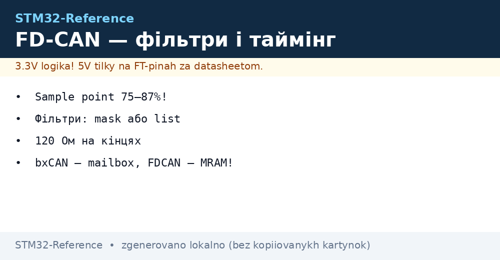
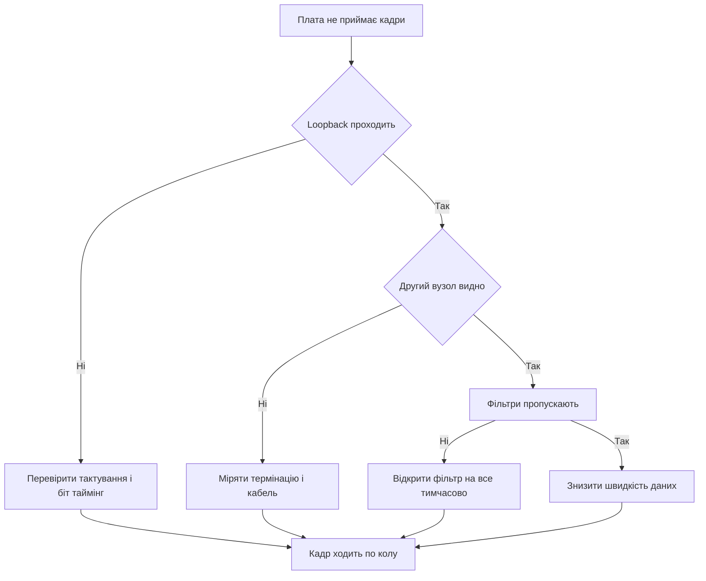

# FDCAN STM32 - біт-таймінг, фільтри і трансивер


*Рис. Вузол FDCAN: контролер, трансивер, вита пара і термінація на кінцях лінії.*

> [!tip] Призначення ноти
> Дати робочу карту шини CAN на STM32: коли вистачає classic CAN, коли потрібен CAN FD, як порахувати біт-таймінг, як налаштувати фільтри і як не спалити трансивер.

## 1. Призначення

Шина CAN зєднує десятки вузлів двома дротами і живе в шумі, вібрації та стрибках живлення. Один вузол передає, решта слухає, арбітраж без руйнування вирішує, хто говорить першим. Повідомлення короткі, з контрольною сумою, кожен приймач підтверджує прийом.

Classic CAN несе до восьми байтів даних на швидкості до одного мегабіта. CAN FD зберігає той же арбітраж, але поле даних прискорює до восьми мегабіт і розширює до шістдесяти чотирьох байтів. FDCAN на STM32 вміє обидва режими, тому один код працює зі старими і новими мережами.

Нота закриває повний цикл: вибір швидкості, розрахунок таймінгів, фільтри ідентифікаторів, трансивер і термінація, запуск через HAL, перевірка в режимі loopback.

## 2. Classic CAN проти CAN FD

| Параметр | Classic CAN | CAN FD |
| --- | --- | --- |
| Максимум даних у кадрі | Вісім байтів | Шістдесят чотири байти |
| Швидкість арбітражу | До одного мегабіта | До одного мегабіта, зазвичай повільна |
| Швидкість поля даних | Та сама, що арбітраж | До восьми мегабіт, окрема настройка |
| Довжина ідентифікатора | Стандартний одинадцять біт або розширений двадцять девять біт | Так само, плюс прапорець розширеної швидкості |
| Контролер STM32 | bxCAN у F1, F4, F072 | FDCAN у G0, G4, H5, H7, U5 |
| Сумісність | Розуміє тільки classic кадри | Приймає classic, передає обидва формати |
| Коли брати | Датчики, кнопки, прості виконавчі вузли | Прошивка по шині, телеметрія, довгі пакети |

```text
Логіка вибору формату:
  Мережа зі старих вузлів ......... тільки classic CAN
  Потрібні пакети понад 8 байт .... CAN FD з classic арбітражем
  Прошивка вузлів через шину ...... CAN FD, великий кадр економить час
  Довга лінія понад 500 метрів .... classic CAN на низькій швидкості
```

Головна ідея CAN FD проста: арбітраж повільний і надійний, дані швидкі. Вузол виграє шину на низькій швидкості, потім перемикається на високу для поля даних, а контрольну суму і підтвердження знову рахує уважно. Старі вузли бачать початок кадру, але швидке поле даних їм незрозуміле, тому змішану мережу тримають у classic режимі.

## 3. Біт-таймінг і точка семплування

Бітовий інтервал складається з квантів часу. Один квант дорівнює періоду тактування контролера, поділеному на переддільник. Сегменти йдуть один за одним: синхронізація, поширення сигналу по лінії, фаза один, фаза два. Контролер зчитує рівень лінії в точці семплування між фазою один і фазою два.

| Сегмент | Призначення | Типове значення |
| --- | --- | --- |
| Синхронізація | Один квант, фронт біта | Завжди один квант |
| Поширення | Компенсує затримку лінії і трансивера | Два вісім квантів, росте з довжиною лінії |
| Фаза один | До точки семплування | Підганяють під цільову точку |
| Фаза два | Після точки семплування | Підганяють під цільову точку |
| Точка семплування | Момент читання біта | Норма від сімдесяти пяти до вісімдесяти семи відсотків |
| Пересинхронізація | Стрибок ширини при розсинхронізації | Один два кванти запасу |

```text
Структура одного біта на лінії:

  | SYNC |   PROP   |  PHASE1  |  PHASE2  |
  |  1   | 1..8 tq  | 1..8 tq  | 1..8 tq  |
  ^старт                ^ читання тут
                   sample point 75-87 відсотків

  Приклад 500 кбіт на 80 МГц:
    prescaler 4, 1 tq дорівнює 50 нс
    40 tq на біт дають рівно 500 кбіт
    SYNC 1 + PROP 8 + PHASE1 19 + PHASE2 12
    точка семплування близько 80 відсотків
```

Правило довжини просте: довша лінія вимагає повільнішого арбітражу і більшого сегмента поширення. Один мегабіт живе приблизно до сорока метрів, пятьсот кілобіт до ста метрів, сто двадцять пять кілобіт тягне кілька сотень метрів. Поле даних CAN FD на довгій лінії теж краще сповільнити, інакше відбиття зїдять швидкі біти.

## 4. Фільтри прийому

Без фільтрів кожен кадр будить процесор. З фільтрами апаратура сама розкладає потрібні ідентифікатори по буферах, а сміття відкидає мовчки. FDCAN має окремі списки для стандартних і розширених ідентифікаторів.

| Режим фільтра | Як працює | Коли брати |
| --- | --- | --- |
| Маска і діапазон | Пропускає групу ідентифікаторів за шаблоном | Серія датчиків з сусідніми адресами |
| Список точних | Пропускає тільки перелічені ідентифікатори | Шлюз, якому потрібні пять конкретних вузлів |
| Відхилення решти | Все, що не збіглося, ігнорується | Типовий вузол, тиша в перериваннях |
| Прийом у FIFO нуль | Перший канал прийому | Основні дані керування |
| Прийом у FIFO один | Другий канал прийому | Діагностика окремо від керування |
| Стандартний ID | Одинадцять біт, короткий арбітраж | Нові компактні мережі |
| Розширений ID | Двадцять девять біт, довгий арбітраж | Сумісність з вантажною технікою |

```text
Приклад мислення фільтром:
  Хочу тільки ID 0x100 .. 0x10F:
    маска пропускає старші біти, молодші ігнорує
  Хочу ID 0x100, 0x200, 0x7DF точно:
    список з трьох записів, решта відхиляється
  Хочу все для налагодження:
    відкрити один фільтр на весь діапазон тимчасово
```

Маску рахують від потрібної групи: спільні біти фіксують одиницею в масці, різні біти нулем дозволяють будь-яке значення. Список точних записів простіший для читання, але кожен запис займає місце в памяті повідомлень, тому десятки адрес краще накрити однією маскою.

## 5. bxCAN проти FDCAN

| Параметр | bxCAN | FDCAN |
| --- | --- | --- |
| Покоління | Класичний модуль у F1 і F4 | Сучасний модуль у G0, G4, H5, H7, U5 |
| Формат | Тільки classic CAN | Classic CAN плюс CAN FD |
| Сховище повідомлень | Три поштові скриньки передачі | Область MRAM з чергами і списками |
| Прийом | Два буфери FIFO по три кадри | Два буфери FIFO, глибина налаштовується |
| Фільтри | Банки попарно, спільні на два модулі | Окремі списки, гнучке призначення буферів |
| Швидкість даних | Одна на весь кадр | Окрема для арбітражу і для даних |
| Налагодження | Простий, прикладів найбільше | Багатший, але вимагає уважного читання довідника |
| Вибір | Стара плата або готова бібліотека під bxCAN | Новий проєкт, потрібен запас швидкості |

Головна практична різниця в памяті: поштова скринька bxCAN тримає одне повідомлення і чекає звільнення, а черга FDCAN приймає кілька повідомлень підряд. Тому bxCAN губить кадри при щільному потоці, а FDCAN з правильною глибиною черги ковтає пачки без участі процесора.

## 6. Трансивер і термінація лінії

Контролер говорить логічними рівнями, а лінія говорить різницею напруг. Трансивер перетворює одне в інше і тримає удари електростатики. Без трансивера два контролери безпосередньо не зєднують, згорить перший же стрибок.

| Елемент | Вибір | Пояснення |
| --- | --- | --- |
| Трансивер classic | TJA1051 або подібний на п’ять вольт | Дешевий, перевірений, вистачає для classic CAN |
| Трансивер FD | TJA1441 або подібний з запасом швидкості | Тримає круті фронти швидкого поля даних |
| Живлення трансивера | П’ять вольт окремо, земля спільна | Логіка три вольти через узгодження рівнів |
| Термінація | Сто двадцять Ом на кожному кінці лінії | Два резистори паралельно дають шістдесят Ом між дротами |
| Топологія | Одна довга лінія, короткі відводи | Зірка з довгими променями дає відбиття |
| Вита пара | CANH плюс CANL разом | Зменшує випромінювання і наведення |
| Захист | TVS-діоди на лінію за потреби | Обов'язково в автомобілі і на вулиці |

```text
Правильна лінія з двох вузлів:

   ВУЗОЛ А                          ВУЗОЛ Б
  +--------+                      +--------+
  | STM32  |                      | STM32  |
  | FDCAN  |                      | FDCAN  |
  | TX RX  |                      | TX RX  |
  +---+----+                      +---+----+
      | TX RX                         | TX RX
  +---+----+                      +---+----+
  | TJA14xx|                      | TJA14xx|
  | H L    |                      |    H L |
  +---+----+                      +---+----+
      | CANH =========================== CANH |
      | CANL =========================== CANL |
     120 Ом на початку             120 Ом у кінці

  Помилка новачка: резистори на кожному вузлі посередині.
  Правильно: тільки два резистори, тільки на кінцях.
```

Вимір справності простий: вимкнути живлення всієї мережі і поміряти опір між дротами CANH і CANL. Два правильні термінатори покажуть близько шістдесяти Ом. Сто двадцять Ом означає один резистор загублено, сорок Ом або менше означає зайві резистори на проміжних вузлах.

## 7. Типові швидкості арбітражу

| Арбітраж | Дані FD | Довжина | Застосування |
| --- | --- | --- | --- |
| Пятьсот кбіт | Два мегабіти | До ста метрів | Легковий транспорт, стенди |
| Двісті пятьдесят кбіт | Один мегабіт | До двохсот метрів | Промислові контролери |
| Сто двадцять пять кбіт | Пятьсот кбіт | До пятисот метрів | Довгі лінії цеху |
| Один мегабіт | Чотири мегабіти | До сорока метрів | Короткий швидкий стенд |
| Двадцять кбіт | Не прискорювати | До кілометра | Повільна телеметрія |

Швидкість даних CAN FD завжди вибирають після перевірки лінії: осцилограф має показати чисті прямокутники на високій швидкості. Дзвін на фронтах означає погану термінацію або зіркову топологію, тоді швидкість даних знижують або перекладають кабель.

## 8. Практика HAL FDCAN

```c
FDCAN_HandleTypeDef hfdcan1;
FDCAN_TxHeaderTypeDef txHeader;
uint8_t txData[8] = {1, 2, 3, 4, 5, 6, 7, 8};

void can_start(void)
{
  HAL_FDCAN_Start(&hfdcan1);
  HAL_FDCAN_ActivateNotification(&hfdcan1, FDCAN_IT_RX_FIFO0_NEW_MESSAGE, 0);
}

void can_send_basic(void)
{
  txHeader.Identifier = 0x100;
  txHeader.IdType = FDCAN_STANDARD_ID;
  txHeader.TxFrameType = FDCAN_DATA_FRAME;
  txHeader.DataLength = FDCAN_DLC_BYTES_8;
  txHeader.ErrorStateIndicator = FDCAN_ESI_ACTIVE;
  txHeader.BitRateSwitch = FDCAN_BRS_OFF;
  txHeader.FDFormat = FDCAN_CLASSIC_CAN;
  txHeader.TxEventFifoControl = FDCAN_NO_TX_EVENTS;
  txHeader.MessageMarker = 0;
  HAL_FDCAN_AddMessageToTxFifoQ(&hfdcan1, &txHeader, txData);
}

void HAL_FDCAN_RxFifo0Callback(FDCAN_HandleTypeDef *hfdcan, uint32_t RxFifo0ITs)
{
  FDCAN_RxHeaderTypeDef rxHeader;
  uint8_t rxData[64];
  if ((RxFifo0ITs & FDCAN_IT_RX_FIFO0_NEW_MESSAGE) != 0)
  {
    HAL_FDCAN_GetRxMessage(hfdcan, FDCAN_RX_FIFO0, &rxHeader, rxData);
  }
}
```

| Крок CubeMX | Що натиснути |
| --- | --- |
| Увімкнути FDCAN1 | Connectivity, режим FDCAN без FD спочатку |
| Задати тактування | Перевірити частоту входу, підібрати переддільник під цільову швидкість |
| Налаштувати фільтр | Один стандартний фільтр маскою на потрібну групу |
| Увімкнути переривання | RX FIFO нуль, нове повідомлення |
| Згенерувати код | Перевірити стартову функцію і колбек |

## 9. Loopback-тест без трансивера

```c
void can_loopback_check(void)
{
  hfdcan1.Init.FrameFormat = FDCAN_FRAME_CLASSIC;
  hfdcan1.Init.Mode = FDCAN_MODE_EXTERNAL_LOOPBACK;
  HAL_FDCAN_Init(&hfdcan1);
  HAL_FDCAN_Start(&hfdcan1);
  can_send_basic();
}
```

| Крок | Дія |
| --- | --- |
| Один | Перевести модуль у зовнішній loopback, трансивер не потрібен |
| Два | Надіслати кадр сам собі і дочекатися колбеку прийому |
| Три | Якщо колбек прийшов, таймінги і код правильні |
| Чотири | Перевести у звичайний режим і підключити трансивер |
| Пять | Якщо з трансивером тиша, підозрювати кабель і термінацію |

Внутрішній loopback перевіряє тільки цифру всередині чипа. Зовнішній loopback ганяє сигнал через виводи, тому ловить помилки розпіновки. Повна лінія з двома вузлами перевіряється обміном лічильником: один нарощує число, другий відлунює, пропуски видно одразу.

## 10. Mermaid: шлях налагодження



## 11. Живлення і компонування вузла

Трансивер живлять від пяти вольт з окремим керамічним конденсатором біля корпуса. Землю контролера і трансивера зєднують короткою доріжкою без розрізів. Лінії CANH і CANL ведуть парою однакової довжини, подалі від імпульсних перетворювачів. Екран кабелю заземлюють в одній точці, щоб не створити контур.

## Типові помилки

| # | Помилка | Чому погано | Як правильно |
| --- | --- | --- | --- |
| 1 | Термінатори на кожному вузлі | Зайві резистори садять рівні, кадри бються | Тільки два резистори по сто двадцять Ом на кінцях |
| 2 | Точка семплування навмання | Біти читаються на схилі, помилки ростуть | Тримати точку в межах сімдесяти пяти вісімдесяти семи відсотків |
| 3 | Фільтр закрив потрібні ID | Вузол мовчить, код наче правильний | Спочатку відкрити прийом усього, потім звужувати |
| 4 | Зірка замість лінії | Відбиття псують швидке поле даних | Одна магістраль, відводи коротші за тридцять сантиметрів |
| 5 | CAN FD у старій мережі | Старі вузли сиплють помилками | Змішану мережу тримати в classic режимі |
| 6 | Пряме з'єднання без трансивера | Різні рівні і кидки знищать виводи | Завжди трансивер між контролером і лінією |
| 7 | Спільний кристал без перерахунку | Після зміни тактування пливе швидкість | Після кожної зміни дерева тактування рахувати таймінг заново |

## Офіційні джерела

- [FDCAN description STM32G4 (ST)](https://www.st.com/en/microcontrollers-microprocessors/stm32g4-series.html) - контролер, режими, приклади.
- [AN5348 FDCAN configuration (ST)](https://www.st.com/resource/en/application_note/an5348-fdcan-configuration-stmicroelectronics.pdf) - біт-таймінг і фільтри.
- [TJA1441 transceiver datasheet (ST partner)](https://www.st.com/en/interfaces-and-transceivers/can-transceivers.html) - вимоги до трансивера і лінії.

## Див. також

- [Home](../../../STM32-Reference/Home.md)
- [сучасні G0 і G4](../../../STM32-Reference/01-Hardware/03-G0-G4.md)
- [налаштування CubeMX](../../../STM32-Reference/09-Proshivka/01-CubeIDE-CubeMX.md)
- [шари HAL і LL](../../../STM32-Reference/09-Proshivka/02-HAL-LL.md)
- [режими GPIO](../../../STM32-Reference/03-GPIO/01-GPIO-rezhimi.md)
- [порт USB](../../../STM32-Reference/04-Shini/05-USB.md)
- [карти і зовнішня флеш](../../../STM32-Reference/04-Shini/06-SDMMC-QUADSPI.md)
