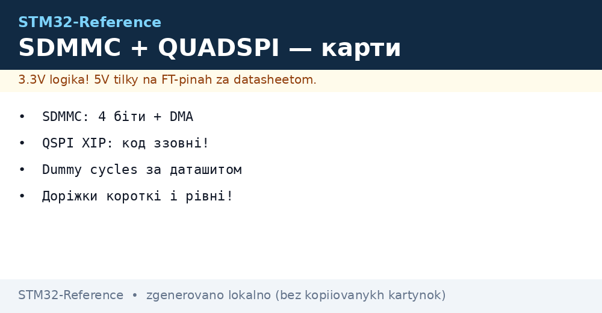
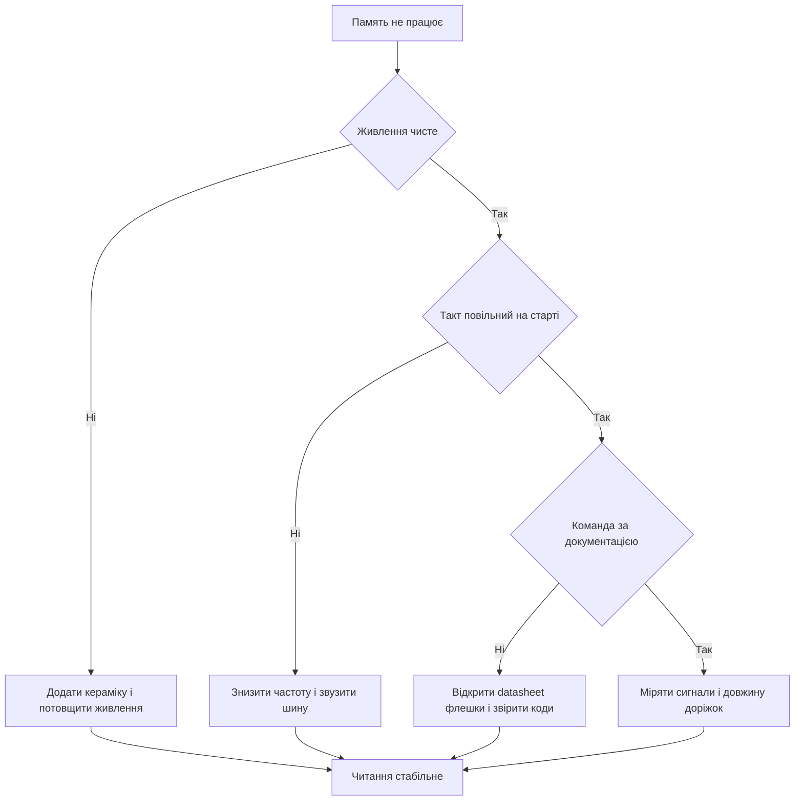

# SDMMC і QUADSPI - карти пам'яті і XIP


*Рис. Карта памяті через SDMMC і зовнішня флеш через QUADSPI: шини, живлення і виконання коду на місці.*

> [!tip] Призначення ноти
> Розвести дві зовнішні памяті по місцях: карта через SDMMC для файлів і логів, флеш через QUADSPI для коду і ресурсів з виконанням на місці.

## 1. Призначення

Внутрішньої флеші вистачає для коду, але не для логів, карт, шрифтів і звуку. Карта памяті дає гігабайти під файлову систему, яку читає і компютер. Зовнішня флеш дає десятки мегабайтів під код і ресурси, причому процесор виконує код прямо з неї без копіювання в оперативну пам'ять.

SDMMC говорить з картою паралельною шиною в один або чотири біти на високому такті. QUADSPI говорить з флешкою послідовно в один, два або чотири біти, а в режимі памяті відображає її у вікно адрес процесора. Обидва блоки вміють працювати з прямим доступом до памяті, щоб процесор не тягав байти руками.

Нота покриває обидва тракти: шина і тактування карти, файлова система через CubeMX, режими флешки, виконання коду на місці, завантажувач для програматора і цілісність сигналів.

## 2. SDMMC: шина і тактування

| Параметр | Значення | Пояснення |
| --- | --- | --- |
| Ширина шини | Один або чотири біти даних | Чотири біти дають учетверо вищу швидкість |
| Лінії | Такт, команда, дані нуль три | Плюс живлення і земля карти |
| Тактування | До пятидесяти мегагерц у швидкому режимі | Починають з повільного для ініціалізації |
| Детект карти | Окремий вхід присутності | Плата розуміє, що карту вставлено |
| Захист запису | Вхід дозволу запису | Забороняє стирання перемикачем на гнізді |
| Живлення | Три вольти, струм з запасом | Провал живлення бє файлову систему |
| Підтяжки | На команду і дані | Без них лінія висить у повітрі |

```text
Підключення карти до SDMMC:

  STM32                        microSD ГНІЗДО
  SDMMC_CK  -----------------> CLK
  SDMMC_CMD -----------------> CMD
  SDMMC_D0  -----------------> DAT0
  SDMMC_D1  -----------------> DAT1
  SDMMC_D2  -----------------> DAT2
  SDMMC_D3  -----------------> DAT3
  3V3       --> живлення карти
  GND       --> земля карти
  PC8 детект <-- CD (card detect)
  PC9 захист <-- WP (write protect)

  Починати завжди з шини 1 біт і низького такту.
  Ширину 4 біти вмикати після успішної ініціалізації.
```

Ініціалізація вимагає повільного такту близько чотирьохсот кілогерц. Після відповіді карти контролер піднімає частоту і розширює шину. Стрибок одразу на максимум без етапів закінчується мовчанням карти, особливо з дешевими екземплярами.

## 3. FATFS через CubeMX

| Крок | Дія |
| --- | --- |
| Один | Увімкнути SDMMC і middleware FATFS |
| Два | Вибрати детект карти і захист запису за схемою |
| Три | Увімкнути DMA для читання і запису |
| Чотири | Згенерувати код і змонтувати том при старті |
| Пять | Писати і читати файли звичайними викликами |

```c
FATFS fs;
FIL logFile;
UINT written;

void sd_start(void)
{
  f_mount(&fs, "", 1);
  f_open(&logFile, "log.txt", FA_OPEN_APPEND | FA_WRITE);
  f_write(&logFile, "start\r\n", 7, &written);
  f_sync(&logFile);
}

void sd_log_line(const char *line)
{
  UINT n = 0;
  while (line[n] != 0) { n++; }
  f_write(&logFile, line, n, &written);
  f_sync(&logFile);
}
```

| Правило файлів | Пояснення |
| --- | --- |
| Синхронізація після запису | Без неї вимкнення губить останні дані |
| Один відкритий файл на запис | Менше шансів пошкодити таблицю |
| Імена короткі латинкою | Довгі імена з пробілами ламають сумісність |
| Карту виймати через кнопку | Програмне розмонтування перед витяганням |
| Перевірка вільного місця | Перед довгим логом глянути залишок |

Файлову систему форматує компютер у FAT32 з розумним розміром кластера. Екзотичні формати контролер не розуміє. Карту під логи беруть з запасом циклів, дешева карта вмирає за місяці щосекундного запису.

## 4. Читання і запис з DMA

| Режим | Плюс | Мінус |
| --- | --- | --- |
| Опитування | Просто для налагодження | Процесор висить у циклі |
| Переривання | Не блокує, проста логіка | Кожен блок смикає процесор |
| DMA | Процесор вільний під час обміну | Треба стежити за буфером і кешем |

```c
uint8_t sdBuf[512];

void sd_read_block_dma(void)
{
  HAL_SD_ReadBlocks_DMA(&hsd1, sdBuf, 0, 1);
}

void HAL_SD_RxCpltCallback(SD_HandleTypeDef *hsd)
{
  (void)hsd;
  /* блок у памяті, можна розбирати */
}
```

Буфер DMA тримають вирівняним і не чіпають до колбеку завершення. На ядрах з кешем область буфера чистять і скидають за правилами кешу, інакше процесор бачить старі дані. Довгі операції розбивають на блоки по пятьсот дванадцять байтів, прогрес показують світлодіодом.

## 5. QUADSPI і OCTOSPI: режими флешки

| Режим | Ліній на такт | Швидкість | Коли брати |
| --- | --- | --- | --- |
| Звичайний послідовний | Один біт | Базова | Налагодження, сумісність з будь-якою флешкою |
| Подвійний | Два біти | Подвоєна | Компроміс швидкості і простоти |
| Четверний | Чотири біти | Учетверо вища | Картинки, звук, швидке завантаження |
| Вісімний OCTOSPI | Вісім біт | Максимум | Старші чипи H5 і H7, великі ресурси |
| Подвійна швидкість | Подвоєння на фронті і спаді | Ще вище | Тільки з флешкою, що вміє такий режим |

Типова флешка W25Q128 тримає шістдесят чотири мегабіти у корпусі під ручний монтаж і говорить у всіх режимах до четверного. Команди читання, запису і стирання беруть з її документації побайтово, самодіяльність з кодами команд закінчується мовчанням мікросхеми.

## 6. Пам'ять на місці: виконання коду ззовні

У режимі відображення контролер сам шле команду читання, адресу і паузи, а флешка віддає байти як звичайна пам'ять. Процесор ставить точку входу у вікно зовнішньої памяті і виконує код без копіювання. Різниця з внутрішньою флешкою лише в затримці, яку ховає кеш.

| Крок | Дія |
| --- | --- |
| Один | Ініціалізувати QUADSPI у непрямому режимі і перевірити ID флешки |
| Два | Налаштувати команду швидкого читання за документацією флешки |
| Три | Перевести контролер у режим відображення |
| Чотири | Перевірити читання вікна адресної памяті |
| Пять | Перенести таблицю векторів або ресурси назовні |

```c
void qspi_memory_mapped(void)
{
  QSPI_CommandTypeDef cmd;
  QSPI_MemoryMappedTypeDef mmap;
  cmd.Instruction = 0xEB;
  cmd.AddressSize = QSPI_ADDRESS_24_BITS;
  cmd.AlternateByteMode = QSPI_ALTERNATE_BYTES_NONE;
  cmd.DummyCycles = 6;
  cmd.InstructionMode = QSPI_INSTRUCTION_1_LINE;
  cmd.AddressMode = QSPI_ADDRESS_4_LINES;
  cmd.DataMode = QSPI_DATA_4_LINES;
  mmap.TimeOutActivation = QSPI_TIMEOUT_COUNTER_DISABLE;
  HAL_QSPI_MemoryMapped(&hqspi, &cmd, &mmap);
}
```

Число пауз читання беруть з таблиці флешки для конкретної частоти. Менше пауз дає сміття на високому такті, більше пауз просто сповільнює читання. Частоту контролера і паузи змінюють тільки парою за документацією.

## 7. Приклад W25Q128

| Операція | Код команди | Пояснення |
| --- | --- | --- |
| Читати ID | 0x9F | Перевірка звязку, перший тест плати |
| Швидке читання | 0xEB у четверному режимі | Основне читання даних і коду |
| Дозвіл запису | 0x06 перед кожним записом | Без нього запис ігнорується |
| Запис сторінки | 0x32 у четверному режимі | До двохсот пятьдесяти шести байтів за раз |
| Стирання сектора | 0x20 на чотири кілобайти | Перед записом сектор стирають |
| Стан | 0x05 читати прапорець зайнятості | Чекати готовності після запису |

```c
uint8_t qspi_read_id(void)
{
  QSPI_CommandTypeDef cmd;
  uint8_t id[3] = {0};
  cmd.Instruction = 0x9F;
  cmd.DataMode = QSPI_DATA_1_LINE;
  cmd.NbData = 3;
  HAL_QSPI_Command(&hqspi, &cmd, 100);
  HAL_QSPI_Receive(&hqspi, id, 100);
  return id[0];
}
```

```text
Послідовність запису сторінки:

  1. Прочитати стан, дочекатись готовності.
  2. Надіслати дозвіл запису 0x06.
  3. Надіслати команду запису, адресу і дані.
  4. Чекати прапорець готовності командою 0x05.
  5. Перечитати і порівняти, що записалось.
```

Стирання займає десятки мілісекунд, запис сторінки сотні мікросекунд. Блокувальне очікування в циклі допустиме на старті, у робочому режимі статус опитують фоново. Переривання запису вимкненням живлення залишає сектор у напівстертому стані, тому важливі дані дублюють у двох секторах.

## 8. Зовнішній завантажувач для CubeProgrammer

| Крок | Дія |
| --- | --- |
| Один | Зібрати проєкт завантажувача під свою плату |
| Два | Вказати тип флешки, розмір і команду читання |
| Три | Покласти файл у теку програматора |
| Чотири | Прошити зовнішню флеш звичайною кнопкою запису |

Без свого завантажувача програматор бачить тільки внутрішню пам'ять і чесно каже, що адреси зовні не існує. Завантажувач вчить програматор говорити з конкретною флешкою на конкретній платі, тому його тримають у репозиторії поруч зі схемою.

## 9. Вибір FMC проти OCTOSPI

| Параметр | FMC | OCTOSPI |
| --- | --- | --- |
| Тип памяті | Паралельна, багато пінів | Послідовна, мало пінів |
| Швидкість | Вища на паралельній шині | Достатня для коду і картинок |
| Плата | Складна, шина шириною у долоню | Проста, шість вісім доріжок |
| Корпус чипа | Потрібен великий з повною шиною | Вистачає середнього корпуса |
| Коли брати | Зовнішня оперативна пам'ять, дисплей | Зовнішня флеш під код і ресурси |

Дисплей з великим кадром і зовнішня оперативна пам'ять просять паралельну шину. Флеш під код і картинки живе на послідовній без втрати комфорту. Поєднання обох дає швидкий кадр з паралельної памяті і картинки з послідовної флешки.

## 10. Цілісність: короткі рівні доріжки

| Правило | Пояснення |
| --- | --- |
| Доріжки короткі | Довгі антени ловлять шум і дзвенять |
| Однакова довжина | Розбіг ліній даних менше допуску |
| Суцільна земля під шиною | Зворотний струм тече прямо під сигналом |
| Живлення з керамікою | Конденсатор біля кожної мікросхеми памяті |
| Без гострих кутів | Плавні повороти менше випромінюють |
| Такт подалі від аналогових входів | Дзвін такту піднімає шум вимірювань |

```text
Трасування QUADSPI зверху:

  MCU --коротко--> FLASH
  CLK окремо від IO0..IO3
  під шиною суцільна земля
  кераміка 100 нФ біля живлення флешки

  SDMMC трасують так само:
  CLK окремо, дані разом,
  детект і захист будь-де.
```

Перевірка цілісності проста: читання великого файлу з карти і контрольна сума прошивки у флешці мають збігатися сто разів зі ста. Випадкові розбіжності означають проблеми живлення або довжини, а не помилки в коді.

## 11. Mermaid: що гальмує



## 12. Живлення карти і флешки

Карта памяті їсть ривками: в простої мікроампери, у записі десятки міліампер. Слабкий стабілізатор просаджує живлення саме в момент запису, тому поруч з гніздом ставлять електроліт і кераміку. Флешка скромніша, але теж любить чисте живлення і коротку землю. Спільний ферит на вході живлення памяті відсікає шум цифрової частини.

## Типові помилки

| # | Помилка | Чому погано | Як правильно |
| --- | --- | --- | --- |
| 1 | Швидкий такт одразу | Карта не встигає відповісти, тиша на шині | Починати з повільного такту, розганяти після ініціалізації |
| 2 | Немає детекту карти | Плата пише у порожнечу і псує стан | Опитувати вхід присутності і монтувати тільки з картою |
| 3 | Паузи читання навмання | Сміття замість коду на високій частоті | Брати паузи з таблиці флешки під свою частоту |
| 4 | Запис без стирання сектора | Старі біти лишаються, дані биті | Стерти сектор, записати сторінки, перечитати |
| 5 | Буфер DMA чіпають рано | Половина блока нова, половина стара | Чекати колбек завершення, тримати буфер вирівняним |
| 6 | Довгі різні доріжки | Дзвін і перехресні завади | Короткі рівні доріжки над суцільною землею |
| 7 | Немає свого завантажувача | Програматор не бачить зовнішню флеш | Зібрати external loader під свою плату і флешку |

## Офіційні джерела

- [SDMMC overview STM32 (ST)](https://www.st.com/en/interfaces-and-transceivers/secure-digital.html) - контролери карт і режими шин.
- [AN5122 QUADSPI on STM32 (ST)](https://www.st.com/resource/en/application_note/an5122-quadspi-memory-interface-on-stm32-microcontrollers-stmicroelectronics.pdf) - режими, відображення, приклади.
- [W25Q128 datasheet reference (ST partner)](https://www.st.com/en/memory.html) - команди флешки і таблиці пауз читання.

## Див. також

- [Home](../../../STM32-Reference/Home.md)
- [сучасні G0 і G4](../../../STM32-Reference/01-Hardware/03-G0-G4.md)
- [налаштування CubeMX](../../../STM32-Reference/09-Proshivka/01-CubeIDE-CubeMX.md)
- [шари HAL і LL](../../../STM32-Reference/09-Proshivka/02-HAL-LL.md)
- [режими GPIO](../../../STM32-Reference/03-GPIO/01-GPIO-rezhimi.md)
- [шина FDCAN](../../../STM32-Reference/04-Shini/04-FDCAN.md)
- [порт USB](../../../STM32-Reference/04-Shini/05-USB.md)
