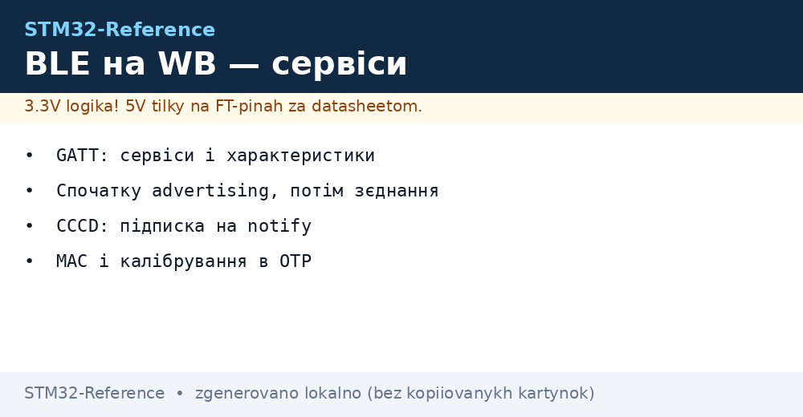
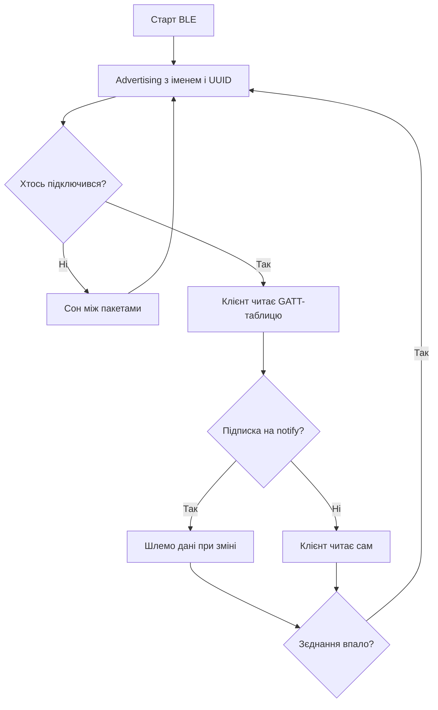

# BLE на STM32WB - сервіси, з'єднання і профілі


*Рис. Шлях пакета: advertising, з'єднання, GATT-обмін.*

> [!tip] Призначення ноти
> Навчити піднімати BLE-периферію на WB55: advertising, свої сервіси, стабільне з'єднання і малий струм.

## 1. Призначення

STM32WB55 тримає повний BLE-стек на радіо-ядрі M0+, а твій код на M4 лише описує дані. Типовий вузол: датчик вимірює, кладе значення в характеристику, телефон або шлюз забирає. Розуміння GATT-моделі знімає магію: все зводиться до таблиці атрибутів.

## Ролі і топологія

| Роль | Поведінка | Приклад |
| --- | --- | --- |
| Peripheral | Рекламує себе, чекає підключення | Датчик, маячок, пульт |
| Central | Сканує і підключається | Телефон, шлюз |
| Broadcaster | Тільки шле, без з'єднань | Маяк температури |
| Observer | Тільки слухає | Логер маяків |

```text
Типова пара:
  датчик-периферія ..реклама.. телефон-центр ..зєднання.. обмін.
  Один центр тримає кілька периферій одночасно.
```

## Advertising: візитівка в ефірі

| Параметр | Значення | Практика |
| --- | --- | --- |
| Інтервал | 20 мс - 10 с | Частіше - швидше знаходять, більше струм |
| Тип | Connectable / non-connectable | Маяку з'єднання не треба |
| Дані | Імя, прапорці, UUID сервісів | 31 байт максимум! |
| Потужність TX | -20..+6 дБм | Мінімум, якого вистачає |

## Mermaid: від реклами до даних



## GATT: таблиця всього

| Рівень | Роль | Приклад |
| --- | --- | --- |
| Profile | Сценарій цілком | Датчик середовища |
| Service | Група даних | Температура і вологість |
| Characteristic | Одне значення | Температура float |
| Descriptor | Налаштування | CCCD: дозвіл notify |

| Операція | Напрям | Коли |
| --- | --- | --- |
| Read | Клієнт читає | Рідкісні дані |
| Write | Клієнт пише | Команди вузлу |
| Notify | Сервер шле сам | Потік вимірів |
| Indicate | Notify з підтвердженням | Важливі події |

## Прошивка радіо-стека

| Крок | Дія |
| --- | --- |
| 1 | CubeProgrammer: оновити FUS до свіжого |
| 2 | Залити BLE-стек під задачу (full або light) |
| 3 | Перевірити версії: FUS і стек сумісні! |
| 4 | Тільки потім шити свою M4-прошивку |

> Невідповідність FUS і стека - мовчання радіо при живому M4. Перша підозра завжди сюди.

## Енергоспоживання з'єднання

| Параметр | Вплив |
| --- | --- |
| Connection interval | Більший - менше струм, більша затримка |
| Slave latency | Пропуск подій - сон довший |
| TX power | Мінімум для дистанції |
| Advertising в сні | Рідше - довше життя батареї |

```text
Орієнтир:
  маяк раз на секунду .. роки від таблетки;
  зєднання 100 мс ..... тижні від таблетки;
  зєднання 15 мс ...... дні, зате відгук миттєвий.
```

## Типові помилки

| # | Помилка | Чому погано | Як правильно |
| --- | --- | --- | --- |
| 1 | Старий FUS + новий стек | Радіо мовчить | Оновити обидва з одного пакета |
| 2 | Advertising 20 мс завжди | Батарея тане | 1 с для маяка вистачає |
| 3 | UUID не в рекламі | Телефон не фільтрує | Сервіси заявити в пакеті |
| 4 | Notify без CCCD | Клієнт не отримує | Перевірити підписку явно |
| 5 | TX на максимумі | Струм і нагрів | Мінімум для дистанції |
| 6 | Вся логіка в колбеках стека | Зависання радіо-ядра | Колбек короткий, робота в main |
| 7 | Немає обробки розриву | Вузол висить без реклами | По розриву - назад в advertising |

## Офіційні джерела

- [STM32WB BLE stack guide (ST)](https://www.st.com/en/microcontrollers-microprocessors/stm32wb-series.html) - стеки, FUS, приклади.
- [Bluetooth Core Specification (Bluetooth SIG)](https://www.bluetooth.com/specifications/specs/) - GATT, ролі, профілі.

## Спарювання і безпека з'єднання

| Рівень | Що дає | Коли треба |
| --- | --- | --- |
| Just Works | Шифрування без підтвердження | Датчики без екрана |
| Passkey | PIN з обох боків | Керування доступом |
| OOB | Ключ поза ефіром | Максимальний захист |
| Bonding | Запамятовує ключ | Щоб не спарювати щоразу |

```text
Практика:
  характеристики з командами — тільки через шифроване зєднання;
  ключі bonding зберігати у Flash, інакше злітають при перепрошивці;
  для маяків без зєднань спарювання взагалі не потрібне.
```

## Пропускна здатність: чесні цифри

| Режим | Реально | Обмеження |
| --- | --- | --- |
| 1M PHY notify | Десятки кБ/с | Інтервал з'єднання і MTU |
| 2M PHY notify | До сотні кБ/с | Обидва боки мають вміти 2M |
| DLE розширення | Більші пакети | Узгодити MTU явно |

> BLE - не для потокового відео. Для файлів і логів вистачає, для аудіо вже ні.

## Див. також

- [Home](../../../STM32-Reference/Home.md)
- [бездротові чипи](../../../STM32-Reference/01-Hardware/06-WB-WL.md)
- [режими сну](../../../STM32-Reference/07-Timeri-Son/03-Sleep-Stop-Standby.md)
- [батарейне живлення](../../../STM32-Reference/02-Zhivlennya/02-Batareyne-zhivlennya.md)
- [мережа далекої дії](../../../STM32-Reference/05-Radio/02-LoRaWAN-WL.md)
