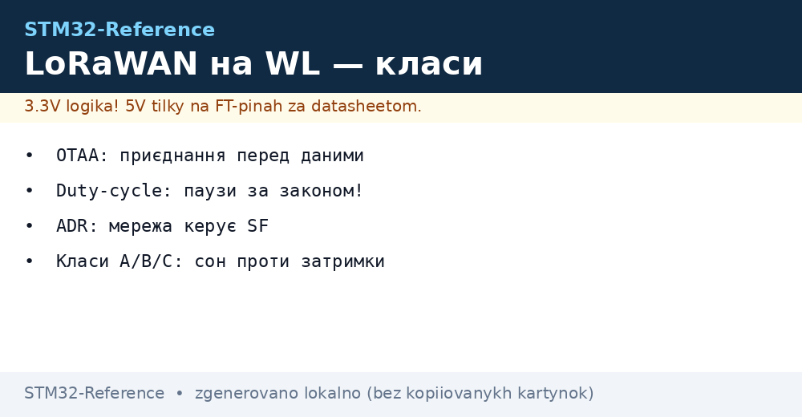
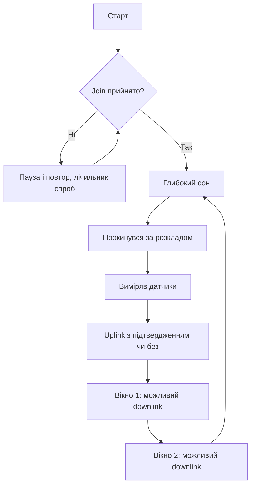

# LoRaWAN на STM32WL - класи, OTAA і duty-cycle


*Рис. Шлях пакета: вузол, шлюз, сервер, твій застосунок.*

> [!tip] Призначення ноти
> Навчити підключати WL-вузол до мережі: приєднання, класи, SF і законні паузи в ефірі.

## 1. Призначення

LoRaWAN - це кілометри дистанції ціною байтів на день. Вузол спить, прокидається, шле короткий пакет через шлюзи на сервер. STM32WL тримає радіо на окремому ядрі, твій M4 лише готує дані. Розуміння класів і duty-cycle відрізняє легальну мережу від глушилки сусідів.

## Архітектура мережі

| Ланка | Роль |
| --- | --- |
| Вузол (твій WL) | Вимірює і шле uplink |
| Шлюз | Слухає ефір, пересилає в інтернет |
| Сервер мережі | Дедуплікація, ADR, безпека |
| Сервер застосунків | Твої дані і команди downlink |

```text
Вузол НЕ зєднується зі шлюзом безпосередньо:
  шле в ефір — чують усі шлюзи поруч;
  сервер прибирає дублікати;
  відповідь приходить через ОДИН шлюз.
```

## OTAA проти ABP

| Параметр | OTAA | ABP |
| --- | --- | --- |
| Приєднання | Join-процедура при старті | Ключі зашиті, стартує одразу |
| Безпека | Сесійні ключі нові щоразу | Ключі одні на роки |
| Зручність | Довше старт, менше клопоту | Швидко, але ключі руками |
| Рекомендація | За замовчуванням | Тільки для тестів |

## Класи пристроїв

| Клас | Вікна прийому | Струм | Коли |
| --- | --- | --- | --- |
| A | Два короткі після uplink | Мінімальний | Датчики, 99 відсотків задач |
| B | Розкладні слоти по маяках | Середній | Керування з затримкою секунди |
| C | Слухає постійно | Максимальний | Тільки від мережі, не батарея! |

## Mermaid: життєвий цикл вузла класу A



## SF, bandwidth і час в ефірі

| SF | Швидкість | Дальність | Час пакета 20 байт |
| --- | --- | --- | --- |
| SF7 | Швидко | Місто квартали | Десятки мс |
| SF9 | Середньо | Місто цілком | Сотні мс |
| SF12 | Повільно | Поле і ліс | Секунди! |

> ADR (адаптивна швидкість) дозволяє серверу знижувати твій SF, коли сигнал добрий. Не вимикай без причини - економить батарею всім.

## Duty-cycle: закон, а не порада

| Діапазон | Ліміт ефіру | Наслідок |
| --- | --- | --- |
| 868 МГц Європа | 1 відсоток | Пакет 1 с - пауза 99 с! |
| Перевищення | Глушиш сусідів | Штрафи і бан на сервері |
| TTN fair use | 30 с ефіру на добу | Більше - тільки своя мережа |

```text
Практика:
  датчик раз на 10 хвилин SF9 — всередині ліміту;
  трекер раз на 10 секунд SF12 — поза законом, ріж SF або рідше;
  підтвердження кожного пакета подвоює ефір — підтверджуй важливе.
```

## Типові помилки

| # | Помилка | Чому погано | Як правильно |
| --- | --- | --- | --- |
| 1 | ABP ключі в репозиторії | Хто завгодно клонує вузол | OTAA або секрети поза git |
| 2 | SF12 і часті пакети | Порушення duty-cycle | ADR увімкнено, інтервал за таблицею |
| 3 | Клас C на батареї | Тижні замість років | Клас A для автономних |
| 4 | Антена на 433 замість 868 | Мінус десятки дБ | Антена під свій діапазон! |
| 5 | Downlink кожен цикл | Сервер ріже, ефір забитий | Downlink тільки для команд |
| 6 | Join в циклі без пауз | Забиває ефір при поганому сигналі | Експоненційна пауза між спробами |
| 7 | Один шлюз у підвалі | Вузли не чутно | Шлюз вище, антена надворі |

## Офіційні джерела

- [LoRaWAN Specification (LoRa Alliance)](https://lora-alliance.org/resource-hub/lorawan-specification-v101/) - класи, OTAA, кадри.
- [STM32WL LoRaWAN stack (ST)](https://www.st.com/en/microcontrollers-microprocessors/stm32wl-series.html) - приклади end-node.

## Корисне навантаження: байти бережемо

| Правило | Пояснення |
| --- | --- |
| Шли сирі числа, не текст | Температура як int16, не рядок! |
| Декодер на сервері | Байти в значення перетворює сервер |
| Порт розрізняє типи | Порт 1 - виміри, порт 2 - службові |

```c
// Приклад пакування: температура і вологість в 4 байти:
int16_t t = (int16_t)(temp_c * 100);
uint16_t h = (uint16_t)(hum_pct * 100);
payload[0] = t >> 8; payload[1] = t & 0xFF;
payload[2] = h >> 8; payload[3] = h & 0xFF;
```

## Бюджет лінії: чи вистачить сигналу

| Параметр | Орієнтир |
| --- | --- |
| Потужність вузла | До +22 дБм, але дивсь EIRP регіону! |
| Чутливість SF12 | Мінус 130+ дБм |
| Втрати в місті | Десятки дБ на кожен будинок |
| Запас на погоду | Мінімум 10 дБ понад мінімум |

```text
Груба перевірка:
  поле прямої видимості .. десятки км;
  місто з вікна ......... кілометри;
  підвал і ліфт ......... не пробувати без зовнішньої антени.
```

## Приватна мережа: свій шлюз і сервер

| Тема | Практика |
| --- | --- |
| Свій шлюз | Single-channel для тестів, повний для роботи |
| Сервер | ChirpStack локально або в хмарі |
| Частоти | Свій план під регіон, без конфліктів |
| Без fair use | Обмеження тільки законом, не сервером |

```text
Мінімум приватної мережі:
  шлюз з антеною надворі;
  сервер з декодером пакетів;
  два тестові вузли для перевірки покриття.
```

## Роумінг і завади: що чекати в місті

| Фактор | Ефект |
| --- | --- |
| Щільні мережі | Колізії, повтори, витрата батареї |
| Метал і підвали | Мертві зони навіть близько |
| Погода | Дощ додає втрати на sub-GHz мало |

## Див. також

- [Home](../../../STM32-Reference/Home.md)
- [радіо ближнього поля](../../../STM32-Reference/05-Radio/01-BLE-WB.md)
- [бездротові чипи](../../../STM32-Reference/01-Hardware/06-WB-WL.md)
- [режими сну](../../../STM32-Reference/07-Timeri-Son/03-Sleep-Stop-Standby.md)
- [радіо по SPI](../../../STM32-Reference/12-Moduli-zvyazku/01-NRF24-LoRa.md)
- [прямий звязок](../../../STM32-Reference/05-Radio/04-LoRa-P2P.md)
