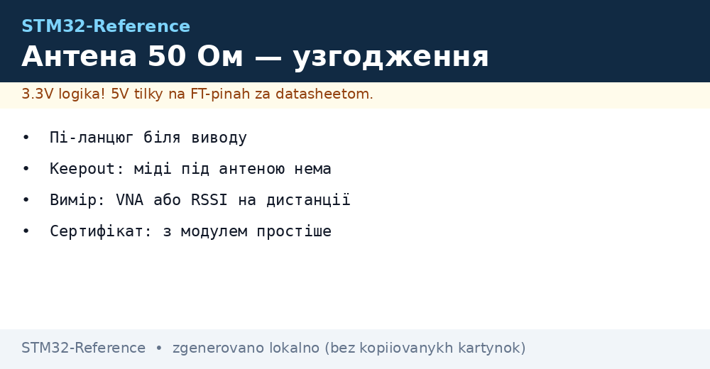
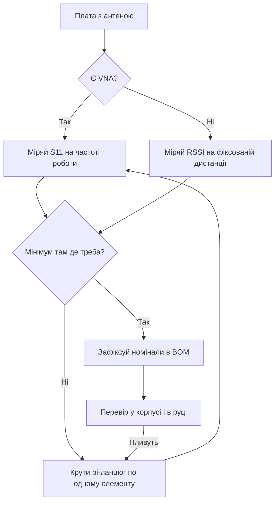

# Антена 50 Ом - узгодження, keepout і сертифікація


*Рис. Від виводу до ефіру: ланцюг, доріжка, антена.*

> [!tip] Призначення ноти
> Навчити доводити радіо до ефіру без втрат: узгодження, розводка, вимір і документи.

## 1. Призначення

Радіочип з поганою антеною - це дорогий генератор тепла. Між виводом і ефіром стоять узгоджувальний ланцюг, доріжка і сама антена. Кожна ланка краде децибели, якщо зроблена навмання. Ця нота дає мінімум, щоб вузол чув і його чули.

## Ланцюжок тракту

| Ланка | Вимога |
| --- | --- |
| Вивід чипа | Pi-ланцюг: два конденсатори і індуктивність |
| Доріжка | 50 Ом, коротка, над суцільною землею |
| Розєм (якщо є) | Якісний, затягнутий, без перехідників-гармошок |
| Антена | На свій діапазон: 2.4 ГГц або sub-GHz, не навпаки! |

```text
Типовий pi-ланцюг:
  вивід -> шунт-конденсатор -> послідовна індуктивність -> шунт-конденсатор -> антена.
  Номінали підбираються під конкретну плату виміром, не з голови!
```

## Види антен

| Тип | Плюси | Мінуси |
| --- | --- | --- |
| PCB-доріжка | Безкоштовна, повторювана | Займає місце, чутлива до корпусу |
| Chip-антена | Маленька, документована | Вимагає keepout і узгодження |
| Штирьова зовнішня | Дальність і простота | Ціна, габарити, вандалізм |
| Друкована на корпусі | Інтеграція | Тільки з виміром і досвідом |

## Keepout: порожнеча навколо

| Правило | Пояснення |
| --- | --- |
| Під chip-антеною - ніякої міді | Ні полігонів, ні доріжок, ні землі! |
| Корпус подалі від металу | Батарейка і екран поруч вбивають діаграму |
| Орієнтація | Антена на край плати, виступ за габарит |
| Рука користувача | Тестувати в руці, не тільки на столі |

## Mermaid: налаштування антени



## Вимір без лабораторії

| Метод | Як робити |
| --- | --- |
| RSSI на дистанції | Два вузли, фіксована відстань, писати рівень до і після зміни |
| Дальність в полі | Пряма видимість, рахувати відсоток доставлених |
| Струм TX | Просадка при максимумі - поганий КСХ гріє каскад |
| Порівняння з еталоном | Та сама прошивка на Nucleo з відомою антеною |

## Сертифікація: що закласти в бюджет

| Питання | Відповідь |
| --- | --- |
| Модуль з екраном | Тести простіші: модуль вже сертифіковано |
| Свій тракт з нуля | Повний цикл випробувань випромінювання |
| Зміна антени | Перевірка заново майже напевно |
| Прошивка міняє потужність | Перетест, бо змінився спектр |
| Документи | RED для Європи, FCC для Штатів - час і гроші |

## Типові помилки

| # | Помилка | Чому погано | Як правильно |
| --- | --- | --- | --- |
| 1 | Антена 433 на 868 | Мінус десятки дБ одразу | Маркування і даташит антени! |
| 2 | Мідь під chip-антеною | Резонанс пливе | Keepout за даташитом антени |
| 3 | Номінали pi з голови | Неузгодження гарантоване | Вимір S11 або хоча б RSSI |
| 4 | Доріжка 50 Ом навмання | Відбиття на кожному вигині | Калькулятор ширини під свій стек! |
| 5 | Металевий корпус | Екран замість антени | Зовнішня антена або вікно |
| 6 | Тест тільки на столі | В руці все інакше | Перевірка в реальному хваті |
| 7 | Сертифікація в кінці | Переробка плати | Закладати з першої ревізії |

## Корпус і антена: сумісність

| Корпус | Наслідок | Вихід |
| --- | --- | --- |
| Пластик | Майже не впливає | Перевірити зсув резонансу |
| Метал | Екранує повністю | Зовнішня антена через розєм |
| Волога і бруд | Пливе узгодження | Герметизація і запас по S11 |

## Офіційні джерела

- [AN5128 Antenna design (ST)](https://www.st.com/resource/en/application_note/an5128.pdf) - PCB-антени і узгодження.
- [ETSI EN 300 220 (ETSI)](https://www.etsi.org/committee/ERM) - вимоги sub-GHz діапазону Європи.

## Доріжка 50 Ом: як порахувати ширину

| Параметр стеку | Де взяти |
| --- | --- |
| Товщина діелектрика | У виробника плати (стандарт 1.6 мм двосторонка) |
| Діелектрична проникність | FR4 приблизно 4.2-4.6 |
| Товщина міді | 35 мкм (1 унція) за замовчуванням |
| Калькулятор | Онлайн microstrip-калькулятор під свій стек! |

```text
Практика:
  порахував ширину — витримав її по всій довжині;
  вигини тільки дугою 45 градусів, ніяких гострих кутів;
  земля під доріжкою суцільна, без щілин і переходів;
  довжина мінімальна: кожен міліметр краде на гігагерцах.
```

## Підбір pi-ланцюга покроково

| Крок | Дія |
| --- | --- |
| 1 | Запаяй середні номінали з референс-дизайну ST |
| 2 | Заміряй S11 або RSSI - запиши базу |
| 3 | Міняй ОДИН елемент за раз (послідовну індуктивність) |
| 4 | Знайди мінімум, потім докрути шунтами |
| 5 | Зафіксуй номінали і партномери в BOM |

> Не міняй два елементи одразу - не зрозумієш, що допомогло.

## Діаграма спрямованості: куди світить

| Тема | Практика |
| --- | --- |
| Штирь вертикально | Бублик навколо - добре для поля |
| PCB-доріжка | Максимум перпендикулярно платі |
| Вузол на стіні | Перевірити зворотний бік - там яма! |
| Два вузли | Орієнтувати однаково при тестах |

```text
Перевірка діаграми без камери:
  фіксувати передавач, ходити приймачем колом;
  писати RSSI кожні 30 градусів;
  яма понад 20 дБ — розвернути антену або додати другу.
```

## Волога і бруд на антені: дрейф резонансу

| Фактор | Ефект |
| --- | --- |
| Дощ на PCB-антені | Резонанс пливе вниз |
| Лід | Ще сильніше, плюс втрати |
| Пил з часом | Повільний дрейф |
| Захист | Лак і кожух з запасом по S11 |

## Див. також

- [Home](../../../STM32-Reference/Home.md)
- [радіо ближнього поля](../../../STM32-Reference/05-Radio/01-BLE-WB.md)
- [мережа далекої дії](../../../STM32-Reference/05-Radio/02-LoRaWAN-WL.md)
- [бездротові чипи](../../../STM32-Reference/01-Hardware/06-WB-WL.md)
- [схемотехніка плати](../../../STM32-Reference/17-Lab/03-Hardware-Design-Guidelines.md)
