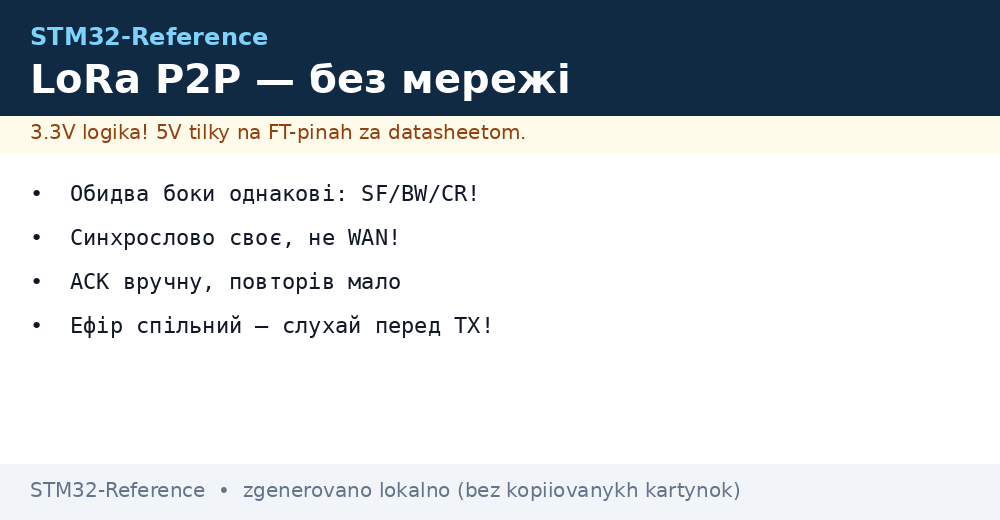
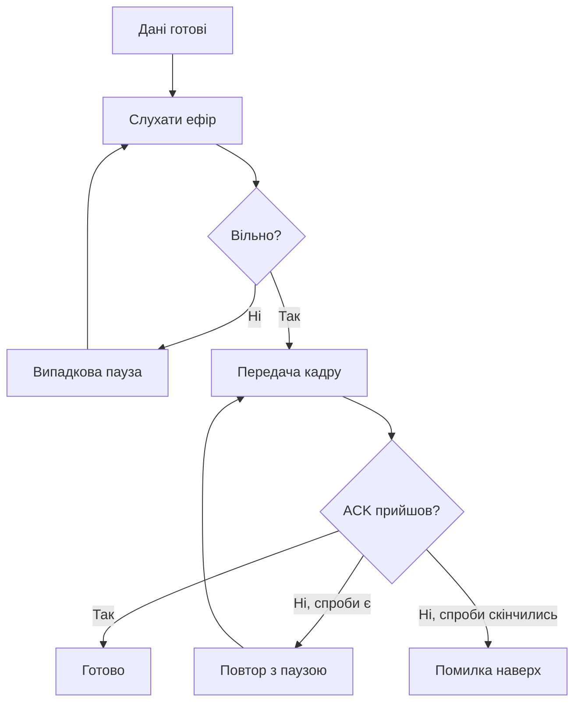

# LoRa P2P - прямий звязок без мережі


*Рис. Два рівні: однакові параметри, свій протокол.*

> [!tip] Призначення ноти
> Навчити зєднувати два вузли безпосередньо: спільні параметри, свій кадр, підтвердження і межі дальності.

## 1. Призначення

P2P - це LoRa без серверів і шлюзів: пульт і виконавчий, два датчики, маяк і приймач. Працює там, де немає покриття мережі: поле, ліс, підвал. Ціна простоти - свій протокол: адресація, повтори і колізії на тобі.

## 2. P2P проти LoRaWAN: коли що

| Критерій | P2P | LoRaWAN |
| --- | --- | --- |
| Інфраструктура | Нуль | Шлюзи і сервер |
| Затримка | Мілісекунди-секунди | Секунди-вікна |
| Двосторонність | Вільна | Downlink обмежений |
| Масштаб | Десятки вузлів | Тисячі |
| Закон | Той же duty-cycle! | Той же |

## 3. Четвірка параметрів: однакові з обох боків

| Параметр | Вибір | Наслідок |
| --- | --- | --- |
| Частота | Однакова, свій канал | Різні - глухота |
| SF | Однаковий | Різні - не чують! |
| Bandwidth | Однаковий | 125 кГц за замовчуванням |
| Coding rate | Однаковий | 4/5 для старту |

| Додатково | Значення |
| --- | --- |
| Синхрослово | Своє, НЕ мережеве! |
| Преамбула | Однакова довжина |
| Потужність | Однакова для симетрії тесту |

## 4. Свій кадр: мінімум полів

| Поле | Навіщо |
| --- | --- |
| Адреса отримувача | Хто читає |
| Адреса відправника | Хто послав |
| Лічильник | Дублікати від повторів |
| Тип | Дані, ACK, команда |
| Дані | Корисне |
| CRC | Цілість (залізо вміє!) |

## Mermaid: передача з підтвердженням



## 5. Код: скелет P2P-вузла

```c
// Налаштування радіо (обидва боки однаково!):
radio_set_freq(868000000);
radio_set_sf(9);
radio_set_bw(125000);
radio_set_cr(5);
radio_set_syncword(PRIVATE_SYNC);  // не WAN!

// Передача з повтором:
for (int i = 0; i < 3; i++) {
  radio_send(frame, len);
  if (wait_ack(2000)) break;
  random_delay();   // рознести повтори!
}
```

## 6. Дальність: чесні цифри

| Умови | SF7 | SF9 | SF12 |
| --- | --- | --- | --- |
| Пряма видимість | Кілометри | Десятки км | Десятки км |
| Місто | Квартали | Кілометри | Кілометри+ |
| Ліс | Сотні метрів | Кілометри | Кілометри |
| Приміщення | Кімнати | Поверх | Будинок |

| Правило | Пояснення |
| --- | --- |
| Антени вище | Кожен метр висоти - дальність |
| Тест в обидва боки | Асиметрія буває! |
| Запас 10 дБ | Погода і перешкоди |

## 7. Ретранслятор одним вузлом

| Тема | Практика |
| --- | --- |
| Прийняв - передав далі | Hop-лічильник проти петель! |
| Два канали | Прийом і передача рознесені |
| Живлення | Релей від мережі, не батарея |
| Затримка | Кожен hop додає секунди |

## Типові помилки

| # | Помилка | Чому погано | Як правильно |
| --- | --- | --- | --- |
| 1 | Різні SF з боків | Глухота повна | Таблиця параметрів єдина! |
| 2 | Мережеве синхрослово | Чужі пакети лізуть | Своє приватне |
| 3 | Без слухання ефіру | Колізії своїми ж | LBT перед кожною TX |
| 4 | Повтори без паузи | Забиває ефір | Випадкова пауза! |
| 5 | Без лічильника | Дублікати як нові дані | Лічильник + вікно |
| 6 | Duty-cycle ігнорується | Поза законом | Паузи за діапазоном |
| 7 | Тест в один бік | Зворотний гірший | Обидва напрями! |

## Офіційні джерела

- [SX126x datasheet (Semtech)](https://www.semtech.com/products/wireless-rf/lora-connect/sx1262) - регістри, параметри, CAD.
- [AN1200 LoRa modulation (Semtech)](https://www.semtech.com/design-support) - SF, чутливість, бюджет.

## CAD і шифрування: два бонуси заліза

| Тема | Практика |
| --- | --- |
| CAD-детектор | Залізо чує преамбулу без прийому пакета! |
| Пробудження по CAD | Спав, почув, прийняв - мікроампери в простої |
| AES-блок | Шифр кадрів без коду на M4 |
| Ключі | Однакові з обох боків, не в git! |

```text
Економний приймач:
  цикл: сон -> CAD на мілісекунди -> тиша, назад спати;
  преамбула є — повний прийом і обробка.
```

## Див. також

- [Home](../../../STM32-Reference/Home.md)
- [мережа далекої дії](../../../STM32-Reference/05-Radio/02-LoRaWAN-WL.md)
- [узгодження антени](../../../STM32-Reference/05-Radio/03-Antena-50ohm.md)
- [бездротові чипи](../../../STM32-Reference/01-Hardware/06-WB-WL.md)
- [радіо по SPI](../../../STM32-Reference/12-Moduli-zvyazku/01-NRF24-LoRa.md)
