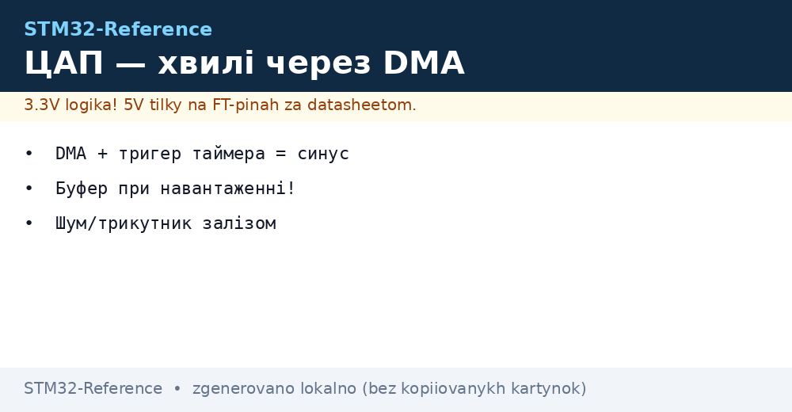

# ЦАП STM32 - хвилі через DMA і буфер


*Рис. Схема ЦАП: регістр коду, буфер виходу, тригер таймера і потік семплів через DMA.*

> [!tip] Призначення ноти
> Показати, як отримати справжню аналогову напругу без зовнішніх мікросхем: коли вмикати вбудований буфер, як гнати синус або пилу через прямий доступ за тригером таймера, як користуватися вбудованими шумом і трикутником і що робити, коли перетворювача немає у корпусі.
> Нота закриває шлях від статичного рівня для зміщення датчика до неперервної генерації звуку і тестових сигналів.

## 1. Призначення

Цифро аналоговий перетворювач перетворює цифровий код у напругу на виводі мікроконтролера. У класичних родинах це два канали по дванадцять біт з окремими регістрами даних і спільним тригером. Один канал може тримати сталий рівень, а другий одночасно генерувати хвилю.

Нота потрібна там, де широтно імпульсна модуляція з фільтром дає сходинки і запізнення: чистий синус для звуку, пила для розгортки, довільна форма для тестування тракту, точне зміщення для датчика. Вона пояснює, чому без буфера напруга просідає під навантаженням, чому без тригера сходинки нерівномірні і як порахувати реальну частоту хвилі.

Окремо розібрано випадок відсутності перетворювача у чипі. Багато малих корпусів його не мають, тоді вибір між фільтрованою модуляцією і зовнішньою мікросхемою по послідовній шині визначається вимогами до чистоти і швидкодії.

## 2. Два канали і дванадцять біт

Кожен канал має свій вивід, свій регістр і своє ввімкнення. Дані можна писати у форматі дванадцять біт з вирівнюванням праворуч або ліворуч, а також у вигляді вісім біт для швидких задач. Два канали можуть працювати незалежно або синхронно від одного тригера.

| Параметр | Значення у типових родинах | Наслідок |
| --- | --- | --- |
| Кількість каналів | Два незалежні | Статика плюс хвиля одночасно |
| Роздільність | Дванадцять біт | Чотири тисячі девʼяносто шість рівнів |
| Крок при опорі три вольта | Менше мілівольта | Плавні сходинки звуку |
| Вихідний діапазон без буфера | Від землі до опори | Повний розмах, але малий струм |
| Вихідний діапазон з буфером | З відступом від країв | Менший розмах, але стабільність |
| Швидкість | Близько одного мільйона вибірок | Звук і швидкі розгортки реально |

```text
Два канали на одній опорі:
  Код A --> [ЦАП канал 1] --Uвих1--> навантаження або підсилювач
  Код B --> [ЦАП канал 2] --Uвих2--> зміщення датчика або другий канал звуку
  Опора спільна, тому точність обох каналів залежить від чистоти опори.
  Буфер кожного каналу вмикається окремо.
```

Одночасний старт двох каналів від одного тригера дає стереопару без розбігу у часі. Для цього обидва канали переводять у синхронний режим і пишуть пару кодів одним зверненням.

## 3. Вихідний буфер: коли вмикати

Вихід без буфера це фактично резистивна матриця з великим вихідним опором. Вона дає повний розмах від землі до опори, але просідає навіть під навантаженням у десятки кілоом. Вихід з буфером тримає навантаження у кілька кілоом і ємність у сотні пікофарад, але втрачає кілька десятків мілівольт біля країв шкали.

| Режим виходу | Перевага | Обмеження |
| --- | --- | --- |
| Без буфера, вивід назовні | Повний розмах до країв | Тільки на високоомне навантаження або повторювач |
| З буфером на вивід | Тримає струм і ємність | Відступ від землі і опори, менший розмах |
| Внутрішньо без виводу | Зміщення для компаратора і підсилювача | Зовні не видно, економить вивід |
| Через зовнішній повторювач | Найкраща стабільність | Додаткова мікросхема на платі |

| Навантаження | Рекомендація |
| --- | --- |
| Вхід операційного підсилювача | Можна без буфера, опір великий |
| Дільник десять кілоом | Вмикати буфер або ставити повторювач |
| Навушники або динамік | Тільки через зовнішній підсилювач потужності |
| Довгий кабель до приладу | Буфер плюс послідовний резистор десятки ом |

Практичне правило: якщо напруга на виводі залежить від підключеного приладу, значить бракує буфера або зовнішнього повторювача. Вимірювати треба вольтметром з великим вхідним опором, інакше сам прилад стане частиною дільника.

## 4. Хвиля через прямий доступ за тригером

Статичний рівень можна оновлювати програмою, але рівна хвиля потребує рівної сітки у часі. Масив семплів у памʼяті, кільцевий прямий доступ і періодичний тригер від таймера дають точну частоту без джиттера ядра.

| Елемент ланцюжка | Роль | Приклад |
| --- | --- | --- |
| Масив семплів | Один період хвилі у кодах | Шістдесят чотири точки синуса |
| Таймер тригер | Рівні імпульси запуску | Кожні десять мікросекунд |
| Прямий доступ | Переклад коду у регістр | Кільцевий режим без участі ядра |
| Тригер перетворювача | Момент оновлення виходу | Подія таймера або програма |

```text
Ланцюжок генерації синуса:
  [масив 64 коди] --DMA--> [регістр ЦАП] --тригер TIM6--> [вихід Uвих] --> фільтр --> навушники
  Частота хвилі дорівнює частоті тригера, поділеній на кількість точок.
  Приклад: тригер сто кілогерц і шістдесят чотири точки дають півтори кілогерца.
```

Частота хвилі рахується просто: частота тригера ділиться на довжину масиву. Зміна частоти без переписування масиву робиться зміною періоду таймера. Зміна амплітуди робиться масштабуванням масиву у памʼяті.

| Хвиля | Масив | Застосування |
| --- | --- | --- |
| Синус | Таблиця синуса на період | Звук, тест тракту, модуляція |
| Пила | Лінійне зростання і скидання | Розгортка, тест лінійності |
| Прямокутник | Два рівні навпіл періоду | Тактування, грубий тест |
| Довільна форма | Запис з виміру або розрахунок | Імітація датчика, калібрування |

## 5. Старт хвилі: налаштування кроками

Спочатку готують масив у памʼяті і перевіряють його статично: записують середній код і міряють половину шкали вольтметром. Потім вмикають таймер з повільним періодом і переконуються, що сходинки йдуть рівно. Лише після цього ставлять робочу частоту.

```c
#define WAVE_LEN 64U
static uint16_t wave_sine[WAVE_LEN];

void dac_wave_fill(void)
{
    /* Заповнення одного періоду синуса на повну шкалу */
    for (uint32_t i = 0U; i < WAVE_LEN; i++)
    {
        /* Проста таблиця без бібліотеки: тут виклик обчислення синуса */
        wave_sine[i] = sine_table_12bit(i);
    }
}

void dac_wave_start(DAC_HandleTypeDef *hdac, TIM_HandleTypeDef *htim)
{
    HAL_DAC_Start_DMA(hdac, DAC_CHANNEL_1, (uint32_t *)wave_sine, WAVE_LEN, DAC_ALIGN_12B_R);
    HAL_TIM_Base_Start(htim);
}
```

Функція заповнення таблиці винесена окремо, щоб її можна було перевірити тестом: мінімум біля нуля, максимум біля повної шкали, середнє у середині. Якщо таблиця крива, ніякий таймер її не виправить.

Помилка новачків полягає у запуску прямого доступу без запущеного таймера: на виході висить перший семпл і здається, що перетворювач зламаний. Завжди перевіряють обидва запуски: спочатку канал з доступом, потім базу таймера.

## 6. Вбудовані шум і трикутник

Апаратний генератор шуму і трикутника не потребує масиву у памʼяті. Псевдовипадковий шум зручний для перевірки фільтрів і запасу стійкості, а трикутна хвиля з програмованою амплітудою дає розгортку без таблиці.

| Вбудований сигнал | Налаштування | Застосування |
| --- | --- | --- |
| Шум з маскою бітів | Маска визначає амплітуду | Перевірка фільтра, розширення спектра |
| Трикутник малої амплітуди | Кілька молодших бітів | Тест чутливості, дитеринг |
| Трикутник повної шкали | Уся шкала дванадцять біт | Розгортка осцилографа, тест лінійності |
| Сталий рівень плюс трикутник | Зміщення регістром | Перевірка порогів компаратора |

```text
Трикутник без масиву:
  Тригер --> [лічильник вгору] --> максимум --> [лічильник вниз] --> мінімум --> повтор
  Амплітуда задається кількістю бітів лічильника.
  Ядро вільне, памʼять вільна, хвиля йде сама.
```

Шум не повторюється періодично у короткому вікні, тому ним зручно шукати резонанси. Трикутник строго періодичний, тому ним зручно міряти лінійність тракту.

## 7. Калібрування зсуву

Буфер виходу має початковий зсув у кілька мілівольт. Калібрування вимірює цей зсув внутрішньо і віднімає поправку. Процедуру запускають після ввімкнення, до першого використання виходу.

```c
void dac_trim_once(DAC_HandleTypeDef *hdac, uint32_t channel)
{
    /* Калібрування зсуву буфера перед роботою */
    if (HAL_DACEx_SelfCalibrate(hdac, channel, 100000U) != HAL_OK)
    {
        Error_Handler();
    }
    HAL_DAC_Start(hdac, channel);
}
```

Без калібрування малий сигнал біля нуля матиме сходинку: перші коди не змінюють напругу, бо зсув їх зʼїдає. Після калібрування характеристика починається плавніше.

У точних виробах калібрування повторюють при зміні температури кристала. Зсув пливе від нагріву, тому періодична пауза на самоперевірку окупається стабільністю нуля.

## 8. Швидкість і фільтрація сходинок

Перетворювач оновлює вихід приблизно мільйон разів за секунду. Це означає, що сходинки хвилі тривалістю мікросекунда треба згладжувати простим резистором і конденсатором, інакше на фронтах буде дзвін. Частота зрізу фільтра ставиться у кілька разів вище за частоту хвилі, але нижче за частоту сходинок.

| Частота хвилі | Частота сходинок при шістдесят чотири точках | Фільтр на виході |
| --- | --- | --- |
| Одна кілогерц | Шістдесят чотири кілогерц | Зріз близько десяти кілогерц |
| Десять кілогерц | Шістсот сорок кілогерц | Зріз близько ста кілогерц |
| Статичний рівень | Сходинок немає | Тільки конденсатор проти шуму |

```text
Простий фільтр на виході:
  Uвих ЦАП --1k--+------------------> до навантаження
                     |
                    10n
                     |
                   земля
  Зріз близько шістнадцять кілогерц: синус чисто, сходинки згладжено.
  Для точного рівня беруть плівковий конденсатор, а не кераміку з пʼєзоефектом.
```

Довга доріжка від виводу до фільтра збирає завади. Фільтр ставлять поруч із мікроконтролером, а далі ведуть вже згладжений сигнал.

## 9. Коли перетворювача немає у корпусі

Малі корпуси часто не мають вбудованого перетворювача. Тоді є два шляхи: фільтрована модуляція або зовнішня мікросхема по послідовній шині.

| Варіант | Перевага | Недолік |
| --- | --- | --- |
| Модуляція з резистором і конденсатором | Нуль додаткових деталей | Повільна, шумна, навантажує таймер |
| Зовнішній перетворювач по шині | Точний, стабільний, багатоканальний | Потрібна шина і драйвер |
| Зовнішній повторювач на модуляторі | Швидше за пасивний фільтр | Додатковий підсилювач і живлення |

```text
Заміна вбудованого ЦАП:
  Варіант А: TIM ШІМ --10k--+--100n-- земля --> Uвих повільне, дешево
  Варіант Б: шина I2C --> [MCP4725] --> Uвих точне, для зміщень і калібрування
  Вибір залежить від швидкості: звук тільки через варіант Б або старший чип.
```

Звʼязка з шиною описана у нотах про послідовні інтерфейси. Для повільних зміщень достатньо восьми біт зовнішньої мікросхеми, для звуку беруть дванадцять біт і швидку шину.

## 10. Низькорівневий старт без надмірності

Низькорівневий драйвер дає прямий доступ до тригера і регістру без прихованих станів. Нижче мінімальний старт першого каналу з програмним тригером для статичного рівня.

```c
void dac_static_ll(uint16_t code12)
{
    LL_DAC_Enable(DAC1, LL_DAC_CHANNEL_1);
    LL_DAC_SetTriggerSource(DAC1, LL_DAC_CHANNEL_1, LL_DAC_TRIG_SOFTWARE);
    LL_DAC_ConvertData12RightAligned(DAC1, LL_DAC_CHANNEL_1, code12);
    LL_DAC_TrigSWConversion(DAC1, LL_DAC_CHANNEL_1);
}
```

Цей фрагмент зручний для перевірки плати: записали середину шкали, поміряли вольтметром половину опори, записали нуль і максимум, перевірили краї. Якщо краї не сходяться, дивляться режим буфера і навантаження.

## 11. Mermaid: вибір рішення

```mermaid
flowchart TB
    Start[Потрібна аналогова напруга] --> Has[Перетворювач є у чипі]
    Has -- Є -- Static[Потрібен сталий рівень]
    Has -- Немає -- Alt[Вибір заміни]
    Static -- Так -- Buf[Налаштування буфера під навантаження]
    Static -- Ні -- Wave[Генерація хвилі через DMA]
    Buf -- Навантаження мале --> Direct[Прямий вихід без буфера]
    Buf -- Навантаження помітне --> Buffered[Вихід з буфером]
    Wave -- Таблиця готова --> Trig[Тригер від таймера]
    Trig -- Сітка рівна --> Filter[Фільтр сходинок на виході]
    Filter --> Done[Перевірка осцилографом]
    Alt -- Повільно і дешево --> Pwm[Модуляція з фільтром]
    Alt -- Точно і стабільно --> Ext[Зовнішня мікросхема по шині]
```

## Типові помилки

| # | Помилка | Чому погано | Як правильно |
| --- | --- | --- | --- |
| 1 | Вихід без буфера на навантаження кілька кілоом | Напруга просідає, шкала стискається | Вмикати буфер або ставити зовнішній повторювач |
| 2 | Запуск доступу без запуску таймера | На виході висить перший семпл, хвилі немає | Стартувати канал з доступом і окремо базу таймера |
| 3 | Невірний розрахунок частоти хвилі | Хвиля звучить не тим тоном або рветься | Ділити частоту тригера на довжину масиву і перевіряти осцилографом |
| 4 | Пропущене калібрування зсуву | Сходинка біля нуля, малі коди не працюють | Викликати самокалібрування до першого старту |
| 5 | Відсутність фільтра на швидкій хвилі | Сходинки і дзвін на фронтах | Резистор з конденсатором поруч із виводом, зріз між хвилею і сходинками |
| 6 | Спроба згенерувати звук фільтрованою модуляцією | Шум квантування і малий діапазон | Брати чип із перетворювачем або зовнішню мікросхему по шині |

## Офіційні джерела

- [Посібник із застосування ЦАП STM32 (ST)](https://www.st.com/resource/en/application_note/an3126-audio-and-waveform-generation-using-the-dac-in-stm32-microcontrollers--stmicroelectronics.pdf) - генерація хвиль, тригери, звʼязка з таймерами.
- [Опис ЦАП у довідковому керівництві STM32G4 (ST)](https://www.st.com/en/microcontrollers-microprocessors/stm32g474re.html) - буфер, калібрування, внутрішні звʼязки.
- [Зовнішній ЦАП MCP4725 для малих чипів (ST)](https://www.st.com/en/interfaces-and-transceivers/i2c.html) - коли вбудованого перетворювача немає, вибір шини.

## Див. також

- [Home](../../../STM32-Reference/Home.md)
- [аналогові F3 і F4](../../../STM32-Reference/01-Hardware/02-F3-F4.md)
- [налаштування CubeMX](../../../STM32-Reference/09-Proshivka/01-CubeIDE-CubeMX.md)
- [шари HAL і LL](../../../STM32-Reference/09-Proshivka/02-HAL-LL.md)
- [шина I2C](../../../STM32-Reference/04-Shini/03-I2C.md)
- [вимірювання через АЦП](../../../STM32-Reference/06-Analog/01-ADC.md)
- [компаратори й операційники](../../../STM32-Reference/06-Analog/03-COMP-OPAMP.md)
- [сигма-дельта фільтр](../../../STM32-Reference/06-Analog/04-DFSDM.md)
