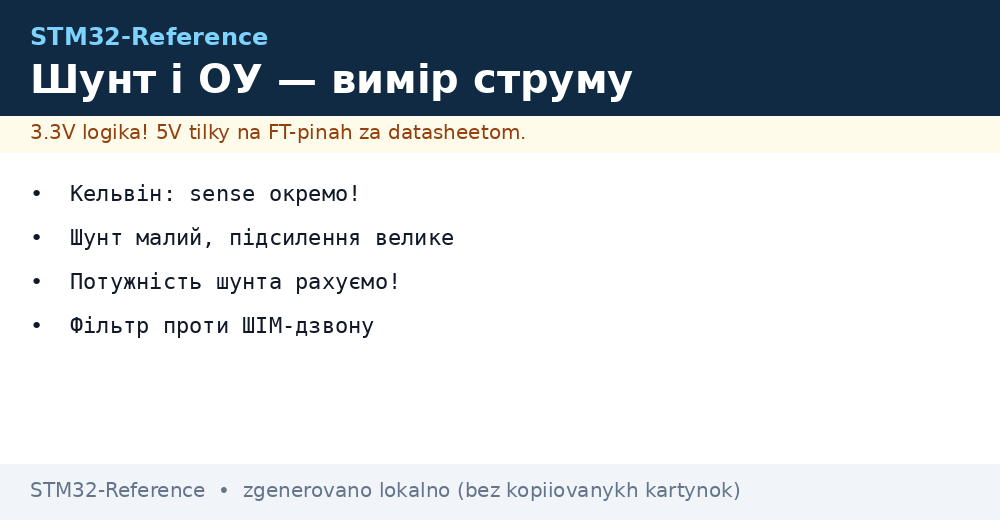
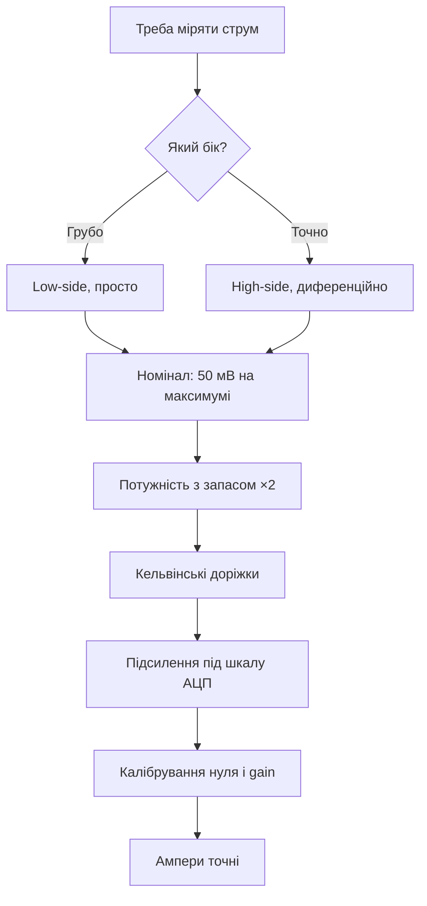

# Шунт і ОУ - точний вимір струму


*Рис. Мілівольти в ампери: шунт, підсилення, калібрування.*

> [!tip] Призначення ноти
> Навчити міряти струм точно: вибрати шунт, підключити по Кельвіну, підсилити і відкалібрувати.

## 1. Призначення

Закон Ома перетворює струм у напругу: маленький резистор у розрив кола дає мілівольти пропорційно амперам. Внутрішній ОУ піднімає їх до рівня АЦП без жодної зовнішньої мікросхеми. Ціна точності - правильний номінал, кельвінівські доріжки і калібрування нуля.

## 2. High-side проти low-side

| Схема | Плюси | Мінуси |
| --- | --- | --- |
| Low-side (в землі) | Проста, ОУ біля нуля | Земля рветься, шум, не для точності |
| High-side (в плюсі) | Земля ціла | Синфазний сигнал біля живлення! |
| Диференційний | Точний скрізь | Два дроти sense, увага до розводки |

```text
Правило:
  іграшки і грубщина ... low-side;
  батарея, мотор, гроші ... high-side з диференційним входом.
```

## 3. Розрахунок шунта: три числа

| Параметр | Формула | Приклад |
| --- | --- | --- |
| Номінал | Vmax / Imax | 50 мВ / 10 А = 5 мОм |
| Потужність | I² × R з запасом ×2! | 100 × 0.005 = 0.5 Вт → брати 1 Вт |
| Точність | 1% мінімум, 0.5% краще | Дешевий 5% бреше з нагрівом |

| Тема | Практика |
| --- | --- |
| Температурний коефіцієнт | Манганінові шунти пливуть менше |
| Саморозігрів | Великий струм гріє - поправка або запас |
| Індуктивність | Безіндуктивні для ШІМ-кіл! |

## 4. Кельвін: sense окремо від сили

| Правило | Пояснення |
| --- | --- |
| Силові доріжки | Товсті, несуть ампери |
| Sense-доріжки | Тонкі, від самих площадок шунта, струму майже немає |
| Точка відбору | Всередині площадок, не зовні! |
| Пара sense | Поруч, однакової довжки |

```text
Помилка новачка:
  sense з силових доріжок за шунтом;
  падіння на доріжках додається до шунта;
  вимір бреше на відсотки і пливе з нагрівом.
```

## Mermaid: проєктування каналу струму



## 5. Підсилення внутрішнім ОУ

| Тема | Практика |
| --- | --- |
| Режим PGA | Програмоване підсилення ×2-×64 |
| Повна шкала | 50 мВ × 64 ≈ 3.2 В - під АЦП! |
| Зсув нуля | Калібрування при старті обов'язкове |
| Смуга | ОУ не для мегагерців - ШІМ усереднюємо |

```c
// Ланцюжок виміру: ОУ шунта в АЦП з тригером:
OPAMP_PGA_Init(gain);              // підсилення під шкалу
ADC_Calibrate();                   // нуль при старті
TIM_Trigger_ADC();                 // вимір у тихий момент ШІМ!
```

## 6. Синхронізація з ШІМ: міряти в тиші

| Тема | Практика |
| --- | --- |
| Проблема | Ключі дзвонять у момент комутації |
| Рішення | Тригер АЦП посередині імпульсу |
| Усереднення | 8-16 вимірів за період |
| Фільтр RC | Маленький на вході проти дзвону |

## 7. Калібрування: нуль і gain

| Крок | Дія |
| --- | --- |
| 1 | Нуль струму - записати зсув |
| 2 | Еталонний струм - записати gain |
| 3 | Зберігати в EEPROM вузла |
| 4 | Перевірка раз на рік |

## Типові помилки

| # | Помилка | Чому погано | Як правильно |
| --- | --- | --- | --- |
| 1 | Sense з силових доріжок | Падіння доріжок у вимірі | Кельвін від площадок! |
| 2 | Шунт без запасу потужності | Перегрів і дрейф | I²R ×2 мінімум |
| 3 | Індуктивний шунт у ШІМ | Викиди на фронтах | Безіндуктивний! |
| 4 | Без калібрування нуля | Зсув на малих струмах | Нуль при кожному старті |
| 5 | Вимір у момент комутації | Дзвін замість струму | Тригер у тихий момент |
| 6 | Low-side рве землю | Шум скрізь | High-side для точного |
| 7 | Дешевий 5% шунт | Бреше з нагрівом | 1% або краще |

## Захист входів: перенапруга і ESD

| Загроза | Захист |
| --- | --- |
| Кидок при вимкенні індуктивності | TVS на лінію шунта |
| Статика при монтажі | Резистори послідовно + діоди на живлення |
| Переплюсовка батареї | Діод або ключ від зворотної полярності |
| Обрив sense-доріжки | Підтяжка, щоб вхід не висів у повітрі |

## Приклад каналу 10 А: збірка

| Елемент | Значення |
| --- | --- |
| Шунт | 5 мОм, 1 Вт, 1%, безіндуктивний |
| Сигнал | 50 мВ на 10 А |
| PGA | ×64 → 3.2 В на АЦП |
| Роздільність | 10 А / 4096 ≈ 2.4 мА на молодший біт |

## Офіційні джерела

- [AN4834 Current sensing (ST)](https://www.st.com/resource/en/application_note/an4834.pdf) - шунти, ОУ, синхронізація.
- [INA18x datasheets (TI)](https://www.ti.com/lit/ds/symlink/ina180.pdf) - high-side практика (для зовнішніх каскадів).

## Див. також

- [Home](../../../STM32-Reference/Home.md)
- [компаратори й операційники](../../../STM32-Reference/06-Analog/03-COMP-OPAMP.md)
- [вимірювання сигналу](../../../STM32-Reference/06-Analog/01-ADC.md)
- [струм і вага](../../../STM32-Reference/10-Sensori/04-INA219-HX711.md)
- [аналог G4](../../../STM32-Reference/01-Hardware/03-G0-G4.md)
- [облік енергії](../../../STM32-Reference/16-Proekti/03-Energomonitor.md)
