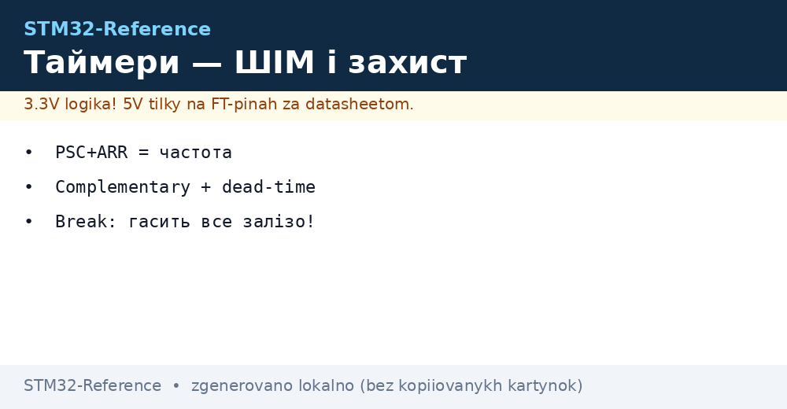
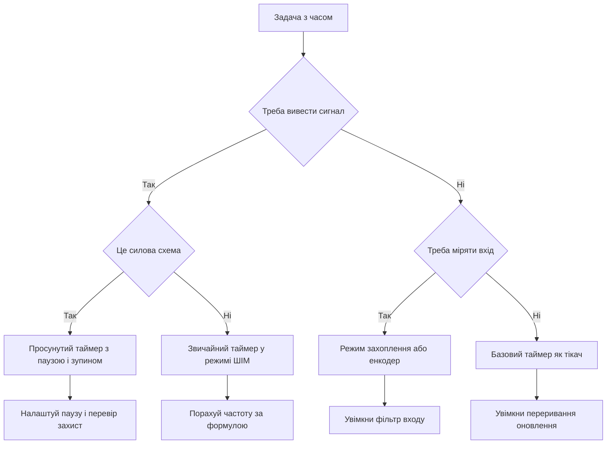

# Таймери STM32 - ШІМ, захоплення і захист


*Рис. Схема таймерів: лічильник з переддільником, канали порівняння і захоплення, комплементарні виходи з паузою.*

> [!tip] Призначення ноти
> Дати робочу карту таймерів: який таймер обрати, як порахувати частоту, як отримати чистий ШІМ, як міряти частоту, як зупинити міст при аварії.

## 1. Призначення

Таймер у STM32 це апаратний лічильник з тактуванням від шини, який вміє рахувати, порівнювати, захоплювати моменти фронтів і генерувати сигнали без участі ядра. Базовий сценарій це періодичне переривання, складніші це ШІМ для двигуна, вимір тривалості імпульсу, підрахунок імпульсів енкодера, аварійне вимкнення силового каскаду.

Головна ідея проста: є тактова частота шини, є переддільник який її ділить, є регістр автоперезавантаження який задає період, є канали які порівнюють лічильник з порогом. Зміна трьох регістрів дає будь-яку частоту і будь-яку шпаруватість. Ядро лише задає числа, далі все робить залізо.

## 2. Види таймерів

| Вид | Приклади | Розрядність | Канали | Для чого |
| --- | --- | --- | --- | --- |
| Базові | TIM6, TIM7 | 16 біт | Немає виводів | Такт для ЦАП, тригер для АЦП, часова база |
| Загальні | TIM2, TIM3, TIM4, TIM5 | 16 або 32 біт | До 4 каналів | ШІМ, захоплення, енкодер, лічильник імпульсів |
| Просунуті | TIM1, TIM8, TIM20 | 16 біт | До 4 каналів плюс інверсні | Керування двигунами, мертвий час, аварійний стоп |
| Спеціальні | HRTIM у старших | Висока роздільність | Багато виходів | Імпульсні перетворювачі з точним зсувом фази |

Базові таймери не мають виводів назовні. Вони живуть усередині кристала і чудово підходять як системний тікач або як джерело тригера. Не варто вішати на них ШІМ, бо фізично нікуди вивести сигнал.

Загальні таймери це робочі конячки. TIM2 і TIM5 у багатьох родинах мають 32 біт, тобто можуть рахувати дуже довгі інтервали без переповнення. Решта зазвичай 16 біт. Чотирьох каналів вистачає для трьохфазного моста з датчиком струму або для чотирьох сервоприводів.

Просунуті таймери додають комплементарні виходи, програмований мертвий час і вхід аварійного зупину. Саме їх беруть для інверторів, перетворювачів і будь-якої силової електроніки, де ціна помилки це згорілі транзистори.

## 3. Переддільник і період

| Регістр | Повна назва | Що задає |
| --- | --- | --- |
| PSC | Переддільник | У скільки разів поділити такт шини |
| ARR | Автоперезавантаження | Значення, після якого лічильник починається з нуля |
| CNT | Лічильник | Поточне значення, біжить само |
| CCR | Регістр порівняння | Поріг спрацювання каналу |

Частота переповнення рахується однією формулою. Тактова частота шини ділиться на добуток переддільника плюс один і періоду плюс один. Плюс один зявляється тому, що регістри рахують від нуля.

```text
Формула частоти таймера:
  Такт шини ................................. 84 МГц
  PSC ........................................ 83
  ARR ........................................ 999
  Частота оновлення = 84 МГц / ((83 + 1) x (999 + 1))
                    = 84 000 000 / (84 x 1000)
                    = 1000 Гц
  Пояснення:
    PSC ділить такт до 1 МГц тіку лічильника
    ARR задає 1000 тіків на період
    Разом маємо рівно 1 кГц
```

Практичне правило: спочатку вибираємо зручний тік лічильника через PSC, наприклад 1 МГц для мікросекундної точності, а потім через ARR задаємо потрібний період. Такий підхід спрощує розрахунок шпаруватості і тривалості імпульсів.

| Бажана частота ШІМ | Тік лічильника | ARR | Коментар |
| --- | --- | --- | --- |
| 50 Гц для серво | 1 МГц | 19999 | Період 20 мс, крок 1 мкс |
| 1 кГц для нагрівника | 1 МГц | 999 | Період 1 мс |
| 20 кГц для двигуна | 1 МГц | 49 | Період 50 мкс, вище чутного діапазону |
| 100 кГц для перетворювача | 10 МГц | 99 | Потрібен швидкий такт шини |

## 4. ШІМ і шпаруватість

ШІМ це прямокутний сигнал сталої частоти, у якому змінюється тривалість високого рівня. Відношення тривалості імпульсу до періоду називають шпаруватістю. Регістр порівняння задає момент перемикання всередині періоду.

| Режим каналу | Поведінка виходу | Застосування |
| --- | --- | --- |
| Активний високий | Високий доки лічильник менший за поріг | Світлодіоди, нагрівники, ключі |
| Активний низький | Навпаки | Інверсна логіка драйвера |
| Вирівнювання по краю | Пилка вгору | Простий ШІМ, більшість задач |
| Вирівнювання по центру | Трикутник вгору і вниз | Тихий двигун, менше завад |

Шпаруватість через регістр порівняння рахується прямо. Нуль дає постійно низький рівень, значення рівне періоду дає майже сто відсотків, половина періоду дає меандр. Зміна значення на льоту оновлюється у момент переповнення, тому сигнал не смикається.

## 5. Комплементарні виходи і мертвий час

Силова стійка з двох транзисторів вимагає двох протифазних сигналів з паузою між ними. Пауза потрібна, щоб верхній ключ встиг закритись до відкриття нижнього. Без паузи виникає наскрізний струм і ключі гріються або згорають.

| Параметр | Де задається | Типове значення |
| --- | --- | --- |
| Мертвий час | Регістр паузи просунутого таймера | Від 100 нс до 2 мкс |
| Полярність | Біти полярності каналів | Активний високий для обох |
| Дозвіл виходів | Головний вимикач виходів | Вмикається після налаштування |
| Джерело аварії | Вхід зупину | Зовнішній пін або компаратор |

Налаштування паузи залежить від швидкості ключів. Повільні польові транзистори з великим зарядом затвора потребують довшої паузи. Швидкі ключі з драйвером дозволяють коротшу паузу і менші втрати. Починати варто з мікросекунди і зменшувати під контролем осцилографа.

## 6. Захоплення вхідного сигналу

Режим захоплення фіксує значення лічильника у момент фронту на вході. Різниця двох захоплень дає період сигналу, а різниця фронту і спаду дає ширину імпульсу. Ядро не опитує пін, залізо саме ставить мітку часу.

| Задача вимірювання | Налаштування каналів | Що рахуємо |
| --- | --- | --- |
| Частота сигналу | Один канал на наростання, переривання | Різниця міток часу між фронтами |
| Ширина імпульсу | Два канали, фронт і спад | Різниця між наростанням і спадом |
| Шпаруватість | Пара каналів з перезапуском | Відношення ширини до періоду |
| Швидкість вала | Енкодерний режим | Кількість імпульсів за час |

Фільтр входу прибирає деренчання контактів і короткі голки. Переддільник входу дозволяє міряти дуже швидкі сигнали, пропускаючи кожен другий або кожен четвертий фронт. Без фільтра вимір на довгих дротах буде стрибати.

## 7. Енкодерний режим

Квадратурний енкодер дає дві послідовності зі зсувом фази. Таймер в енкодерному режимі рахує вгору або вниз залежно від порядку фронтів. Жодного переривання на кожен імпульс не треба, лічильник сам веде позицію вала.

| Сигнал енкодера | Куди подати | Налаштування |
| --- | --- | --- |
| Фаза А | Перший канал | Вхід без інверсії |
| Фаза Б | Другий канал | Вхід без інверсії |
| Нульова мітка | Окремий вхід | Скидання лічильника раз на оберт |

Роздільна здатність множиться на чотири, бо рахуються обидва фронти обох фаз. Енкодер на 500 рисок дає 2000 відліків на оберт. Переповнення лічильника треба обробляти програмно, додаючи оберти у змінну верхніх бітів.

## 8. Аварійний стоп і звязка з компаратором

Вхід зупину миттєво переводить силові виходи у безпечний стан без участі програми. Джерелом може бути зовнішній пін або внутрішній сигнал від компаратора, який стежить за струмом. Це найважливіша звязка таймера з аналоговою частиною для захисту моста.

| Джерело аварії | Реакція | Як повернутись |
| --- | --- | --- |
| Зовнішній пін | Виходи гаснуть одразу | Повторний дозвіл після аналізу |
| Компаратор струму | Те саме, ще швидше | Перевірити поріг і фільтр |
| Програмний запит | Те саме для тесту | Зняти прапорець і ввімкнути знову |

Детальніше про пороги і гістерезис дивись у ноті про [компаратори й операційники](../../../STM32-Reference/06-Analog/03-COMP-OPAMP.md). Правильний поріг компаратора це межа між хибними спрацюваннями і згорілим мостом. Фільтр на вході зупину прибирає короткі сплески від комутації ключів.

## 9. Одноімпульсний режим

Одноімпульсний режим видає один імпульс заданої довжини у відповідь на тригер. Застосування це ультразвукові далекоміри, запуск тиристорів, стробоскопи, точні затримки. Ядро задає затримку і довжину, далі залізо відпрацьовує само з точністю до тіку.

## 10. Звязки між таймерами

Один таймер може запускати інший через внутрішні тригери. Ведучий видає сигнал оновлення або порівняння, ведений стартує, зупиняється або скидається. Так будують каскади: один задає частоту пачок, інший шиє всередині пачки.

| Звязка | Ведучий | Ведений | Результат |
| --- | --- | --- | --- |
| Запуск АЦП | Оновлення таймера | Аналоговий перетворювач | Вимір рівно у потрібний момент ШІМ |
| Пачка імпульсів | Повільний таймер | Швидкий таймер | Серія імпульсів з паузою |
| Зсув фаз | Перший канал | Другий таймер | Два сигнали з точною затримкою |

Докладніше про вимір у потрібний момент дивись [вимірювання через АЦП](../../../STM32-Reference/06-Analog/01-ADC.md). Синхронізація з АЦП дозволяє міряти струм у середині імпульсу, коли перехідні процеси вже вщухли.

## 11. Пастка подвоєння на шині

Якщо переддільник шини відмінний від одиниці, таймери отримують подвоєний такт. Це класична пастка: у конфігураторі видно 84 МГц, а таймер цокає від 168 МГц. Формула частоти ламається рівно вдвічі, двигун свистить не на тій частоті.

```text
Карта тактування таймерів:
  SYSCLK .................... 168 МГц
  AHB без дільника ........... 168 МГц
  APB1 з дільником 4 ......... 42 МГц на шині
  TIM на APB1 ................ 84 МГц (подвоєння!)
  APB2 з дільником 2 ......... 84 МГц на шині
  TIM на APB2 ................ 168 МГц (подвоєння!)
  Висновок: дивись саме такт TIM, а не такт APB.
```

Перевірка проста: у конфігураторі відкрий дерево тактування і знайди числа саме для таймерів. Або блимни світлодіодом з періодом одна секунда і поміряй секундоміром. Двократна помилка видна одразу.

## 12. Швидкісний таймер для перетворювачів

Для молодших родин вистачає звичайних таймерів. Для резонансних перетворювачів і точних джерел живлення беруть чипи з апаратним блоком високої роздільності. Докладніше про такий блок дивись [аналог G4 і HRTIM](../../../STM32-Reference/01-Hardware/03-G0-G4.md). Правило просте: якщо потрібен крок менше наносекунди або багато фаз зі зсувом, це вже той блок.

## 13. Приклади коду

```c
TIM_HandleTypeDef htim1;

void pwm_start_example(void)
{
    HAL_TIM_PWM_Start(&htim1, TIM_CHANNEL_1);
    HAL_TIMEx_PWMN_Start(&htim1, TIM_CHANNEL_1);
    __HAL_TIM_SET_COMPARE(&htim1, TIM_CHANNEL_1, 500);
}

void input_capture_example(void)
{
    HAL_TIM_IC_Start_IT(&htim1, TIM_CHANNEL_1);
    HAL_TIM_IC_Start_IT(&htim1, TIM_CHANNEL_2);
}

void encoder_start_example(void)
{
    HAL_TIM_Encoder_Start(&htim3, TIM_CHANNEL_ALL);
}

void break_config_example(void)
{
    TIM_BreakDeadTimeConfigTypeDef cfg = {0};
    cfg.DeadTime = 100;
    cfg.BreakState = TIM_BREAK_ENABLE;
    cfg.BreakPolarity = TIM_BREAKPOLARITY_HIGH;
    cfg.AutomaticOutput = TIM_AUTOMATICOUTPUT_ENABLE;
    HAL_TIMEx_ConfigBreakDeadTime(&htim1, &cfg);
    __HAL_TIM_MOE_ENABLE(&htim1);
}
```

Нижчий рівень дає повний контроль без зайвих витрат. Регістрові виклики корисні в перериваннях, де кожен такт на рахунку. Докладніше про вибір рівня дивись [шари HAL і LL](../../../STM32-Reference/09-Proshivka/02-HAL-LL.md).

```c
void ll_pwm_example(void)
{
    LL_TIM_EnableCounter(TIM2);
    LL_TIM_CC_EnableChannel(TIM2, LL_TIM_CHANNEL_CH1);
    LL_TIM_OC_SetCompareCH1(TIM2, 250);
    LL_TIM_EnableIT_CC1(TIM2);
}

void ll_capture_irq(void)
{
    if (LL_TIM_IsActiveFlag_CC1(TIM2))
    {
        LL_TIM_ClearFlag_CC1(TIM2);
    }
}
```

Налаштування пінів під канали робиться через альтернативні функції. Таблицю відповідності дивись у ноті [мапінг альтернативних функцій](../../../STM32-Reference/03-GPIO/02-AF-maping.md). Без правильного номера функції на виводі буде тиша.

## 14. Схема вибору режиму



## 15. Покрокова перевірка

```text
Перший запуск ШІМ:
  1. Вистав такт шини і запиши число TIM.
  2. Порахуй PSC і ARR під потрібну частоту.
  3. Вибери канал і номер функції на піні.
  4. Запусти з малою шпаруватістю і глянь осцилографом.
  5. Додай інверсний вихід і мертвий час.
  6. Подай тестовий стоп і перевір гасіння.
  7. Підключи компаратор струму до входу зупину.
```

## Типові помилки

| # | Помилка | Чому погано | Як правильно |
| --- | --- | --- | --- |
| 1 | Частота вдвічі не та через подвоєння | Шина з дільником дає таймерам подвійний такт | Дивитись саме такт TIM у дереві тактування |
| 2 | Старт ШІМ без дозволу виходів | Просунутий таймер мовчить без головного вимикача | Увімкнути головний вихід після налаштування |
| 3 | Нульовий мертвий час на мосту | Наскрізний струм гріє ключі | Починати з 1 мкс і зменшувати за осцилографом |
| 4 | Захоплення без фільтра на довгих дротах | Випадкові спрацювання і стрибки виміру | Увімкнути цифровий фільтр входу |
| 5 | Зміна періоду без буферизації | Смикання сигналу посеред періоду | Вмикати тіньові регістри і оновлення на переповненні |
| 6 | Пін без альтернативної функції | На виводі тиша при живому таймері | Виставити номер функції за таблицею мапінгу |

## Офіційні джерела

- [TIM cookbook AN4013 ST](https://www.st.com/resource/en/application_note/an4013-stm32-crossseries-timer-overview--stmicroelectronics.pdf) - огляд таймерів усіх серій з прикладами.
- [General purpose timer cookbook AN4776 ST](https://www.st.com/resource/en/application_note/an4776-generalpurpose-timer-cookbook-for-stm32-microcontrollers--stmicroelectronics.pdf) - режими ШІМ захоплення і енкодера.
- [Advanced motor control timers ST](https://www.st.com/en/microcontrollers-microprocessors/stm32-32-bit-arm-cortex-mcus.html) - вибір чипа з просунутими таймерами.

## Див. також

- [Home](../../../STM32-Reference/Home.md)
- [час і сторожові таймери](../../../STM32-Reference/07-Timeri-Son/02-LPTIM-RTC-WDT.md)
- [режими сну](../../../STM32-Reference/07-Timeri-Son/03-Sleep-Stop-Standby.md)
- [мапінг альтернативних функцій](../../../STM32-Reference/03-GPIO/02-AF-maping.md)
- [компаратори й операційники](../../../STM32-Reference/06-Analog/03-COMP-OPAMP.md)
- [вимірювання через АЦП](../../../STM32-Reference/06-Analog/01-ADC.md)
- [шари HAL і LL](../../../STM32-Reference/09-Proshivka/02-HAL-LL.md)
- [аналог G4 і HRTIM](../../../STM32-Reference/01-Hardware/03-G0-G4.md)
- [налаштування CubeMX](../../../STM32-Reference/09-Proshivka/01-CubeIDE-CubeMX.md)
