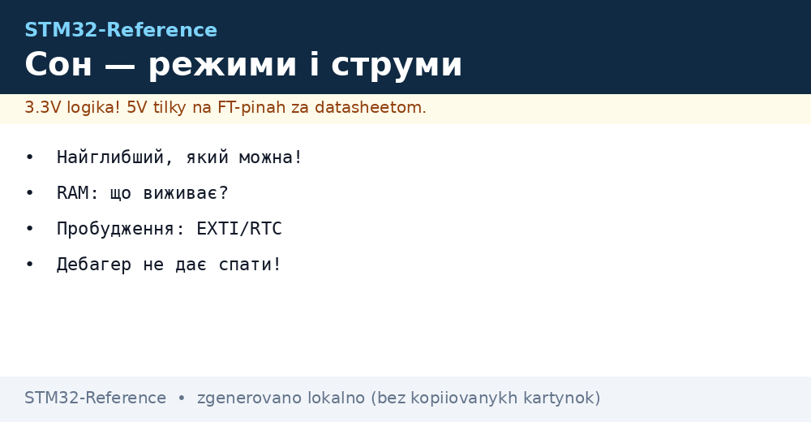
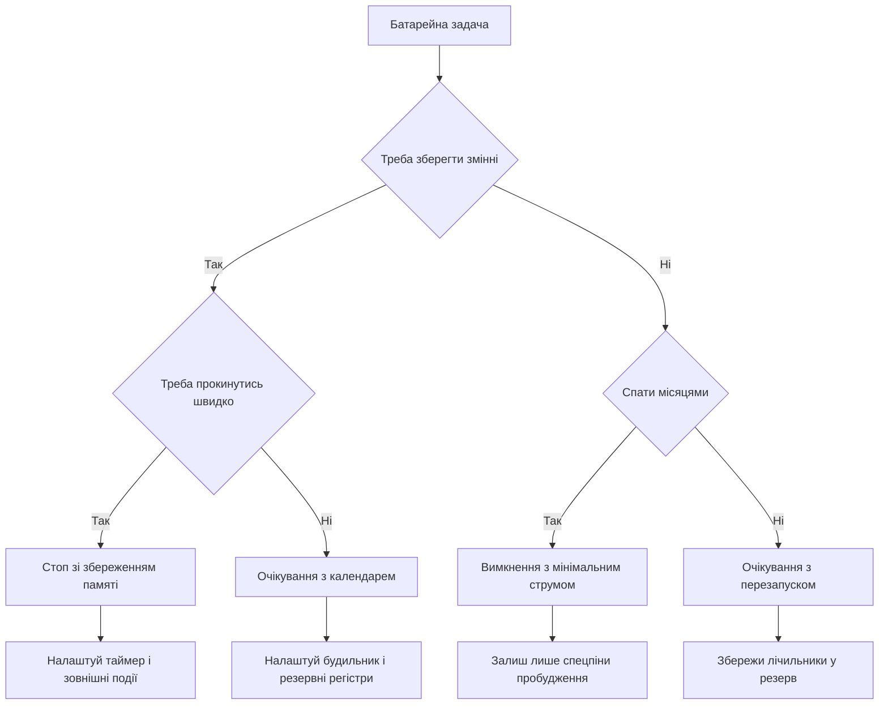

# Режими сну STM32 - Stop, Standby і струми


*Рис. Схема сну: ядро зупинене, памяті частина жива, будить зовнішня подія або календар.*

> [!tip] Призначення ноти
> Навчити вибирати найглибший можливий сон, рахувати середній струм і міряти реальне споживання, а не вірити лише даташиту.

## 1. Призначення

Батарейний вузол майже весь час спить і прокидається на мілісекунди для виміру і передачі. Різниця між активними міліамперами і сонними мікроамперами дає роки роботи від елемента. Режими сну відрізняються тим, що лишається живим: ядро, памяті, генератори, периферія.

Правило найглибшого режиму просте: бери найекономніший режим, який ще вміє будити вчасно і зберігати потрібні дані. Якщо потрібне швидке пробудження і збереження змінних, це зупинка. Якщо достатньо перезапуску раз на годину, це очікування з календарем. Якщо вузол спить місяцями, це вимкнення з мінімальним струмом.

## 2. Таблиця режимів

| Режим | Ядро | Памяті | Генератори | Типовий струм | Пробудження |
| --- | --- | --- | --- | --- | --- |
| Sleep | Стоїть, периферія жива | Збережені | Усі живі | Міліампери | Будь-яке переривання |
| Stop0 | Стоїть | Збережені | Швидкі вимкнені | Десятки мікроамперів | Зовнішній сигнал, календар, малий таймер |
| Stop1 | Стоїть | Збережені | Ще менше живого | Одиниці мікроамперів | Те саме, трохи довше старт |
| Stop2 | Стоїть | Збережені, частина вимкнена | Мінімум | Частки мікроампера | Обмежений набір джерел |
| Standby | Вимкнене | Втрачені крім резерву | Лише повільні | Сотні наноамперів | Скидання, календар, зовнішні піни |
| Shutdown | Вимкнене | Втрачені | Майже нічого | Десятки наноамперів | Тільки спеціальні піни |

Точні числа залежать від родини, напруги і температури. У таблиці порядок величин для орієнтації. Для паспорта дивись розділ споживання у даташиті свого чипа при своїй напрузі. При плюс вісімдесяти градусах струми витоків ростуть у рази.

| Критерій | Sleep | Stop | Standby |
| --- | --- | --- | --- |
| Збереження змінних | Так | Так | Ні, лише резервні регістри |
| Швидкість старту | Миттєво | Мікросекунди | Як після скидання |
| Периферія жива | Так | Частково | Ні |
| Налагодження | Просте | Потребує уваги | Складне, старт з нуля |

## 3. Правило найглибшого режиму

| Сценарій | Режим | Чому |
| --- | --- | --- |
| Опитування кнопок з миттєвою реакцією | Sleep | Реакція за такти, струм менший за активний |
| Вимір датчика щосекунди | Stop з малим таймером | Змінні живі, старт швидкий |
| Передача раз на годину | Stop або Standby з календарем | Довгий сон, календар будить |
| Маяк раз на добу | Standby | Мінімальний струм, старт з нуля прийнятний |
| Сезонне зберігання | Shutdown | Майже нуль, будить лише спецпін |

Помилка новачків це сидіти у Sleep роками і дивуватись сівшій батареї. Sleep економить лише зупинку ядра, а вся периферія і генератори їдять як раніше. Для батарейного вузла базовим має стати Stop, а Sleep лише паузою між пакетами обміну.

## 4. Джерела пробудження

| Джерело | З якого режиму будить | Налаштування |
| --- | --- | --- |
| Зовнішній пін | Усі крім найглибшого | Фронт через контролер переривань |
| Календар з будильником | Stop і Standby | Час і маска, батарейний домен |
| Малопотужний таймер | Stop | Період від повільного генератора |
| Компаратор | Stop | Поріг події без ядра |
| Дані на шині | Sleep і частково Stop | Адресне співпадіння без ядра |

Детальніше про зовнішні переривання дивись [переривання EXTI](../../../STM32-Reference/03-GPIO/03-EXTI-NVIC.md). Про календар і малий таймер дивись [час і сторожові таймери](../../../STM32-Reference/07-Timeri-Son/02-LPTIM-RTC-WDT.md). Звязка проста: вдень спимо у Stop, календар і таймер будять за розкладом, зовнішній пін будить за подією.

```text
Карта пробудження:
  Сплячий вузол .................. Stop2, струм частки мікроампера
  Щосекунди ....................... малий таймер будить, вимір, назад у сон
  Щогодини ........................ календар будить, передача, назад у сон
  Тривога ......................... зовнішній пін будить одразу
  Розряд .......................... компаратор будить при просіданні живлення
```

## 5. Середній струм і батарея

Середній струм це зважена сума: активний струм помножений на частку активності плюс сонний струм помножений на частку сну. Батареї вистачить на ємність поділену на середній струм з поправкою на саморозряд і температуру.

```text
Формула середнього струму:
  Активний струм ................ 20 мА
  Тривалість активності .......... 10 мс
  Період ......................... 10 с
  Сонний струм ................... 2 мкА
  Середній = (20 мА x 0.01 с + 0.002 мА x 9.99 с) / 10 с
           = (0.2 + 0.01998) / 10
           = 0.022 мА = 22 мкА
  Батарея 1000 мАг / 0.022 мА = 45454 годин = 5.2 року
  Мінус саморозряд і холод, реально близько 3 років.
```

| Параметр прикладу | Значення |
| --- | --- |
| Активний струм з радіо | 20 мА протягом 10 мс |
| Вимір датчика | 3 мА протягом 2 мс |
| Сон у Stop2 | 1.5 мкА решту часу |
| Період циклу | 60 секунд |
| Ємність елемента | 2400 мАг |
| Оцінка життя | Понад 7 років за формулою, реально 4-5 |

Поради для чесного розрахунку: міряй реальні струми, а не бери з реклами. Додай саморозряд батареї близько двох відсотків на рік. На холоді ємність падає вдвічі. Пікові струми радіо садять напругу, потрібен конденсатор підтримки.

## 6. Чому налагоджувач не дає спати

Підключений налагоджувач утримує живлення налагоджувального порту і заважає вимикати генератори. Кристал начебто у сні, а струм міліампери. Це нормальна поведінка при розробці, а не брак чипа.

| Симптом | Причина | Дія |
| --- | --- | --- |
| У сні міліампери | Живий порт налагодження | Вимкити налагоджувач і поміряти знову |
| Не заходить у глибокий сон | Біти заборони сну | Перевірити регістри збереження периферії |
| Прокидається одразу | Висячий прапорець | Чистити прапорці перед входом у сон |
| Після сну не стартує | Не налаштований генератор | Вибирати джерело старту після пробудження |

Правило виміру: прошивку для заміру ший без налагоджувача, живлення через амперметр, кнопка скидання для старту. У конфігураторі є опція поведінки у сні, докладніше дивись [налаштування CubeMX](../../../STM32-Reference/09-Proshivka/01-CubeIDE-CubeMX.md). Бойовий замір завжди без кабелю налагодження.

## 7. Вимір реального сну амперметром

| Крок | Дія | Навіщо |
| --- | --- | --- |
| 1 | Знайти перемичку виміру струму на платі | Розрив живлення для приладу |
| 2 | Зняти перемичку і ввімкнути міліамперметр | Бачити активний струм |
| 3 | Запустити цикл сон-пробудження | Перевірити логіку |
| 4 | Перемкнути прилад на мікроампери | Бачити сонний струм |
| 5 | Вимкити налагоджувач і світлодіоди | Прибрати зайве споживання |
| 6 | Записати три числа: актив, сон, середнє | Підставити у формулу батареї |

На платах розробки поруч з індикацією є вимірювальна перемичка. Зняв ковпачок, підключив прилад, бачиш реальний струм ядра без зайвих споживачів. Світлодіоди живлення їдять більше за сплячий кристал, їх треба вимкати або враховувати окремо.

```text
Порядок виміру на платі:
  Живлення плати ................. USB або зовнішні 5 В
  Перемичка струму ................ зняти, туди щупи приладу
  Межа приладу .................... спочатку мА, потім мкА
  Прошивка ........................ блим раз на 5 с, решта сон
  Очікувано ....................... пік 20 мА, сон 2 мкА
  Якщо сон 2 мА ................... винен налагоджувач або світлодіод
```

## 8. Автономний збір без ядра

У нових родинах зявився автономний збір даних: периферія сама збирає виміри у памяті, ядро спить. Аналоговий перетворювач за тригером малого таймера складає відліки через прямий доступ, ядро прокидається лише забрати готовий пакет. Детальніше про тригери дивись [вимірювання через АЦП](../../../STM32-Reference/06-Analog/01-ADC.md).

| Етап | Хто працює | Ядро |
| --- | --- | --- |
| Тригер | Малий таймер | Спить |
| Вимір | Перетворювач | Спить |
| Перенос | Прямий доступ | Спить |
| Пакет готовий | Переривання | Прокидається |

Для нот про таймери важливо одне: саме малий таймер стає серцем такого збору, бо він живе у сні. Звичайний таймер для цього не годиться, він зупиняється разом з швидкими генераторами.

## 9. Приклади коду

```c
void sleep_example(void)
{
    HAL_SuspendTick();
    HAL_PWR_EnterSLEEPMode(PWR_MAINREGULATOR_ON, PWR_SLEEPENTRY_WFI);
    HAL_ResumeTick();
}

void stop_example(void)
{
    HAL_SuspendTick();
    HAL_PWR_EnterSTOPMode(PWR_LOWPOWERREGULATOR_ON, PWR_STOPENTRY_WFI);
    SystemClock_Config();
    HAL_ResumeTick();
}

void standby_example(void)
{
    HAL_PWR_EnableWakeUpPin(PWR_WAKEUP_PIN1);
    HAL_PWR_EnterSTANDBYMode();
}

void stop2_example(void)
{
    HAL_PWREx_EnterSTOP2Mode(PWR_STOPENTRY_WFI);
    SystemClock_Config();
}
```

Перед входом у сон гасіть зайве: вимикайте світлодіоди, переводьте піни у безпечний стан, чистіть прапорці. Детальніше про налаштування пінів дивись [мапінг альтернативних функцій](../../../STM32-Reference/03-GPIO/02-AF-maping.md). Після пробудження зі Stop треба заново налаштувати швидкі генератори, бо вони вимикались.

```c
void prepare_sleep_example(void)
{
    __HAL_PWR_CLEAR_FLAG(PWR_FLAG_WU);
    HAL_RTCEx_DeactivateWakeUpTimer(&hrtc);
    HAL_RTCEx_SetWakeUpTimer_IT(&hrtc, 10, RTC_WAKEUPCLOCK_CK_SPRE_16BITS);
    HAL_PWR_EnterSTOPMode(PWR_LOWPOWERREGULATOR_ON, PWR_STOPENTRY_WFI);
}
```

## 10. Схема вибору сну



## 11. Покрокова перевірка

```text
Перший батарейний цикл:
  1. Блимай у активі і міряй 20 мА.
  2. Зайди у сон на 5 секунд і міряй мікроампери.
  3. Додай пробудження від малого таймера.
  4. Додай пробудження від календаря.
  5. Додай кнопку як зовнішнє пробудження.
  6. Відключи налагоджувач і переміряй сон.
  7. Порахуй середній струм і життя батареї.
  8. Залиш на ніч і звір прогноз з фактом.
```

## Типові помилки

| # | Помилка | Чому погано | Як правильно |
| --- | --- | --- | --- |
| 1 | Замір сну з підключеним налагоджувачем | Міліампери замість мікроамперів | Міряти без кабелю налагодження |
| 2 | Світлодіоди і підтяжки на платі | Їдять більше за сплячий кристал | Випаяти або врахувати окремо |
| 3 | Не почищені прапорці пробудження | Миттєве хибне пробудження | Чистити усі прапорці перед входом |
| 4 | Після Stop не відновлено тактування | Ядро працює на повільному генераторі | Викликати налаштування тактів після виходу |
| 5 | Зберігання даних у звичайній памяті перед Standby | Дані втрачаються | Критичне тримати у резервних регістрах |
| 6 | Опитування замість пробудження | Ядро не спить, батарея сідає | Спати у Stop, будити таймером і подіями |

## Офіційні джерела

- [Low power modes AN4621 ST](https://www.st.com/resource/en/application_note/an4621-stm32l0-and-stm32l4-power-modes--stmicroelectronics.pdf) - режими сну і струми.
- [Getting started with low power ST](https://www.st.com/en/microcontrollers-microprocessors/stm32-ultra-low-power-mcus.html) - вибір родини під батарейний вузол.

## Див. також

- [Home](../../../STM32-Reference/Home.md)
- [таймери і ШІМ](../../../STM32-Reference/07-Timeri-Son/01-GPTIM-ADTIM.md)
- [час і сторожові таймери](../../../STM32-Reference/07-Timeri-Son/02-LPTIM-RTC-WDT.md)
- [переривання EXTI](../../../STM32-Reference/03-GPIO/03-EXTI-NVIC.md)
- [налаштування CubeMX](../../../STM32-Reference/09-Proshivka/01-CubeIDE-CubeMX.md)
- [вимірювання через АЦП](../../../STM32-Reference/06-Analog/01-ADC.md)
