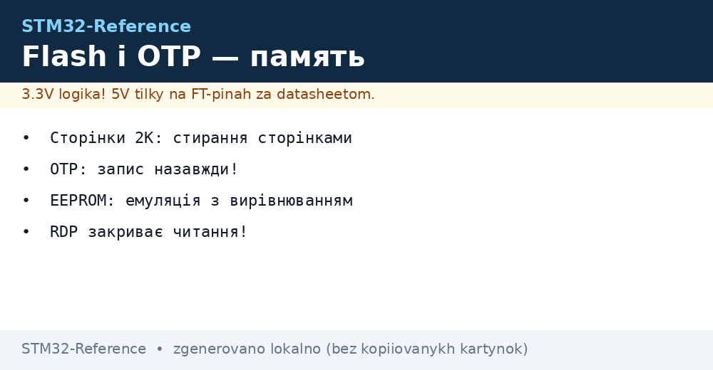
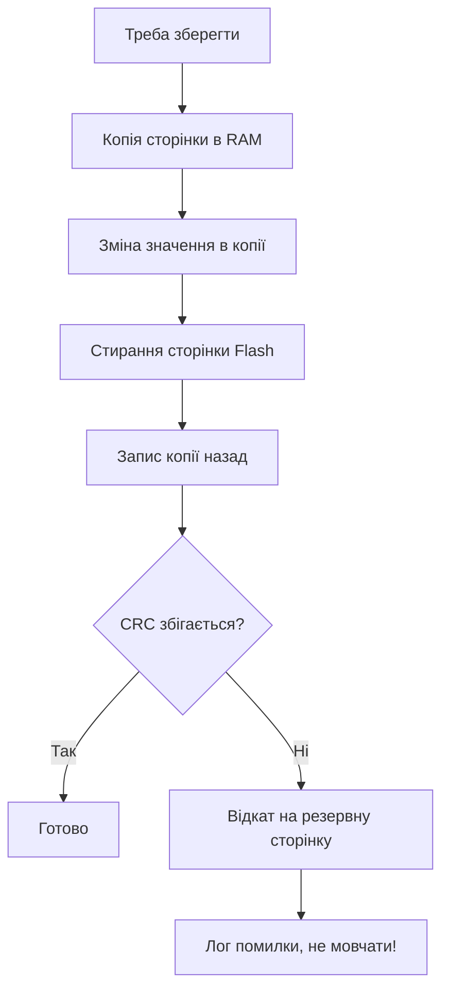

# Flash і OTP - сторінки, знос і емуляція EEPROM


*Рис. Правила Flash: стирай сторінками, пиши словами, OTP - раз і назавжди.*

> [!tip] Призначення ноти
> Навчити зберігати налаштування і лічильники у внутрішній памяті так, щоб вистачило на роки.

## 1. Призначення

Внутрішня Flash тримає код і може тримати дані: калібрування, лічильники, налаштування. Але Flash стирається цілими сторінками і зношується після тисяч циклів. Розуміння сторінок, вирівнювання і OTP-зони відрізняє надійний виріб від цегли через рік.

## Організація Flash

| Параметр | Значення | Практика |
| --- | --- | --- |
| Стирання | Тільки сторінками або секторами | Байт стерти не можна! |
| Запис | Біти тільки 1 в 0 | Перед записом - стерти сторінку |
| Розмір сторінки | 1-2 КБ (F0/F1/G0) до 128 КБ (H7) | За даташитом конкретного чипа! |
| Знос | Близько 10 тисяч циклів | Лічильник щосекунди вб'є сторінку |
| Подвійний банк (H7/G4) | Два банки для безшовного оновлення | Пиши в один, працюй з іншого |

```text
Цикл запису параметра:
  прочитай сторінку в RAM -> зміни значення -> зітри сторінку -> запиши назад.
  Живлення пропало посередині — сторінка бита. Тому подвійний буфер!
```

## Де тримати дані

| Варіант | Коли |
| --- | --- |
| Остання сторінка Flash | Рідкі налаштування, версія, калібрування |
| Дві сторінки по черзі | Часті записи: одна активна, друга готується |
| Backup-регістри | Байти, що живуть від VBAT |
| Зовнішня EEPROM | Дуже часті записи і гаряча заміна |

## Mermaid: безпечний запис параметра



## OTP-зона: раз і назавжди

| Тема | Практика |
| --- | --- |
| Призначення | Серійники, ключі, калібрування з заводу |
| Властивість | Записаний біт назад не повернути! |
| Стратегія | Писати тільки перевірене, двічі читати перед записом |
| Захист | RDP закриває читання разом з Flash |

## Емуляція EEPROM від ST

| Елемент | Роль |
| --- | --- |
| Дві сторінки | Активна і приймальна, міняються місцями |
| Wear-leveling | Записи розмазуються, знос ділиться |
| Віртуальні адреси | Твої змінні, бібліотека мапить сама |
| Page full | Чистка і перенос при заповненні |

```c
// Логіка використання емуляції:
EE_Init();                          // старт, пошук активної сторінки
EE_WriteVariable(VIRT_ADDR, value); // запис змінної
EE_ReadVariable(VIRT_ADDR, &value); // читання змінної
```

## Знос: рахуй до покупки

| Сценарій | Розрахунок |
| --- | --- |
| Налаштування раз на день | 10 тисяч циклів - десятки років |
| Лічильник щосекунди | Сторінка вмирає за години! |
| Лічильник у RAM + запис щогодини | Роки без проблем |

```text
Правило:
  часте — у RAM, рідкісне — у Flash;
  між ними — бекап при просіданні живлення (PVD!).
```

## Типові помилки

| # | Помилка | Чому погано | Як правильно |
| --- | --- | --- | --- |
| 1 | Запис без стирання | Старі нулі не стануть одиницями | Стирання перед записом |
| 2 | Лічильник у Flash щосекунди | Знос за дні | RAM + рідкісний бекап |
| 3 | Одна сторінка без резерву | Збій живлення - втрата всього | Дві сторінки з CRC |
| 4 | OTP пишуть при дебагу | Незворотна псування | OTP тільки у фіналі! |
| 5 | Стирання коду замість даних | Цегла | Адреси сторінок звірити з лінкером! |
| 6 | Переривання під час запису | Таймінги Flash жорсткі | Запис з вимкненими перериваннями або з RAM |
| 7 | Немає перевірки CRC | Бита сторінка читається мовчки | CRC після кожного запису |

## Карта памяті і лінкер: де чиї дані

| Ділянка | Що лежить |
| --- | --- |
| Початок Flash | Векторна таблиця, потім код |
| Кінець Flash | Твої сторінки даних - адреси в лінкер-файлі! |
| RAM | Стек, купа, буфери DMA |
| CCM-RAM | Гарячий код і дані ISR |
| Backup-домен | Лічильники і прапорці, що живуть від VBAT |

> Сторінки даних резервуй у лінкер-файлі, інакше компонувальник покладе туди код.

## Офіційні джерела

- [AN4894 EEPROM emulation (ST)](https://www.st.com/resource/en/application_note/an4894.pdf) - дві сторінки, wear-leveling.
- [PM0223 Flash programming manual (ST)](https://www.st.com/resource/en/programming_manual/pm0223.pdf) - операції з Flash.

## Read-while-write і подвійний банк

| Тема | Практика |
| --- | --- |
| Однобанкові чипи | Під час стирання код стоїть - переривання мовчать! |
| Код з RAM | Критичні функції копіювати в RAM на час запису |
| Подвійний банк | Пишеш в неактивний, перемикаєшся бітом |
| Swap без цегли | Перемикання тільки після CRC нового банку |

```text
Безшовне оновлення на двобанковому:
  працюєш з банку 1 -> пишеш новий код у банк 2;
  перевіряєш CRC банку 2 -> перемикаєш біт SWAP;
  ресет — старт вже з нового банку.
```

## Тест зносу: як перевірити запас

| Крок | Дія |
| --- | --- |
| 1 | Лічильник циклів у окремій змінній |
| 2 | Прискорений прогін на стенді |
| 3 | Перевірка CRC після кожної тисячі |
| 4 | Екстраполяція на роки роботи |

```text
Прискорений тест:
  писати в циклі без пауз добу;
  рахувати цикли і помилки CRC;
  поділити паспортний знос на виміряний темп.
```

## Захист даних при оновленні прошивки

| Тема | Практика |
| --- | --- |
| Дані окремо від коду | Сторінки даних не чіпає прошивка! |
| Версія структури | Міграція при несупадінні |
| Бекап перед erase | Копія в RAM при mass erase |

## Див. також

- [Home](../../../STM32-Reference/Home.md)
- [ланцюги живлення](../../../STM32-Reference/02-Zhivlennya/01-Lancjugi-zhivlennya.md)
- [оновлення прошивки](../../../STM32-Reference/15-Protokoli/02-DFU-Bootloader.md)
- [захист виробу](../../../STM32-Reference/15-Protokoli/03-Bezpeka.md)
- [зовнішні лоадери](../../../STM32-Reference/08-Pamyat/02-Zovnishni-Loadery.md)
- [файлові системи](../../../STM32-Reference/08-Pamyat/03-Filesystem-LittleFS.md)
