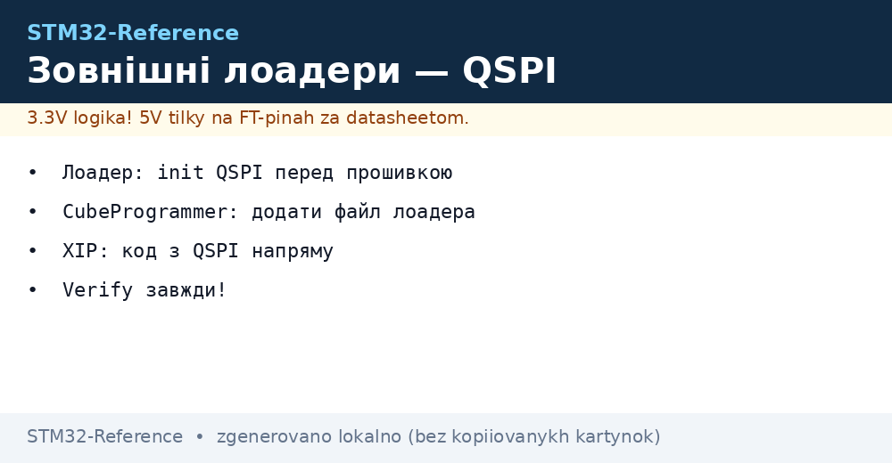
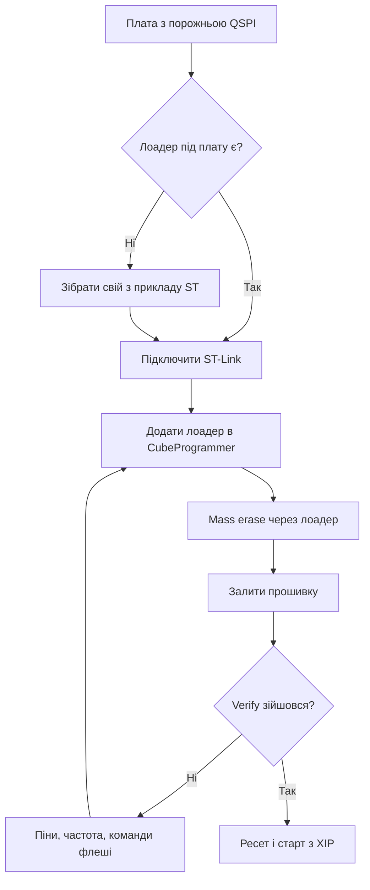

# Зовнішні лоадери - прошивка QSPI через CubeProgrammer


*Рис. Лоадер посередник: ініціалізує QSPI, ллє дані, перевіряє.*

> [!tip] Призначення ноти
> Навчити шити зовнішню флеш: що таке лоадер, де взяти готовий і як написати свій.

## 1. Призначення

CubeProgrammer з коробки вміє тільки внутрішню Flash. Зовнішня QSPI для нього - темний ліс, поки ти не даси йому лоадер: маленьку програму, що вміє ініціалізувати твій QSPI і писати в твою мікросхему. Без лоадера плати з XIP і ресурсами назовні не прошиваються взагалі.

## Що робить лоадер

| Функція | Навіщо |
| --- | --- |
| Init | Налаштовує QSPI і сам чип флеші |
| Write | Пише сторінки даних |
| Read | Читає назад для verify |
| Erase | Стирає сектори перед записом |
| MassErase | Чистить все для першої прошивки |

```text
Ланцюжок прошивки плати з QSPI:
  CubeProgrammer -> заливає лоадер в RAM -> лоадер init QSPI;
  дані течуть через лоадер у флеш -> verify читанням назад.
```

## Де взяти готовий

| Джерело | Коли вистачає |
| --- | --- |
| Пакет CubeProgrammer | Популярні плати Nucleo і Discovery |
| Репозиторій ST | Готові лоадери під eval-плати |
| Виробник плати | Свій лоадер під свою розводку |
| Свій з прикладу | Унікальна флеш або нестандартні піни |

> Піни QSPI у лоадері мають збігатися з твоєю платою. Чужий лоадер з іншими пінами - тиша.

## Свій лоадер: скелет

| Крок | Дія |
| --- | --- |
| 1 | Взяти приклад лоадера з пакета ST |
| 2 | Прописати свої піни QSPI і тактування |
| 3 | Прописати команди своєї флеші (ID, erase, page program) |
| 4 | Зібрати, покласти поруч з проєктом |
| 5 | Підключити в CubeProgrammer і перевірити verify |

```c
// Логіка Init всередині лоадера (спрощено):
QSPI_Init(pins_from_board);     // піни ТВОЄЇ плати!
QSPI_ResetMemory(flash_cmd);    // скидання флеші
QSPI_EnableMemoryMapped();      // перевірка читання ID
```

## Параметри своєї флеші

| Параметр | Де взяти |
| --- | --- |
| ID мікросхеми | Даташит, команда RDID |
| Розмір сектора стирання | 4 КБ типово, перевірити! |
| Розмір сторінки запису | 256 байт типово |
| Dummy cycles | За частотою, з даташита |
| Quad enable біт | Статусний регістр, вмикається раз |

## Mermaid: перша прошивка плати з QSPI



## XIP після прошивки

| Тема | Практика |
| --- | --- |
| Memory-mapped режим | Код виконується прямо з QSPI |
| Кеш увімкнено | Інакше гальма на кожній інструкції |
| Векторна таблиця | VTOR вказує на початок образу в QSPI |
| H750 без внутрішньої | Тільки так і працює взагалі! |

## Типові помилки

| # | Помилка | Чому погано | Як правильно |
| --- | --- | --- | --- |
| 1 | Чужий лоадер з іншими пінами | Тиша, флеш не видно | Піни своєї плати! |
| 2 | Невірні команди флеші | Стирання не те, запис кривий | Даташит конкретної мікросхеми |
| 3 | Частота вище межі флеші | Биті дані на verify | Знизити prescaler QSPI |
| 4 | Немає quad enable | Пише повільно в single | Біт у статусному регістрі |
| 5 | Verify пропущено | Бита прошивка шукається тижнями | Verify завжди! |
| 6 | Лоадер не в репозиторії | Нова людина не прошиє плату | Лоадер поруч з проєктом у git |
| 7 | Стирання внутрішньої замість зовнішньої | Затерто не те | Перевірити target перед erase |

## Офіційні джерела

- [UM2237 CubeProgrammer manual (ST)](https://www.st.com/en/development-tools/stm32cubeprog.html) - external loaders, verify.
- [AN4760 QSPI usage (ST)](https://www.st.com/resource/en/application_note/an4760.pdf) - режими, команди, XIP.

## Дебаг через лоадер: як зрозуміти, що не так

| Симптом | Причина | Перевірка |
| --- | --- | --- |
| Init падає одразу | Піни або тактування | Продзвонити QSPI-лінії, знизити частоту |
| Write йде, verify битий | Частота або dummy cycles | Читання ID вручну через дебагер |
| Працює на одній платі, на іншій ні | Розкид флешей | ID кожної плати звірити! |
| Після ресету не стартує | VTOR або option bytes | Вектор вказує на QSPI-адресу |

```text
Швидка діагностика вручну:
  підключитись дебагером, зупинити ядро;
  прочитати ID флеші через SFR QSPI;
  ID правильний — копати команди і частоту;
  ID сміття — копати піни і живлення флеші.
```

## Версіонування лоадера в команді

| Правило | Пояснення |
| --- | --- |
| Лоадер у git поруч з проєктом | Інакше нова людина не прошиє плату |
| Імя з ревізією плати | Лоадер під конкретну розводку! |
| Чекліст несумісності | Зміна пінів QSPI - новий лоадер одразу |

## Dual-bank і лоадер: як дружать

| Тема | Практика |
| --- | --- |
| Лоадер пише в неактивний банк | Активний працює, ніхто не стоїть |
| Перемикання після verify | Біт SWAP тільки при цілому образі |
| Відкат | Старий банк лишається до підтвердження нового |

## Час прошивки великих образів

| Обсяг | Орієнтир |
| --- | --- |
| 1 МБ по SWD | Хвилини, не секунди |
| Прискорення | Вища частота SWD, якщо дроти короткі |
| Перевірка блоками | Verify частинами при обривах |

```text
Якщо ллється годину:
  перевірити частоту SWD і довжину шлейфа;
  розбити на менші образи (ресурси окремо від коду);
  ресурси шити один раз, код — часто.
```

## Див. також

- [Home](../../../STM32-Reference/Home.md)
- [внутрішня память](../../../STM32-Reference/08-Pamyat/01-Flash-OTP-EEPROM.md)
- [карти і зовнішня флеш](../../../STM32-Reference/04-Shini/06-SDMMC-QUADSPI.md)
- [прошивка через ST-Link](../../../STM32-Reference/09-Proshivka/03-ST-Link-Proshivka.md)
- [оновлення прошивки](../../../STM32-Reference/15-Protokoli/02-DFU-Bootloader.md)
