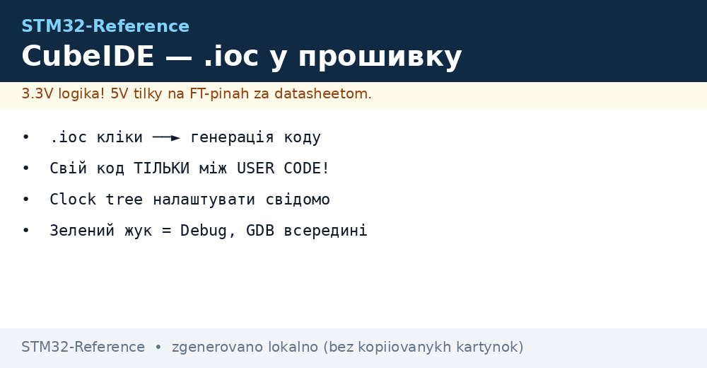
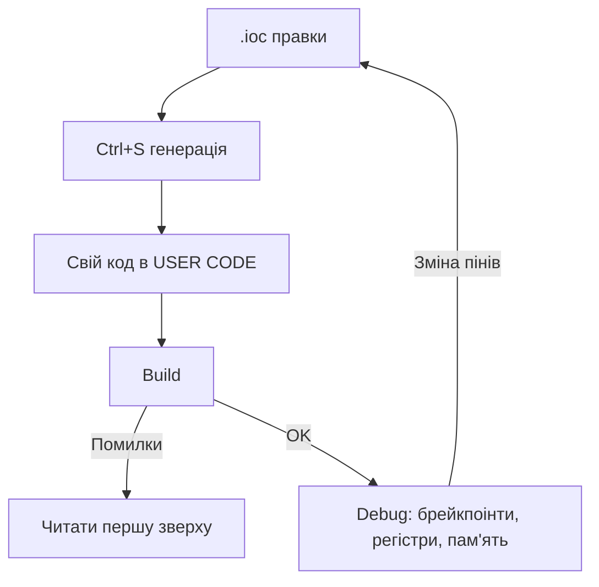

# STM32CubeIDE і CubeMX - проєкт з нуля


*Рис. Ланцюжок: .ioc → генерація → USER CODE → збірка → дебаг.*

> [!tip] Призначення ноти
> Довести від порожнього CubeIDE до блимаючого LED з розумінням, що згенерував CubeMX і куди писати свій код.

## 1. Призначення

STM32CubeIDE = Eclipse + ARM-GCC + CubeMX + GDB-дебаг в одному. CubeMX - графічний конфігуратор: клікаєш піни/таймери/UART, він генерує init-код. Головне правило: свій код - ТІЛЬКИ між маркерами `USER CODE BEGIN/END`, інакше перегенерація його зітре.

## Новий проєкт покроково

| Крок | Дія |
| --- | --- |
| 1 | File → New → STM32 Project → вибери точний партномер чипа |
| 2 | Назви проєкт, мова C (C++ - за потреби) |
| 3 | У `.ioc`: увімкни потрібну периферію, налаштуй тактування (Clock Configuration!) |
| 4 | Project Manager → Code Generator: HAL + окремі `.c/.h` на периферію |
| 5 | Ctrl+S - генерація; пиши код між USER CODE |
| 6 | Зелений жук - Debug; червона кнопка - Run |

```text
Типовий маршрут тактування (приклад F401, мета 84 МГц):
  HSE 8 МГц (кварц!) → PLL: M=4, N=168, P=2 → SYSCLK 84 МГц
  APB1 /4 = 21 МГц (таймери ×2 = 42!) — пастка новачків
  APB2 /2 = 42 МГц
```

## Mermaid: цикл роботи



## Clock Configuration: головні граблі

| Питання | Відповідь |
| --- | --- |
| HSE vs HSI | HSE-кварц для USB/CAN/точності; HSI - для старту |
| Множники PLL | Рахувати під цільову SYSCLK, не лишати дефолтні |
| APB-дільники | Таймери на APB отримують ×2 при дільнику >1! |
| USB 48 МГц | Окрема гілка PLL (PLLSAI/PLLQ) - перевірити явно |
| Перевірка факту | MCO-вихід на пін + осцилограф/частотомір |

## Headless-збірка (без IDE)

```text
# Той самий проєкт з консолі (для CI):
STM32CubeIDE --launcher.suppressErrors -nosplash \
  -application org.eclipse.cdt.managedbuilder.core.headlessbuild \
  -data workspace/ -import project/ -build project/Debug
```

## Типові помилки

| # | Помилка | Чому погано | Як правильно |
| --- | --- | --- | --- |
| 1 | Свій код поза USER CODE | Генерація стирає | Тільки між маркерами! |
| 2 | Тактування за дефолтом | Половина швидкості / не працює USB | Налаштувати Clock tree свідомо |
| 3 | Забутий `HAL_Init` / SystemClock_Config | Периферія мовчить | Порядок: HAL → Clock → периферія |
| 4 | Оптимізація -O0 у релізі | Повільно і жирно | Реліз: -O2/-Os + перевірка таймінгів |
| 5 | Два `.ioc` на проєкт | Конфлікт генерації | Один .ioc - джерело правди |

## Офіційні джерела

- [STM32CubeIDE User Guide (ST)](https://www.st.com/en/development-tools/stm32cubeide.html) - встановлення, дебаг.
- [STM32CubeMX User Manual UM1718 (ST)](https://www.st.com/en/development-tools/stm32cubemx.html) - конфігуратор.

## Вкладки .ioc детально: що де клікати

| Вкладка | Що налаштовується | Пастка |
| --- | --- | --- |
| Pinout & Configuration | Піни, режими, периферія, NVIC, DMA | Один пін - одна функція; конфлікт підсвічує червоним |
| Clock Configuration | HSE/HSI, PLL, шини, дільники | Дефолт = повільно; USB вимагає точних 48 МГц |
| Project Manager | Імена файлів, HAL/LL, шляхи | Окрема пара файлів на периферію - читабельніше |
| Code Generator | Копіювати тільки потрібне / всі HAL | Весь HAL = жирний проєкт; тільки потрібне = економія |
| Advanced Settings | HAL vs LL на кожну периферію окремо! | Саме тут вмикається LL для гарячого |

## Структура згенерованого проєкту: куди дивитись

```text
проєкт/
  *.ioc .................... джерело правди (комітити в git!)
  Core/Inc/main.h .......... прототипи,defines
  Core/Src/main.c .......... main + SystemClock + USER CODE
  Core/Src/stm32f4xx_hal_msp.c .. піни/такти/NVIC (правити обережно!)
  Core/Src/gpio.c, usart.c ... окремі файли периферії (якщо увімкнено)
  Drivers/STM32F4xx_HAL_Driver/ .. сам HAL (не чіпати!)
  Debug/*.elf .............. результат збірки для прошивки
```

## Перший Blink правильно (шаблон main)

```c
int main(void)
{
  HAL_Init();
  SystemClock_Config();
  MX_GPIO_Init();
  while (1)
  {
    /* USER CODE BEGIN */
    HAL_GPIO_TogglePin(GPIOC, GPIO_PIN_13);
    HAL_Delay(500);
    /* USER CODE END */
  }
}
```

| Правило | Чому |
| --- | --- |
| Свій код між BEGIN/END | Перегенерація стирає все поза ними! |
| Ініціалізація зверху вниз | HAL, потім тактування, потім периферія |
| Безкінечний цикл завжди | Вихід з main = HardFault на bare-metal |

## Дебаг-вікна CubeIDE: що відкрити новачку

| Вікно | Що показує | Коли потрібно |
| --- | --- | --- |
| Expressions/Variables | Значення змінних на паузі | Логіка не та |
| Registers | Усі регістри ядра і периферії | Підозра на неправильний init |
| Memory | Сирий дамп за адресою | Перевірка таблиць/буферів |
| SFRs | Розшифровані біти периферії | Перевірка, що UART справді увімкнено |
| SWV ITM Data Console | printf через SWO без UART! | Швидкий лог без зайвих дротів |
| Live Expressions | Значення без зупинки ядра | Моніторинг змінних на льоту |

## SWV-printf без UART (налаштування)

```text
1. У .ioc: SYS → Debug = Serial Wire + Trace Asynchronous Sw.
2. Debug-конфіг → Debugger → увімкнути SWV, частота = SYSCLK фактична!
3. Код: переозначити _write на ITM_SendChar.
4. Відкрити SWV ITM Data Console, порт 0, Start Trace.
```

| Пастка | Рішення |
| --- | --- |
| Сміття замість тексту | Невірна частота SWV - звірити з SYSCLK |
| Тиша | Trace-пін (PB3/SWO) зайнятий іншою функцією |
| Гальма на високій частоті | SWV дільник; не логувати з ISR 100 кГц |

## Git і версії: щоб не було боляче

| Тема | Практика |
| --- | --- |
| Комітити .ioc | Так! Це джерело генерації |
| Комітити згенероване | Так для малих команд; ігнорувати Debug/ і .metadata/ |
| Оновлення CubeMX | Бекап перед міграцією; HAL-версії ламають API між мажорами |
| Два розробники + один .ioc | Правити по черзі; мердж .ioc вручну - боляче, уникати паралелі |

## Див. також

- [Home](../../../STM32-Reference/Home.md)
- [Вибір середовища](../../../STM32-Reference/00-Start/05-Vibir-seredovischa.md)
- [HAL/LL](../../../STM32-Reference/09-Proshivka/02-HAL-LL.md)
- [ST-Link](../../../STM32-Reference/09-Proshivka/03-ST-Link-Proshivka.md)
- [Без CubeIDE](../../../STM32-Reference/09-Proshivka/04-Bez-CubeIDE.md)
