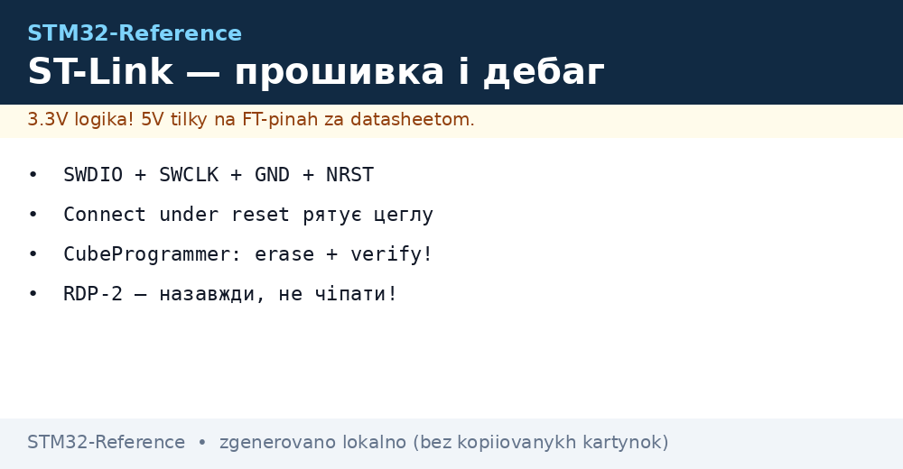
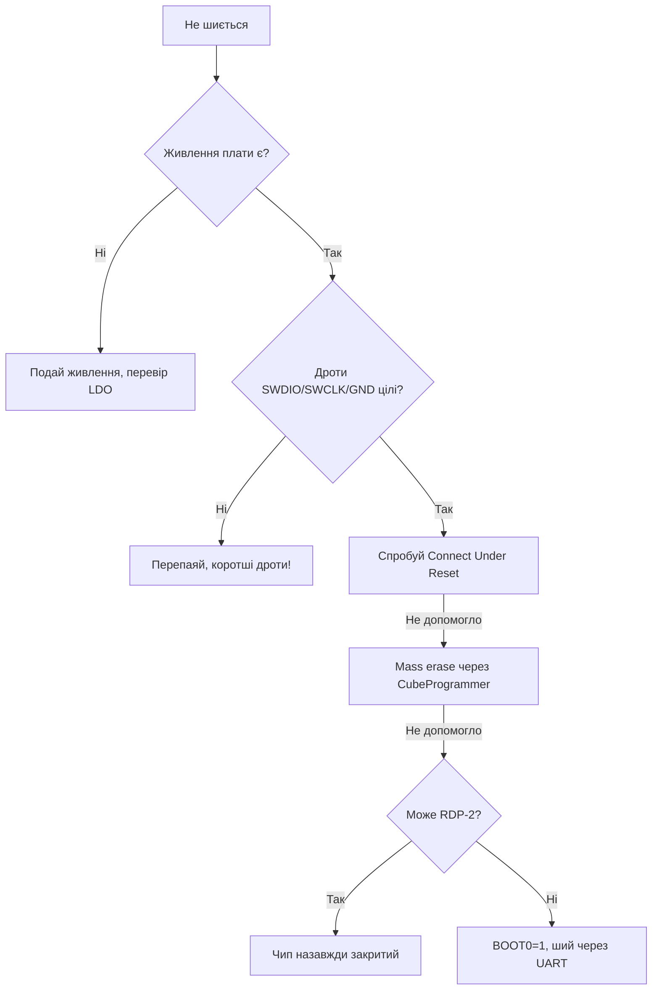

# ST-Link і прошивка - SWD, CubeProgrammer, OpenOCD


*Рис. 4 дроти SWD, connect-under-reset, erase перед записом, verify після.*

> [!tip] Призначення ноти
> Навчити шити будь-яку плату STM32: що куди підключити, чим заливати .elf/.bin/.hex і як оживити цеглу.

## 1. Призначення

ST-Link - це міст USB → SWD: шиє Flash, дебажить через GDB, дає віртуальний COM-порт (на Nucleo!). SWD - всього 2 сигнальні лінії (SWDIO + SWCLK) плюс земля і скидання. Розуміння цього ланцюжка знімає 90% паніки: плата мовчить - перевіряєш живлення, дроти, режим підключення, захист.

## Мінімальне підключення SWD

| Сигнал | Куди | Нотатка |
| --- | --- | --- |
| SWDIO | PA13 (SWDIO) | Дані, підтяжка вгорі на платі |
| SWCLK | PA14 (SWCLK) | Такти, підтяжка внизу |
| GND | GND | Спільна земля ОБОВЯЗКОВО |
| NRST | NRST | Скидання для connect-under-reset |
| 3V3 | 3V3 (опційно) | Тільки для живлення логіки узгодження, не живити мотор! |

```text
Зовнішній ST-Link v2 → Blue Pill:
  SWDIO → DIO (PA13)
  SWCLK → CLK (PA14)
  GND   → GND
  3V3   → 3V3 (якщо плата без свого живлення!)
  Живлення плати окремо, якщо є мотори/реле.
```

## Mermaid: плата не шиється - що робити



## STM32CubeProgrammer: головний інструмент

| Вкладка/кнопка | Що робить | Коли |
| --- | --- | --- |
| Connect | Підключитись до чипа | Завжди першим |
| Erasing & Programming | Залити файл + verify | Звичайна прошивка |
| Full chip erase | Стерти все | Перед першою прошивкою клона |
| Option bytes | RDP/WDG/захист | ОБЕРЕЖНО - можна зацеглити! |
| Firmware upgrade (WB/WL) | FUS + радіо-стеки | Тільки для бездротових чипів |

```text
Режим підключення (важливо!):
  Normal ......... за замовчуванням
  Under Reset .... коли прошивка ламає SWD (sleep, remap пінів!)
  HotPlug ........ до живого без скидання
```

## Connect Under Reset: рятівник цегли

| Ситуація | Чому Normal не працює |
| --- | --- |
| Прошивка одразу йде в Stop/Standby | SWD-домен вимкнено - дебагер не встигає |
| PA13/PA14 перепризначені на GPIO | SWD-піни вимкені кодом! |
| Неправильне тактування | Ядро висить до підключення |
| WDG ресетить кожні мілісекунди | Вікно для конекту - мізерне |

```text
Процедура:
1. У CubeProgrammer вибери Under Reset.
2. Затисни NRST (або тримай кнопку).
3. Натисни Connect, відпусти NRST в потрібний момент.
4. Одразу Full chip erase — цегла оживає.
```

## Файли прошивок: elf vs hex vs bin

| Формат | Містить | Коли використовувати |
| --- | --- | --- |
| .elf | Код + символи + адреси (все!) | Дебаг через GDB, головний артефакт |
| .hex | Адреси + дані текстом | CubeProgrammer, універсально |
| .bin | Голі дані без адрес | UART-bootloader, OTA, точна адреса обов'язкова! |

| Правило | Пояснення |
| --- | --- |
| Шиєш .bin - вкажи адресу | Зазвичай 0x08000000 (початок Flash) |
| Шиєш .hex/.elf - адреса всередині | Не треба вказувати вручну |
| Завжди verify після запису | Виявляє биті Flash і поганий контакт |

## OpenOCD і st-flash (консоль і Linux)

```text
# OpenOCD: прошивка + OpenOCD-сесія для GDB:
openocd -f interface/stlink.cfg -f target/stm32f1x.cfg \
  -c "program firmware.elf verify reset exit"

# st-flash (пакет stlink-tools): швидко і просто:
st-flash --reset write firmware.bin 0x8000000
st-info --probe   # що за чип підключено
```

| Інструмент | Плюс | Мінус |
| --- | --- | --- |
| CubeProgrammer | GUI, Option bytes, WB-стеки | Важкий, потрібна Java |
| OpenOCD | Скріпти, GDB-сервер, CI | Конфіги під кожну родину! |
| st-flash | Одна команда | Без дебага, тільки запис |
| pyOCD | Python-екосистема | Рідше оновлюється під нові чипи |

## RDP: захист, який вбиває (читати двічі!)

| Рівень | Що означає | Відкат |
| --- | --- | --- |
| RDP 0 | Відкрито (заводське) | - |
| RDP 1 | SWD читання закрито, запис можливий | Mass erase знімає |
| RDP 2 | НАЗАВЖДИ. Ні читання, ні запис, ні erase | НЕМАЄ. Чип одноразовий! |

> Ніколи не став RDP 2 на етапі розробки. Один необережний клік в Option bytes - і плата для смітника. RDP 1 вистачає для 99% задач.

## Швидкість і надійність SWD

| Тема | Практика |
| --- | --- |
| Частота SWD | Знизити при довгих дротах (з 4 МГц до 950 кГц) |
| Довжина дротів | До 10-15 см; довше - глюки і обриви |
| ST-Link клон vs оригінал | Клони працюють, але прошивка їх самих іноді злітає |
| Вбудований ST-Link на Nucleo | Можна шити зовнішню плату (зняти перемички!) |
| Живлення від ST-Link | Тільки логіка; мотори і реле - окремий БЖ! |

## Типові помилки

| # | Помилка | Чому погано | Як правильно |
| --- | --- | --- | --- |
| 1 | Немає спільної GND | Випадкові обриви, биті дані | GND завжди першим дротом |
| 2 | Шиють .bin без адреси | Код не там - мовчання | 0x08000000 для Flash |
| 3 | RDP 2 на дебажній платі | Смітник | Тільки RDP 0/1 при розробці |
| 4 | PA13/PA14 віддані під GPIO | Втрата SWD після першої прошивки | Лишати SWD або робити Under Reset |
| 5 | Довгі дроти на макетці | Обриви на високій частоті | Коротше + нижча частота SWD |
| 6 | Verify пропущено | Бита прошивка шукається тижнями | Verify завжди! |

## Офіційні джерела

- [STM32CubeProgrammer User Manual UM2237 (ST)](https://www.st.com/en/development-tools/stm32cubeprog.html) - прошивка, Option bytes.
- [ST-Link/V2 User Manual UM1075 (ST)](https://www.st.com/en/development-tools/st-link-v2.html) - підключення, режими.

## Див. також

- [Home](../../../STM32-Reference/Home.md)
- [CubeIDE](../../../STM32-Reference/09-Proshivka/01-CubeIDE-CubeMX.md)
- [HAL/LL](../../../STM32-Reference/09-Proshivka/02-HAL-LL.md)
- [Без CubeIDE](../../../STM32-Reference/09-Proshivka/04-Bez-CubeIDE.md)
