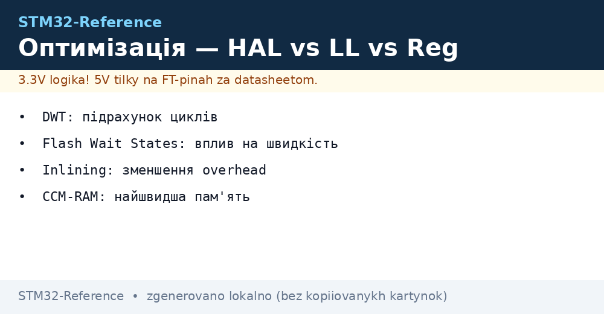
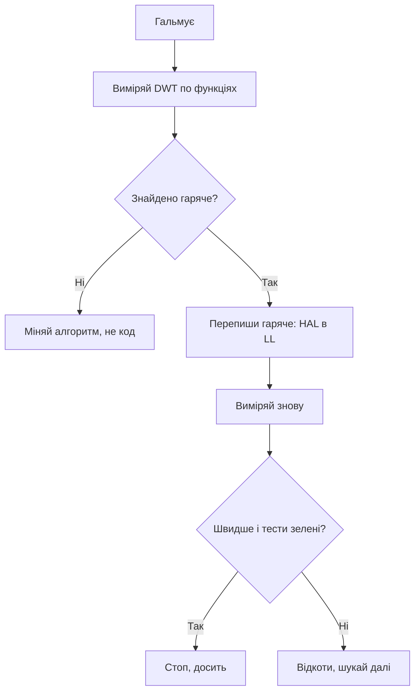

# Оптимізація STM32 - DWT, пам'ять і HAL проти LL


*Рис. Міряй циклами, а не відчуттями: DWT покаже правду.*

> [!tip] Призначення ноти
> Навчити знаходити справжні вузькі місця профілюванням і прибирати їх точково, а не переписуванням усього.

## 1. Призначення

Оптимізація без вимірів - це гадання. Цикловий лічильник DWT рахує такти ядра і показує точну ціну кожної функції. Практика проста: виміряв, знайшов гаряче, переписав гаряче на рівень нижче, перевірив, що нічого не зламалось. Все інше лишається читабельним.

## DWT: лінійка в тактах

```c
// Увімкнення циклового лічильника (M3/M4/M7):
CoreDebug->DEMCR |= CoreDebug_DEMCR_TRCENA_Msk;
DWT->CYCCNT = 0;
DWT->CTRL |= DWT_CTRL_CYCCNTENA_Msk;

// Вимір ділянки:
uint32_t t0 = DWT->CYCCNT;
HAL_GPIO_TogglePin(GPIOC, GPIO_PIN_13);
uint32_t cost = DWT->CYCCNT - t0;   // тактів!
```

| Правило виміру | Пояснення |
| --- | --- |
| Міряти в релізній збірці (-O2) | Дебажна -O0 бреше в рази |
| Гріти кеш перед заміром | Перший прогін завжди повільніший |
| Середнє з сотні прогонів | Переривання псують одиничні заміри |
| Фіксувати частоту ядра | Такти в мікросекунди переводяться через SYSCLK |

```text
Орієнтири ціни (порядок, не догма):
  GPIO через LL ............ 1-2 такти
  GPIO через HAL ............ 20-50 тактів
  Вхід-вихід з ISR .......... 100-300 тактів
  float-ділення .............. сотні тактів
```

## Mermaid: цикл оптимізації



## HAL проти LL проти регістрів

| Операція | HAL | LL | Регістри | Висновок |
| --- | --- | --- | --- | --- |
| Ініціалізація | Один виклик | Десятки рядків | Даташит в руках | HAL без конкуренції |
| GPIO в циклі | Десятки тактів | 1-2 такти | 1 такт | LL або BSRR безпосередньо |
| UART байт | Перевірки стану | Прапорець | Прапорець | LL у потоці |
| ISR 10 кГц | Встигає | Встигає | Встигає | Лишай HAL |
| ISR 100 кГц+ | Не встигає | Встигає | Встигає | Тільки LL |

```c
// Той самий пін трьома шарами:
HAL_GPIO_WritePin(GPIOC, GPIO_PIN_13, GPIO_PIN_SET);  // зручно
LL_GPIO_SetOutputPin(GPIOC, LL_GPIO_PIN_13);          // швидко
GPIOC->BSRR = GPIO_BSRR_BS13;                         // межа
```

## Пам'ять: де лежить гаряче

| Пам'ять | Швидкість | Що класти |
| --- | --- | --- |
| ITCM / CCM-RAM | Нуль очікувань завжди | Критичний код і дані ISR |
| SRAM | Швидко, але ділиться з DMA | Буфери обміну |
| Flash з ART/кешем | Швидко при влучанні | Основний код |
| Flash без кешу | Повільно (wait states!) | Нічого гарячого |
| Зовнішня QSPI | Найповільніше | Дані, не гарячий код |

| Тема | Практика |
| --- | --- |
| Wait states | За даташитом під частоту: 168 МГц вимагає 5 WS! |
| ART-акселератор | Не вимикати - дає нуль очікувань на Flash |
| Атрибут секції | Гарячу функцію в CCM: `__attribute__((section(".ccmram")))` |
| Стек ISR | З запасом: переповнення стека ламає все мовчки |

## Прапорці компілятора

| Прапорець | Ефект | Коли |
| --- | --- | --- |
| -O0 | Без оптимізації, зручний дебаг | Тільки розробка |
| -O2 | Баланс швидкості і розміру | Реліз за замовчуванням |
| -Os | Мінімум розміру | Тісний Flash |
| -O3 | Агресивно, роздуває код | Тільки після вимірів! |
| LTO | Оптимізація через файли | Реліз, якщо збірка дозволяє |

> Міняєш прапорці - переміряй таймінги. -O3 іноді ЛАМАЄ чутливий до порядку код.

## Типові помилки

| # | Помилка | Чому погано | Як правильно |
| --- | --- | --- | --- |
| 1 | Оптимізація навмання | Ламає робоче без виграшу | Спочатку DWT, потім код |
| 2 | -O0 у релізі | Повільно і жирно | Реліз мінімум -O2 |
| 3 | Гарячий код у QSPI | Промах кешу - сотні тактів | Гаряче тільки у внутрішній памяті |
| 4 | Невірні wait states | Глюки на високій частоті | За таблицею даташита! |
| 5 | float там, де вистачить int | Сотні тактів на ділення | Фіксована кома в циклах |
| 6 | double замість float | Програмна емуляція навіть з FPU! | Тільки float одинарної точності |
| 7 | Вимір одним прогоном | Переривання бреше | Середнє з сотні, кеш прогрітий |

## Офіційні джерела

- [AN4661 Performance stats (ST)](https://www.st.com/resource/en/application_note/an4661.pdf) - бенчмарки ядер STM32.
- [Cortex-M4 Technical Reference (ARM)](https://developer.arm.com/documentation/100166/latest/) - конвеєр, DWT, кеш.

## Volatile і оптимізатор: договір про чесність

| Ситуація | Що робити |
| --- | --- |
| Прапорець з ISR читає main | `volatile`, інакше компілятор викине читання! |
| Регістр периферії в циклі | Завжди через volatile-структуру CMSIS |
| Затримка пустим циклом | Оптимізатор викине цикл - тільки DWT або таймер |

```c
// Класичний баг: без volatile цикл очікування зникає в -O2!
volatile uint32_t *reg = &TIM2->SR;
while ((*reg & TIM_SR_UIF) == 0) { /* чекаємо */ }
```

```text
Перевірка лінкера після оптимізації:
  arm-none-eabi-size firmware.elf  — text/data/bss по секціях;
  .map-файл: хто зжер Flash (profiler секцій!);
  стек + купа влазять у RAM з запасом 20%%?
```

## Див. також

- [Home](../../../STM32-Reference/Home.md)
- [шари коду](../../../STM32-Reference/09-Proshivka/02-HAL-LL.md)
- [налаштування збірки](../../../STM32-Reference/09-Proshivka/01-CubeIDE-CubeMX.md)
- [таймери і ШІМ](../../../STM32-Reference/07-Timeri-Son/01-GPTIM-ADTIM.md)
- [режими DMA](../../../STM32-Reference/04-Shini/07-DMA-DeepDive.md)
