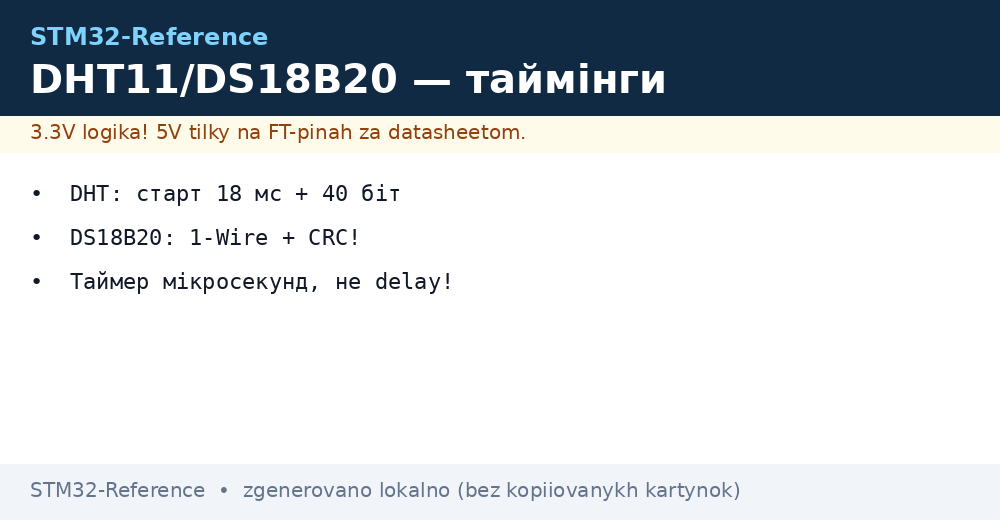
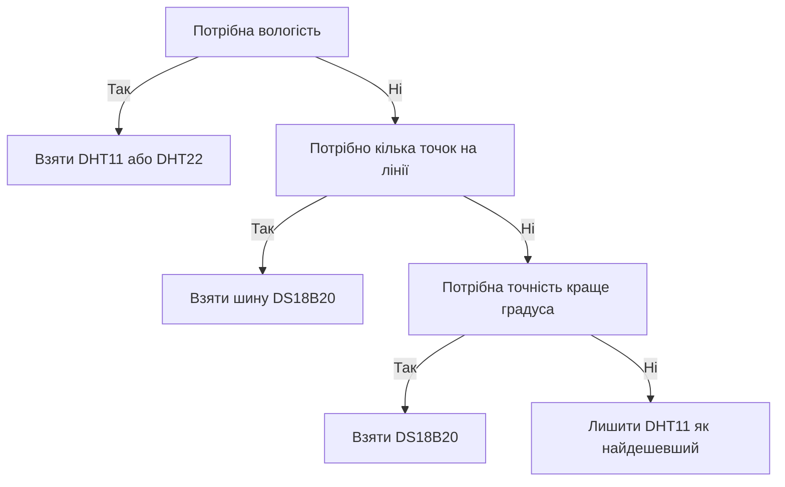

# DHT11 і DS18B20 - температура по одному дроту


*Рис. Підключення DHT11 і DS18B20 до STM32: підтяжка лінії даних і варіант паразитного живлення.*

> [!tip] Призначення ноти
> Дати робочу схему читання дешевих датчиків температури по одному дроту: таймінги DHT11, команди шини DS18B20 і готові функції HAL без зовнішніх бібліотек.

## 1. Призначення

DHT11 вимірює температуру і вологість та віддає готові байти без калібрування на боці контролера. DS18B20 вимірює тільки температуру, але дає адресну шину, контрольну суму і вибір роздільності. Обидва датчики підключаються одним сигнальним дротом, тому зручні для розподілених вузлів обліку тепла і клімату в теплицях, складах і житлових приміщеннях.

Типова звʼязка виглядає так: STM32 опитує датчик раз на одну або дві секунди, перевіряє контрольну суму і кладе значення у чергу телеметрії. DHT11 ставлять там, де потрібні температура і вологість одночасно і не потрібна точність. DS18B20 ставлять там, де потрібна точність, довга лінія або кілька точок виміру на одній шині.

## 2. Порівняння датчиків

| Параметр | DHT11 | DS18B20 |
| --- | --- | --- |
| Що вимірює | Температура і вологість | Тільки температура |
| Інтерфейс | Власний протокол DHT, один дріт | Шина з адресами, один дріт |
| Живлення | 3.0-5.5 В, окремий пін живлення | 3.0-5.5 В або паразитне від лінії даних |
| Діапазон температури | 0-50 °C | −55…+125 °C |
| Точність температури | ±2 °C | ±0.5 °C у центрі діапазону |
| Крок температури | 1 °C | 0.0625 °C при 12 бітах |
| Вологість | ±5 %, крок 1 % | Немає |
| Час одного виміру | Близько 1 с, частіше не питати | 94-750 мс залежно від роздільності |
| Адресація | Один датчик на лінію | До сотні датчиків на одній шині |
| Контрольна сума | Сума байтів кадру | Поліноміальний код кожного блоку |
| Ціна | Найдешевший | Трохи дорожчий, але точніший |

## 3. Протокол DHT11

Обмін завжди починає контролер. Послідовність така: довгий стартовий імпульс низького рівня, пауза очікування, відповідь датчика і 40 біт даних. Дані йдуть старшим бітом уперед: вологість ціла, вологість дробова, температура ціла, температура дробова і контрольна сума.

| Фаза | Хто тримає лінію | Тривалість |
| --- | --- | --- |
| Старт | Контролер тягне донизу | Мінімум 18 мс |
| Пауза | Контролер відпускає, підтяжка піднімає | 20-40 мкс |
| Відгук датчика | Датчик тягне донизу, потім вгору | Низький 80 мкс, високий 80 мс |
| Біт 0 | Датчик | Низький 50 мкс, високий 26-28 мкс |
| Біт 1 | Датчик | Низький 50 мкс, високий близько 70 мкс |
| Кінець кадру | Лінія вільна | Високий рівень, пауза до наступного старту |
| Період опитування | Контролер чекає | Не частіше разу на секунду |

```text
Лінія даних DHT11, один кадр обміну:
  Хост тримає низький рівень ..... мінімум 18 мс, старт кадру
  Хост відпускає лінію ........... підтяжка піднімає рівень 20-40 мкс
  Датчик відповідає .............. низький 80 мкс, потім високий 80 мкс
  Біт нуль ....................... низький 50 мкс плюс високий 26-28 мкс
  Біт одиниця .................... низький 50 мкс плюс високий близько 70 мкс
  Кінець ......................... лінія у високому рівні, чекати секунду
```

Контрольна сума кадру DHT11 дорівнює сумі перших чотирьох байтів молодшим байтом. Якщо сума не збігається, кадр викидають і повторюють запит. Повтор роблять не одразу, а після паузи, бо датчик зайнятий виміром.

## 4. Мікросекундні виміри: лічильник або таймер

Протокол DHT11 розрізняє біти за тривалістю високого рівня 28 мкс проти 70 мкс. Функція затримки на основі системного тіку тут не годиться, бо її крок становить мілісекунду. Потрібен мікросекундний відлік: або лічильник ядра, або звичайний таймер загального призначення.

| Варіант | Як увімкнути | Точність | Нотатка |
| --- | --- | --- | --- |
| Лічильник ядра | Дозволити трасування і запустити лічильник тактів | Один такт ядра | Працює на більшості серій, гальмується в налагодженні |
| Таймер загального призначення | Переддільник під 1 МГц, вільний канал | 1 мкс | Стабільний, не залежить від налагоджувача |
| Захоплення вхідних імпульсів | Канал у режимі виміру тривалості | 1 мкс і краще | Найточніше читання бітів, але складніше |
| Цикл очікування | Калібрований цикл на відомій частоті | Приблизна | Ламається при зміні тактування, тільки запасний варіант |

```c
#include "stm32f1xx_hal.h"

// Мікросекундна затримка через таймер, налаштований на 1 МГц.
// Приклад: TIM2 з переддільником під частоту шини.
void delay_us_tim(TIM_HandleTypeDef *htim, uint32_t us)
{
    __HAL_TIM_SET_COUNTER(htim, 0);
    HAL_TIM_Base_Start(htim);
    while (__HAL_TIM_GET_COUNTER(htim) < us)
    {
    }
    HAL_TIM_Base_Stop(htim);
}

// Мікросекундна затримка через лічильник тактів ядра.
// Перед першим викликом дозволити трасування.
void dwt_init(void)
{
    CoreDebug->DEMCR |= CoreDebug_DEMCR_TRCENA_Msk;
    DWT->CYCCNT = 0;
    DWT->CTRL |= DWT_CTRL_CYCCNTENA_Msk;
}

void delay_us_dwt(uint32_t us, uint32_t hclk_hz)
{
    uint32_t start = DWT->CYCCNT;
    uint32_t ticks = (hclk_hz / 1000000UL) * us;
    while ((DWT->CYCCNT - start) < ticks)
    {
    }
}
```

## 5. Читання DHT11 через HAL

Пін STM32 працює у двох ролях: спочатку вихід для стартового імпульсу, потім вхід для прийому бітів. Перемикання режиму роблять повторною ініціалізацією структури піна. Підтяжку вгору вмикають або зовнішнім резистором 4.7 кОм, або внутрішньою підтяжкою контролера.

```c
#include "stm32f1xx_hal.h"

#define DHT_PORT GPIOA
#define DHT_PIN  GPIO_PIN_0

static void dht_pin_output(void)
{
    GPIO_InitTypeDef g = {0};
    g.Pin = DHT_PIN;
    g.Mode = GPIO_MODE_OUTPUT_PP;
    g.Speed = GPIO_SPEED_FREQ_HIGH;
    HAL_GPIO_Init(DHT_PORT, &g);
}

static void dht_pin_input(void)
{
    GPIO_InitTypeDef g = {0};
    g.Pin = DHT_PIN;
    g.Mode = GPIO_MODE_INPUT;
    g.Pull = GPIO_PULLUP;
    HAL_GPIO_Init(DHT_PORT, &g);
}

// Очікування рівня на лінії з таймаутом у мікросекундах.
// Повертає тривалість утримання рівня або нуль при таймауті.
static uint32_t dht_wait_level(TIM_HandleTypeDef *htim, GPIO_PinState level, uint32_t timeout_us)
{
    __HAL_TIM_SET_COUNTER(htim, 0);
    HAL_TIM_Base_Start(htim);
    while (HAL_GPIO_ReadPin(DHT_PORT, DHT_PIN) != level)
    {
        if (__HAL_TIM_GET_COUNTER(htim) > timeout_us)
        {
            HAL_TIM_Base_Stop(htim);
            return 0;
        }
    }
    uint32_t t0 = __HAL_TIM_GET_COUNTER(htim);
    while (HAL_GPIO_ReadPin(DHT_PORT, DHT_PIN) == level)
    {
        if ((__HAL_TIM_GET_COUNTER(htim) - t0) > timeout_us)
        {
            HAL_TIM_Base_Stop(htim);
            return 0;
        }
    }
    uint32_t dur = __HAL_TIM_GET_COUNTER(htim) - t0;
    HAL_TIM_Base_Stop(htim);
    return dur;
}

// Читання кадру DHT11. Повертає нуль при успіху.
// rh і temp — цілі частини вологості і температури.
int dht11_read(TIM_HandleTypeDef *htim, uint8_t *rh, uint8_t *temp)
{
    uint8_t data[5] = {0};

    dht_pin_output();
    HAL_GPIO_WritePin(DHT_PORT, DHT_PIN, GPIO_PIN_RESET);
    HAL_Delay(20);
    HAL_GPIO_WritePin(DHT_PORT, DHT_PIN, GPIO_PIN_SET);
    dht_pin_input();
    delay_us_tim(htim, 40);

    if (dht_wait_level(htim, GPIO_PIN_RESET, 120) == 0) return -1;
    if (dht_wait_level(htim, GPIO_PIN_SET, 120) == 0) return -1;

    for (int i = 0; i < 40; i++)
    {
        if (dht_wait_level(htim, GPIO_PIN_RESET, 100) == 0) return -2;
        uint32_t high = dht_wait_level(htim, GPIO_PIN_SET, 120);
        if (high == 0) return -3;
        data[i / 8] <<= 1;
        if (high > 40) data[i / 8] |= 1; // довгий високий рівень = одиниця
    }

    uint8_t sum = data[0] + data[1] + data[2] + data[3];
    if (sum != data[4]) return -4; // контрольна сума не збіглася

    *rh = data[0];
    *temp = data[2];
    return 0;
}
```

## 6. Шина DS18B20: скидання і команди ROM

Шина DS18B20 вміє тримати багато датчиків на одному дроті, бо кожен чип має унікальний 64-бітний номер. Обмін починається зі скидання: контролер тягне лінію донизу на 480 мкс, відпускає і чекає імпульс присутності від датчиків. Далі йде команда вибору адресата, потім команда функції.

| Команда | Код | Коли застосовувати |
| --- | --- | --- |
| Пошук номерів | 0xF0 | Перший запуск, складання списку датчиків на шині |
| Читання номера | 0x33 | Один датчик на шині, дізнатися його номер |
| Вибір за номером | 0x55 | Кілька датчиків, звернення до конкретного |
| Пропуск вибору | 0xCC | Один датчик або команда всім одночасно |
| Пошук тривожних | 0xEC | Знайти датчики з виходом за пороги |
| Старт виміру | 0x44 | Запуск конверсії у вибраних датчиках |
| Читання буфера | 0xBE | Забрати температуру і службові байти |
| Запис порогів | 0x4E | Налаштувати пороги тривоги і роздільність |

Пошук номерів виконують спеціальним циклом з читанням пар бітів і розвʼязанням колізій. Для одного датчика на шині достатньо команди пропуску вибору: скидання, код пропуску, код старту виміру, пауза, скидання, код пропуску, код читання буфера.

```text
Обмін з одним DS18B20 через пропуск вибору:
  Скидання 480 мкс, імпульс присутності 60-240 мкс
  Байт 0xCC, пропуск вибору адресата
  Байт 0x44, старт конверсії температури
  Пауза за таблицею роздільності, до 750 мкс на 12 біт
  Скидання, імпульс присутності
  Байт 0xCC, пропуск вибору адресата
  Байт 0xBE, читання девʼяти байтів буфера
```

## 7. Буфер і циклічний код DS18B20

Буфер датчика має девʼять байтів: молодший і старший байти температури, пороги тривоги, байт конфігурації, три резервні байти, лічильник і циклічний код. Температура зберігається у додатковому коді, молодшим бітом уперед. Байт конфігурації задає роздільність 9-12 біт.

| Байт | Призначення | Нотатка |
| --- | --- | --- |
| 0 | Температура, молодший байт | Молодші біти залежать від роздільності |
| 1 | Температура, старший байт | Знак у старших бітах додаткового коду |
| 2 | Верхній поріг тривоги | Зберігається у незалежній памʼяті |
| 3 | Нижній поріг тривоги | Зберігається у незалежній памʼяті |
| 4 | Конфігурація | Біти роздільності 9-12 біт |
| 5 | Резервний | Не використовується |
| 6 | Резервний | Не використовується |
| 7 | Лічильник залишку | Для точного дорахунку десятих |
| 8 | Циклічний код | Поліном, початкове значення нуль |

```c
#include <stdint.h>

// Циклічний код шини, поліном x^8 + x^5 + x^4 + 1.
// Рахується по перших восьми байтах буфера.
uint8_t ds_crc8(const uint8_t *buf, int len)
{
    uint8_t crc = 0;
    for (int i = 0; i < len; i++)
    {
        crc ^= buf[i];
        for (int b = 0; b < 8; b++)
        {
            if (crc & 0x01) crc = (crc >> 1) ^ 0x8C;
            else crc >>= 1;
        }
    }
    return crc;
}

// Перетворення сирого коду у соті частки градуса.
// Працює для будь-якої роздільності, бо молодші біти вже нульові.
int32_t ds_raw_to_centi(int16_t raw)
{
    // raw у шістнадцятих частках градуса: 1 = 0.0625 C.
    // Множимо на 6.25 через цілочисельну формулу: raw * 25 / 4.
    return ((int32_t)raw * 25) / 4;
}
```

## 8. Роздільність і час конверсії

| Роздільність | Крок | Час конверсії | Байт конфігурації |
| --- | --- | --- | --- |
| 9 біт | 0.5 °C | 94 мс | 0x1F |
| 10 біт | 0.25 °C | 188 мс | 0x3F |
| 11 біт | 0.125 °C | 375 мс | 0x5F |
| 12 біт | 0.0625 °C | 750 мс | 0x7F |

Роздільність за замовчуванням становить 12 біт. Зниження роздільності вдвічі скорочує час конверсії і споживання при паразитному живленні. Для кімнатного термостата достатньо 10-11 біт, бо сота частка градуса губиться у шумах монтажу. Для калібрування і лабораторних вимірів лишають 12 біт і усереднюють кілька кадрів.

## 9. Паразитне живлення

| Питання | Звичайне живлення | Паразитне живлення |
| --- | --- | --- |
| Зайняті дроти | Три: живлення, земля, дані | Два: земля і дані |
| Пін живлення чипа | На шині живлення через конденсатор | На землі |
| Конденсатор | 100 нФ біля чипа бажаний | 100 нФ біля чипа обовʼязковий |
| Підтяжка даних | 4.7 кОм до живлення | 4.7 кОм, при довгій лінії 2.2 кОм |
| Сильна підтяжка | Не потрібна | Транзистор на час конверсії і запису памʼяті |
| Команда перевірки | Не потрібна | 0xB4 повідомляє, хто сидить на паразитному |
| Довга лінія | До сотні метрів з правильною топологією | Коротші відрізки, інакше помилки коду |

```text
Паразитне живлення одним поглядом:
  Земля спільна для контролера і всіх датчиків
  Дані через підтяжку 4.7 кОм до живлення контролера
  Пін живлення кожного DS18B20 на землі
  Конденсатор 100 нФ між даними і землею біля чипа
  На час конверсії вмикати сильну підтяжку транзистором
```

## 10. Читання DS18B20 через HAL

Слоти читання і запису тривають близько 60 мкс. Запис нуля - довгий низький рівень, запис одиниці - короткий імпульс з відпусканням. Читання - короткий стартовий імпульс контролера, потім вибірка рівня всередині вікна. Усі паузи роблять мікросекундним таймером з розділу про виміри.

```c
#include "stm32f1xx_hal.h"

#define OW_PORT GPIOA
#define OW_PIN  GPIO_PIN_1

extern TIM_HandleTypeDef htim2; // таймер на 1 МГц

static void ow_output(void)
{
    GPIO_InitTypeDef g = {0};
    g.Pin = OW_PIN;
    g.Mode = GPIO_MODE_OUTPUT_OD;
    g.Speed = GPIO_SPEED_FREQ_HIGH;
    HAL_GPIO_Init(OW_PORT, &g);
}

static void ow_input(void)
{
    GPIO_InitTypeDef g = {0};
    g.Pin = OW_PIN;
    g.Mode = GPIO_MODE_INPUT;
    g.Pull = GPIO_PULLUP;
    HAL_GPIO_Init(OW_PORT, &g);
}

static void ow_low(void)
{
    ow_output();
    HAL_GPIO_WritePin(OW_PORT, OW_PIN, GPIO_PIN_RESET);
}

static void ow_release(void)
{
    ow_input(); // відкритий стік відпускає, підтяжка піднімає лінію
}

// Скидання шини. Повертає одиницю, якщо датчик відповів присутністю.
int ow_reset(void)
{
    ow_low();
    delay_us_tim(&htim2, 480);
    ow_release();
    delay_us_tim(&htim2, 70);
    int presence = (HAL_GPIO_ReadPin(OW_PORT, OW_PIN) == GPIO_PIN_RESET);
    delay_us_tim(&htim2, 410);
    return presence;
}

void ow_write_bit(int bit)
{
    ow_low();
    if (bit)
    {
        delay_us_tim(&htim2, 6);
        ow_release();
        delay_us_tim(&htim2, 64);
    }
    else
    {
        delay_us_tim(&htim2, 60);
        ow_release();
        delay_us_tim(&htim2, 10);
    }
}

int ow_read_bit(void)
{
    ow_low();
    delay_us_tim(&htim2, 6);
    ow_release();
    delay_us_tim(&htim2, 9);
    int bit = (HAL_GPIO_ReadPin(OW_PORT, OW_PIN) == GPIO_PIN_SET);
    delay_us_tim(&htim2, 55);
    return bit;
}

void ow_write_byte(uint8_t b)
{
    for (int i = 0; i < 8; i++)
    {
        ow_write_bit(b & 0x01);
        b >>= 1;
    }
}

uint8_t ow_read_byte(void)
{
    uint8_t b = 0;
    for (int i = 0; i < 8; i++)
    {
        if (ow_read_bit()) b |= (1u << i);
    }
    return b;
}

// Читання температури одним датчиком, соті частки градуса.
// Повертає нуль при успіху, відʼємне — код помилки.
int ds18b20_read_centi(int32_t *out)
{
    uint8_t buf[9];
    if (!ow_reset()) return -1;
    ow_write_byte(0xCC); // пропуск вибору
    ow_write_byte(0x44); // старт конверсії
    HAL_Delay(750);       // чекати за таблицею роздільності
    if (!ow_reset()) return -2;
    ow_write_byte(0xCC);
    ow_write_byte(0xBE); // читання буфера
    for (int i = 0; i < 9; i++) buf[i] = ow_read_byte();
    if (ds_crc8(buf, 8) != buf[8]) return -3;
    int16_t raw = (int16_t)((buf[1] << 8) | buf[0]);
    *out = ds_raw_to_centi(raw);
    return 0;
}
```

## 11. Точність і ціна: що вибрати

| Задача | Рекомендація | Чому |
| --- | --- | --- |
| Кімнатний дисплей температури і вологості | DHT11 або новіший DHT22 | Дешево, дві величини з одного корпусу |
| Термостат з гістерезисом 1 °C | DS18B20, 10 біт | Точність краща за крок регулювання |
| Вулична станція | DS18B20 у гільзі | Широкий діапазон, довга лінія |
| Кілька точок на одному кабелі | Шина DS18B20 з пошуком номерів | Один дріт на всі кімнати |
| Калібрування плати | DS18B20, 12 біт, усереднення | Сота частка градуса без шуму молодших бітів |
| Облік тепла | DS18B20 парами подача і повернення | Однакова характеристика пари після калібрування |

## Mermaid: вибір датчика



## Типові помилки

| # | Помилка | Чому погано | Як правильно |
| --- | --- | --- | --- |
| 1 | Опитування DHT11 кожні 100 мс | Датчик не встигає виміряти, віддає старі кадри | Пауза мінімум секунда між стартами |
| 2 | Затримки на системному тіку для бітів | Крок мілісекунда не розрізняє 28 і 70 мкс | Мікросекундний таймер або лічильник ядра |
| 3 | Пін лишився виходом після старту | Контролер і датчик тягнуть лінію одночасно | Перемикати пін у вхід з підтяжкою |
| 4 | Немає зовнішньої підтяжки 4.7 кОм | Фронти затягнуті, біти читаються навмання | Поставити резистор біля датчика |
| 5 | Ігнорування контрольної суми | Биті кадри потрапляють у статистику і регулювання | Викидати кадр і повторювати після паузи |
| 6 | Паразитне живлення без сильної підтяжки | Конверсія зривається, код не збігається | Транзистор сильної підтяжки на час конверсії |

## Офіційні джерела

- [DS18B20 datasheet (Analog Devices, formerly Maxim)](https://www.analog.com/en/products/ds18b20.html) - буфер, команди шини, таймінги слотів.
- [DHT11 datasheet (Adafruit mirror of Aosong)](https://cdn-shop.adafruit.com/datasheets/DHT11-chinese.pdf) - стартовий імпульс, формат 40 біт, період опитування.
- [1-Wire search algorithm (Analog Devices app note)](https://www.analog.com/en/resources/app-notes/1wire-search-algorithm.html) - пошук номерів і розвʼязання колізій.

## Див. також

- [Home](../../../STM32-Reference/Home.md)
- [режими GPIO](../../../STM32-Reference/03-GPIO/01-GPIO-rezhimi.md)
- [таймери і ШІМ](../../../STM32-Reference/07-Timeri-Son/01-GPTIM-ADTIM.md)
- [клімат по I2C](../../../STM32-Reference/10-Sensori/02-BME280-SHT3x.md)
- [рух і орієнтація](../../../STM32-Reference/10-Sensori/03-MPU6050-IMU.md)
