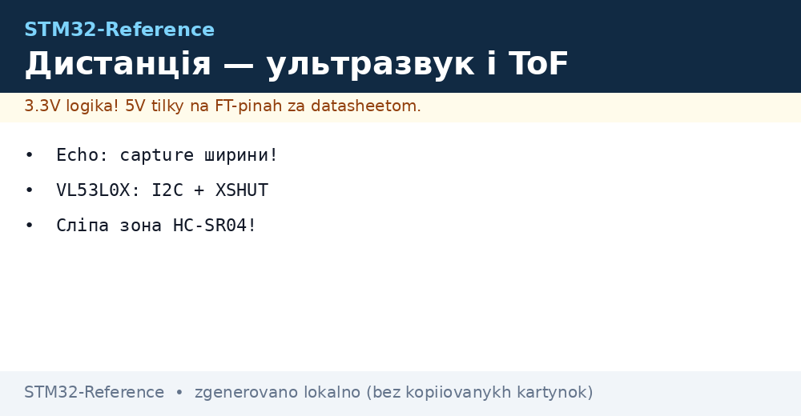
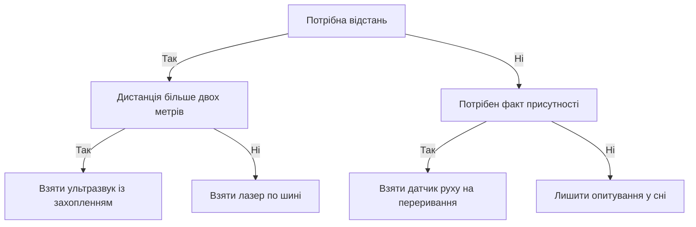

# HC-SR04 і VL53L0X - дистанція і присутність


*Рис. Вимір дистанції ультразвуковим модулем і лазерним дальноміром плюс дискретний датчик руху на вході переривань.*

> [!tip] Призначення ноти
> Дати три готові канали виявлення обʼєктів: далекобійний ультразвук, точний лазер по шині і дискретний датчик руху з перериванням.

## 1. Призначення

HC-SR04 міряє відстань ультразвуковим відлунням від кількох сантиметрів до кількох метрів. VL53L0X міряє відстань лазерним імпульсом з міліметровою роздільною здатністю на короткій дистанції. Дискретний інфрачервоний датчик руху повідомляє про появу людини у зоні без виміру відстані. Разом трійця закриває охорону, паркування, рівень рідини і підрахунок відвідувачів.

STM32 дає стартовий імпульс ультразвуку, міряє тривалість відлуння захопленням таймера і перераховує у сантиметри. Лазерний дальномір працює по шині як звичайний абонент з адресою. Датчик руху підключають на вхід зовнішніх переривань з програмним придушенням брязкоту.

## 2. Порівняння каналів виявлення

| Параметр | HC-SR04 | VL53L0X | Датчик руху |
| --- | --- | --- | --- |
| Принцип | Ультразвукове відлуння | Час прольоту світла | Інфрачервоне тепло тіла |
| Діапазон | 2 см - 4 м | До 2 м | До 7 м за паспортом лінзи |
| Точність | Близько 3 мм | Міліметри | Факт руху без дистанції |
| Кут зору | Близько 15 градусів | Вузький промінь | Широка зона лінзи Френеля |
| Сліпа зона | Перші 2 см | Кілька сантиметрів | Затримка виходу на режим |
| Інтерфейс | Два цифрові піни | Шина з адресою | Один дискретний вихід |
| Завади | Мʼякі тканини глушать | Пряме сонце сліпить | Теплові потоки і тварини |
| Ціна | Найдешевший | Дорожчий | Дешевий, але з лінзою |

## 3. Ультразвук: старт 10 мкс і відлуння

| Фаза | Дія | Тривалість |
| --- | --- | --- |
| Старт | Контролер дає високий рівень на вхід запуску | 10 мкс |
| Пачка | Модуль випромінює вісім імпульсів 40 кГц | Автоматично |
| Відлуння | Вихід відлуння тримає високий рівень | Пропорційно подвійній відстані |
| Пауза | Очікування затухання | Мінімум 60 мс між стартами |
| Таймаут | Немає відлуння | Обмежити вимір десятками мілісекунд |

```text
Обмін з HC-SR04 одним поглядом:
  Контролер піднімає вхід запуску на 10 мкс
  Модуль випромінює пачку 40 кГц у простір
  Вихід відлуння піднімається до повернення хвилі
  Таймер міряє тривалість високого рівня
  Пауза 60 мс гасить перевідбиття у приміщенні
```

Формула відстані випливає зі швидкості звуку 343 метри на секунду при кімнатній температурі. Хвиля проходить подвійний шлях до перешкоди і назад, тому сантиметри дорівнюють мікросекундам відлуння поділеним на 58. При мінусових температурах швидкість звуку падає, і без поправки зʼявляється похибка у відсотки.

## 4. Захоплення тривалості відлуння таймером

| Налаштування | Значення | Нотатка |
| --- | --- | --- |
| Канал таймера | Режим захоплення обох фронтів | Передній фронт стартує, задній зупиняє |
| Тактування | 1 МГц | Мікросекундна роздільна здатність |
| Вхід запуску | Звичайний вихід контролера | Імпульс 10 мкс програмною затримкою |
| Переповнення | Прапорець для довгих дистанцій | Таймаут замість зависання |
| Фільтр входу | Цифровий фільтр таймера | Прибирає голки довгого шлейфа |

```c
#include "stm32f1xx_hal.h"

#define TRIG_PORT GPIOA
#define TRIG_PIN  GPIO_PIN_0

extern TIM_HandleTypeDef htim2; // канал 1 у режимі захоплення

// Стартовий імпульс 10 мкс на вхід запуску модуля.
void hcsr_trig(TIM_HandleTypeDef *htim_us)
{
    HAL_GPIO_WritePin(TRIG_PORT, TRIG_PIN, GPIO_PIN_SET);
    delay_us_tim(htim_us, 10);
    HAL_GPIO_WritePin(TRIG_PORT, TRIG_PIN, GPIO_PIN_RESET);
}

// Перерахунок тривалості відлуння у міліметри.
// us — мікросекунди високого рівня, подвійний шлях хвилі.
int32_t hcsr_mm(uint32_t us)
{
    // Швидкість звуку 343 м/с дає 2.92 мкс на міліметр в один бік.
    // Подвійний шлях: міліметри = us / 5.85, округлюємо цілочисельно.
    return (int32_t)((us * 10) / 58);
}

// Опитування з таймаутом. Повертає нуль при успіху.
int hcsr_read_poll(TIM_HandleTypeDef *htim_us, GPIO_TypeDef *echo_port,
                   uint16_t echo_pin, int32_t *mm)
{
    hcsr_trig(htim_us);
    __HAL_TIM_SET_COUNTER(htim_us, 0);
    HAL_TIM_Base_Start(htim_us);
    while (HAL_GPIO_ReadPin(echo_port, echo_pin) == GPIO_PIN_RESET)
    {
        if (__HAL_TIM_GET_COUNTER(htim_us) > 30000) return -1; // немає переднього фронту
    }
    __HAL_TIM_SET_COUNTER(htim_us, 0);
    while (HAL_GPIO_ReadPin(echo_port, echo_pin) == GPIO_PIN_SET)
    {
        if (__HAL_TIM_GET_COUNTER(htim_us) > 30000) return -2; // немає заднього фронту
    }
    uint32_t us = __HAL_TIM_GET_COUNTER(htim_us);
    HAL_TIM_Base_Stop(htim_us);
    *mm = hcsr_mm(us);
    return 0;
}
```

## 5. Сліпа зона і кути ультразвуку

| Явище | Причина | Що робити |
| --- | --- | --- |
| Сліпа зона 2 см | Дзвін мембрани після пачки | Ближче не міряти, ставити лазер |
| Широкий конус 15 градусів | Природа випромінювача | Бічні предмети дають хибне відлуння |
| Мʼякі поверхні | Тканина і поролон поглинають | Збільшувати площу відбивача |
| Нахилені стіни | Хвиля йде убік | Тримати поверхню перпендикулярно |
| Перевідбиття у кімнаті | Хвиля гуляє між стінами | Пауза 60 мс між стартами |
| Температурний дрейф | Швидкість звуку залежить від тепла | Поправка за датчиком температури |

## 6. Лазерний дальномір по шині

| Питання | Відповідь | Нотатка |
| --- | --- | --- |
| Адреса за замовчуванням | 0x29 | Однакова у всіх модулів з коробки |
| Зміна адреси | Вхід вимкнення плюс запис нової | Кожен модуль будиться окремо |
| Живлення | 2.6-3.6 В | Підтяжки шини тільки до живлення модуля |
| Режими | Одиничний і безперервний | Одиничний для рідкісних вимірів |
| Точність | Міліметри до метра | Далі розкид росте |
| Сонце | Пряме світло сліпить приймач | Козирок і розсіювач допомагають |

```text
Зміна адреси двох однакових модулів:
  Обидва входи вимкнення у низькому рівні
  Підняти вхід першого модуля, дати адресу один
  Підняти вхід другого модуля, дати адресу два
  Далі обидва живуть на одній шині паралельно
  Адреси губляться після зняття живлення
```

Кілька однакових дальномірів на одній шині розводять через входи вимкнення: тримати всіх вимкненими, будити по одному і призначати адреси. Після призначення кожен модуль опитується окремо стандартними читаннями регістрів результату. Ініціалізація за довідником виробника калібрує оптику під конкретну плату.

## 7. Дискретний датчик руху як вхід переривань

| Параметр | Значення | Нотатка |
| --- | --- | --- |
| Вихід | Цифровий високий рівень при русі | Тригерний і нетригерний режими перемичкою |
| Живлення | 5 В для стабільної чутливості | Вихід узгодити дільником або транзистором |
| Час прогріву | Близько хвилини | Після живлення ігнорувати спрацювання |
| Затримка виходу | Секунди, регулюється | Тримає світло увімкненим після руху |
| Чутливість | Регулюється | Зменшити при хибних спрацюваннях |
| Лінза | Зона Френеля | Без лінзи дальність падає в рази |

Датчик підключають на вхід зовнішніх переривань з спрацюванням на передній фронт. Обробник переривання ставить прапорець події і перезапускає програмний таймер придушення брязкоту. Основний цикл читає прапорець, вмикає світло або сигналізацію і гасить за таймаутом відсутності руху.

```c
#include "stm32f1xx_hal.h"

volatile uint8_t pir_event = 0;

// Виклик зворотного виклику зовнішніх переривань.
// Пін датчика налаштований на передній фронт.
void HAL_GPIO_EXTI_Callback(uint16_t pin)
{
    if (pin == GPIO_PIN_2)
    {
        pir_event = 1;
    }
}

// Обробка події руху в основному циклі.
// light_on і light_off керують виконавчим пристроєм.
void pir_task(uint32_t hold_ms)
{
    static uint32_t last = 0;
    if (pir_event)
    {
        pir_event = 0;
        last = HAL_GetTick();
        light_on();
    }
    if ((HAL_GetTick() - last) > hold_ms)
    {
        light_off();
    }
}
```

## 8. Спільний цикл опитування трьох каналів

| Канал | Період | Дія |
| --- | --- | --- |
| Ультразвук | 100 мс | Старт, захоплення, перерахунок у міліметри |
| Лазер | 100 мс у протифазі | Запит по шині, читання результату |
| Рух | За перериванням | Прапорець події, таймаут утримання |
| Злиття | Кожен цикл | Близький обʼєкт підтверджується двома каналами |
| Телеметрія | Раз на секунду | Медіана трьох вимірів у пакет |

```text
Цикл охорони одним поглядом:
  Парні такти міряє ультразвук, непарні лазер
  Рух приходить перериванням незалежно від тактів
  Тривога тільки при збігу руху і близької дистанції
  Медіана трьох вимірів прибирає поодинокі викиди
```

## Mermaid: вибір каналу виявлення



## Типові помилки

| # | Помилка | Чому погано | Як правильно |
| --- | --- | --- | --- |
| 1 | Вимір відлуння програмним циклом | Джитер мікросекунд дає стрибки сантиметрів | Захоплення таймера апаратно |
| 2 | Старти ультразвуку без паузи | Перевідбиття маскуються під близькі стіни | Пауза мінімум 60 мс між пусками |
| 3 | Два лазери на одній адресі | Шина конфліктує, обидва мовчать | Розвести адреси через входи вимкнення |
| 4 | Підтяжки шини лазера до 5 В | Перевищення живлення входів модуля | Підтяжки тільки до живлення модуля |
| 5 | Датчик руху без прогріву | Хибні спрацювання першу хвилину | Ігнорувати вихід до виходу на режим |
| 6 | Світло безпосередньо від виходу датчика | Брязкіт і перевантаження виходу | Переривання плюс таймаут у контролері |

## Офіційні джерела

- [VL53L0X datasheet (STMicroelectronics)](https://www.st.com/en/imaging-and-photonics-solutions/vl53l0x.html) - режими виміру, карта регістрів, зміна адреси.
- [HC-SR04 basic manual (Cytron)](https://www.cytron.io/p-hc-sr04-ultrasonic-sensor) - таймінги старту і відлуння, формула відстані.
- [PIR motion detector guide (Adafruit)](https://learn.adafruit.com/pir-passive-infrared-proximity-motion-sensor) - режими виходу, прогрів, налаштування чутливості.

## Див. також

- [Home](../../../STM32-Reference/Home.md)
- [режими GPIO](../../../STM32-Reference/03-GPIO/01-GPIO-rezhimi.md)
- [таймери і ШІМ](../../../STM32-Reference/07-Timeri-Son/01-GPTIM-ADTIM.md)
- [шина I2C](../../../STM32-Reference/04-Shini/03-I2C.md)
- [рух і орієнтація](../../../STM32-Reference/10-Sensori/03-MPU6050-IMU.md)
