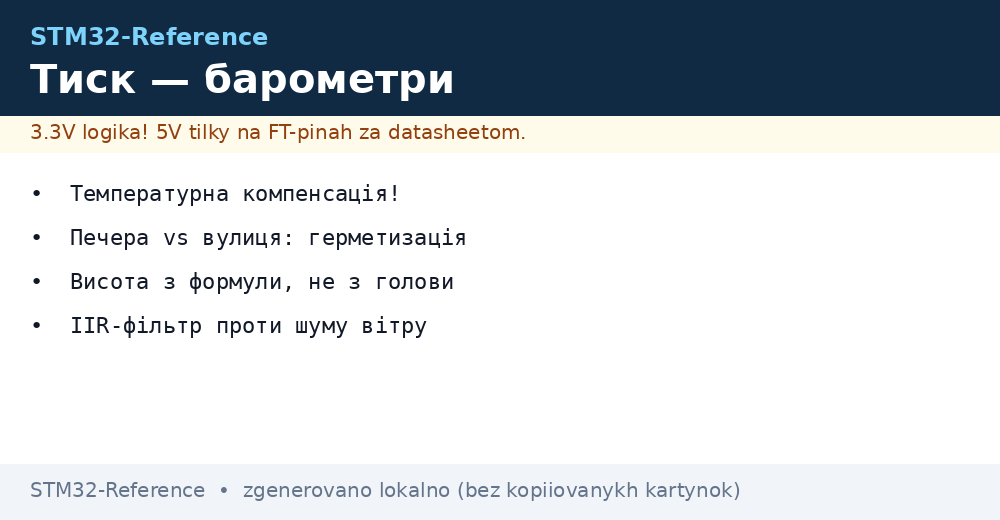
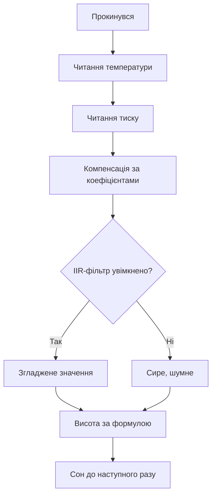

# Тиск BMP390 і MS5611 - барометри і висота


*Рис. Від паскалів до метрів: компенсація, фільтр, формула.*

> [!tip] Призначення ноти
> Навчити міряти тиск і висоту без шуму: калібрування, IIR-фільтр і правильна герметизація.

## 1. Призначення

Барометр бачить погоду і висоту: падіння тиску - циклон, різниця паскалів - метри. BMP390 дешевий і точний для хобі, MS5611 - прецизійний для висотометрів. Обидва вимагають температурної компенсації: сирий АЦП без коефіцієнтів бреше на відсотки.

## Порівняння датчиків

| Параметр | BMP390 | MS5611 |
| --- | --- | --- |
| Інтерфейс | I2C і SPI | I2C і SPI |
| Точність тиску | Відносна висока | 24-біт АЦП, прецизійний |
| Шум | Низький з фільтром | Дуже низький |
| Ціна | Дешевий | Дорожчий |
| Для чого | Погода, дрон-підтримка | Висотометр, варіометр |

## Компенсація: серце драйвера

| Крок | Дія |
| --- | --- |
| 1 | Прочитати калібрувальні коефіцієнти з NVM |
| 2 | Прочитати сирі температуру і тиск |
| 3 | Скомпенсувати температуру першою! |
| 4 | Підставити температуру в формулу тиску |

```c
// Порядок завжди такий: спочатку t_lin, потім тиск:
t_lin = compensate_temp(raw_temp, calib);
pressure = compensate_press(raw_press, t_lin, calib);
```

> Порядок критичний: тиск без свіжої температури - сміття.

## Mermaid: цикл виміру



## Висота з тиску

| Тема | Практика |
| --- | --- |
| Формула | Барометрична через тиск на рівні моря |
| Опора | Калібрувати по відомій висоті при старті! |
| Відносна точність | Метри, якщо опора свіжа |
| Абсолютна | Пливе з погодою - не для навігації |

## Герметизація і вітер

| Проблема | Рішення |
| --- | --- |
| Вітер дає стрибки | Піна або мембрана над отвором |
| Волога всередині | Отвір вниз, конформне покриття поруч |
| Сонце гріє корпус | Тінь або винос датчика |
| Герметичний корпус | Отвір назовні трубкою! |

## Типові помилки

| # | Помилка | Чому погано | Як правильно |
| --- | --- | --- | --- |
| 1 | Без компенсації | Похибка відсотки | Коефіцієнти з NVM завжди! |
| 2 | Тиск до температури | Формула бреше | Спочатку t_lin |
| 3 | Без фільтра на вітрі | Стрибки метрами | IIR або oversampling |
| 4 | Герметичний корпус | Тиск всередині ≠ зовні | Вентиляційний отвір |
| 5 | Абсолютна висота без опори | Пливе з погодою | Калібрування при старті |
| 6 | I2C-адреса навмання | Два варіанти у BMP | SDO на землю або живлення! |
| 7 | Часті виміри без сну | Батарея тане | Forced-режим + сон |

## Варіометр: швидкість набору висоти

| Тема | Практика |
| --- | --- |
| Похідна тиску | Різниця висоти за секунду - метри на секунду |
| Фільтр похідної | Без фільтра шумить сильніше за сигнал! |
| Частота вимірів | 25+ Гц для плавного варіо |
| Звук | Біпер частотою за швидкістю - класика параплана |

```text
Ланцюжок варіометра:
  тиск 25 Гц -> IIR -> висота -> різниця за секунду -> другий IIR -> біпер.
  Два фільтри обовязкові: один на висоту, один на швидкість.
```

## SPI чи I2C: що вибрати

| Критерій | I2C | SPI |
| --- | --- | --- |
| Пінів | Дві на всіх | Чотири плюс CS на кожен |
| Швидкість | Вистачає для тиску | Потрібна для 25+ Гц потоків |
| Довжина | Коротко, інакше глюки | Терпить довші шлейфи |

## Офіційні джерела

- [BMP390 datasheet (Bosch)](https://www.bosch-sensortec.com/products/environmental-sensors/pressure-sensors/bmp390/) - компенсація, режими.
- [MS5611 datasheet (TE)](https://www.te.com/usa-en/product-CAT-BLPS0003.html) - 24-біт, коефіцієнти.

## Oversampling: точність проти струму

| Режим | Шум | Струм | Коли |
| --- | --- | --- | --- |
| Ultra low power | Більший | Мінімум | Маяк раз на годину |
| Standard | Середній | Середній | Погода вдома |
| High resolution | Малий | Більший | Варіометр у польоті |
| Ultra high | Мінімальний | Максимум | Лабораторія |

```c
// Читання тиску через HAL (I2C, BMP390):
uint8_t buf[6];
HAL_I2C_Mem_Read(&hi2c1, BMP_ADDR, REG_PRESS, 1, buf, 6, 100);
raw_press = buf[2] << 16 | buf[1] << 8 | buf[0];
raw_temp  = buf[5] << 16 | buf[4] << 8 | buf[3];
```

## Довгостроковий дрейф: що чекати

| Тема | Практика |
| --- | --- |
| Старіння MEMS | Паскалі за рік - норма для дешевих |
| Перекалібрування | Раз на рік по еталону або рівню моря |
| Зберігання | Без вологи і агресивних парів |
| Документування | Зсув у EEPROM вузла з датою |

## Див. також

- [Home](../../../STM32-Reference/Home.md)
- [клімат по I2C](../../../STM32-Reference/10-Sensori/02-BME280-SHT3x.md)
- [рух і орієнтація](../../../STM32-Reference/10-Sensori/03-MPU6050-IMU.md)
- [шина обміну](../../../STM32-Reference/04-Shini/03-I2C.md)
- [погодний вузол](../../../STM32-Reference/16-Proekti/01-Meteostantsiya.md)
