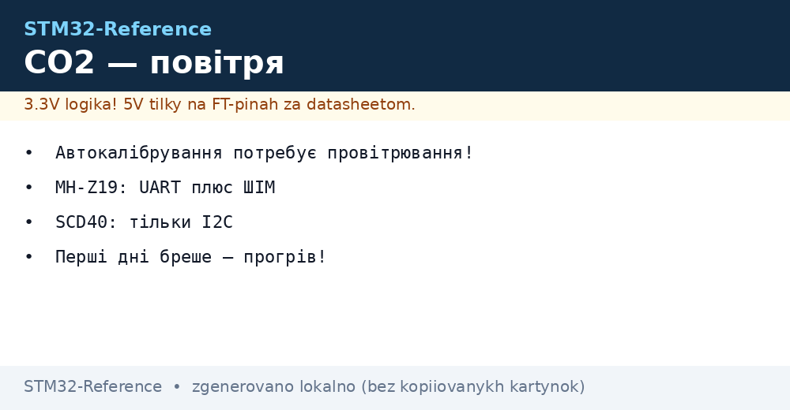
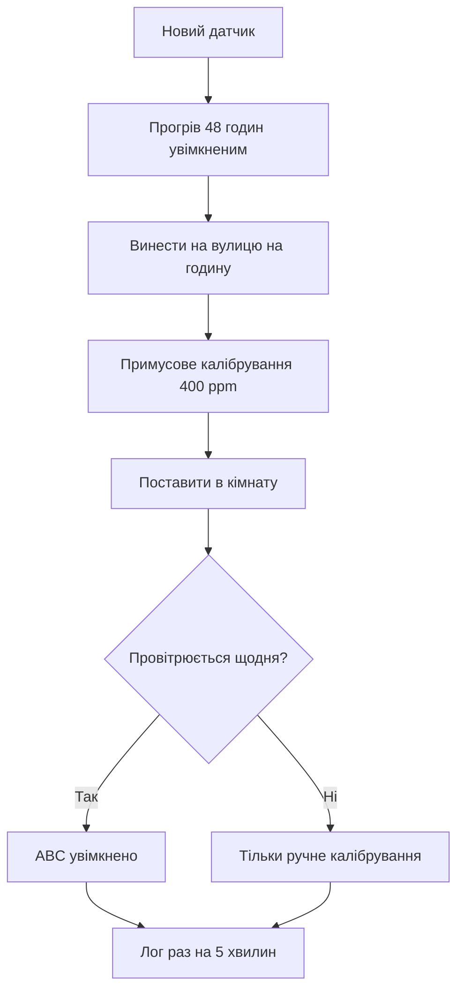

# CO2 SCD40 і MH-Z19 - якість повітря


*Рис. Від молекули до ppm: оптика, прогрів, калібрування.*

> [!tip] Призначення ноти
> Навчити міряти CO2 чесно: прогрів, автокалібрування і правильне місце датчика.

## 1. Призначення

Вуглекислий газ - маркер задухи: понад 1000 ppm падає концентрація, хочеться спати. SCD40 маленький і точний для кімнат, MH-Z19 дешевий з UART для вентиляції. Обидва брешуть перші дні - прогрів і калібрування обов'язкові.

## Порівняння датчиків

| Параметр | SCD40 | MH-Z19 |
| --- | --- | --- |
| Принцип | Фотоакустика | NDIR-оптика |
| Інтерфейс | Тільки I2C | UART і ШІМ-вихід |
| Діапазон | До 40000 ppm | До 5000 ppm типово |
| Розмір | Крихітний | Більший, з камерою |
| Для чого | Кімната, настільний | Вентиляція, шафа |

## NDIR: як міряє оптика

| Елемент | Роль |
| --- | --- |
| ІЧ-випромінювач | Світить через камеру |
| Камера з газом | CO2 поглинає свою довжину хвилі |
| Детектор | Менше світла - більше ppm |
| Еталонний канал | Компенсує старіння лампи |

## Автокалібрування ABC: підступ

| Тема | Практика |
| --- | --- |
| Ідея | Датчик вважає мінімум тижня за 400 ppm вулиці |
| Умова | Приміщення ПРОВІТРЮЄТЬСЯ регулярно! |
| Пастка | Підвал без провітрювання - калібрування пливе вниз |
| Вихід | Вимкнути ABC і калібрувати вручну на вулиці |

```c
// Примусове калібрування SCD40 на свіжому повітрі:
HAL_I2C_Master_Transmit(&hi2c1, SCD_ADDR, cmd_forced_cal, 2, 100);
// Чекати 400+ секунд стабільного повітря!
```

## Mermaid: введення в експлуатацію



## Де ставити датчик

| Правило | Пояснення |
| --- | --- |
| Висота дихання | 1-1.5 м від підлоги |
| Не біля вікна і батареї | Протяги і тепло брешуть |
| Не в кутку за шафою | Застійне повітря |
| Корпус з отворами | Газ має доходити до камери! |

## MH-Z19 по UART і ШІМ

| Режим | Практика |
| --- | --- |
| UART 9600 | Команда читання, відповідь 9 байт з CRC |
| ШІМ-вихід | Ширина імпульсу - концентрація, без протоколу |
| Прогрів | 3 хвилини після ввімкнення |
| Zero-калібрування | HD-пін на землю на вулиці! |

## Типові помилки

| # | Помилка | Чому погано | Як правильно |
| --- | --- | --- | --- |
| 1 | Віра першому дню | Датчик ще гріється | 48 годин прогріву |
| 2 | ABC у непровітрюваному | Калібрування сповзає | Ручне на вулиці |
| 3 | Датчик у герметичному корпусі | Газ не доходить | Вентиляційні отвори |
| 4 | Біля людини видих | Піки до 2000 без причини | Метр від робочого місця |
| 5 | MH-Z19 без прогріву | Перші хвилини брешуть | Чекати готовність |
| 6 | CRC ігнорується | Биті пакети в лог | Перевіряти контрольну суму |
| 7 | Часті виміри без потреби | CO2 повільний газ | Раз на хвилину вистачає |

## Бонус SCD40: температура і вологість з того ж чипа

| Канал | Точність | Нюанс |
| --- | --- | --- |
| Температура | Гріється сам чип! | Зсув вгору без компенсації плати |
| Вологість | Прийнятна | Калібрувати відносно SHT при потребі |
| Self-test | Вбудований | Гнати при старті, логувати результат |

> Температура SCD40 завжди вища за кімнатну через саморозігрів - для погоди бери окремий датчик.

## Живлення: струм вимірів

| Датчик | Пік | Середній |
| --- | --- | --- |
| SCD40 | Десятки мА в імпульсі | Міліампери при щохвилинних |
| MH-Z19 | Понад 100 мА з лампою | Десятки мА середнього |

## Офіційні джерела

- [SCD40 datasheet (Sensirion)](https://sensirion.com/products/catalog/SCD40/) - калібрування, команди.
- [MH-Z19C CO2 sensor (Winsen)](https://www.winsen-sensor.com/sensors/co2-sensor/mh-z19c.html) - UART-протокол, zero.

## Керування вентиляцією за CO2

| Поріг | Дія |
| --- | --- |
| До 800 ppm | Все добре, вентилятор мінімум |
| 800-1200 ppm | Підняти оберти, попередити |
| Понад 1200 ppm | Максимум, аларм провітрити |
| Гістерезис | 100 ppm між вмиканням і вимиканням! |

```c
// Керування з гістерезисом проти смикання реле:
if (co2 > 1200) fan = MAX;
else if (co2 < 1100) fan = MIN;
// Між 1100 і 1200 — стан не міняється!
```

## Довгостроковий лог: що писати

| Поле | Навіщо |
| --- | --- |
| CO2, температура, вологість | Кореляція з самопочуттям |
| Стан вентиляції | Чи допомогло провітрювання |
| Калібрування з датою | Коли востаннє на вулиці |
| Раз на 5 хвилин | CO2 повільний, частіше не треба |

## Див. також

- [Home](../../../STM32-Reference/Home.md)
- [клімат по I2C](../../../STM32-Reference/10-Sensori/02-BME280-SHT3x.md)
- [тиск і висота](../../../STM32-Reference/10-Sensori/06-Pressure-BMP-MS.md)
- [послідовний порт](../../../STM32-Reference/04-Shini/01-UART.md)
- [погодний вузол](../../../STM32-Reference/16-Proekti/01-Meteostantsiya.md)
