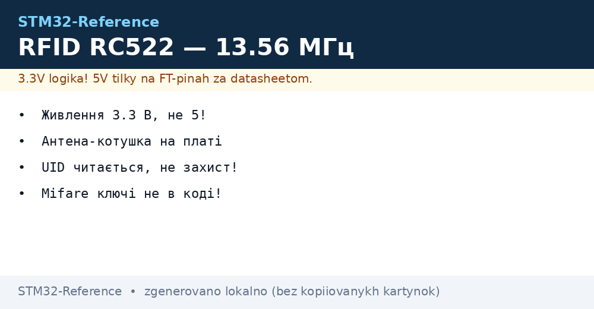
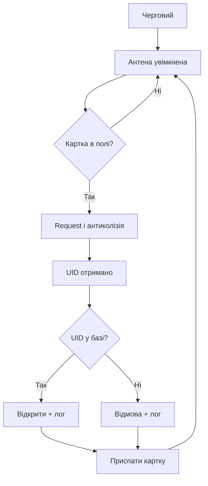

# RFID RC522 - картки 13.56 МГц на SPI


*Рис. Поле 13.56 МГц: антена будить картку, SPI несе дані.*

> [!tip] Призначення ноти
> Навчити читати картки: підключення по SPI, антиколізія, сектори і межі безпеки.

## 1. Призначення

RC522 читає безконтактні картки Mifare на 13.56 МГц: перепустки, ключі, мітки. Модуль дешевий, спілкується по SPI, антена-котушка вже на платі. Для обліку доступу і міток вистачає, для грошей і секретів - ні: UID клонується за хвилини.

## Підключення по SPI

| Пін модуля | Куди | Нотатка |
| --- | --- | --- |
| VCC | 3.3 В! | 5 В вбиває модуль |
| GND | GND | Спільна земля |
| SCK, MOSI, MISO | SPI чипа | Швидкість до 10 МГц |
| SDA (NSS) | Будь-який GPIO | Вибір кристала |
| RST | GPIO | Скидання при старті |
| IRQ | EXTI за бажанням | Картка прийшла - буди! |

```text
Живлення критичне:
  модуль їсть піками при ввімкненому полі;
  слабкий LDO просідає — читання рване;
  bulk 10 мкФ біля модуля обовязковий.
```

## Логіка роботи з карткою

| Крок | Дія |
| --- | --- |
| 1 | Ввімкнути антену (поле в ефір) |
| 2 | Request: чи є картка в полі |
| 3 | Антиколізія: вибрати одну з кількох |
| 4 | Select: отримати UID |
| 5 | Аутентифікація ключем сектора |
| 6 | Читання або запис блоків |

## Mermaid: цикл зчитування



## UID і безпека: чесні межі

| Тема | Правда |
| --- | --- |
| UID читається відкрито | Будь-який зчитувач його бачить |
| Китайські заготовки | UID записується - клон за хвилину |
| Mifare Classic крипто | Зламано давно, не для грошей |
| Секретні дані | Тільки на картках з нормальним крипто |

```text
Правило:
  UID — це логін, не пароль;
  для дверей підійде, для сейфа — ні;
  ключі секторів не в коді відкритим текстом!
```

## Сектори і ключі Mifare

| Тема | Практика |
| --- | --- |
| Блок 16 байт | Одиниця читання і запису |
| Трейлер сектора | Ключі A і B плюс біти доступу |
| Ключ за замовчуванням | Безліч нулів або одиниць - міняти одразу! |
| Біти доступу | Що можна з ключем A, що з ключем B |

## Дальність і антена

| Тема | Практика |
| --- | --- |
| Штатна дальність | 2-5 см над котушкою |
| Метал поруч | Вбиває поле - дистанція від металу! |
| Накладка корпусу | Пластик тонкий, метал ніякий |
| Посилення | Регістр TxControl - не вище норми без потреби |

## Типові помилки

| # | Помилка | Чому погано | Як правильно |
| --- | --- | --- | --- |
| 1 | Живлення 5 В | Модуль згорає | Тільки 3.3 В! |
| 2 | UID як пароль | Клон проходить | UID плюс PIN або час |
| 3 | Ключі в коді відкрито | Прошивка читається | Ключі в захищеній памяті |
| 4 | Модуль на металі | Поле не працює | Дистанція від металу |
| 5 | Без bulk-конденсатора | Рвані читання | 10 мкФ біля модуля |
| 6 | Швидкість SPI максимум | Глюки на довгих дротах | Нижче і коротше |
| 7 | Картка не присипляється | Читається сотні разів | Halt після операції |

## Офіційні джерела

- [MFRC522 datasheet (NXP)](https://www.nxp.com/docs/en/data-sheet/MFRC522.pdf) - регістри, команди, антена.
- [MIFARE Classic info (NXP)](https://www.nxp.com/products/rfid-nfc/mifare-hf/mifare-classic) - сектори, ключі.

## Ініціалізація модуля: порядок

| Крок | Дія |
| --- | --- |
| 1 | Апаратний ресет піном RST |
| 2 | Мякий ресет командою |
| 3 | Налаштувати таймер і модуляцію |
| 4 | Увімкнути антену бітами TxControl |
| 5 | Перевірити версію чипа читанням регістра |

```c
// Скелет старту (регістри за даташитом MFRC522):
RC522_Write(CommandReg, PCD_RESETPHASE);
HAL_Delay(50);
RC522_Write(TModeReg, 0x80);
RC522_Write(TPrescalerReg, 0xA9);
RC522_AntennaOn();   // без цього карток не видно!
```

## Турнікетна логіка: антипасбек

| Правило | Навіщо |
| --- | --- |
| Запис часу входу | Той же UID не проходить двічі підряд |
| Напрям турнікета | Вхідний і вихідний зчитувачі окремо |
| Чорний список | Втрачені картки блокуються |
| Лог усіх подій | Хто, коли, результат - на SD або сервер |

## Див. також

- [Home](../../../STM32-Reference/Home.md)
- [рух і орієнтація](../../../STM32-Reference/10-Sensori/03-MPU6050-IMU.md)
- [шина обміну](../../../STM32-Reference/04-Shini/02-SPI.md)
- [захист виробу](../../../STM32-Reference/15-Protokoli/03-Bezpeka.md)
- [облік і лог](../../../STM32-Reference/16-Proekti/03-Energomonitor.md)
