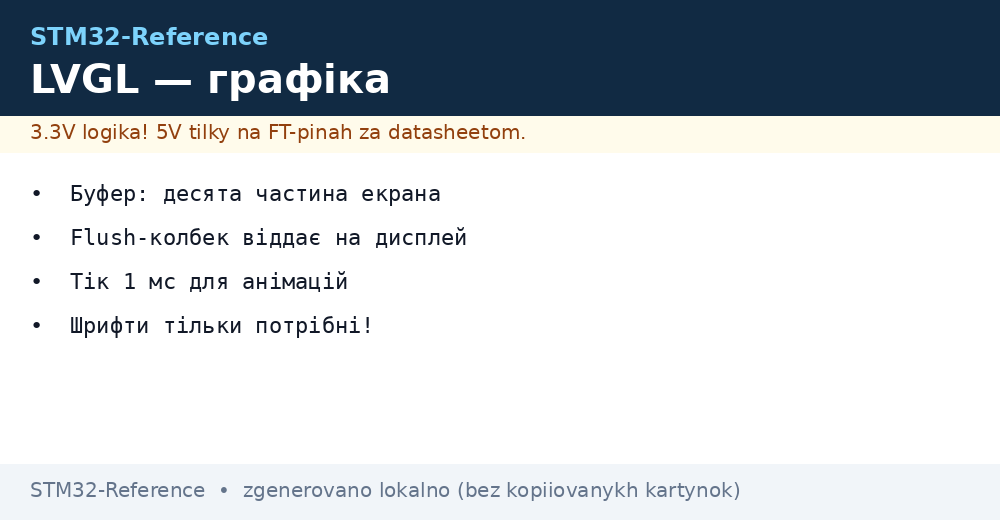
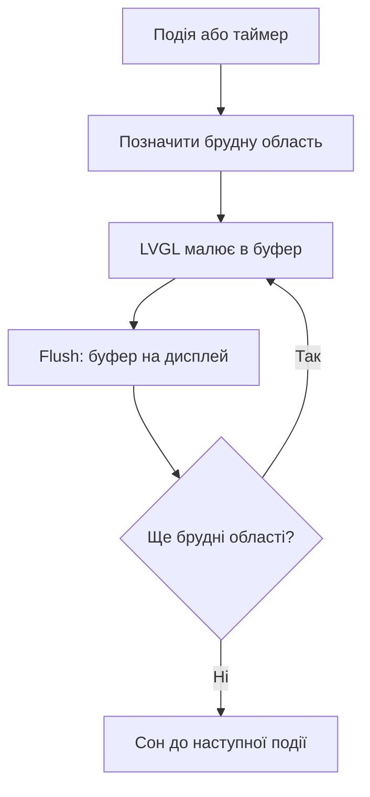

# LVGL - графіка і інтерфейси на STM32


*Рис. Конвеєр: віджет, буфер, flush на дисплей.*

> [!tip] Призначення ноти
> Навчити піднімати інтерфейс: буфери за розміром RAM, тік для анімацій, тільки потрібні шрифти.

## 1. Призначення

LVGL малює кнопки, графіки і екрани на мікроконтролері без операційки. Працює поверх твого драйвера дисплея: ти даєш flush-функцію і тік, бібліотека дає віджети. Для HMI-панелей і налаштувань це швидше за самописну графіку в рази.

## Що потрібно для старту

| Компонент | Мінімум |
| --- | --- |
| Дисплей з драйвером | Flush цілими областями |
| Буфер | Десята частина екрана, два краще! |
| Тік 1 мс | Таймер або SysTick для анімацій |
| Ввід | Кнопки, енкодер або тач |

```c
// Скелет інтеграції:
lv_init();
lv_disp_draw_buf_init(&buf, buf1, buf2, SIZE);
lv_disp_drv_register(&drv);   // drv.flush = моя функція!
```

## Буфери: скільки RAM віддати

| Варіант | Пам'ять | Ефект |
| --- | --- | --- |
| Десятина екрана | Мало | Працює, перемальовує смугами |
| Два буфери | Вдвічі більше | Плавно, без розривів |
| Повний кадр | Весь екран | Ідеально, але тільки з SDRAM! |
| Немає RAM | Зовнішня SDRAM | F4 і H7 через FMC |

## Mermaid: цикл кадру



## Віджети: що брати

| Віджет | Для чого |
| --- | --- |
| Label і Button | Текст і натискання |
| Slider і Switch | Налаштування |
| Chart | Графік вимірів |
| Meter | Стрілка як у приладі |
| Keyboard | Ввід без фізичних кнопок |
| Tabview | Екрани-вкладки |

## Шрифти: тільки потрібні

| Правило | Пояснення |
| --- | --- |
| Один розмір на задачу | Кожен шрифт - кілобайти Flash! |
| Кирилиця окремо | Латиниця і кирилиця - різні набори |
| Конвертер LVGL | Генерує C-масив з TTF |
| Іконки шрифтом | Символи замість картинок |

## Тач: калібрування

| Тема | Практика |
| --- | --- |
| XPT2046 по SPI | Класика для резистивних |
| Калібрування | Три точки при першому старті |
| Зберігання | Коефіцієнти в EEPROM вузла |
| Ємнісний | Точніше, але дорожче і складніше |

## Типові помилки

| # | Помилка | Чому погано | Як правильно |
| --- | --- | --- | --- |
| 1 | Немає тіка 1 мс | Анімації стоять | Таймер або SysTick! |
| 2 | Flush блокує надовго | Інтерфейс гальмує | DMA + прапорець готовності |
| 3 | Усі шрифти світу | Flash забита | Тільки потрібні гліфи |
| 4 | Повний кадр без RAM | Не влазить | Десятина + два буфери |
| 5 | Малювання з ISR | Гонки буфера | Тільки з задач! |
| 6 | Тач без калібрування | Промахи повз кнопки | Калібрування при старті |
| 7 | Важкі тіні і градієнти | Кадр секундами | Простий стиль на слабких |

## SquareLine: від макета до коду

| Крок | Дія |
| --- | --- |
| 1 | Намалювати екрани мишею |
| 2 | Експорт C-файлів інтерфейсу |
| 3 | Підключити події до своєї логіки |
| 4 | Логіка окремо - макет окремо! |

## Ресурси: де лежать картинки

| Варіант | Коли |
| --- | --- |
| У Flash чипа | Малі іконки |
| У QSPI | Великі фони, XIP не потрібен |
| На SD-карті | Змінні без перепрошивки |

## Офіційні джерела

- [LVGL Documentation (LVGL)](https://docs.lvgl.io/master/) - віджети, буфери, портування.
- [SquareLine docs](https://docs.squareline.io/docs/squareline) - візуальний конструктор екранів.
- [STM32 MCUs with Chrom-ART (ST)](https://www.st.com/en/microcontrollers-microprocessors.html) - DMA2D-прискорювач графіки.

## Стилі і теми: дешева краса

| Прийом | Ціна |
| --- | --- |
| Плоскі кольори | Безкоштовно |
| Закруглення малі | Дешево |
| Тіні і градієнти | Дорого на слабких! |
| Темна тема | Менше пікселів світиться на OLED |

## Екран налаштувань: скелет

```c
// Вкладки: виміри, налаштування, про пристрій:
lv_obj_t *tabs = lv_tabview_create(scr, LV_DIR_TOP, 40);
lv_obj_t *t1 = lv_tabview_add_tab(tabs, "Виміри");
lv_obj_t *t2 = lv_tabview_add_tab(tabs, "Ліміти");
lv_chart_create(t1);            // графік на першій
lv_slider_create(t2);           // повзунок на другій
```

## Продуктивність: щоб не гальмувало

| Правило | Пояснення |
| --- | --- |
| Оновлювати тільки змінне | Не перемальовувати все щосекунди |
| FPS лічильник | Виміряти, а не відчувати |
| DMA2D (Chrom-ART) | Заливка і копії залізом на H7! |
| Частота SPI дисплея | Максимум стабільного |

## Див. також

- [Home](../../../STM32-Reference/Home.md)
- [кольоровий дисплей](../../../STM32-Reference/11-Vivid/02-TFT-LCD.md)
- [чорнила](../../../STM32-Reference/11-Vivid/04-Epaper.md)
- [флагмани для графіки](../../../STM32-Reference/01-Hardware/04-H5-H7.md)
- [шина обміну](../../../STM32-Reference/04-Shini/02-SPI.md)
