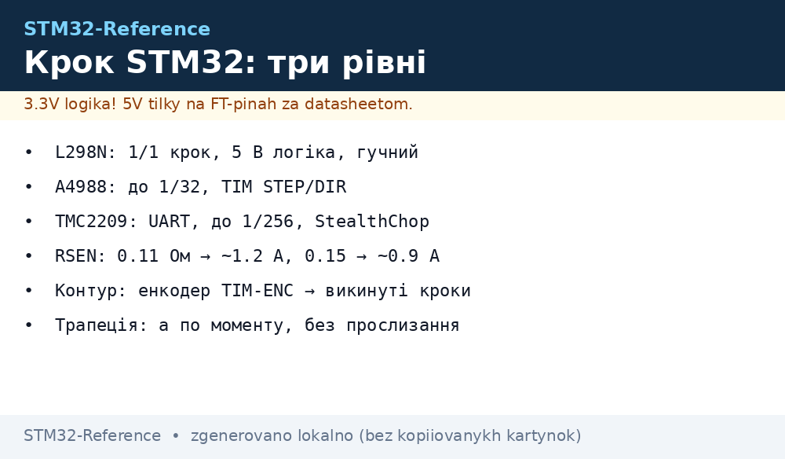
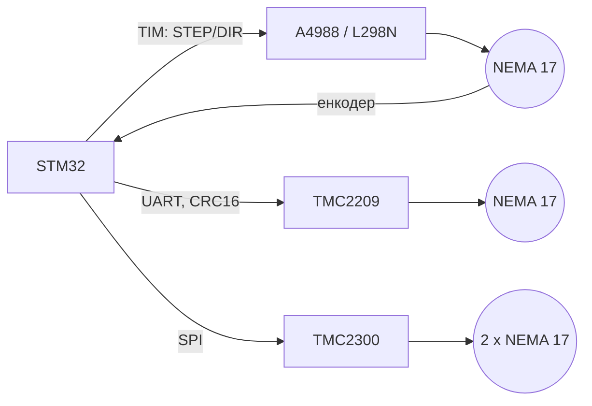

# Крокові двигуни на STM32: L298N, A4988, TMC2209/2300


*Рис. Крокові двигуни: TMC2209 UART, A4988 STEP/DIR з таймерів, енкодер для контуру.*

> [!tip] Що це за нота
> Розширення по ширині виводу: таймери ([Таймери](../../../STM32-Reference/07-Timeri-Son/01-GPTIM-ADTIM.md)) + контроль ([Енкодер](../../../STM32-Reference/10-Sensori/11-Encoder.md)). Три рівні: L298N (дешево і грубо), A4988 (мікрокроки, класика CNC), TMC2209/2300 (тихо, з UART/SPI і захистом).

Три рівні драйвера:



*Рис. Два «механічних» рівні на таймерах, один - на UART/SPI.*

## 1. Мотори: що таке NEMA 17

- 1.8° на крок → 200 кроків на оберт; позиція відлічується без енкодера;
- утримувальний момент 0.25-1.0 Нм (NEMA 17, 42 мм);
- струм намотки 1.5-2.0 А: драйвер має подавати не менше, інакше мотор не розкриється;
- повний крок = шум і вібрація; мікрокроки ділять крок на 2-256 часток (у TMC2209 - 256).

## 2. Драйвери: порівняння

| Драйвер | Інтерфейс | Струм | Мікрокроки | Логіка | Коментар |
| --- | --- | --- | --- | --- | --- |
| L298N | STEP/DIR (2×) | до 2 А (реально ~1) | тільки 1/1 | 5 В | дешевий, гарячий, гучний |
| A4988 | STEP/DIR + MS1-3 | 2 А | до 1/32 | 3.3-5.5 В | класика CNC, порталів, 3D |
| TMC2209 | UART + STEP/DIR | 2.2 А | до 1/256 | 3.3 В | тихий (StealthChop), моментний захист |
| TMC2300 (каретка) | SPI | 2×2.5 А | до 1/32 | 3.3 В | двомоторна каретка, завше живий |

## 3. TMC2209: розпіновка і конфігурація

| Пін TMC2209 | На STM32 | Примітка |
| --- | --- | --- |
| STAP | TIM CH1 | кроки до 250 кГц |
| SDIR | GPIO / PWM-канала | напрямок |
| SCLK | GPIO | такт інтерфейсу |
| MS0 / MS1 / MS2 | UART TX (конфіг) | UART 115200 або 4.8 МГц |
| SEN / SP | GND + RSEN | 0.11 Ом → ~1.2 А, 0.15 → ~0.9 А, 0.212 → ~0.65 А |
| VMS | 12-24 В, до 30 В / 2 А | тип: 12 В, 2 А |
| PUL / EN | GPIO | enable-керування |

Конфігураційний код (USART + HAL, 4-байтові кадри, CRC16-CCITT):

```c
// TMC2209: UART-регістри (16-бітні поля, CRC16-CCITT таблиця)
void tmc2209_write_reg(uint16_t reg, uint16_t val) {
  uint8_t b[4] = { (uint8_t)reg, 0, (uint8_t)val, 0 };
  b[1] = crc16_ccitt_table((uint8_t)reg);
  b[3] = crc16_ccitt_table((uint8_t)val);
  HAL_UART_Transmit(&huart1, b, 4, 10);
}
// GCONF: en_pwm_mode (StealthChop), mstep; CHOPCONF: toff, rhlg
// GSTAT / DRV_STATUS — читати: overheat, ступінь зсуву, lost step
```

## 4. A4988 на таймерах: робочий код

- STEP - короткі імпульси TIM CH1, DIR - перемикання GPIO або TIM CH2;
- трапецея: розгін / хрест / гальмівний за профілем кроків/с;
- контур: TIM8 encoder mode (TI1/TI2 від енкодера на валу) → eCAP-лічильник → різниця з планом.

```c
// STM32F4: A4988, TIM2 update @hz ( кроки/с), TIM8 ENC — енкодер
void TIM2_IRQHandler(void) {
  HAL_TIM_IRQHandler(&htim2);
  step_pulse();            // TIM8 CH1: імпульс 2 мкс (PWM, CCR=2)
  if (--remaining == 0) profile_state = IDLE;
  else if (profile_state == ACCEL) profile_hz++;
}
// кожен крок: порівнюємо eCAP_read() з планом; різниця > N → повернути крок
```

Мікрокроки: MS1 MS2 MS3 = 0/1/1 → 1/16; 1/32 тільки на низьких швидкостях (момент падає на ~30 %).

## 5. TMC2300: короткий запис

- каретка з двома кристалами SPI (мастер-слейв по SDO), обидва мотори одного пристрою;
- драйвер «завже живий»: вимірювання струму на GND-звороті, без окремого H-моста;
- STM32 ходить лише SPI-команди + залишається планування траєкторії;
- застосування: 3D-принтери, порталні автоматики, шпунти з високим запитом на тишу.

## 6. Траєкторія: трапецея

| Фаза | Формула | Примітка |
| --- | --- | --- |
| розгін | v(t) = v0 + a·t, кроків t = v0/a | a - по моменту (без провалів) |
| хрест | v = const | тут мікрокроки 1/32 в роботі |
| гальмування | симетрично, d = v²/2a | гарантія стопу без прослизання |

Прослизання: a занадто висока - мотор випадає з кроку (стукіт, похида позиції). Контроль: енкодер проти плану; різниця > N кроків - повертаємо цикл.

## 7. Типові помилки

| Симптом | Причина | Лікування |
| --- | --- | --- |
| Драйвер гарячий | струм драйвера > струму мотора | знизити CS-регістр до струму мотора |
| Випадає з кроку під навантаженням | a завелика / VMS низька | менша a, VMS 24 В, менші мікрокроки |
| TMC2209 не відповідає по UART | SEN не з'єднано / не той RSEN | перевірити резистор 0.11/0.15 Ом, ревізію конфігурації |
| Гучний «дзижчання» на повних кроках | без мікрокроків / L298N | A4988 1/16 або TMC2209 StealthChop |
| Контур ідеальний, а стіл «віжже» | механіка: люфт, базовий гвинт, валц | чинити механіку, не ПІД |
| Мотор зупиняється через 5 с | тепловий захист (TMC2300) | менший струм, краще відведення тепла |

## 8. Суміжні ноти

- [Таймери](../../../STM32-Reference/07-Timeri-Son/01-GPTIM-ADTIM.md), [SPI](../../../STM32-Reference/04-Shini/02-SPI.md), [UART](../../../STM32-Reference/04-Shini/01-UART.md)
- [Енкодер](../../../STM32-Reference/10-Sensori/11-Encoder.md) - квадратура і TIM-ENC
- [RTOS](../../../STM32-Reference/09-Proshivka/06-FreeRTOS.md) - планування на кілька осей
- [Живлення-дизайн](../../../STM32-Reference/02-Zhivlennya/03-Power-Design.md) - піки струму двигунів

## 9. Чек-лист, коли двигун не крутиться

| Симптом | Що перевіряємо |
| --- | --- |
| Не реагує взагалі | EN-пін HIGH, VMS 12 В, струм на драйвері |
| Крутиться ривками | MS1/MS2/MS3 - стан мікрокроків, струм драйвера |
| Гучний «піу» | повні кроки → менші мікрокроки або TMC2209 |
| Не встигає за профілем | частота STEP (кГц), зайва затримка EN |
| Гарячий за 10 с | струм драйвера > струму мотора → знизити CS |

Додатково:

- VMS > 30 В - перевірите вхідний захист, інакше знижувати напругу;
- логіка TMC2209 3.3 В - не підключати 5 В до UART;
- STEP/DIR тримати на одному таймері, не пересуватися між TIM.

## Офіційні джерела

- [TMC2209-Stepper (DigiKey)](https://www.digikey.com/en/products/detail/trinamic/TMC2209STEPPERTN/4989751) - UART-драйвер, 2.2 А.
- [TMC2300-Stepper (DigiKey)](https://www.digikey.com/en/products/detail/trinamic/TMC2300STEPPERTN/6815382) - двомоторна каретка, SPI.
- [A4988 (Analog Devices)](https://www.analog.com/en/timer-counter/digital-timer/a4988.html) - STEP/DIR, мікрокроки.
- [L298N (ST)](https://www.st.com/en/dual-power-supplies/l298n-dual-power-supply.html) - dual H-bridge 5 В.
- [STM32F4 (ST)](https://www.st.com/en/mcus-mpus/stm32f4.html) - TIM, encoder mode.
